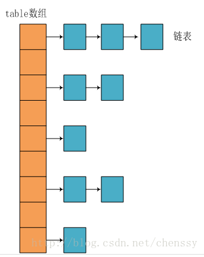
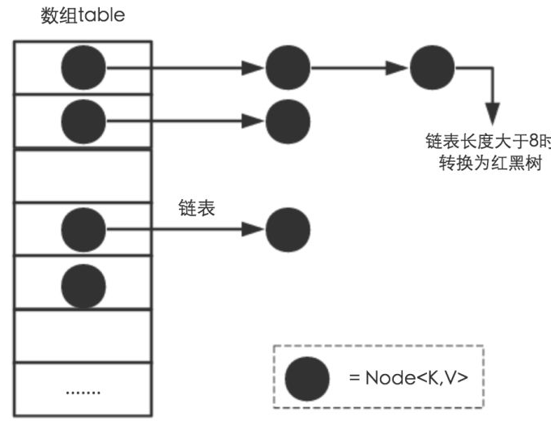
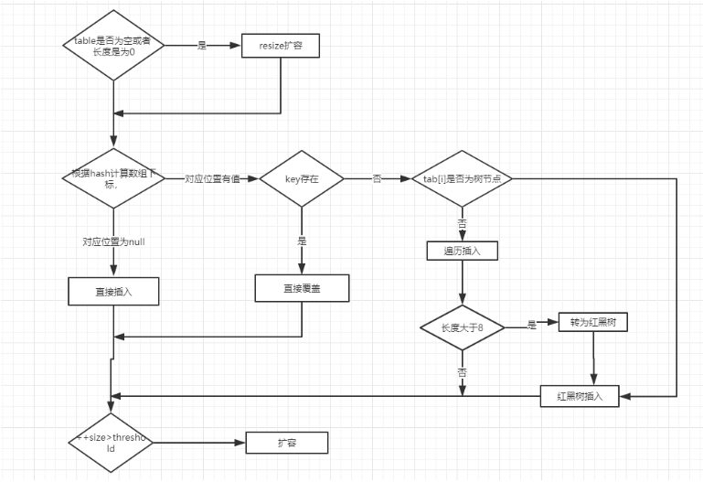

# HashMap简介

HashMap主要用来存放键值对，它基于哈希表的Map接口实现，是常用的Java集合之一。
 JDK1.8 之前 HashMap 由 数组+链表 组成的，数组是 HashMap 的主体，链表则是主要为了解决哈希冲突而存在的（“拉链法”解决冲突）.
 JDK1.8 之后解决哈希冲突时有了较大的变化，当链表长度大于阈值（默认为8）时，将链表转化为红黑树（将链表转换成红黑树前会判断，如果当前数组长度小于64，那么会选择进行数组扩容，而不是转换成红黑树），以减少搜索时间。

## 底层数据结构分析
### JDK1.8之前
JDK1.8之前HashMap底层是数组和链表结合在一起使用的链表散列。HashMap通过key的hashCode经过扰动函数处理之后得到hash值，然后通过（n-1） & hash判断当前元素存放的位置（这里的n指的是数组的长度），如果当前位置村子元素的话，就判断该元素与要存入的元素的hash值以及key是否相同，如果相同的话，直接覆盖，不相同的话就通过拉链法解决冲突。
扰动函数就是hash方法，使用hash方法主要是防止性能较差的hashcode方法，从而减少碰撞。
1.8的hash方法

    static final int hash(Object key) {
        int h;
        //key.hashCode() : 返回散列值也就是hashcod
        //^ ： 按位异或
        //>>>：无符号右移，忽略符号位，空位都以0补齐
        return (key == null) ? 0 : (h = key.hashCode()) ^ (h >>> 16);
    }

1.7的hash方法

    static int hash(int h){
        h ^= (h >>> 20) ^ (h >>> 12);
        return h ^ (h >>> 7) ^ (h >>> 4);
    }

1.8的hash函数性能更高，因为1.7的hash函数扰动了四次

拉链法： 数组与链表结合，如图

JDK1.8之后，当链表长度大于阈值（默认为8）时，将链表转化为红黑树，以减少搜索时间。

### 类的属性：

    public class HashMap<K,V> extends AbstractMAp<K,V> implements Map<K,V>,Cloneable,Serializable{
        // 序列号
        private static final long serialVersionUID = 362498820763181265L;    
        // 默认的初始容量是16
        static final int DEFAULT_INITIAL_CAPACITY = 1 << 4;   
        // 最大容量
        static final int MAXIMUM_CAPACITY = 1 << 30; 
        // 默认的填充因子
        static final float DEFAULT_LOAD_FACTOR = 0.75f;
        // 当桶(bucket)上的结点数大于这个值时会转成红黑树
        static final int TREEIFY_THRESHOLD = 8; 
        // 当桶(bucket)上的结点数小于这个值时树转链表
        static final int UNTREEIFY_THRESHOLD = 6;
        // 桶中结构转化为红黑树对应的table的最小大小
        static final int MIN_TREEIFY_CAPACITY = 64;
        // 存储元素的数组，总是2的幂次倍
        transient Node<k,v>[] table; 
        // 存放具体元素的集
        transient Set<map.entry<k,v>> entrySet;
        // 存放元素的个数，注意这个不等于数组的长度。
        transient int size;
        // 每次扩容和更改map结构的计数器
        transient int modCount;   
        // 临界值 当实际大小(容量*填充因子)超过临界值时，会进行扩容
        int threshold;
        // 加载因子
        final float loadFactor;
    }

loadFactory加载因子：加载因子控制数据的疏密程度，默认0.75比较好的临界值。
给定的默认容量为 16，负载因子为 0.75。Map 在使用过程中不断的往里面存放数据，当数量达到了 16 * 0.75 = 12 就需要将当前 16 的容量进行扩容，而扩容这个过程涉及到 rehash、复制数据等操作，所以非常消耗性能

threshold
threshold = capacity*loadFactor,当Size>=threshold的时候，考虑扩增

### 节点类源码

    //继承自Map.Entry<K,V> 
    static class Node<K,V> implements Map.Entry<K,V> {
        final int hash;// 哈希值，存放元素到hashmap中时用来与其他元素hash值比较
        final K key;//键
        V value; //值
        //指向下一个节点
        Node<K,V> next;
        Node(int hash, K key,V value,Node<K,V> next) {
            this.hash = hash;
            this.key = key;
            this.value = value;
            this.next = next;
        }
        public final K getKey() {return key;}
        public final V getValue() {return value;}
        public final String toString() {return key + "=" + value;}
        //重写hashCode方法
        public final int hashCode(){
            return Objects.hashCode(Key) ^ Objects.hashCode(value);
        }

        public final V setValue(V newValue) {
            V oldValue = value;
            value = newValue;
            return oldValue;
        }
        //重写equals方法
        public final boolean equals(Object o) {
            if(o == this){
                return true;
            }
            if(o instanceof Map.Entry){
                Map.Entry<?,?> e = (Map.Entry<?,?>) o;
                //任何属于Map.Entry的对象都可以进行比较，比较过程中，key要相等，value也要相等
                if(Objects.equals(key,e.getKey()) && Objects.equals(value,e.getValue())){
                    return true;
                }
            }
        }
    }

### 树节点类源码

    static final class TreeNode<K,V> extends LinkedHashMap.Entry<K,V> {
        TreeNode<K,V> parent; //父
        TreeNode<K,V> left; //左
        TreeNode<K,V> right; //右
        TreeNode<K,V> prev; //needed to unlink next upon deletion
        boolean red; //判断颜色
        TreeNode(int hash,K key,V val,Node<K,V> next) {
            super(hash,key,val,next);
        }
        //返回根节点
        final TreeNode<K,V> root() {
            final (TreeNode<K,V> r = this,p;;) {
                if((p = r.parent) == null) {
                    return r;
                }
                r = p;
            }
        }
    }

## HashMap源码分析
### 构造方法

    //默认构造函数
    public HashMap() {
        this.loadFactor = DEFAULT_LOAD_FACTOR; //all other fields defaulted
    }

    //包含另一个“Map”的构造函数
    public HashMap(Map<? extends K,? extends V> m) {
        this.loadFactor = DEFAULT_LOAD_FACTOR;
        putMapEntries(m,false);//下面分析
    }

    //指定“容量大小”的构造函数
    public HashMap(int initialCapacity) {
        this(initialCapacity,DEFAULT_LOAD_FACTOR);
    }

    //指定容量大小和加载因子的构造函数
    public HashMap(int initialCapacity, final loadFactor) {
        //初始容量小于零和大于最大的情况
        if(initialCapacity < 0){
            throw new IllegalArgumentException("Illegal initial capacity: " + initialCapacity);
        }
        if(initialCapacity > MAXIMUM_CAPACITY){
            initialCapacity = MAXIMUM_CAPACITY;
        }
        //加载因子的限制条件
        if(loadFactor <= 0 || Float.isNaN(loadFactor)){
            throw new IllegalArgumentException("Illegal load factor: " + loadFactor);
        }
        this.loadFactor = loadFactor;
        this.threshold = tableSizeFor(inintialCapacity); 
    }

putMapEntries方法：

    //就是将已有构造函数的m放进新的hashMap
    final void putMapEntries(Map<? extends K,? extends V> m , boolean evict) {
        int s = m.size();
        if(s > 0) {
            //判断table是否初始化
            if(table == null) {
                //未初始化，s为m的实际个数
                float ft = ((float)s / loadFactor) + 1.0F;
                int t = ((ft < (float)MAXIMUM_CAPACITY) ? (int) ft : MAXIMUM_CAPACITY);
                //计算得到的t大于阈值，则初始化阈值
                if(t > threshold){
                    threshold = tableSizeFor(t);
                }
                //已初始化，并且m元素个数大于阈值，进行扩容处理
                else if (s > threshold){
                    resize();
                }
                //将m中所有的元素添加到HashMap中
                for(Map.Entry<? extends K,? extends V> e : m.EntrySet()) {
                    K key = e.getKey();
                    V value = e.getValue();
                    putVal(hash(key),key,value,false,evict)
                }
            }
        }
    }

### put方法
HashMap只提供了put用于添加元素，putVal方法只是给put方法调用的一个方法，并没有提供给用户使用。
#### 对putVal方法添加元素的分析如下：
1、如果定位到的数组位置没有元素就直接插入
2、如果定位到的数组位置有元素就和要插入的key比较，如果key相同就直接覆盖，如果key不相同，就判断是否是一个树节点，如果是就调用e = ((TreeNode<K,V>)p).putTreeVal(this,tab,hash,key,value)将元素添加进入，如果不是就遍历链表插入（插入的是链表尾部）

    //put源码
    public V put(K key , V value){
        return putVal(hash(key),key,value,false,true);
    }

    final V putVal(int hash,K key, V value,boolean onlyIfAbsent,boolean evict) {
        Node<K,V>[] tab;
        Node<K,V> p; 
        int n,i;
        //table未初始化或者长度为0，进行扩容
        if((tab = table) == null || (n = tab.length) == 0){
            n = (tab = resize()).length; 
        }
        //(n - 1) & hash确定元素存放在哪个桶内，桶为空，新生成的节点放入桶内，此时的节点是放在数组内的
        if((p = tab[i = (n - 1) & hash]) == null){
            tab[i] = newNode(hash, key, value, null);
        }
        //桶内已有存在的元素
        else{
            Node<K,V> e; K k;
            //比较桶中第一个元素（数组中的节点）的hash值是否相等，key相等
            if(p.hash == hash && ((k = p.key) == key || (key != null && key.equals(k)))){
                //将第一个元素赋给e，用e来记录
                e = p;
            }
            //hash值不相等，即key不相等，为红黑树节点
            else if(p instanceof TreeNode) {
                //放入树中
                e = ((TreeNode<K,V>)p).putTreeVal(this, tab, hash, key, value);
            }
            //为链表节点
            else {
                //在链表最末插入结点
                for((e = p.next()) == null) {
                    //在尾部插入新节点
                    p.next = newNode(hash,key,value,null);
                    // 结点数量达到阈值，转化为红黑树
                    if (binCount >= TREEIFY_THRESHOLD - 1) // -1 for 1st
                        treeifyBin(tab, hash);
                    // 跳出循环
                    break;
                }
                // 判断链表中结点的key值与插入的元素的key值是否相等
                if (e.hash == hash &&
                    ((k = e.key) == key || (key != null && key.equals(k))))
                    // 相等，跳出循环
                    break;
                // 用于遍历桶中的链表，与前面的e = p.next组合，可以遍历链表
                p = e;
            }
        }

        // 表示在桶中找到key值、hash值与插入元素相等的结点
        if (e != null) { 
            // 记录e的value
            V oldValue = e.value;
            // onlyIfAbsent为false或者旧值为null
            if (!onlyIfAbsent || oldValue == null)
                //用新值替换旧值
                e.value = value;
            // 访问后回调
            afterNodeAccess(e);
            // 返回旧值
            return oldValue;
        }
    }
    // 结构性修改
    ++modCount;
    // 实际大小大于阈值则扩容
    if (++size > threshold)
        resize();
    // 插入后回调
    afterNodeInsertion(evict);
    return null;
    }

### get方法

    public V get(Object key) {
        Node<K,V> e;
        return (e = getNode(hash(key), key)) == null ? null : e.value;
    }
    final Node<K,V> getNode(int hash, Object key) {
        Node<K,V>[] tab; Node<K,V> first, e; int n; K k;
        if ((tab = table) != null && (n = tab.length) > 0 && (first = tab[(n - 1) & hash]) != null) {
            // 数组元素相等
            if (first.hash == hash && // always check first node
                ((k = first.key) == key || (key != null && key.equals(k))))
                return first;
            // 桶中不止一个节点
            if ((e = first.next) != null) {
                // 在树中get
                if (first instanceof TreeNode)
                    return ((TreeNode<K,V>)first).getTreeNode(hash, key);
                // 在链表中get
                do {
                    if (e.hash == hash &&
                        ((k = e.key) == key || (key != null && key.equals(k))))
                        return e;
                } while ((e = e.next) != null);
            }
        }
        return null;
    }

### resize方法
进行扩容，会伴随着一次重新hash分配，并且会遍历hash表中所有的元素，是非常耗时的。在编写程序中，要尽量避免resize。

    final Node<K,V>[] resize() {
        Node<K,V>[] oldTab = table; //旧数组
        int oldCap = (oldTab == null) ? 0 : oldTab.length; //旧数组的大小
        int oldThr = threshold; //旧数组的阈值
        int newCap, newThr = 0; //初始化新数组的容量和阈值为0
        if (oldCap > 0) {
            // 超过最大值就不再扩充了，就只好随你碰撞去吧
            if (oldCap >= MAXIMUM_CAPACITY) {
                threshold = Integer.MAX_VALUE; //将阈值也调整到最大，任由碰撞吧
                return oldTab;
            }
            // 没超过最大值，就扩充为原来的2倍
            else if ((newCap = oldCap << 1) < MAXIMUM_CAPACITY && oldCap >= DEFAULT_INITIAL_CAPACITY)
                newThr = oldThr << 1; // 阈值也调整为两倍
        }
        else if (oldThr > 0) // initial capacity was placed in threshold
            newCap = oldThr;
        else { 
            // signifies using defaults
            newCap = DEFAULT_INITIAL_CAPACITY;
            newThr = (int)(DEFAULT_LOAD_FACTOR * DEFAULT_INITIAL_CAPACITY);
        }
        // 计算新的resize上限
        if (newThr == 0) {
            float ft = (float)newCap * loadFactor;
            newThr = (newCap < MAXIMUM_CAPACITY && ft < (float)MAXIMUM_CAPACITY ? (int)ft : Integer.MAX_VALUE);
        }
        threshold = newThr;
        @SuppressWarnings({"rawtypes","unchecked"})
            Node<K,V>[] newTab = (Node<K,V>[])new Node[newCap];
        table = newTab;
        if (oldTab != null) {
            // 把每个bucket都移动到新的buckets中
            for (int j = 0; j < oldCap; ++j) {
                Node<K,V> e;
                if ((e = oldTab[j]) != null) {
                    oldTab[j] = null;
                    if (e.next == null)
                        newTab[e.hash & (newCap - 1)] = e;
                    else if (e instanceof TreeNode)
                        ((TreeNode<K,V>)e).split(this, newTab, j, oldCap);
                    else { 
                        Node<K,V> loHead = null, loTail = null;
                        Node<K,V> hiHead = null, hiTail = null;
                        Node<K,V> next;
                        do {
                            next = e.next;
                            // 原索引
                            if ((e.hash & oldCap) == 0) {
                                if (loTail == null)
                                    loHead = e;
                                else
                                    loTail.next = e;
                                loTail = e;
                            }
                            // 原索引+oldCap
                            else {
                                if (hiTail == null)
                                    hiHead = e;
                                else
                                    hiTail.next = e;
                                hiTail = e;
                            }
                        } while ((e = next) != null);
                        // 原索引放到bucket里
                        if (loTail != null) {
                            loTail.next = null;
                            newTab[j] = loHead;
                        }
                        // 原索引+oldCap放到bucket里
                        if (hiTail != null) {
                            hiTail.next = null;
                            newTab[j + oldCap] = hiHead;
                        }
                    }
                }
            }
        }
        return newTab;
    }