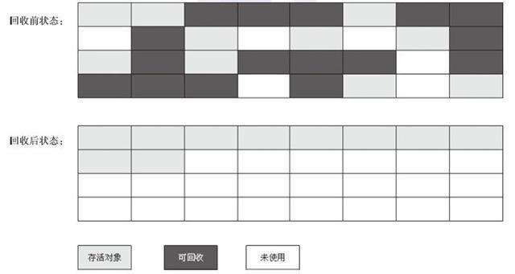

# JVM垃圾回收
## 本节常见面试题

1. 如何判断对象是否死亡；
2. 介绍强引用、软引用、弱引用、虚引用（虚引用与软引用和弱引用的区别，使用软引用能带来的好处）
3. 如何判断一个常量是废弃常量
4. 如何判断一个类是无用的类
5. 垃圾收集有那些算法，各自特点
6. Hotspot为什么要分为新生代和老声代
7. 常见垃圾回收器有哪些
8. 介绍CMS和G1收集器
9. Minor Gc和Full GC有什么不同

## 文章主线：
**内存时如何分配和回收的** --> **那些垃圾需要被回收** --> **什么时候回收** --> **如何回收**
需要排查各种内存溢出问题，当垃圾收集成为系统达到更高并发的瓶颈的时候，我们对这些自动化的技术需要实施必要的监控和调节；

## 1. 揭开JVM内存分配和回收的神秘面纱
Java的自动内存管理主要是针对对象内存的回收和对象内存的分配。JAva自动内存最核心的功能是堆内存的对象的分配和回收。

Java堆是垃圾收集器管理的主要区域，又称GC堆。收集器采用分代垃圾收集算法，java细分为新生代，老生代，还有Eden空间，From survivor 、 To Survivor空间等。进一步划分的目的是更好的回收内存，或者更快的分配内存；

堆空间的基本结构 ：

其中eden，s0，s1都属于新生代，tentired属于老生代。大部分情况对象都会首先在Eden区域分配，再一次新生代垃圾回收之后，如果对象还存活，进入s1，并且年龄增加1，当年龄一直到一定程度，就会晋升到老年代中。经过这次GC之后，Eden和From survivor去被清空，这个时候From和To会交换他们的角色，也就是新的To是上次的From，新的From是上次的To，都能保证名为To的区域是空的。Minor GC会一直重复这样的过程，知道To区被填满。To区被填满就会把所有的对象移动到老年代中。

对象优先在eden中分配
大对象直接进入老年代
长期存活的对象进入老年代；

### 1.1 对象优先在eden中分配
主流垃圾回收器都是分代回收，所以堆内存中分为新生代和老年代，大多数情况下，新生代在eden区分配，eden区没有足够的空间的时候，虚拟机将发起一次Minor GC。

Minor GC和Full GC的不同呢？
**新生代（Minor GC）**：指新发生的垃圾回收动作，Minor GC非常频繁，回收速度快；
**老年代（Major GC）**：发生在老年代的GC，Major GC经常伴随至少一次的Minor GC并非绝对，速度较慢；

### 1.2 大对象直接进入老年代
大对象就是需要大量连续内存空间的对象，比如字符串、数组
避免为大对象分配内存的时候，由于分配担保机制带来的复制而降低效率；

### 1.3 长期存活的对象将进入老年代

### 1.4 动态对象年龄判定
对象首次在Eden中分配，再一次新生代垃圾回收之后，如果对象还存活，则会进入s0或者s1，并且对象的年龄还会加1，当它的年龄增加到一定程度就会晋升到老年代。默认是15；
Hotspot遍历所有对象时，按照年龄从小到大对其所占有的大小进行累计，当累计到某个年龄超过了survivor区的一半，取这个年龄和MaxTenuringThreshold中更小的一个值，作为新的晋升年龄阈值；

CMS的默认晋升年龄是6，具体虚拟机是不一样的；

## 2. 对象已经死亡
堆中放着几乎所有的对象实例，对堆垃圾回收之前要判断哪些对象已经死亡；

如何判断一个对象是否已死：**引用计数法，可达性分析法**

### 2.1 引用计数法
给对象中添加一个引用计数器，每当有一个地方引用他，计数器就加1；当引用失效，计数器就减1；任何时候计数器为0的对象就是不可能在被使用的；

方法简单，效率高，目前主流虚拟机并没有选择和这个算法管理内存，主要原因很难解决对象之间**相互循环引用的问题**；

### 2.2 可达性分析算法
通过一系列的称为GC Roots的对象作为起点，从这个节点往下搜索，节点走过的路径称之为引用链，当一个对象到GC Roots没有任何引用链相连的话，证明这个对象时不可用的；

进行对象遍历，不可达的对象就是死对象

### 2.3 再谈引用
如果 reference 类型的数据存储的数值代表的是另一块内存的起始地址，就称这块内存代表一个引用。
**1. 强引用**
强引用就是最普遍的引用，如果一个对象具有强引用，那就类似于必不可少的生活用品，垃圾回收器觉不到会回收他，内存不足的时候宁愿跑出OutMemoryError错误，使程序异常终止，也绝不靠随意回收强引用的对象来解决内存不足的问题；

**2. 软引用**
如果一个对象只具有软引用，那就类似于可有可无的生活用品。如果内存空间足够，那么垃圾回收器就不会回收塔，如果内存空间不足，就会回收这些对象内存。只要垃圾回收器没有回收他，该对象就可以被程序使用。软引用可以用来实现内存敏感的高速缓存。
软引用可以和一个引用队列（ReferenceQueue）联合使用，如果软引用所引用的对象被垃圾回收，JAVA 虚拟机就会把这个软引用加入到与之关联的引用队列中。

**3. 弱引用**
弱引用，可有可无的生活用品，弱引用和软引用的区别在于，只具有弱引用的对象拥有更短暂的声明周期。在垃圾回收器线程扫描他所管辖的内存区域的过程中，一旦发现有弱引用的对象就不管当前内存是否够用直接回收。但是垃圾回收器线程优先级没有那么高不会马上发现弱引用。弱引用可以和一个引用队列联合使用，如果弱引用所引用的对象被垃圾回收，java就把这个弱引用加入到与之关联的引用队列中；

**4. 虚引用**
顾名思义，形同虚设虚引用并不会决定对象的生命周期。如果一个对象仅持有虚引用，那么它就和没有任何引用一样，在任何时候都可能被垃圾回收。

### 2.4 不可达对象并非“非死不可”
即使是可达性分析中不可达的对象，也并非是非死不可的，这个时候他们暂时处于缓刑期间，真正宣告一个对象的死亡，至少经历两次标记过程；可达性分析法中不可达的对象被第一次标记并且进行一次筛选，筛选的条件是次对象是否有必要执行finalize方法。
当**对象没有覆盖finalized方法，或者finalized方法已经被虚拟机调用过时，虚拟机将这两种情况视为没有必要执行**；

被判定为需要执行的对象将会被放在一个队列中进行二次标记，除非这个对象与引用链上的任何一个对象建立联系，否则就会被真的回收；

### 2.5 如何判断一个常量是废弃常量
运行时常量池主要回收的废弃的常量，如何判断一个常量是废弃常量呢？
如果字符串abc，没有任何string对象引用该字符常量的话，就说明常量abc就是废弃常量，如果这时候发生回收的话而且有必要的话，abc就被清理出常量池；

### 2.6 如何判断一个类是无用的类
类需要同时满足下面 3 个条件才能算是 “无用的类” ：

1. 该类所有的实例被回收，java堆里不存在该类的任何实例；
2. 加载该类的ClassLoader已经被回收；
3. 该类对应的java.lang.Class对象没有在任何地方被引用，无法再任何地方通过反射访问该类的方法；

只是满足上述三个条件的类可以被回收，而不是和对象一样不适用了就会必然被回收；

## 3. 垃圾回收算法

垃圾搜索算法： **标记清除算法、复制算法、标记整理算法、分代收集算法**

### 标记清除算法
分为“标记”和“清除”两个阶段，首先比较出所有需要回收的对象，在标记完成之后一次性回收掉所有标记的对象。他是最基础的收集算法，后续的算法都是对其不足的改进。
问题：
**效率问题**
**空间问题，标记清除之后会有大量不连续的碎片**

### 复制算法
将内存分为两块，每次使用其中一块，当每一块的内存使用完之后，就会将还存活的对象复杂到另一块，再把这个内存中所有的空间直接回收掉。

### 标记整理算法
针对老年代的特点进行的一种标记算法，标记过程中任何和标记清除的过程一样，但是后续步骤不再是清除，而是让还存活的对象向一边移动，然后清除端边界以外的内存；

### 分代收集算法
当前虚拟机收集采用的分代收集算法，这种算法没有什么新思想，只是根据对象存活的周期不同将内存分为几块，一般分为新生代和老年代，这样我们就可以根据各自的特点进行收集；
**新生代中每次都有大量对象的死亡，所以选择复制算法，只需要付出少量复制成本就可以完成每次垃圾的收集，而老年代对象的存活几率是比较高的，没有额外空间对他进行分配担保，所以我们必须选择标记清除和标记整理进行垃圾收集；**

HotSpot 为什么要分为新生代和老年代？ 答案就是上面的；

## 4. 垃圾收集器
垃圾收集器：**Serial收集器，ParNew收集器，Parallel ScaVenge收集器，CMS收集器，G1收集器**

没有最好的收集器出现，更加没有万能的收集器，只能根据具体使用场景选择适合自己的垃圾收集器；

### 4.1 Serial收集器
串行垃圾收集器，一个单线程的收集器，但是单线程的意义不仅仅意味着他只会使用一条垃圾收集线程区完成垃圾收集工作，更重要的是垃圾收集工作的时候必须暂停所有其他的工作线程stop The World，直到他收集完成；

后续垃圾收集器设计中间的停顿时间不断缩短，但是还是又停顿；

优点是，它简单而高效与其他单线程相比；运行在client模式的虚拟机的首选；

### ParNew收集器
ParNew收集器其实就是Serial收集器的一个多线程版本，除了使用多线程来执行垃圾收集工作，其余行为和Serial完全一样；

它是许多运行在 Server 模式下的虚拟机的首要选择，除了 Serial 收集器外，只有它能与 CMS 收集器（真正意义上的并发收集器，后面会介绍到）配合工作；

**并行（Parallel）** ：指多条垃圾收集线程并行工作，但此时用户线程仍然处于等待状态。

**并发（Concurrent）**：指用户线程与垃圾收集线程同时执行（但不一定是并行，可能会交替执行），用户程序在继续运行，而垃圾收集器运行在另一个 CPU 上。

### 4.3 Parall Scavenge收集器
Parallel Scavenge 收集器也是使用复制算法的多线程收集器，它看上去几乎和ParNew都一样。 那么它有什么特别之处呢？
**Parallel Scavenge 收集器关注点是吞吐量（高效率的利用 CPU）。CMS 等垃圾收集器的关注点更多的是用户线程的停顿时间（提高用户体验）。所谓吞吐量就是 CPU 中用于运行用户代码的时间与 CPU 总消耗时间的比值。**

### 4.4 CMS收集器
CMS收集器是一种以获取最短回收停顿时间的收集器，它非常符合在注重用户体验的应用上使用；

CMS收集器是Hotspot虚拟机第一款真正意义上的并发收集器，他第一次实现了让垃圾收集线程与用户同时工作；

名字中的Mark Sweep这两个词可以看出，CMS 收集器是一种 “标记-清除”算法实现的；

运作过程分四个步骤；

**初始标记**： 暂停所有其他线程，并记录下直接与root相连的对象，速度很快；
**并发标记**： 同时开启GC和用户线程，用一个闭包结构去记录可达对象，但是在这个阶段结束之后，这个闭包结构并不能保证包含当前所有的可达对象。因为对象线程可能会不断的更新引用域，所以GC线程无法保证可达性分析的实时性，所以这个算法会跟踪记录这些发生引用更新的地方；
**重新标记**： 重新标记阶段就是为了修正并发标记期间因为用户程序继续运行而导致的标记变动的那一部分，这个阶段的停顿事件一般会比初始标记阶段事件稍长；

**并发清除**： 开启用户线程，同时GC线程开始对未标记的区域做清扫；

从它的名字就可以看出它是一款优秀的垃圾收集器，主要优点：**并发收集、低停顿**。但是它有下面三个明显的缺点：

**对 CPU 资源敏感；**
**无法处理浮动垃圾；**
**它使用的回收算法-“标记-清除”算法会导致收集结束时会有大量空间碎片产生。**