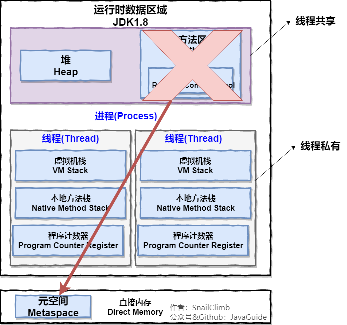

### 基本问题：
1、介绍下Java内存区域（运行时数据区）
2、Java对象的创建过程（五步，默写并知道每一步干什么）
3、对象的访问定位的两种方法（句柄和直接指针两种方法）
### 扩展问题：
1、String类和常量池
2、8种基本类型和包装类和常量池

java程序员将内存控制权交给了java虚拟机，一旦出现内存泄漏或者溢出方面问题，不了解虚拟机怎么使用内存，那么排查错误将会很难；

## 运行时的数据区域

|**线程共享的** | **线程私有的**|
| --------|---------|--------|
|      堆       |  程序计数器    |
|     方法区    |   虚拟机栈     |
|    直接内存   |  本地方法栈    |

### 1. 程序计数器
程序计数器是一块较小的内存空间，是当前执行线程的字节码的行号指示器(或者理解为当前执行代码执行到了第几行)。
字节码解释器通过改变这个计数器的值来进入下一行执行的字节码指令，分支等等功能都需要依赖这个计数器来完成。
为了线程切换后能**恢复**到正确的执行位置，每条线程都需要有一个**独立的程序计数器**，各线程之间计数器互不影响，这类内存区域线程私有；
注：程序计数器是唯一一个不会出现OutOfMemoryError的内存区域，他的生命周期随着线程的创建而创建，随之线程的结束而死亡。

### 2. Java虚拟机栈
线程私有、生命周期和线程相同、描述的是Java方法执行的内存模型，每次方法调用的数据都是通过栈传递的；

Java内存可以粗糙的区分为堆内存(Heap}和栈内存(Stack)，**栈是虚拟机栈或者说是虚拟机栈中的局部变量表部分。**

局部变量表主要存放了编译器可知的各种数据类型（boolean，byte，char，short，int，float，long，double），对象引用（reference类型）

Java虚拟机栈两种异常：StackOverFlowError和OutOfMemoryError
StackOverFlowError：若Java虚拟机栈的内存大小不允许动态扩展，那么当前请求栈深度超过当前Java虚拟栈最大深度的时候，就会抛出StackOverFlowError异常
OutOfMemoryError：若Java虚拟机的内存大小允许动态扩展，且当线程请求栈时内存用完了，无法在动态扩展了，此时抛出OutOfMemoryError异常。

随线程生成随线程消亡;

方法或函数调用？
Java栈类比于数据结构中的栈，Java栈保存的是栈帧，每一次函数调用都会有一个对应的栈帧压入栈，每一个函数调用结束有一个栈帧被弹回；
两种返回：return和异常；

### 3. 本地方法栈
虚拟机栈为虚拟机执行Java方法也就是字节码服务，而本地方法栈则为虚拟机使用的Native方法服务。在HotSpot虚拟机中和Java虚拟机栈合二为一。
### 4. 堆
JAVA虚拟机所管理的内存中最大的一块，Java堆是所有线程共享的一块内存区域，在虚拟机启动时创建。此内存区域唯一目的是存放对象实例，**几乎所有的对象**实例以及数组都在这里分配内存。

Java堆是垃圾收集器管理的主要区域，因此也被称为GC堆。Carbage Collated Heap。从垃圾回收的角度由于现在收集器基本都采用分代垃圾收集算法，所以Java堆还可以细分为，新生代和老生代；这样划分的目的是更好的回收内存，或者更快的分配内存；

jdk7堆内存通常分为下面三部分
新生代内存，老生代，永生代

JDK8版本方法区永生代被彻底移除了，取而代之的是元空间，元空间使用的是直接内存；

大部分情况下，对象都会首先在Eden区域分配，在一次新生代垃圾回收后，如果对象还存活，则会进入s0或者s1，并且对象的年两还会加1，当他的年龄增加到一定程度默认是15岁，就会晋升到老年代；

### 5. 方法区
方法区和Java堆一样，是各个线程共享的内存区域，它用于存储已被虚拟机加载的类信息、常量、静态变量、即时编译器编译后的代码等数据。虽然Java虚拟机把方法区描述为堆的一个逻辑部分，但是他却又一个别名Non-Heap，目的是和Java堆区分开。

### 运行时常量池
JDK1.7及之后版本的JVM已经将运行时的常量池从方法区中移了出来，在Java堆中开辟出一块区域存放运行时常量池。

### 直接内存
直接内存并不是虚拟机运行时数据区的一部分，也不是虚拟机规范中定义的内存区域，但是这部分内存也被频繁地使用。而且也可能导致 OutOfMemoryError 异常出现。

》》》待续
