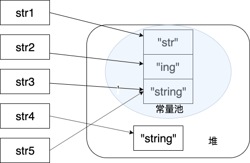

Java内存区域，如果没有特殊说明，都是针对Hotspot虚拟机

### 基本问题：
1、介绍下Java内存区域（运行时数据区）
2、Java对象的创建过程（五步，默写并知道每一步干什么）
3、对象的访问定位的两种方法（句柄和直接指针两种方法）

### 扩展问题：
1、String类和常量池
2、8种基本类型和包装类和常量池

java程序员将内存控制权交给了java虚拟机，一旦出现内存泄漏或者溢出方面问题，不了解虚拟机怎么使用内存，那么排查错误将会很难；

## 运行时的数据区域

|**线程共享的** | **线程私有的**|
| --------|---------|--------|
|      堆       |  程序计数器    |
|     方法区    |   虚拟机栈     |
|    直接内存   |  本地方法栈    |

### 1. 程序计数器
程序计数器是一块较小的内存空间，是当前执行线程的字节码的行号指示器(或者理解为当前执行代码执行到了第几行)。
字节码解释器通过改变这个计数器的值来进入下一行执行的字节码指令，分支等等功能都需要依赖这个计数器来完成。
为了线程切换后能**恢复**到正确的执行位置，每条线程都需要有一个**独立的程序计数器**，各线程之间计数器互不影响，这类内存区域线程私有；
注：程序计数器是唯一一个不会出现OutOfMemoryError的内存区域，他的生命周期随着线程的创建而创建，随之线程的结束而死亡。

### 2. Java虚拟机栈
线程私有、生命周期和线程相同、描述的是Java方法执行的内存模型，每次方法调用的数据都是通过栈传递的；

Java内存可以粗糙的区分为堆内存(Heap}和栈内存(Stack)，**栈是虚拟机栈或者说是虚拟机栈中的局部变量表部分。**

实际上java虚拟机栈是由一个个的栈帧组成，而每一个栈帧中都拥有：局部变量表、操作数栈、动态链接、方法出口信息等；

局部变量表主要存放了编译器可知的各种数据类型（boolean，byte，char，short，int，float，long，double），对象引用（reference类型）

Java虚拟机栈两种异常：StackOverFlowError和OutOfMemoryError
StackOverFlowError：若Java虚拟机栈的内存大小不允许动态扩展，那么当前请求栈深度超过当前Java虚拟栈最大深度的时候，就会抛出StackOverFlowError异常
OutOfMemoryError：若Java虚拟机的内存大小允许动态扩展，且当线程请求栈时内存用完了，无法在动态扩展了，此时抛出OutOfMemoryError异常。

随线程生成随线程消亡;

方法或函数调用？
Java栈类比于数据结构中的栈，Java栈保存的是栈帧，每一次函数调用都会有一个对应的栈帧压入栈，每一个函数调用结束有一个栈帧被弹回；
两种返回：return和异常；

### 3. 本地方法栈
和虚拟机栈发挥的作用相似，区别是：虚拟机栈为虚拟机执行Java方法也就是字节码服务，而本地方法栈则为虚拟机使用的Native方法服务。在HotSpot虚拟机中和Java虚拟机栈合二为一。
### 4. 堆
JAVA虚拟机所管理的内存中最大的一块，Java堆是所有线程共享的一块内存区域，在虚拟机启动时创建。此内存区域唯一目的是存放对象实例，**几乎所有的对象**实例以及数组都在这里分配内存。
存放对象实例，也就是实际定义的对象以及数组等。

随着JIT编译器的发展和逃逸分析技术的逐渐成熟，栈上分配、标量替换优化技术将会导致一些微妙的变化，所有的对象都分配到堆上也变得逐渐的不是那么绝对了。从jdk1.7开始已经默认开启逃逸分析，如过某些方法中的对象引用没有被返回或者被外面使用，那么对象可以直接在栈上分配内存。

Java堆是垃圾收集器管理的主要区域，因此也被称为GC堆。Carbage Collated Heap。从垃圾回收的角度由于现在收集器基本都采用分代垃圾收集算法，所以Java堆还可以细分为，新生代和老生代；再细致些可以分为Eden空间，from survivor，To survivor空间等，这样划分的目的是更好的回收内存，或者更快的分配内存；

jdk7堆内存通常分为下面三部分
新生代内存，老生代，永生代

JDK8版本方法区永生代被彻底移除了，取而代之的是元空间，元空间使用的是直接内存；

大部分情况下，对象都会首先在Eden区域分配，在一次新生代垃圾回收后，如果对象还存活，则会进入s0或者s1，并且对象的年两还会加1，当他的年龄增加到一定程度默认是15岁，就会晋升到老年代；

修正：Hotspot遍历所有对象时，按照年龄从小到大对其占用的大小进行累计，当累计的某个年龄大小超过了survivor区的一半时，区这个年龄和MaxTenuringThreshold中更下的一个值，作为新的晋升年龄阈值；

### 5. 方法区
方法区和Java堆一样，是各个线程共享的内存区域，它用于存储已被**虚拟机加载的类信息、常量、静态变量、即时编译器编译后的代码等**数据。虽然Java虚拟机把方法区描述为堆的一个逻辑部分，但是他却又一个别名Non-Heap，目的是和Java堆区分开。
方法区也称之为永久代。很多人都会分不清楚方法区和永久代之间的关系；

方法区和永久代的关系：
方法区和永久代之间的关系更像是Java中接口和类的关系，类实现了接口，而永久代就是Hotspot虚拟机对虚拟机规范中方法区的一种实现方式，也就是说永久代是Hotspot的概念，方法区是Java虚拟机规范中的定义，是一种规范，而永久代是一种实现，一个是标准一个是实现，其他的虚拟机实现并没有永久代这一说法；
方法区是java虚拟机中的一种规范，而永久代是hotspot对方法区的一种实现。

**为什么用元空间取代永生代呢**
整改永久代中有一个JVM本身设置的固定大小的上限，无法调整，而元空间使用的是直接内存，手本机可用分内存的限制，虽然元空间仍旧可能溢出，但是比原来出现的几率更小；

元空间溢出出现的错误是：java.lang.OutOfMemoryError:MetaSpace

元空间中存放的是类的元数据，这样加载多少类的元数据就不由MaxPermSize控制了，而由系统的实际可用空间来控制，这样就能加载的类更多了；

在JDK1.8合并Hotspot和JRockit的代码时，JRockit从来没有一个叫永生代的东西，合并之后就没有必要额外设置一个永生代的地方了；

### 6. 运行时常量池
运行时常量池是方法区的一部分。Class文件中除了类的版本、字段、方法、接口等描述信息等，还有常量池表，用于存放编译期生成的各种字面量和符号引用。

JDK1.7之前运行的常量池逻辑包含字符串常量池存放在方法区，此时hotspot虚拟机对方法区的实现为永生代
JDK1.7字符串常量池被从方法区拿到了堆中，这里没有提到运行时常量池，也就是说字符串常量池被单独拿到了堆，运行时常量池剩下的东西还在方法区，也就是hotspot中的永生代；
JDK1.8hotspot移除了永久代，使用元空间取而代之，这时候字符串常量池还在堆，运行时常量池还在方法区，只不过方法区的实现从永久代变成了元空间；

### 7. 直接内存
直接内存并不是虚拟机运行时数据区的一部分，也不是虚拟机规范中定义的内存区域，但是这部分内存也被频繁地使用。而且也可能导致 OutOfMemoryError 异常出现。
本机直接内存的分配不会受到Java堆的限制，但是既然是内存就会受到本机总内存的大小以及处理器寻址空间的限制；

## HotSpot虚拟机对象的探秘

Hotspot虚拟机在Java堆中的对象分配，布局和访问的全过程；

### 1. 对象的创建
下图便是Java对象的创建过程，**（默写）**

**第一步：类加载检查**
虚拟机遇到一条new指令时，首先去检查这个指令的参数是否能在常量池中定位到这个类的符号引用，并且检查这个符号引用代表的类是否已经被加载过，解析和初始化过。如果没有，那必须执行相应的类加载过程。

**第二步：分配内存**
在类加载检查通过之后，接下来虚拟机将为新生对象分配内存。对象所需的内存大小在类加载完成之后便可以确定，为对象分配空间的任务等于把一块确定大小的内存从Java堆中划分出来。分配方式有 **指针碰撞** 和 **空闲列表** 两种，**选择那种分配方式由Java堆是否规整决定，而java堆是否规整又由所采用的垃圾收集器是否带压缩整理功能决定；**

    选择上面的两种方式的哪一种，取决于Java堆内存是否规整，Java堆内存是否规整又取决于GC收集器的算法是“标记清除”还是“标记整理”，只等注意的是复制算法内存也是规整的；

    **指针碰撞**
    适合场景：堆内存规整，没有内存碎片的情况下；
    原理：用过的内存全部整合在一边，没有用过的内存全部放在另一边，中间有一个分界值指针，只需要向着没用过的方向将该指针移动对象大小内存的空间即可；
    GC收集器：Serial，ParNew

    **空闲列表**
    适合场景：堆内存不规整的情形；
    原理：虚拟机会维护一个列表，该列表中记录着那些内存块式可以用的，再分配时候，找一块大小足够的内存直接划分给对象即可，最后更新列表；
    GC收集器：CMS

    **内存分配并发的问题**
    在创建对象的时候一个很重要的问题，就是线程安全，在实际开发过程中创建对象时很繁琐的事情，对于虚拟机来说，必须保证线程是安全的，通常来讲，虚拟机采用两种方式保证线程安全：

    **CAS+失败重试**：CAS是乐观锁的一种实现方式。所谓乐观锁就是，每次不加锁而是假设没有冲突而去完成某项操作，如果因为冲突失败就重试，直到成功为止。虚拟机采用CAS配上失败重试的方法保证更新操作的原子性。

    **TLAB**：为每一个线程预先在Eden上分配一个内存，JVM在给线程的对象分配内存时，首先在TLAB上分配，当对象大于TLAB中剩余内存或TLAB的内存已用尽的时候，才采用上述的CAS进行内存分配；

**第三步：初始化零值**
内存分配完之后，虚拟机需要将分配到的内存空间都初始化为0，不包括对象头，这一步操作保证了对象的实例字段在Java代码中可以不赋初值就可以直接使用，程序能访问到这些字段的数据类型所对应的零值；

**第四步：设置对象头**
初始化零值完成之后，**虚拟机要对对象进行必要的设置**，例如这个对象是哪个类的实例，如何才能找到类的元数据信息，对象的哈希码、对象的GC分代年龄等信息。这些信息存放在对象头中。另外，根据虚拟机当前的运行状态的不同，如是否启用偏向锁等，对象头都会有不同的设置方式；

**第五步：执行init方法**
在上面工作都完成之后，从虚拟机的角度来看，一个新的对象已经产生了，但从Java程序的角度来看，对象的创建才刚刚开始，init方法还没有执行，所有的字段都是0。一般来说，执行new指令之后会接着执行init方法，把对象按照程序员的意愿进行初始化，这样一个真正可以用的对象才算是完全产生出来；

### 2. 对象的内存布局
在Hotspot虚拟机中，对象在内存中的布局分为3部分：**对象头、实例数据和对齐填充**；

Hotspot虚拟机的**对象头**包括两部分信息，**第一部分用于存储自身的运行时数据（哈希码，GC分代年龄，锁状态标志等等）**，另一部分是 **类型指针**，即对象指向他的类元数据的指针，虚拟机通过这个指针来确定这个对象时那个类的实例。

**实例数据是对象真正存储的有效信息**，也是程序中所定义的各种类型的字段内容；

**对齐填充部分不是必然存在的，也没有特别的含义，占位作用**。因为Hotspot虚拟机的自动内存管理系统对象的其实地址必须是8字节的整数倍，欢聚哈来说，就是对象的大小必须是8字节的整数倍。

### 3.3 对象的访问定位
建立对象就是为了使用对象，java程序通过站上的reference数据来操作堆上的具体对象。对象的访问方式是由虚拟机实现而定的，目前主流的访问方式有 ****使用句柄**和 **直接内存**

1. **句柄**

使用句柄的话，java堆上会划分出来一块内存作为句柄池，reference中存储的就是对象的句柄地址，而句柄中包含的是对象实例数据和类型数据各自的具体地址信息；

2. **直接指针**

使用直接指针的话，java堆对象的布局就必须考虑如何放置访问类型数据的相关信息，而reference中存储的直接就是对象的地址；

**这两种对象访问方式各有优势。使用句柄来访问的最大好处是 reference 中存储的是稳定的句柄地址，在对象被移动时只会改变句柄中的实例数据指针，而 reference 本身不需要修改。使用直接指针访问方式最大的好处就是速度快，它节省了一次指针定位的时间开销。**

## 四补充内容
### 1.String类和常量池

String对象的两种创建方式：

    String str1 = "abcd"; 检查常量池中有没有abcd，如果字符串常量池中没有，则创建一个，然后str1指向他，有的话直接指向；
    String str2 = new String("abcd");//堆中创建一个新的对象
    String str3 = new String("abcd");//堆中创建一个新的对象
    System.out.println(str1==str2);//false
    System.out.println(str2==str3);//false

上面两种创建方式是不一样的：
第一种是直接在常量池中拿对象；
第二种是直接在堆内存中创建一个新的对象；

牢记：只要使用new方法，就需要创建新的对象；

**String类型的常量池比较特殊，使用方法有两种**
1. 直接使用双引号声明出来的String对象会直接存储在常量池中；
2. 如果不是双引号直接声明的，可以使用String的intern方法。String.intern()是一个native方法，他的作用是：如果运行时常量池中已经包含一个等于此String对象内容的字符串，并返回常量池中该字符串的引用，如果没有jdk1.7以前是在常量池中创建与此String内容相同的字符串，并返回常量池中创建的字符串的引用，jdk1.7及以后的处理方式是在常量池中记录此字符串的引用，并返回该引用；
   
    String s1 = new String("计算机");
    String s2 = s1.intern();
    String s3 = "计算机";
    System.out.println(s2);//计算机
    System.out.println(s1 == s2);//false，因为一个是堆内存中的 String 对象一个是常量池中的 String 对象，
    System.out.println(s3 == s2);//true，因为两个都是常量池中的 String 对象

字符串的拼接：

    String str1 = "str";
    String str2 = "ing";

    String str3 = "str" + "ing";//常量池中的对象
    String str4 = str1 + str2; //在堆上创建的新的对象      
    String str5 = "string";//常量池中的对象
    System.out.println(str3 == str4);//false
    System.out.println(str3 == str5);//true
    System.out.println(str4 == str5);//false

尽量避免字符串拼接。字符串拼接会创建新的对象，如果需要改变字符串的话，可以使用StringBuilder或者StringBuffer；

### 2. String s1 = new String("abc")这句话创建了几个字符串对象？
将创建1或2个字符串。如果池中已经存在一个常量abc则在堆中创建一个字符串对象，如果常量池中不存在abc，那么现在池中创建，然后在堆空间中创建，因此将创建总共2个字符串对象；

### 3.8种基本类型的包装池和常量池
Java基本类型都的包装类的大部分都实现了常量池技术，即Byte，Short，Integer，Long，Character，Boolean；前面4种包装类型默认创建了数值[-128,127]的相应类型的缓存数据，Character创建了数值在[0,127]范围的缓存数据，Boolean直接返回True，False。如果超过了这个范围仍然会去创建新的对象。

**两种浮点数类型的包装类 Float,Double 并没有实现常量池技术。**

    Integer i1 = 40;
    Integer i2 = 40;
    Integer i3 = 0;
    Integer i4 = new Integer(40);
    Integer i5 = new Integer(40);
    Integer i6 = new Integer(0);

    System.out.println("i1=i2   " + (i1 == i2));
    System.out.println("i1=i2+i3   " + (i1 == i2 + i3));
    System.out.println("i1=i4   " + (i1 == i4));
    System.out.println("i4=i5   " + (i4 == i5));
    System.out.println("i4=i5+i6   " + (i4 == i5 + i6));   
    System.out.println("40=i5+i6   " + (40 == i5 + i6));    

    i1=i2   true
    i1=i2+i3   true
    i1=i4   false
    i4=i5   false
    i4=i5+i6   true
    40=i5+i6   true

    语句 i4 == i5 + i6，因为+这个操作符不适用于 Integer 对象，首先 i5 和 i6 进行自动拆箱操作，进行数值相加，即 i4 == 40。然后 Integer 对象无法与数值进行直接比较，所以 i4 自动拆箱转为 int 值 40，最终这条语句转为 40 == 40 进行数值比较。