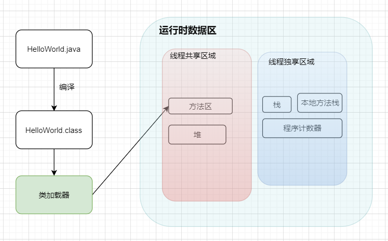
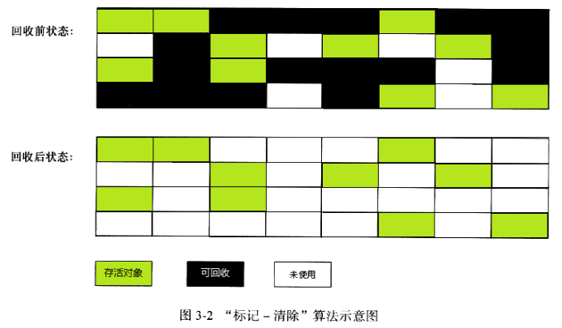
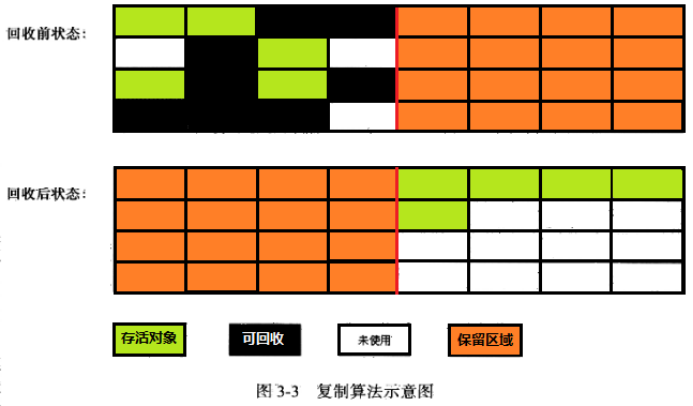
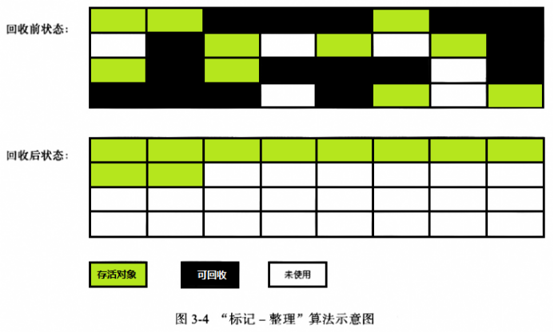

# 1. JVM的基本介绍
JVM Java Virtual Machine的缩写，虚构出来的计算机，一种规范。通过在实际的计算机上的仿真模拟各种计算机功能实现；
jvm其实就是类似于一台小电脑运行在windows或者linux这些操作系统环境中的，他直接和操作系统进行交互，与硬件不直接交互，可操作系统帮我们完成与硬件之间进行交互的工作；

## 1.1 jvm文件是如何被运行的
比如我们现在写一个HelloWorld.java好了，那这个HelloWorld.java抛开所有的东西不谈，那是不是就类似于一个文本文件只是这个文本文件他写的是英文，而且有一定的缩进而已。

那么JVM是不认识这个文本文件的，他需要先 **编译**，让其成为一个jvm认识的二进制文件的HelloWorld.class

1. **类加载器**
如果JVM想要执行这个.class文件，需要有一个搬运工（**类加载器**）就像是一个搬运工一样，会把所有的.class文件全部搬运到jvm中；

2. **方法区**
方法区是用来存放类似与元数据信息方面的数据，比如类信息、常量、静态变量、编译后代码等；
类加载器将.class文件搬过来就是先丢到这一块上；

3. **堆**
堆 主要放了一些存储的数据，比如对象实例，数组等，他和方法区都同属于线程共享区域。**也就是说他们都是线程不安全的**

4. **栈**
栈 这是我们代码运行空间。我们编写的每一个方法都会放到栈里面运行；

我们听说的本地方法栈和本地方法接口这两个名词，基本不会涉及到这两块的内容，这俩底层是使用C进行工作的，和Java没有太大关系；

5. **程序计数器**
主要是完成一个加载的工作，类似于指针一样，指向下一行应该执行的代码，和栈一样，都是线程独享的，就是说每一个线程都会有自己的对应的一块区域而不会存在并发和多线程问题；

**总结**
1. Java文件经过编译后变成.class字节码文件；
2. 字节码文件通过类加载器被搬运到JVM虚拟机中；
3. 虚拟机主要的5大块：方法区，堆都为线程共享区域，有线程安全问题，栈和本地方法栈和计数器都是独享区域，不存在线程安全问题，而JVM的调优主要是围绕堆和栈两大块进行的；

**代码例子**
学生类：

    public class Student {
        public String name;
        public Student(String name){
            this.name = name;
        }
        public void sayName(){
            System.out.println("Student's name is " + name);
        }
    }

    public class App {
        public static void main(String[] args){
            Student static void main(String[] args){
                Student student = new Student("tellUrDream");
                student.sayName();
            }
        }
    }

1. 编译好App.java后得到一个App.class,执行App.calss,系统会启动一个JVM进程，从classpath路径中找到一个名为App.class的二进制文件，将App的类信息加载到运行时数据区的方法区中，这个过程叫做App类的加载；
2. JVM找到一个App的主程序入口，执行main方法；
3. 这个main中的第一条语句是Student student = new Student("tellUrDream"),也就是让JVM创建一个Student的对象，但是这个时候方法区中是没有Student类信息的，所以JVM马上加载Student类，把Student类的信息放到方法区中；
4. 加载完Student类后，JVM在堆中为一个新的Student实例分配内存，然后调用构造函数初始化Student实例，这个Student实例持有指向方法区中的student类的类型信息的引用；
5. 执行student.sayName();时，JVM根据student的引用找到student对象，然后根据student对象持有的引用定位到方法区中student类的类型信息的方发表，获得sayName()的字节码地址
6. 执行sayName();

# 二。类加载器的介绍
它是负责加载class文件的，它们在文件开头会持有特定的文件标识，将class文件字节码内容加载到内存中，并将这些内容转换成方法区中运行时的数据结构，并且ClassLoader自负责class文件的加载，而是否能够运行则由Execution Engine来决定；

## 2.1类加载器的流程
从类被加载到虚拟机内存开始，到释放内存总共7个步骤：加载，验证，准备，解析，初始化，使用，卸载。其中验证，准备，解析三个部分统称为连接；

### 2.1.1加载
1. 将class文件加载到内存
2. 将静态的数据结构转化成方法区中运行时的数据结构
3. 在堆中生成一个代表这个类的java.lang.Class对象作为数据访问的入口；

### 2.1.2连接
1. 验证：确保加载的类符合JVM规范和安全，保证被校验类的方法在运行的时候不会做出危害虚拟机的事件，其实就是一个安全检查；
2. 准备：为static变量在方法区中分配内存空间，设置变量的初始值，例如static int a = 3 （准备阶段只设置类中的静态变量(方法区中),不包括实例变量(堆内存)，实例变量是对象初始化时赋值的）
3. 解析：虚拟机将常量池中符号引用调换为直接引用的过程（符号引用比如我现在import java.util.ArrayList这就算符号引用，直接引用就是指针或者对象地址，注意引用对象一定要在内存进行）

### 2.1.3初始化
初始化其实就是一个赋值的过程的操作，他会执行一个类构造器的<clinit>()方法。由编译器自动收集类中所有变量的赋值操作，此时准备阶段的那个static int a = 3的例子，在这个时候正式赋值为3；

### 2.1.4卸载
GC将无用对象从内存卸载；

## 2.2类加载器的顺序
加载一个Class是由顺序优先级的，从最底层开始往上的顺序加载；

1. BootStrap ClassLoader： rt.jar
2. Extention ClassLoader: 加载扩展的jar包
3. App ClassLoader: 指定的classpath下面的jar包
4. Custom ClassLoader： 自定义的类加载器；
   
## 2.3 双亲委派机制
当一个类收到加载请求时候，他不会自己直接进行加载的，而是委托给父类去完成，比如我现在要new一个Person，这个Person是我们自定义的类，如果我们要加载他，就会先委托AppClassLoder去加载，只有当父类加载器都反馈自己无法完成这个请求（父类无法找到加载所需的Class）时，子类加载器才会自行尝试加载；

这样做的好处是加载位于 rt.jar包中的类的时候，不管是哪个加载器加载，最终都会委托到BootStrap ClassLoader进行加载；这样保证了使用不同的类加载器得到的是同一个结果；

其实也是一个隔离的作用，避免影响JDK代码；

# 运行时数据区
## 3.1 本地方法栈和程序计数器

比如点开Thread的源码，会看到他的start0方法带有一个native关键字修饰，而且不存在方法体，这种用natve修饰的方法就是本地方法，这些是用C来实现的，这些方法一般都会放在叫做本地方法栈的的区域；

程序计数器其实就是一个指针，他指向了我们程序下一步要运行执行的指令，他也是内存区域中唯一一个不会出现OutOfMemoryError的区域，而且占用内存空间小到基本可以忽略不计，这个内存仅代表线程所执行的字节码的行号指示器，字节码解析器通过改变这个计数器的指，选取下一条需要执行的字节码指令。

如果执行的是native方法，这个指针就不工作了；

## 3.2 方法区
主要的作用技术存放类的元数据信息，常量和静态变量等；当他存储的信息过大时，会在无法满足内存分配时报错；

## 3.3虚拟机栈和虚拟机堆
栈管运行，堆管存储。则虚拟机栈复制运行代码，虚拟机堆负责存储数据；

### 3.3.1虚拟机栈的概念
他是java方法执行的内存模型。里面会对局部变量，动态链表，方法出口，栈的操作(入栈和出栈)进行存储，且线程独享。同时如果我们听到局部变量表，那也是在说虚拟机栈；

### 3.3.2虚拟机栈存在的异常
如果线程请求栈的深度大于虚拟机栈的最大深度，就会报StackOverflowError，Java虚拟机也可以动态扩展，但随着扩展会不断的身躯内存，当无法申请足够多的内存的时候，会报错OutOfMemoryError。

### 3.3.3虚拟机栈的生命周期
对于栈来说，不存在垃圾回收。只要程序运行结束，栈的空间自然就会释放了。栈的生命周期和所处的线程是一致的。

这里补充一句：8种基本类型的变量+对象的引用变量+实例方法都是在栈里面分配内存。

### 3.3.4虚拟机栈的执行
我们经常说的栈帧数据，说白了在JVM中叫栈帧，方法哦java中其实就是方法，他也是存放在栈中的；

栈中数据以栈帧格式存在，他是个关于方法和运行期数据的数据集。比如我们执行一个方法a，就会对应产生一个栈帧A1，然后A1会被压入栈中。同理方法b会有一个B1，方法c会有一个C1，等到这个县城执行完毕后，栈会先弹出C1，然后B1，A1。他是一个先进后出，后进先出的原则；

### 3.3.5局部变量的复用
局部变量表用于存放方法参数和方法内部所定义的局部变量，容量以slot为最小单位，一个slot可以存放32位以内的数据类型；

虚拟机通过索引定位的方式使用局部变量表，范围为【0，局部变量表中slot的数量】。方法中的参数就会按照一定顺序排列到这个局部变量表中，至于怎么排的我们不关心。而为了节省栈帧空间，这些slot是可以复用的，当方法执行位置超过了魔鬼变量，那么这个变量的slot可以被其他变量复用；

### 3.3.6 虚拟机堆的概念
jvm内存划分为堆内存和非堆内存，堆内存会划分新生代和老年代，而非堆内存则为**永久代**，新生代划分为Eden区和survivor区。Survivor又划分为FromPlace和ToPlace，toPlace的survivor区域是空的。Eden，FromPlace和ToPlace的比例是8：1：1当然这个东西可以通过-XX：+UsePSAdaptiveSurvivorSizePolice参数来根据生成对象的速率来调整；

堆内存中存放着的就是对象，垃圾回收器回收的就是这些对象，然后交给GC算法进行回收。非堆内存其实就是方法区。在1.8中移除永久代，替代为元空间，最大区别是metaspace是不存在与JVM的，他使用的是本地内存。

### 3.3.7Eden新生代的介绍
当我们new一个对象后，会先放到Eden划分出来一块作为存储空间的内存，但是我们知道堆内存时线程共享的，所以出现两个对象共用一个内存的情况。这里JVM的处理是每一线程都会预先申请好一块连续的内存空间并规定了对象存放的位置，而如果空间不足会再申请多块内存空间。

当Eden空间满了之后，会触发一个叫做Minor GC的操作，存活下来的的对象移动到survivor区域，survivor0区满了之后触犯Minor Gc，就会将存活对象移动到Survivor1区，此时还会把from和to的指针交换，这样保证了一段时间总有一个survivor区是空的，且to所指向的survivor始终为空。经过多次GC还有存活的对象，默认是15，你们也可以设置会移动到老年代；

老年代存储的是长期存活的对象，占满时触发Full GC，期间会停止所有线程等待GC的完成。对于影响要求很高的应用，尽量减少Full GC避免响应超时；

### 3.3.8如何判断一个对象需要被回收

程序计数器、虚拟机栈、本地方法栈，3个区域随着线程的生存而生存的。内存分配和回收都是确定的。随着线程的结束内存自然而然的被回收，不需要考虑垃圾回收的问题；
java堆和方法区不一样，个线程共享，内存的分配和回收都是动态的，垃圾回收器主要关注的都是堆和方法区这部分内存；

如何判断哪些对象还活着哪些已经死去，两种方法：
1. **引用计数器计算**，给对象添加一个引用计数器，每次引用加一，失效减一，计数器等于0就是不会在使用的，无法解决循环引用；
2. **可达性分析**，这是一种类似于二叉树的实现，将一系列的GC ROOTS作为起始的存活对象集，从这个节点往下搜索，搜索所走过的路径成为引用链，把这些能在该集合引用到的对象加入集合中。搜索当一个对象到GC Roots没有使用任何引用链时，则说明该对象是不可用的。

可以作为GC Roots的对象的分为以下几种：
1. 虚拟机栈（栈帧中的本地方法表）中引用的对象，局部变量；
2. 方法区中静态变量所引用的对象（静态变量）
3. 方法区常量引用的对象
4. 本地方法栈中JNI引用的对象
5. 已启动的且未终止的Java线程
   
### 3.3.9如何宣布一个对象的真正死亡
首先必须要提到的是名为finalize()的方法；
finalize()是object类的一个方法、一个对象的finalize方法只会被系统自动调用一次，经过finalize方法逃脱死亡的对象，第二次不会被调用；

**并不提倡在程序中调用finalize()来进行自救。建议忘掉Java程序中该方法的存在。因为它执行的时间不确定，甚至是否被执行也不确定（Java程序的不正常退出**

**判断一个对象的死亡需要至少两次标记**：
1. 如果对象进行可达性分析之后没发现GC Roots相连的引用链，那么他会被第一次标记并且进行一次筛选。判断的条件是决定这个对象是否有必要执行finalize方法，如果对象有必要执行finalize方法，责备放入F-Queue队列中；
2. GC对F-Queue队列中的对象进行二次标记。如果对象在finalize方法中重新与引用链上任何一个对象建立了联系，那么二次标记时则会将他移除即将回收的集合。如果此时对象还没成功的逃脱，那么只能被回收了；

## 3.4垃圾回收算法
常用的四种 标记清除，复制，标记整理，分代收集算法；

### 3.4.1标记清除
标记和清除两个阶段，标记结束之后统一回收；

将已经死亡的对象标记为空闲内存，然后记录在一个空闲列表中，需要new一个新对象时，内存管理模块从空闲列表中寻找空闲内存分配给新的对象；

不足的地方，效率低下。且这种做法会让内存中碎片很多，导致需要大内存快的时候，无法分配到足够的连续内存；

### 3.4.2复制算法
为了解决效率问题，复制算法就出现了。他将可用的内存按照容量分为两等分，每次只使用其中一块。和survivor也是用from和to两个指针这样的玩法。fromPlace存满了，就把存活的对象copy到toPlace上，然后交换指针的内容。解决碎片；

代价就是内存缩水；

当然分配比例也不一定都是1：1分的；

### 3.4.3标记整理算法

复制算法在对象存活率高的情况下有一定效率问题，标记过程仍然与标记清除算法一样，但后续步骤不是直接对可回收对象进行清理，而是让所有存活的对象都向一端移动，清除边界之外的；

### 3.4.4分代收集算法
这种算法并没有什么新的思想，只是根据对象存活周期的不同将内存划分为几块。一般是把Java堆分为新生代和老年代，这样就可以根据各个年代的特点采用最适当的收集算法。在新生代中，每次垃圾收集时都发现有大批对象死去，只有少量存活，那就选用复制算法，只需要付出少量存活对象的复制成本就可以完成收集。而老年代中因为对象存活率高、没有额外空间对它进行分配担保，就必须使用“标记-清理”或者“标记-整理”算法来进行回收。

## 3.5（了解）各种各样的垃圾回收器
HotSpot VM的垃圾回收器，适用场景：
|收集器 |串行、并行，并发|新生、老年|算法|目标|使用场景|
|-|-|-|-|-|-|
|Serial    |串行      |新生代     |复制算法       | 响应速度优先      |  单CPU环境下的Client模式|
|Serial Old  |串行    |老年代     |标记整理       | 响应速度优先      | 单CPU环境下Client模式，CMS的后备预案|
|ParNew     |并行      |新生代    |复制算法       |响应速度优先       |多CPU环境时在Server模式下与CMS配合|
|Parallel Scavenge|并行 |新生代   |复制算法       |吞吐量优先         |在后台运算而不需要太多交互的任务|
|Parallel Old   |并行   |老年代   |标记整理       |吞吐量优先         |在后台运算而不需要太多交互的任务|
|CMS        |并行       |老年代   |标记清除       |响应速度优先       |集中在互联网站或B/S系统服务端的Java应用|
|G1         |并发       |both    |标记整理+复制   |响应速度优先       |面向服务端应用，将来替换CMS|

jdk1.8为止默认的收集器是Parallel Scavenge 和 Parallel Old

从1.9开始G1收集器成为默认的垃圾收集器，目前来看，G1回收器停顿事件最短没有明显缺点，适合Web应用；

## 3.6（了解）JVM常用参数

# 关于JVM调优的一些方面
jvm调优，主要是堆内存那块，所有线程共享数据区大小 = 新生代大小 + 年老代大小 + 持久代大小
其中持久代一般固定大小64m，增大新生代之后就压缩了年老代的大小，但是年老代使用的是full GC，频繁的full GC对性能影响很大，Sun官方推荐3/8；

## 4.1调整最大堆内存和最小堆内存
-Xmx -Xms：指定堆最大最小值，默认值物理值的1/4(<1GB)和1/64(<1GB)

默认(MinHeapFreeRatio参数可以调整)空余堆内存小于40%时，JVM就会增大堆直到-Xmx的最大限制，默认(MaxHeapFreeRatio)空余堆大于70%时，JVM会减少堆指导-Xms的最小限制；
剩余小于40%就申请空间直到最大，剩余大于70%就缩小空间直到最小限制；

开发过程中，通常会将 -Xms 与 -Xmx两个参数的配置相同的值，其目的是为了能够在java垃圾回收机制清理完堆区后不需要重新分隔计算堆区的大小而浪费资源。

## 4.2调整新生代和老年代的比值
-XX：NewRatio  新生代eden+2*survivor和老年代不包含永久区的比值；
在Xmx = Xms并且设置了Xmn的情况下，该参数不需要设置；

## 4.3调整Survivor区和eden的比值
-XX：SurvivorRatio   设置两个survivor区和eden的比值
例如：8表示两个Survivor:eden=2：8即两个survivor共占2/10

## 4.4设置年轻代和老年代的大小
-XX：NewSize  设置年轻代大小
-XX：MaxNewSize   设置年轻代最大值
最优解是官方是eden：survivor：survivor= 8：1：1

## 4.5小总结
根据实际情况调整新生代和幸存代的大小，官方推荐新生代占java堆的3/8，幸存代占新生代的1/10

在OOM时，记得Dump出堆，确保可以排查现场问题，通过下面命令可以输出一个dump文件；

## 4.6永久区的设置
-XX：PermSize -XX：MaxPermSize
初始空间默认为(物理内存的1/64)和最大空间(默认为物理内存的1/4)。jvm启动之后，永久区一开始占用了PermSize大小的空间，空间不够可以扩展，但是不能超过MaxPermSize，否则会OOM;

## 4.7JVM栈参数调优
### 4.7.1调整每个线程栈空间的大小
可以通过-Xss：调整每个线程栈空间的大小
JDK5.0之后每个线程堆栈大小为1M，以前是256k，在相同的物理内存中，减小这个值可以生成更多的线程。但是操作系统堆每一个进程的线程数还是有限制的，不能无限生成，经验值在3000-5000左右；

### 4.7.2设置线程栈的大小
-XXThreadStackSize：
设置线程栈的大小

