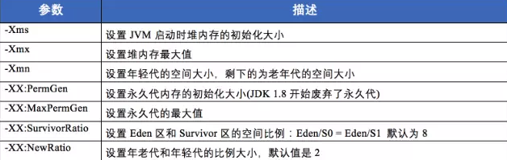
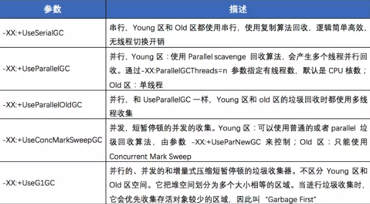
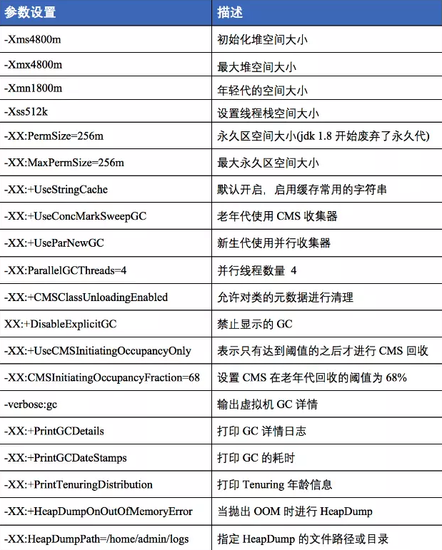
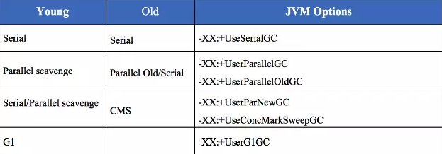

# 最重要的JVM参数指南
## 1. 概述

## 2. 堆内存相关
java虚拟机所管理的内存中最大的一块，java堆是所有线程共享的一块内存区域，在虚拟机启动的时候创建。此内存区域的唯一目的是存放对象实例，几乎所有的对象实例以及数组都在这里分配；

### 2.1显式指定堆内存-Xms和-Xmx
与性能有关的最常见实践之一是根据应用程序要求初始化堆内存。如果我们需要指定最大最小堆大小，使用一下参数

    -Xms<heap size>[unit]
    -Xmx<heap size>[unit]

heap size表示要初始化内存的具体大小
unit表示要初始化内存单位。单位为g，m，k；

### 2.2 显式新生代内存
在堆总可用内存配置之后，第二大影响因素是为Young Generation在堆内存中所占的比例。默认是1310MB 最大大小无限制；

通过-XX：NewSize和-XX：MaxNewSize指定；
-XX：NewSize=<young size>[unit]
-XX: MaxNewSize=<young size>[unit]

如果我们要为 新生代分配256m的内存（NewSize与MaxNewSize设为一致;
-Xmn256m

GC调优策略中很重要的一条经验总结是这样说的：
将新对象预留在新生代，由于Full GC的成本远比Minor GC高，因此尽可能的将对象分配在新生代是明智的做法，实际项目中根据GC日志分析新生代空间大小分配是合理的，适当的通过-Xmn命令调节新生代大小，最大限度的降低新对象直接进入老年代的情况；

另外你可以通过-XX：NewRatio=<int>来设置新生代和老年代内存的比值；

### 2.3显示指定永久代/元空间的大小
从java 8开始，如果我们没有指定Metaspace的大小，随着更多类的创建，虚拟机会耗尽所有可用的系统内存（永久代并不会出现这种情况）

相对而言，垃圾收集行为在这个区域是比较少出现的，但并非数据进入方法区之后就永久存在了；

**JDK1.8的时候，方法区Hotspot的永久代被彻底移除了，取而代之的是元空间，元空间使用的是直接内存。**

## 3.垃圾收集相关
### 3.1垃圾回收器
为了提高应用程序的稳定性，选择正确的垃圾收集算法至关重要。
JVM具有四种类型的GC实现：
1. 串行垃圾收集器
2. 并行垃圾收集器
3. CMS垃圾收集器
4. G1垃圾收集器

### GC记录
为了严格监控应用程序的运行状况，我们应该始终检查JVM的垃圾回收性能。最简单的方法是以人类可读的格式记录GC活动，使用以下参数可以记录GC活动；

    -XX:+UseGCLogFileRotation 
    -XX:NumberOfGCLogFiles=< number of log files > 
    -XX:GCLogFileSize=< file size >[ unit ]
    -Xloggc:/path/to/gc.log

# JVM配置常用参数
1. 堆参数
2. 回收器参数
3. 项目中常用配置
4. 常用组合参数

## 堆参数

-Xms: 设置JVM启动时堆内存的初始化大小
-Xmn：设置堆内存的最大值
-Xmn：设置年轻代的空间大小，剩下的是老年代的大小
-XX:PermGen：设置永久代内存的初始化大小
-XX:MaxPermGen: 设置永久代的最大值

## 回收器参数

-XX:+UseSerialGC 串行，Young区和Old区都使用串行，使用复制算法回收，逻辑简单高效，无效线程切换开销
-XX:+UseParallelGC 并行，Young区，使用Parallel Scavenge回收算法，会产生多个线程并行回收。

如上表所示，目前主要有串行、并行和并发三种，对于大内存的应用而言，串行的性能太低，因此使用到的主要是并行和并发两种。并行和并发GC的策略通过UseParllelGC和UseConcMarkSweepGC来指定。还有一些细节的配置参数用来配置策略的执行方式；

## 项目中的常用配置

## 常用组合

## 常用GC调优策略
1. GC调优原则
2. GC调优目的
3. GC调优策略
   
### GC调优原则
在调优之前，记住以下原则：

多数的java应用不需要在服务器上进行GC优化；多数导致GC问题的Java应用，都不是因为我们的参数设置有误，而是代码问题；
在应用上线之前，先考虑将机器的JVM参数设置到最优；减少创建对象的数量；减少使用全局变量和大对象；GC优化是到最后不得已的情况才采用的手段；在实际使用中，分析GC情况优化代码比优化GC参数要多得多；

### GC调优目的
将转移到老年代的对象数量降低到最小；减少GC的执行时间。

### GC调优策略
**策略一**：
将新对象预留到新生代，由于Full GC的成本远高于Minor GC，因此尽可能的将对象分配在新生代是明智的做法，实际项目中根据GC日志分析新生代空间大小分配是否合理，适当通过-Xmn调节新生代大小，最大限度的降低新对象直接进入老年代的情况；

**策略二**：
大对象进入老年代，虽然大部分情况下，将对象分配到新生代是合理的，但是大对象的做法值得商榷，大对象如果首次在新生代分配可能会出现空间不足导致很多年龄不够的小对象被分配到老年代，破坏新生代的对象结构，可能会出现频繁的Full GC，因此对于大对象可以直接设置进入老年代，短命的大对象对于垃圾回收简直就是噩梦；

**策略三**：
合理设置进入老年代对象的年龄，-XX:MaxTenuringThreshould设置对象进入老年代的年龄大小，减少老年代的内存占用，降低full gc发生的频率；

**策略四**：
设置稳定的堆大小，堆大小设置有两个参数，-Xms初始化堆大小，-Xmx最大堆大小

**策略五**：
注意如果满足下面的指标一般不需要GC优化
MinorGC 执行时间不到50ms； Minor GC 执行不频繁，约10秒一次； Full GC 执行时间不到1s； Full GC 执行频率不算频繁，不低于10分钟1次。

