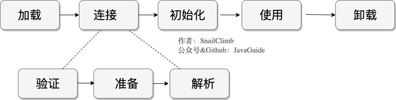
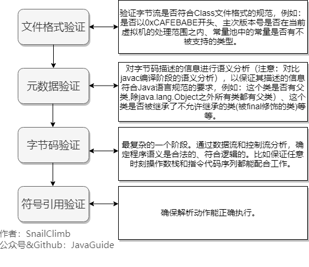
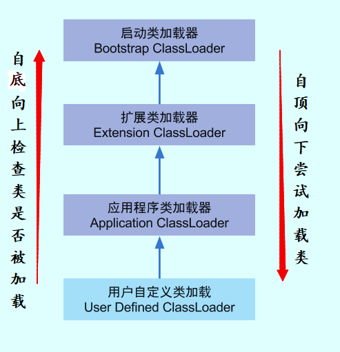

# 类的生命周期

一个类的完整生命周期
**加载 -> 连接 -> 初始化 -> 使用 -> 卸载**
**连接又分为验证 -> 准备 -> 解析**

## 类加载过程
Class需要加载到虚拟机中才可以被运行和使用，那么虚拟机是如何加载这些Class文件的呢；

系统加载Class类型的文件主要有三步：**加载-》连接-》初始化**
连接过程又可分为三步：**验证-》准备-》解析**

## 加载
类加载的第一步，完成三件事情：
1. 通过全类名获取定义此类的二进制字节流；
2. 将字节流所代表的的静态存储结构转换成方法区的运行时数据结构；
3. 在内存中生成一个代表该类的Class对象，作为方法区这些数据的访问入口；

虚拟机规范多，上面的三点并不具体，非常灵活。

**一个非数组类的加载阶段（加载阶段获取类的二进制字节流的动作）是可控性最强的阶段，这一步我们可以去完成还可以自定义类加载器去控制字节流的获取方式（重写一个loadClass）数组类型不通过类加载器去创建，他由Java虚拟机直接创建；**

### 验证

**文件格式验证**： 验证字节流是否符合Class文件格式的规范，例如：是否以0xCAFEBABE开头，主次版本号是否在当前虚拟机的处理范围内，常量池中的常量是否有不被支持的类型；

**元数据验证**：对字节码描述的信息进行语义分析，以保证器描述的信息符合Java语言规范的要求，例如这个类是否有父类，除了java.lang.Object之外的所有类都是父类；

**字节码验证**:最复杂的一个阶段通过对数据流和控制流的分析，确定程序语义是合法的，符合逻辑的。比如保证任意时刻操作数栈和指令代码序列都能配合工作；

### 准备
**准备阶段是正式为类变量分配内存并设置类变量初始值的阶段**，这些内存都将在方法区中分配。对于该阶段有以下几点需要注意：

1. 这时候进行内存分配的近包括类变量，而不包括实例变量，实例变量会在对象实例化时，随着对象一块分配在java堆中。

2. 这里所设置的初始值通常情况下，是数据类型默认的零值，比如我们定义了public static int value = 111；那么value变量在准备阶段的初始值就是0，而不是111，初始化阶段才会赋值。特殊情况：比如给value变量加上了final关键字public static final int value = 111，那么准备阶段value值就是111；

### 解析
解析阶段是虚拟机将常量池中的符号引用替换为直接引用的过程。解析动作主要针对类或接口、字段、类方法、接口方法、方法类型、方法句柄和调用限定符七类符号引用进行；

符号引用是一组符号来描述目标，可以是任何字面量。直接引用就是直接指向目标的指针，相对偏移量或者是一个简洁定位到目标的句柄。
在程序实际运行中，只有符号引用是不够的，在程序执行方法时候，系统需要明确知道这个方法所在的位置。java虚拟机为每个类都准备了一张方法表来存放类中所有的方法。当需要调用一个类的方法的时候，只要知道这个方法在方式表中的偏移量就可以直接调用方法了。

解析阶段是虚拟机将常量池中的符号引用替换为直接引用的过程，也就是得到类或者字段、方法在内存中的指针或者便宜量；

## 初始化
初始化时类加载的最后一步，真正执行类中定义的Java程序代码，初始化阶段是执行类构造器<clinit>()方法的过程；
对于<clinit>()方法的调用，虚拟机会自己确保其在多线程环境中的安全性。因为<clinit>()方法是带锁线程安全的，所以在多线程环境下，进行类初始化的话，可能会引起死锁，并且这种死锁很难被发现；

对于初始化阶段，虚拟机严格规范了有且只有6中情况下，必须对类进行初始化：
1. 当遇到new、getstatic、putstatic或者invokestatic这4条直接吗指令时，比如new一个类，读取一个静态字段（未被final修饰）或调用一个类的静态方法时。
2. 使用java.lang.reflect包的方法对类进行反射调用时如Class.forname("..."),newInstance()等等。如果类没有初始化，需要触发器初始化。
3. 初始化一个类，如果其父类还未初始化，则先触发该父类的初始化；
4. 当虚拟机启动时，用户需要定义一个要执行的主类（包含main方法的那个类），虚拟机会初始化这个类；
5. MethodHandle和VarHandle可以看作是轻量级的反射调用机制，而要想使用这2个调用， 就必须先使用findStaticVarHandle来初始化要调用的类。
6. 当一个接口定义了JDK8新加入的默认方法（被default关键字修饰的接口方法）时，如果有那个接口的实现类发生了初始化，那该接口要在其之前被初始化；

## 卸载
卸载类就是该类的class对象被GC；
卸载需要满足三个条件；
1. 该类所有的实例对象被GC，不存在该类的对象；
2. 该类没有在其他任何地方被引用；
3. 该类的类加载器的实例已被GC；

所以在JVM生命周期类，由jvm自带的类加载器加载的类是不会被卸载的。但是我们自定义的类加载器加载的类是可能被卸载的；

## 回顾一下类加载过程
类加载过程： **加载-》连接-》初始化**
连接分为：**验证-》准备-》解析**；

## 类加载器总结
JVM内置了三个重要的ClassLoader，除了BoostrapClassLoader其他类加载器均由Java实现且全部继承自java.lang.ClassLoader:

1. BootstrapClassLoader(启动类加载器)：最顶层的加载器，由C++实现，负责加载%JAVA_HOME%/lib目录下的jar包和类或者被-Xbootclasspath参数指定的路径中的所有类。
2. ExtensionClassLoader（扩展类加载器）：主要负责加载目录%JRE_HOME%/lib/ext目录下的jar包和类，或被java.ext.dirs系统变量所指定的路径下的jar包；
3. AppClassLoader(应用程序类加载器)：面对我们用户的加载器，负责加载当前应用classpath下的所有jar包和类；

## 双亲委派模型
### 双亲委派模型介绍
每一个类都有一个对应他的类加载器，系统中的ClassLoader在协同工作的时候默认使用双亲委派模型。即在类加载的时候，系统会首先判断当前类是否已经被加载过。已经被加载的类会直接返回，否则才会尝试加载。加载的时候，首先会把该请求委派给该父类加载器loadClass()处理，因此所有的请求最终都会被传送到顶层的启动类加载器BootstrapclassLoader中。当父类加载器无法处理时，才由自己来处理。当父类加载器为null时，会使用启动类加载器BootstrapClassLoader作为父类加载器；

每一个类加载器都有一个父类加载器，我们通过下面的程序验证。

    public class ClassLoaderDemo {
        public static void main(String[] args) {
            System.out.println("ClassLodarDemo's ClassLoader is " + ClassLoaderDemo.class.getClassLoader());
            System.out.println("The Parent of ClassLodarDemo's ClassLoader is " + ClassLoaderDemo.class.getClassLoader().getParent());
            System.out.println("The GrandParent of ClassLodarDemo's ClassLoader is " + ClassLoaderDemo.class.getClassLoader().getParent().getParent());
        }
    }
    output：
    ClassLodarDemo's ClassLoader is sun.misc.Launcher$AppClassLoader@18b4aac2
    The Parent of ClassLodarDemo's ClassLoader is sun.misc.Launcher$ExtClassLoader@1b6d3586
    The GrandParent of ClassLodarDemo's ClassLoader is null

AppClassLoader的父类加载器为ExtClassLoader，ExtClassLoader的父类加载器为null，null并不代表ExtClassLoader没有父类加载器，而是BootstrapClassLoader；

### 双亲委派模型的好处
双亲委派模型保证了java程序的稳定运行，可以避免类的重复加载，jvm区分不同类的方式不仅仅根据类名，相同的类文件被不同的类加载器加载产生的两个不同的类，也保证了java的狠心API不被篡改。如果没有使用双亲委派模型，而是每个类加载器加载自己的话会出现以下问题，比如我们编写一个java.lang.Object类的话，那么程序运行的话，系统就会出现多个不同的Object类；

