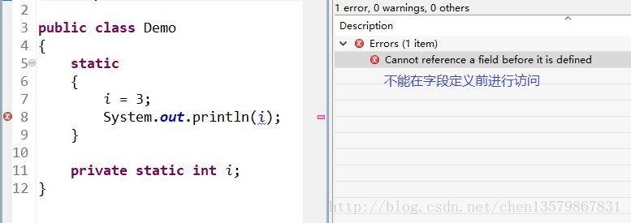

# final，static，this，super关键字总结
## final关键字
final关键字，是最终的，不可变的，用来修饰类，方法，变量具有以下特点：

1. final修饰的类不能再被继承，其中包含的变量和方法隐式的指定为final
2. final修饰的方法不能被重写
3. final修饰的变量是常量，如果是基本数据类型的变量，则其数值一旦在初始化之后便不能再更改；如果是引用类型的变量，则在初始化之后不能指向另一个对象；

## static关键字
static关键字主要有四种使用场景：
1. **修饰成员变量和方法**：静态变量不再属于对象属于类；
2. **静态代码块**：静态代码块定义在类中方法外，调用顺序是静态代码块 -> 非静态代码块 -> 构造方法；该类不管创建了多少对象静态代码块只执行一次；
3. **静态内部类（static修饰类的话只能修饰内部类）**：静态内部类和非静态内部类的区别是，内部类创建之后会隐含保存一个指向创建他的外部类的引用。但是静态内部类没有这个引用，所有他的创建不依赖任何外部类的创建，他不能使用外围类的非static成员变量和方法；
4. **静态导包**：import static 这个两个关键字连用可以指定导入某个类中指定的静态资源，并且不需要使用类名调用类中的静态成员，可以直接使用类中静态成员变量和成员方法；

## this关键词
引用当前类的当前实例；

## super关键词
super关键字从子类访问父类的变量和方法。

    public class Super{
        protected int number;
        protected showNumber(){
            System.out.println("number = " + number);
        }
    }

    public class Sub extends Super{
        void bar(){
            super.number = 10;
            super.showNumber();
        }
    }

在构造器中使用super调用父类中其他构造函数时候，该语句必须放在首行，否则编译器会出错。另外 this调用本类中其他构造方法时候，也要放在首行；
this super不能使用static中；

# static关键字详解
## 四种使用场景
1. 修饰成员变量和成员方法
2. 修饰静态代码块
3. 修饰静态内部类
4. 静态导包

### 修饰静态成员变量和静态成员方法
方法区和java堆一样是各个线程共享的内存区域，他存储着类信息，常量，静态变量，即时编译器后的代码等数据，又称为非堆；
HotSpot虚拟机中方法区也称之为永久代，两种本质不等价，仅仅是因为HotSpot虚拟机设计团队用永久代实现方法区而已，这样Hotspot虚拟机的垃圾收集器就像管理java堆一样管理这部分内存；

###  静态代码块
定义在类中方法外，静态代码块在非静态代码块之前执行，静态代码块 - 非静态代码块 - 构造方法
该类不管创建多少对象，静态代码只执行一次；

静态代码块对于定义在他之后的静态变量可以赋值但是不能访问；

### 静态内部类
静态内部类和非静态内部类最大的区别就是非静态内部类编译完成之后隐含保存着一个引用，该引用是指向创建他的外部类，但静态内部类没有；

这意味着：

静态内部类的创建不依赖外部类的建立；
静态内部类不能使用任何外围类的非static成员变量和方法；

    public class Singleton {
        private Singleton(){

        }

        private static class SingletonHolder {
            private static final Singleton INSTANCE = new Singleton();
        }

        public static Singleton getUniqueInstance(){
            return SingletonHolder.INSTANCE;
        }
    }
当 Singleton 类加载时，静态内部类 SingletonHolder 没有被加载进内存。只有当调用 getUniqueInstance()方法从而触发 SingletonHolder.INSTANCE 时 SingletonHolder 才会被加载，此时初始化 INSTANCE 实例，并且 JVM 能确保 INSTANCE 只被实例化一次。

### 静态导包
import static
这两个关键字连用可以指定导入某个类中的指定静态资源，并且不需要使用类名调用类中静态成员，可以直接使用类中静态成员变量和成员方法；

