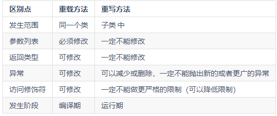
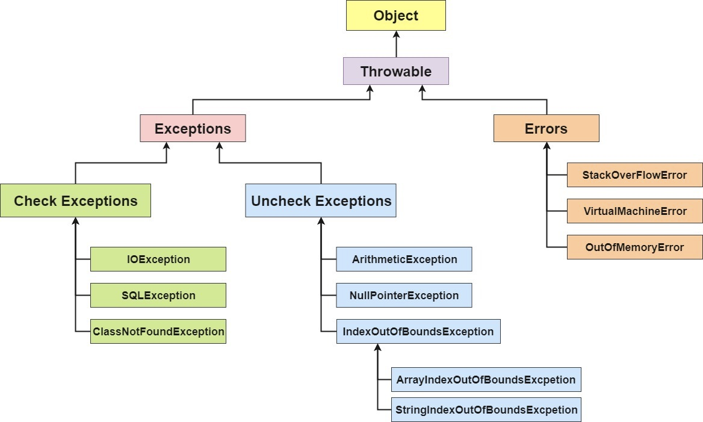

# Java基本功
## 1.1入门 基础概念和常识
### 1.1.1java语言的特点
1. 简单易学
2. 面向对象
3. 平带无关性（jvm实现平台无关性）
4. 可靠性
5. 安全性
6. 支持多线程（C++语言没有内置的多线程机制，需要调用系统的多线程功能进行多线程程序设计(C++11开始支持），java语言提供了多线程支持）
7. 支持网络编程并且很方便
8. 编译和解释并存

### 1.1.2 关于JVM，JDK和JRE的解答
**JVM**：
java虚拟机，运行java字节码的虚拟机，针对不同系统的特定实现，目的是使用相同的字节码让不同系统给出相同的结果。消除平台区别；

    字节码：jvm可以理解的代码叫做字节码，只面对虚拟机。java语言通过字节码的方式，在一定程度上解决了传统解释性语言执行效率低下，同时又保留了解释性语言可移植的特点。所以java程序运行很高效，并不针对任何机器，无需重新编译即可在多种操作系统上运行；

java程序从源代码到运行需要3步：

java源代码 -》 .class文件 -》 机器可执行的二进制机器码

jvm类加载器首先加载字节码文件，通过解释器逐行解释，这种速度较慢，后面引进了JIT，运行时编译，在JIT编译器完成第一次编译之后，器会将字节码对应的机器码保留起来，下次直接运行。这就是java为什么称之为解释和编译共存的语言；

JVM虚拟机是运行java字节码的虚拟机。JVM有针对不同系统的特定实现，目的上使用相同的字节码在不同的平台上出现相同的结果，字节码和不同系统的JVM实现了java语言一次编译，随处使用的关键；

**JDK和JRE**
JDK是java Development Kit 是功能齐全的Java SDK。他拥有JRE所拥有的一切，还有编译器javac和工具javadoc和jdb，他能创建和编译程序；

JRE是java运行时环境。他是运行已编译java程序所需的所有内容的集合，包括java虚拟机JVM，java类库，java命令和其他一些基础构件。但是他不能用于创建新程序；

如果你只是为了运行一下 Java 程序的话，那么你只需要安装 JRE 就可以了。如果你需要进行一些 Java 编程方面的工作，那么你就需要安装 JDK 了。但是，这不是绝对的。有时，即使您不打算在计算机上进行任何 Java 开发，仍然需要安装 JDK。

### 1.1.3 Oracle JDK 和Open JDK

### 1.1.4java和C++的区别
1. 都是面向对象的语言，支持封装、继承和多态；
2. java不提供指针直接访问内存，程序内存更安全
3. java是单继承的，C++支持多继承；java接口可以多继承；
4. java自动内存管理机制，不需要程序员释放内存；
5. c语言中，字符串和字符数组最后是有一个额外的'\0'表示结束，java语言没有结束符这一概念；

### 1.1.5什么是java程序的主类 应用程序和小程序的主类有何不同
一个程序中可以有多个类，但只能有一个类是主类。在java应用程序中，这个主类指的是包括main()方法的类，而在java小程序中，这个主类是一个集成自系统类JAppLet或者Applet的子类。应用程序的主类不一定要求是public类，但小程序要求必须是public类。主类是java程序执行的入口点；

### 1.1.6import java和javax的区别
刚开始的时候，javaAPI所必须的包是java开头的包，javax当时只是扩展API包来使用，随着发展javax逐渐扩展成javaAPI的组成部分。但是将扩展从javax包移动到java包很麻烦，最终决定javax包成为标准的API一部分，所以现在是没有区别的；

### 1.1.8为什么说java语言编译和解释共存
编译型语言指的是编译器针对特定的操作系统将源代码一次性的解释成被该平台执行的机器码；
解释型语言是指解释器对源程序逐行解释成特定平台的机器码并立即执行。

java既有编译型语言的特征，也具有解释型语言的特征，java程序先进行编译后解释两个步骤，由java编写的程序需要先经过编译步骤，生成字节码，这种字节码必须由java解释器解释执行。

## 1.2 java语法
### 1.2.1字符型常量和字符串常量区别
1. 形式上：字符常量单引号引起的一个字符，字符串常量双引号引起的若干字符；
2. 含以上：字符常量相当于一个整形，可参加表达式运算，字符串常量代表一个地址值；
3. 内存: 字符常量2字节，字符串常量若干字节；

### 1.2.7 java泛型了解吗？什么是类型擦除？常用通配符？
java泛型提高了编译时类型的安全检测机制，该机制允许程序员在编译时检测到非法的类型。泛型的本质是参数化类型，也就是说所操作类型指定为一个参数；（操作类型变成了参数可以变化，根据参数的变化而变化）

**java泛型是伪泛型，因为在java编译期间，所有的泛型信息被擦掉，这也是通常所说的泛型擦除**

    List<Integer> list = new ArrayList<>();
    list.add(12);

    list.add("a");//出错
    Class<? extends List> clazz = list.getClass();

    Method add = clazz.getDeclaredMethod("add",Object.class);
    add.invoke(list,"k1");//反射添加可以

    System.out.println(list);

泛型分为三种使用方式：泛型类、泛型接口和泛型方法
1. 泛型类

    public class Generic<T> {
        private T key;

        public Generic(T key){
            this.key = key;
        }
        public T getKey(){
            return key;
        }
    }
2. 泛型接口
   
   public interface Generator<T>{
       public T method();
   }

实现泛型节接口，不指定类型
    
    class GenericImpl<T> implements Generator<T>{
        @Override
        public T method(){
            return null;
        }
    }

实现泛型接口，指定类型

    class GenericImpl<T> implements Generator<String>{
        @Override
        public String method(){
            return "hello";
        }
    }

3. 泛型方法

    public static <E> void printArray(E[] inputArray){
        for (E element : inputArray){
            System.out.printf("%s", element);
        }
        System.out.println();
    }
使用：

    Integer[] intArray = {1,2,3};
    String[] stringArray = {"Hello","World"};
    printArray(intArray);
    printArray(stringArray);

常用通配符
T, E,K,V,?;
？ 表示不确定的 java 类型
T (type) 表示具体的一个java类型
K V (key value) 分别代表java键值中的Key Value
E (element) 代表Element

### 1.2.8 == 和 equals区别

== : 它的作用是判断两个对象的地址是不是相等。即判断两个对象是不是同一个对象。(基本数据类型==比较的是值，引用数据类型==比较的是内存地址)

equals() : 它的作用也是判断两个对象是否相等，它不能用于比较基本数据类型的变量。equals()方法存在于Object类中，而Object类是所有类的直接或间接父类。

**情况 1**：类没有覆盖 equals()方法。则通过equals()比较该类的两个对象时，等价于通过“==”比较这两个对象。使用的默认是 Object类equals()方法。
**情况 2**：类覆盖了 equals()方法。一般，我们都覆盖 equals()方法来两个对象的内容相等；若它们的内容相等，则返回 true(即，认为这两个对象相等)。

**当创建 String 类型的常量对象时，虚拟机会在常量池中查找有没有已经存在的值和要创建的值相同的对象，如果有就把它赋给当前引用。如果没有就在常量池中重新创建一个 String 对象。**

### 1.2.9 hashCode()与equals()
为什么重写equals时必须重写hashCode方法呢？

1. hashCode()介绍：
作用是获得一个哈希码，也称之为散列码；实际上返回的是一个int整数。这个哈希码的作用是确定该对象在哈希表中的索引位置。hashcode()函数定义在JDK的Object类中，这就意味着java中任何类都包含着hashCode()函数。注意Object的hashCode方法是本地方法，也就是c语言或者c++实现的，将内存地址转换成整数返回；

2. 为什么要有hashCode？
对象加入 HashSet 时，HashSet 会先计算对象的 hashcode 值来判断对象加入的位置，同时也会与其他已经加入的对象的 hashcode 值作比较，如果没有相符的 hashcode，HashSet 会假设对象没有重复出现。但是如果发现有相同 hashcode 值的对象，这时会调用 equals（）方法来检查 hashcode 相等的对象是否真的相同。如果两者相同，HashSet 就不会让其加入操作成功。如果不同的话，就会重新散列到其他位置。

大大减少equals的次数，提高执行效率；

3. 为什么重写equals时必须重写hashCode方法？

如果两个对象相等，则 hashcode 一定也是相同的。两个对象相等,对两个对象分别调用 equals 方法都返回 true。但是，两个对象有相同的 hashcode 值，它们也不一定是相等的 。因此，equals 方法被覆盖过，则 hashCode 方法也必须被覆盖

hashCode()的默认行为是对堆上的对象产生独特值。如果没有重写 hashCode()，则该 class 的两个对象无论如何都不会相等（即使这两个对象指向相同的数据）

4. 为什么两个对象有相同的hashcode并不一定相等呢？

散列冲突

## 1.3 基本数据类型，对应的包装类型，各自占用多少字节
8种：byte,short,int,long,float,double,char,boolean
包装：Byte,Short,Integer,Long,Float,Double,Charater,Boolean

### 自动拆箱和装箱
**装箱**：将基本类型用他们的引用类型包装起来；
**拆箱**：将包装类型转换成基本类型；

**Java 基本类型的包装类的大部分都实现了常量池技术，即 Byte,Short,Integer,Long,Character,Boolean；前面 4 种包装类默认创建了数值[-128，127] 的相应类型的缓存数据，Character创建了数值在[0,127]范围的缓存数据，Boolean 直接返回True Or False。如果超出对应范围仍然会去创建新的对象**

浮点数类型的包装类Float和Double并没有实现常量池技术；

        Integer i1 = 33;
        Integer i2 = 33;
        System.out.println(i1 == i2);// 输出 true
        Integer i11 = 333;
        Integer i22 = 333;
        System.out.println(i11 == i22);// 输出 false
        Double i3 = 1.2;
        Double i4 = 1.2;
        System.out.println(i3 == i4);// 输出 false

        Integer i1 = 40;
        Integer i2 = 40;
        Integer i3 = 0;
        Integer i4 = new Integer(40);
        Integer i5 = new Integer(40);
        Integer i6 = new Integer(0);

        System.out.println("i1=i2   " + (i1 == i2));
        System.out.println("i1=i2+i3   " + (i1 == i2 + i3));
        System.out.println("i1=i4   " + (i1 == i4));
        System.out.println("i4=i5   " + (i4 == i5));
        System.out.println("i4=i5+i6   " + (i4 == i5 + i6));   
        System.out.println("40=i5+i6   " + (40 == i5 + i6));  

        i1=i2   true
        i1=i2+i3   true
        i1=i4   false
        i4=i5   false
        i4=i5+i6   true //+号不适应与Integer，首先i5和i6进行自动拆箱，变成i4 == 40，Integer类型无法直接比较，i4拆箱成为40，40==40，结果为true；
        40=i5+i6   true

Integer i1=40；Java 在编译的时候会直接将代码封装成 Integer i1=Integer.valueOf(40);，从而使用常量池中的对象。
Integer i1 = new Integer(40);这种情况下会创建新的对象。

### java中只有值传递
按值调用(call by value)表示方法接收的是调用者提供的值，而按引用调用（call by reference)表示方法接收的是调用者提供的变量地址。一个方法可以修改传递引用所对应的变量值，而不能修改传递值调用所对应的变量值。 

**java程序设计语言，总是采用按值调用。也就是说，方法得到的是所有参数值的一个拷贝，也就是说，方法不能修改传递给他的任何参数变量的内容；**

但实现一个改变对象参数状态的方法并不是一件难事。只要方法得到的是对象引用的拷贝，对象引用以及他的拷贝同时引用同一个对象；

### 重载和重写的区别

**1. 重载**
发生在一个类中，方法名必须相同，参数类型不同，个数不同，顺序不同，方法返回值和访问修饰符可以不同；

**重载就是同一个类中多个同名方法根据不同的传参来执行不同的逻辑处理。**

**2. 重写**
发生在运行期，子类对父类的允许访问的方法的实现过程进行重新编写；

1. 返回值类型，方法名，参数列表必须相同，抛出的异常范围小于等于父类，访问修饰符范围大于等于父类；
2. 如果父类方法访问修饰符为private/final/static则子类不能重写该方法，但是被static修饰的方法能够被再次声明；
3. 构造函数无法被重写；

### 深拷贝和浅拷贝
**浅拷贝**：对基本数据类型进行值传递，对引用类型进行引用传递般的拷贝，此为浅拷贝。
**深拷贝**：基本数据类型进行值传递，对引用数据类型，创建一个新的对象，并复制其内容，此为深拷贝；

# java面向对象
## 类和对象
### 面向对象和面向过程的区别
**面向过程**： 面向过程性能比面向对象高。当性能是考量的因素的时候，比如单片机和嵌入式开发等；
**面向对象**： 面向对象易维护，易复用，易扩展，因为面向对象有封装、继承和多态的特性，所以可以设计出低耦合的系统，系统更加灵活易于维护；

这个并不是根本原因，面向过程也需要分配内存，计算内存偏移量，Java 性能差的主要原因并不是因为它是面向对象语言，而是 Java 是半编译语言，最终的执行代码并不是可以直接被 CPU 执行的二进制机械码。
而面向过程语言大多都是直接编译成机械码在电脑上执行，并且其它一些面向过程的脚本语言性能也并不一定比 Java 好。

**构造方法不能被重写，但是可以被重载，所以可以看到一个类中多个构造函数的情况**

### 定义一个不做事且没有参数的构造方法的作用

java程序在执行子类的构造函数之前，如果没有用super()来调用父类特定的构造函数，则会调用父类中没有参数的构造函数。因此如果父类只定义了有参数的构造函数，而子类的构造函数又没有用super()来调用父类中特定的构造函数，则编译出错；

### 成员变量和局部变量的区别有哪些
1. 语法形式上来看：成员变量是属于类的，而局部变量在方法中定义的变量或是方法参数；成员变量可以被public等修饰符修饰，而局部变量不能被访问控制修饰符及static修饰，但都能被final修饰；
2. 从变量在内存中存储方式来看：如果成员变量是使用static修饰的，那么这个成员变量是属于类的，如果没有static，这个变量是属于实例的。对象存在堆内存，局部变量则存在于栈内存；
3. 从变量在内存中的生存时间上看:成员变量是对象的一部分，它随着对象的创建而存在，而局部变量随着方法的调用而自动消失。
4. 成员变量如果没有被赋初值:则会自动以类型的默认值而赋值（一种情况例外:被 final 修饰的成员变量也必须显式地赋值），而局部变量则不会自动赋值。

### 构造方法特性
1. 名字与类名相同
2. 没有返回值，但不能用void声明
3. 生成类的对象自动执行，无需调用；

### 调用子类构造方法之前先调用父类没有参数的构造方法目的是帮助子类做初始化工作

### 对象的相等和执行他们的引用相等有什么不同
对象相等，比较的是内存中存放的内容是否相等，而引用相等，比较的是他们指向的内存地址的是否相等；

## 面向对象的三大特征
### 封装
封装是指把一个对象的状态信息隐藏到对象内部，不允许外部对象直接访问对象的内部信息。但是可以提供一些被外界访问的方法来操作属性。就好像是我们看不到挂载墙上的空调零件信息（也就是属性),但是可以通过遥控器(方法)来控制空调。
属性根据需求设置是否为外界所能访问。

### 继承
不同类型的对象，相互之间有一定数量的共同点。小明，小红，小李，都具有学生的特性，同时每个对象还定义了额外的特性使得他们与众不同。
继承是使用已存在的类的定义作为基础建立新类的技术，新类的定义增加了新的数据或者新的功能，也可以用父类的功能，但不能选择性的继承父类。

1. 子类拥有父类所有的属性和方法，但是父类中的私有属性和方法，子类无法访问，只能拥有；
2. 子类可以拥有自己属性和方法，即子类可以对父类进行扩展。
3. 子类可以用自己的方式实现父类的方法；

### 多态
多态：表示一个对象具有多种状态。具体表现为父类引用指向子类的实例；

多态的特点：
对象类型和引用类型之间具有继承/实现关系
对象类型不可变，引用类型可以变
方法具有多态性，属性不具有多态性；
引用类型变量发出的方法调用到底是哪个类的方法，运行时才知道
多态不能调用只在子类中存在但在父类中不存在的方法
如果子类重写了父类的方法，真正执行的是子类覆盖的方法。

## 修饰符
### 在静态方法中调用非静态变量是非法的
在静态方法中调可以不通过对象进行调用，因此在静态方法中，不能调用其他非静态变量，也不能方位非静态变量成员；

### 静态方法和实例方法的区别
在外部调用静态方法时，可以使用"类名.方法名"的方式，也可以使用"对象名.方法名"的方式。而实例方法只有后面这种方式。也就是说，调用静态方法可以无需创建对象。

静态方法在访问本类的成员时，只允许访问静态成员（即静态成员变量和静态方法），而不允许访问实例成员变量和实例方法；实例方法则无此限制。

## 接口和抽象类
### 接口和抽象类的区别
1. 接口的方法默认是public，所有方法在接口中不能有实现（java8开始可以有默认实现），而抽闲类可以有非抽象的方法
2. 接口中除了static、final变量，不能有其他变量，而抽象了则不一定；
3. 一个类可以实现多个接口，但只能实现一个抽象类。接口自己本身可以通过extends关键词扩展多个接口；
4. 接口方法默认修饰符是public，抽象方法可以有public protected和default这些修饰符(抽象方法不能用private)
5. 设计层面来说，抽象是对类的抽象，是一种模板设计，而接口是对行为的抽象，是一种行为的规范；

jdk7，接口中只能有常量变量和抽象方法。这些接口方法必须由选择实现接口的类实现；
jdk8，接口的时候接口可以有默认方法和静态方法功能
jdk9，在接口中引入了私有方法和私有静态方法；

## 2.5 其他重要知识点
### 2.5.1 String StringBuffer和StringBuilder的区别是什么？String为什么不可变
简单的来说：String类中使用final关键字修饰字符数组来保存字符串，private **final** char value[],所以String对象时不可变的；

Java9之后，String类的实现改用byte数组存储字符串 private **final** byte[] value;

StringBuffer与StringBuilder都继承自AbstractStringBuilder类，在AbstractStringBuilder中也是使用字符数组保存字符串char[] value但是没有用final关键词修饰，所以这两种对象的可变的；

StringBuilder与StringBuffer的构造方法都是调用父类构造方法也就是AbstractStringBuilder实现的；

**线程安全性**
String中对象是不可变的，可以理解为常量，线程安全。AbstractStringBuilder是StringBuilder与StringBuffer的公共父类，定义了一些字符串的基本操作，如expandCapacity、append、insert、indexOf等公共方法。StringBuffer对方法加了同步锁或者对调用了的方法加了同步锁，所以是线程安全的。StringBuilder并没有对方法进行加同步锁，所以的非线程安全的；

**性能**
每次对 String 类型进行改变的时候，都会生成一个新的 String 对象，然后将指针指向新的 String 对象。StringBuffer 每次都会对 StringBuffer 对象本身进行操作，而不是生成新的对象并改变对象引用。相同情况下使用 StringBuilder 相比使用 StringBuffer 仅能获得 10%~15% 左右的性能提升，但却要冒多线程不安全的风险。

**总结**
操作少量数据：适用String
单线程操作字符串缓冲区的操作大量数据：适用StringBuilder
多线程操作字符串缓冲区的操作大量数据：适用StringBuffer

**Object类的常见的方法总结**
getClass() //当前运行对象的Class信息，使用final关键词修饰，不允许重写
hashCode() //返回hash码
equals//比较两个对象的内存地址是否相等，String类对该方法进行了重写用户比较字符串是否相等
clone//用于创建并返回对象的一份拷贝
toString 返回类的名字@实例的哈希码的16进制字符串
notify 唤醒一个在此对象监视器上等待的线程(监视器相当于就是锁的概念)。如果有多个线程在等待只会任意唤醒一个。
notifyAll 唯一的区别就是会唤醒在此对象监视器上等待的所有线程，而不是一个线程。
wait 暂停线程的执行。
finalize 实例被垃圾回收器回收的时候触发的操作

### java序列化中如果有些字段不行进行序列化，怎么办
对于不想进行序列化的变量，使用transient关键词修饰；
transient关键词的作用是：阻止实例中那些用词关键词修饰的变量序列化；当对象被反序列化时，被transient修饰的变量值不会被持久化和恢复，transient只能修饰变量，不能修饰类和方法。

### 获取键盘输入常用的两种方法
1. 通过Scanner
   
   Scanner input = new Scanner(System.in);
   String s = input.nextline();
   input.close();

2. 通过BufferedReader

   BufferedReader input = new BufferedReader(new InputStreamReader(System.in));
   String s = input.readLine();

# java核心技术
## 集合
见后续》》》》》》》》》》》

## 异常

在Java中，所有的异常的都有一个共同的祖先Throwable类。Throwable：有两个重要的子类：Exception（异常）和Error（错误），二者都是Java异常处理的重要子类，各自都包括大量子类。

**Error错误：程序无法处理的错误**，表示应用程序遇到了重要问题，大多数错误与代码编写无关，JVM出现的问题。当JVM不再有继续执行操作所需的内存资源是，出现OutOfMemoryError。
这些错误表示故障发生于虚拟机自身、或者发生在虚拟机试图执行应用时，如Java虚拟机运行错误，类定义错误等。这些错误是不可查的。因为他们在应用程序的控制和处理能力之外，而且绝大多数是程序运行时不允许出现的状况。

**Exception(异常):程序本身可以处理的异常**：Exception类有一个重要的子类RuntimeException。RuntiomeException异常由Java虚拟机抛出。NullPointerException访问的变量没有引用任何对象时抛出该异常；
ArithmeticExceptin算术运算异常，一个整数除以0时，抛出该异常
ArrayIndexOutOfBoundsException(下标越界异常)；

异常可以被程序本身处理，错误无法处理

## Throwable类的常用方法
public string getMessage():异常发生的简要描述
public string toString():返回异常发生时的详细信息
public string getLocalizedMessage()：返回异常对象的本地化信息。使用Throwable的子类的覆盖这个方法，可以生产本地化信息，没有覆盖的话返回跟getMessage()返回结果相同；
public void printStackTrace():在控制台上打印Throwable对象封装的异常信息

## 多线程
### 简述线程、程序、进程的基本概念，以及他们之间关系是什么
**线程**与进程相似，但线程是一个进程更小的执行单位。一个进程与执行的过程中可以产生多个线程，这些线程共享一块内存空间和一组系统资源，所以在系统产生一个线程或是多线程切换工作的时候负担比进程切换小得多，线程也称之为轻量级进程；

**程序**是含有指令和数据的文件，被存储在磁盘或者其他数据存储设备上，也就是说程序是静态的代码；

**进程**是程序的一次执行过程，是系统运行程序的基本单位，因为进程是动态的。系统运行一个程序即是一个进程从创建，运行到消亡的过程。简单的说，一个进程就是一个执行的程序，他在计算机中一个指令接着一个指令的执行着，同时，每个进程还占有某些系统资源如CPU事件，内存空间，文件，输入输出等。话句话说程序在执行时，将会被操作系统载入内存中。

### 线程有哪些基本状态
New      初始状态，线程被构建，但是还没有调用start()方法
RUNNABLE 运行状态，Java线程将操作系统中的就绪和运行笼统称为“运行中”
BLOCKED  阻塞状态，线程阻塞于锁
WAITING  等待状态，表示线程进入等待状态，该线程需要一些其他线程做出的动作
TIME_WAITING  超时等待状态，该状态不同于WAITING，他是可以指定时间自行返回
TERMINATED 终止状态，表示当前线程已经执行完毕；

线程创建之后它将处于**NEW(新建)状态**，调用**start()方法**之后运行，线程这个时候处于**READY(可运行)**状态。
可运行状态的线程**获得了CPU的时间片后处于RUNNING**运行状态；
当线程执行**wait()方法之后，线程进入WAITING**等待状态。
进入**等待状态的线程需要依靠其他线程的通知才能返回运行状态**，而TIME_WAITING超时等待相当于在等待状态的基础上增加了超时限制，比如通过**sleep或者wait方法可以将Java线程置于TIMED WAITING状态**；
当超时**时间到达之后Java线程将会返回到RUNNABLE**状态。
当线程调用同步方法时，在**没有获取到锁的情况下，线程将会进入到BLOCKED阻塞状态**。
线程在**执行Runnable的run()方法之后将会进入TERMINATED状态**；

## 文件与IO流
### Java的IO流分为几种
1. 安装流的流向分，可以分为输入流和输出流
2. 操作单元分，可以划分文字节流和字符流
3. 按照流的角色划分节点流和处理流；

JAVA IO流的40多个类都是从如下4个抽象类几类中派生出来的；

InputStream/Reader： 所有的输出流的基类，前者是字节输入流，后者是字符输入流；
OutputStream/Reader： 所有的输出流的基类，前者是字节输出流，后者是字符输出流；

**既然有字节流，为什么还有字符流**
不管是文件读写还是网络发送接收，信息的最小存储单元都是字节，那为什么IO流操作，要分为字节流操作和字符流操作；

字符流是由java虚拟机将字节转换得到的，问题就出在这个过程很耗时间，并且如果我们不知道编码类型就很容易乱码问题。所以IO流就干脆提供了一个直接操作字符的接口，方便我们平时对字符进行流操作。如果音频视频文件用字节流，如果涉及到字符的话使用字符流比较好；

