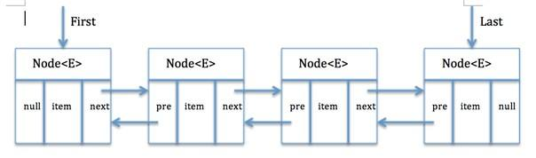

# LinkedList 
LinkedList实现了List接口和Deque接口的双端链表。
链表结构支持高效的插入和删除操作，
Deque接口使得LinkedList类具有队列的特性。

## LinkedList类中的内部私有类Node

    private static class Node<E> {
        E item; //结点值
        Node<E> next; //后继节点
        Node<E> prev; //前驱节点
        Node(Node<E> prev, E element, Node<E> next){
            this.item = element;
            this.next = next;
            this.prev = prev;
        }
    }

## LinkedList源码分析：
### 构造方法：

    public LinkedList(){
    }

    public LinkedList(Collection<? extends E> c) {
        this();
        addAll(c);
    }

### add方法
add(E e)方法：将元素添加到链表的尾部

    public boolean add(E e){
        linkLast(e);//调用方法
        return true;
    }

    /**
      *链接使e作为最后一个元素
      */
    void linkLast(E e){
        final Node<E> l = last; //l指向链表尾部
        final Node<E> newNode = new Node<>(l,e,null); //新建结点将结点放在链表尾部
        last = newNode;//新建结点
        if(l == null){ //说明原链表为空，新建结点既是第一个也是最后一个
            first = newNode;
        }else{
            l.next = newNode;//指向下一个元素
        }
        size++;
        modCount++;
    }

add(int index,E e) 在指定位置添加元素

    public void add(int index, E element) {
        checkPositionIndex(index);//检查索引是否处于【0~size】之间
        if(index == size) {
            linkLast(element);
        }else{
            linkBefore(element,node(index));
        }
    }
linkBefore方法需要给定两个参数，一个插入结点的值，一个指定的node，所以我们调用了node(index)查找index对应的node
addAll(Collection c) : 将集合插入到链表尾部

    public boolean addAll(Collection<? extends E> c) {
        return addAll(size,c)
    }

addAll(int index, Collection c)： 将集合从指定位置开始插入

    public boolean addAll(int index, Collection<? extends E> c) {
        //1:检查index范围是否在size之内
        checkPositionIndex(index);

        //2:toArray()方法把集合的数据存到对象数组中
        Object[] a = c.toArray();
        int numNew = a.length;
        if (numNew == 0)
            return false;

        //3：得到插入位置的前驱节点和后继节点
        Node<E> pred, succ;
        //如果插入位置为尾部，前驱节点为last，后继节点为null
        if (index == size) {
            succ = null;
            pred = last;
        }
        //否则，调用node()方法得到后继节点，再得到前驱节点
        else {
            succ = node(index);
            pred = succ.prev;
        }

        // 4：遍历数据将数据插入
        for (Object o : a) {
            @SuppressWarnings("unchecked") E e = (E) o;
            //创建新节点
            Node<E> newNode = new Node<>(pred, e, null);
            //如果插入位置在链表头部
            if (pred == null)
                first = newNode;
            else
                pred.next = newNode;
            pred = newNode;
        }

        //如果插入位置在尾部，重置last节点
        if (succ == null) {
            last = pred;
        }
        //否则，将插入的链表与先前链表连接起来
        else {
            pred.next = succ;
            succ.prev = pred;
        }

        size += numNew;
        modCount++;
        return true;
    }

### addAll方法通常包括四个步骤：
    1、检查index范围是否在size之内
    2、toArray()方法把集合中的数据存到对象数组中
    3、得到插入位置的前驱和后继节点
    4、遍历数据将数据插入到指定位置

addFirst(E e):将元素添加到链表头部

    public void addFirst(E e) {
        linkFirst(e);
    }

    private void linkFirst(E e) {
        final Node<E> f = first;
        final Node<E> newNode = new Node<>(null, e, f);//新建节点，以头节点为后继节点
        first = newNode;
        //如果链表为空，last节点也指向该节点
        if (f == null)
            last = newNode;
        //否则，将头节点的前驱指针指向新节点，也就是指向前一个元素
        else
            f.prev = newNode;
        size++;
        modCount++;
    }

### 根据位置取数据的方法
get(int index) : 根据指定索引返回数据

    public E get(int index) {
        //检查index范围是否在size之内
        checkElementIndex(index);
        //调用Node(index)去找到index对应的node然后返回它的值
        return node(index).item;
    }

### 获取头节点的数据方法：

    public E getFirst() {
        final Node<E> f = first;
        if (f == null)
            throw new NoSuchElementException();
        return f.item;
    }
    public E element() {
        return getFirst();
    }
    public E peek() {
        final Node<E> f = first;
        return (f == null) ? null : f.item; //跟getFirst唯一的区别在于头为空不报错
    }
    public E peekFirst() {
        final Node<E> f = first;
        return (f == null) ? null : f.item;
    }

### 区别在于四种方法对于头结点为空的时候的处理，是报错还是抛出异常

获取尾节点（index = -1）数据方法：

    public E getLast() {
        final Node<E> l = last;
        if (l == null)
            throw new NoSuchElementException();
        return l.item;
    }
    public E peekLast() {
        final Node<E> l = last;
        return (l == null) ? null : l.item;
    }

根据对象得到索引的方法
int indexOf(Object o) : 从头遍历找

    public int indexOf(Object o) {
        int index = 0;
        if(o == null) {
            for(Node<E> x = first; x != null; x = x.next) {
                if(x.item == null) {
                    return index;
                }
                index++;
            }
        } else {
            for(Node<E> x = first; x != null; x = x.next) {
                if(o.equals(x.item)){
                    return index;
                }
                index++;
            }
        }
        return -1;
    }

### 检查链表是否包含对象的方法：
contains(Object o) : 检查对象o是否存在于链表中

    public boolean contains(Object o) {
        return indexOf(o) != -1;
    }

### 删除方法
remove(),removeFirst,pop() : 删除头节点
    public E pop() {
        return removeFirst();
    }
    public E remove() {
        return removeFirst();
    }
    public E removeFirst() {
        final Node<E> f = first;
        if (f == null)
            throw new NoSuchElementException();
        return unlinkFirst(f);
    }

removeLast(), pollLast(): 删除尾节点

    public E removeLast() {
        final Node<E> l = last;
        if (l == null)
            throw new NoSuchElementException();
        return unlinkLast(l);
    }
    public E pollLast() {
        final Node<E> l = last;
        return (l == null) ? null : unlinkLast(l);
    }

remove(Object o) : 删除指定元素

    public boolean remove(Object o) {
        //如果删除对象为null
        if (o == null) {
            //从头开始遍历
            for (Node<E> x = first; x != null; x = x.next) {
                //找到元素
                if (x.item == null) {
                   //从链表中移除找到的元素
                    unlink(x);
                    return true;
                }
            }
        } else {
            //从头开始遍历
            for (Node<E> x = first; x != null; x = x.next) {
                //找到元素
                if (o.equals(x.item)) {
                    //从链表中移除找到的元素
                    unlink(x);
                    return true;
                }
            }
        }
        return false;
    }

当删除指定对象时，只需调用remove(Object o)即可，不过该方法一次只会删除一个匹配的对象，如果删除了匹配对象，返回true，否则false。

unlink(Node x)方法：

    E unlink(Node<E> x) {
        // assert x != null;
        final E element = x.item;
        final Node<E> next = x.next;//得到后继节点
        final Node<E> prev = x.prev;//得到前驱节点

        //删除前驱指针
        if (prev == null) {
            first = next;//如果删除的节点是头节点,令头节点指向该节点的后继节点
        } else {
            prev.next = next;//将前驱节点的后继节点指向后继节点
            x.prev = null;
        }

        //删除后继指针
        if (next == null) {
            last = prev;//如果删除的节点是尾节点,令尾节点指向该节点的前驱节点
        } else {
            next.prev = prev;
            x.next = null;
        }

        x.item = null;
        size--;
        modCount++;
        return element;
    }

remove(int index)：删除指定位置的元素

    public E remove(int index) {
        //检查index范围
        checkElementIndex(index);
        //将节点删除
        return unlink(node(index));
    }

### LinkList类常用方法测试

    package list;

    import java.util.Iterator;
    import java.util.LinkedList;

    public class LinkedListDemo {
        public static void main(String[] srgs) {
            //创建存放int类型的linkedList
            LinkedList<Integer> linkedList = new LinkedList<>();
            /************************** linkedList的基本操作 ************************/
            linkedList.addFirst(0); // 添加元素到列表开头
            linkedList.add(1); // 在列表结尾添加元素
            linkedList.add(2, 2); // 在指定位置添加元素
            linkedList.addLast(3); // 添加元素到列表结尾

            System.out.println("LinkedList（直接输出的）: " + linkedList);

            System.out.println("getFirst()获得第一个元素: " + linkedList.getFirst()); // 返回此列表的第一个元素
            System.out.println("getLast()获得第最后一个元素: " + linkedList.getLast()); // 返回此列表的最后一个元素
            System.out.println("removeFirst()删除第一个元素并返回: " + linkedList.removeFirst()); // 移除并返回此列表的第一个元素
            System.out.println("removeLast()删除最后一个元素并返回: " + linkedList.removeLast()); // 移除并返回此列表的最后一个元素
            System.out.println("After remove:" + linkedList);
            System.out.println("contains()方法判断列表是否包含1这个元素:" + linkedList.contains(1)); // 判断此列表包含指定元素，如果是，则返回true
            System.out.println("该linkedList的大小 : " + linkedList.size()); // 返回此列表的元素个数

            /************************** 位置访问操作 ************************/
            System.out.println("-----------------------------------------");
            linkedList.set(1, 3); // 将此列表中指定位置的元素替换为指定的元素
            System.out.println("After set(1, 3):" + linkedList);
            System.out.println("get(1)获得指定位置（这里为1）的元素: " + linkedList.get(1)); // 返回此列表中指定位置处的元素

            /************************** Search操作 ************************/
            System.out.println("-----------------------------------------");
            linkedList.add(3);
            System.out.println("indexOf(3): " + linkedList.indexOf(3)); // 返回此列表中首次出现的指定元素的索引
            System.out.println("lastIndexOf(3): " + linkedList.lastIndexOf(3));// 返回此列表中最后出现的指定元素的索引

            /************************** Queue操作 ************************/
            System.out.println("-----------------------------------------");
            System.out.println("peek(): " + linkedList.peek()); // 获取但不移除此列表的头
            System.out.println("element(): " + linkedList.element()); // 获取但不移除此列表的头
            linkedList.poll(); // 获取并移除此列表的头
            System.out.println("After poll():" + linkedList);
            linkedList.remove();
            System.out.println("After remove():" + linkedList); // 获取并移除此列表的头
            linkedList.offer(4);
            System.out.println("After offer(4):" + linkedList); // 将指定元素添加到此列表的末尾

            /************************** Deque操作 ************************/
            System.out.println("-----------------------------------------");
            linkedList.offerFirst(2); // 在此列表的开头插入指定的元素
            System.out.println("After offerFirst(2):" + linkedList);
            linkedList.offerLast(5); // 在此列表末尾插入指定的元素
            System.out.println("After offerLast(5):" + linkedList);
            System.out.println("peekFirst(): " + linkedList.peekFirst()); // 获取但不移除此列表的第一个元素
            System.out.println("peekLast(): " + linkedList.peekLast()); // 获取但不移除此列表的第一个元素
            linkedList.pollFirst(); // 获取并移除此列表的第一个元素
            System.out.println("After pollFirst():" + linkedList);
            linkedList.pollLast(); // 获取并移除此列表的最后一个元素
            System.out.println("After pollLast():" + linkedList);
            linkedList.push(2); // 将元素推入此列表所表示的堆栈（插入到列表的头）
            System.out.println("After push(2):" + linkedList);
            linkedList.pop(); // 从此列表所表示的堆栈处弹出一个元素（获取并移除列表第一个元素）
            System.out.println("After pop():" + linkedList);
            linkedList.add(3);
            linkedList.removeFirstOccurrence(3); // 从此列表中移除第一次出现的指定元素（从头部到尾部遍历列表）
            System.out.println("After removeFirstOccurrence(3):" + linkedList);
            linkedList.removeLastOccurrence(3); // 从此列表中移除最后一次出现的指定元素（从尾部到头部遍历列表）
            System.out.println("After removeFirstOccurrence(3):" + linkedList);

            /************************** 遍历操作 ************************/
            System.out.println("-----------------------------------------");
            linkedList.clear();
            for (int i = 0; i < 100000; i++) {
                linkedList.add(i);
            }
            // 迭代器遍历
            long start = System.currentTimeMillis();
            Iterator<Integer> iterator = linkedList.iterator();
            while (iterator.hasNext()) {
                iterator.next();
            }
            long end = System.currentTimeMillis();
            System.out.println("Iterator：" + (end - start) + " ms");

            // 顺序遍历(随机遍历)
            start = System.currentTimeMillis();
            for (int i = 0; i < linkedList.size(); i++) {
                linkedList.get(i);
            }
            end = System.currentTimeMillis();
            System.out.println("for：" + (end - start) + " ms");

            // 另一种for循环遍历
            start = System.currentTimeMillis();
            for (Integer i : linkedList)
                ;
            end = System.currentTimeMillis();
            System.out.println("for2：" + (end - start) + " ms");

            // 通过pollFirst()或pollLast()来遍历LinkedList
            LinkedList<Integer> temp1 = new LinkedList<>();
            temp1.addAll(linkedList);
            start = System.currentTimeMillis();
            while (temp1.size() != 0) {
                temp1.pollFirst();
            }
            end = System.currentTimeMillis();
            System.out.println("pollFirst()或pollLast()：" + (end - start) + " ms");

            // 通过removeFirst()或removeLast()来遍历LinkedList
            LinkedList<Integer> temp2 = new LinkedList<>();
            temp2.addAll(linkedList);
            start = System.currentTimeMillis();
            while (temp2.size() != 0) {
                temp2.removeFirst();
            }
            end = System.currentTimeMillis();
            System.out.println("removeFirst()或removeLast()：" + (end - start) + " ms");
        }
    }