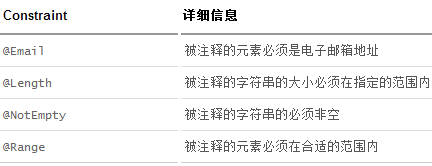

# SpringBoot
## 快速入门

    <?xml version="1.0" encoding="UTF-8"?>
    <project xmlns="http://maven.apache.org/POM/4.0.0" xmlns:xsi="http://www.w3.org/2001/XMLSchema-instance"
        xsi:schemaLocation="http://maven.apache.org/POM/4.0.0 https://maven.apache.org/xsd/maven-4.0.0.xsd">
        <modelVersion>4.0.0</modelVersion>
        <!--继承spring-boot-starter-parent的依赖管理，控制版本与打包等内容-->
        <parent>
            <groupId>org.springframework.boot</groupId>
            <artifactId>spring-boot-starter-parent</artifactId>
            <version>2.2.1.RELEASE</version>
            <relativePath/> <!-- lookup parent from repository -->
        </parent>
        <groupId>com.zyq</groupId>
        <artifactId>chapter1-1</artifactId>
        <version>0.0.1-SNAPSHOT</version>
        <name>chapter1-1</name>
        <description>Demo project for Spring Boot</description>

        <properties>
            <java.version>1.8</java.version>
        </properties>

        <dependencies>
            <!--用于实现HTTP接口（该依赖中包含了Spring MVC）-->
            <dependency>
                <groupId>org.springframework.boot</groupId>
                <artifactId>spring-boot-starter-web</artifactId>
            </dependency>

            <!--用于编写单元测试的依赖包-->
            <dependency>
                <groupId>org.springframework.boot</groupId>
                <artifactId>spring-boot-starter-test</artifactId>
                <scope>test</scope>
                <exclusions>
                    <exclusion>
                        <groupId>org.junit.vintage</groupId>
                        <artifactId>junit-vintage-engine</artifactId>
                    </exclusion>
                </exclusions>
            </dependency>
        </dependencies>

        <!--构建配置部分。默认使用了spring-boot-maven-plugin，配合spring-boot-starter-parent就可以把Spring Boot应用打包成JAR来直接运行。-->
        <build>
            <plugins>
                <plugin>
                    <groupId>org.springframework.boot</groupId>
                    <artifactId>spring-boot-maven-plugin</artifactId>
                </plugin>
            </plugins>
        </build>

    </project>
注意相关依赖的作用；
Application类和controller类之间的相对路径关系，否则无法加载；

## 工程结构推荐

    com
        +- example
            +- myproject
            +- Application.java
            |
            +- domain
            |  +- Customer.java
            |  +- CustomerRepository.java
            |
            +- service
            |  +- CustomerService.java
            |
            +- web
            |  +- CustomerController.java
            |

1、root package：com.example.myproject，所有的类和其他package都在root package之下。/2/2、应用主类：Application.java，该类直接位于root package下。通常我们会在应用主类中做一些框架配置扫描等配置，我们放在root package下可以帮助程序减少手工配置来加载到我们希望被Spring加载的内容
3、com.example.myproject.domain包：用于定义实体映射关系与数据访问相关的接口和实现
4、com.example.myproject.service包：用于编写业务逻辑相关的接口与实现
5、com.example.myproject.web：用于编写Web层相关的实现，比如：Spring MVC的Controller等

### 非典型结构下的初始化
使用@ComponentScan注解指定具体的加载包，比如：
方法一：
@ComponentScan(basePackages="com.example")
方法二：
使用@Bean注解来初始化

## 构建RESTful API与单元测试
@Controller：修饰class，用来创建处理http请求的对象
@RestController：Spring4之后加入的注解，原来在@Controller中返回json需要@ResponseBody来配合，如果直接用@RestController代替@Controller就不需要在配置@ResponseBody，默认返回json格式。
@RequestMapping：配置url映射。现在更多的也会直接用HttpMethod直接关联的映射注解来定义。比如GetMapping，PostMapping，DeleteMapping，PutMapping等

## swagger的配置可以直接生成APi文档
首先增加依赖

    <dependency>
			<groupId>com.spring4all</groupId>
			<artifactId>swagger-spring-boot-starter</artifactId>
			<version>1.9.0.RELEASE</version>
	</dependency>
之后在配置页设置相应的信息

    swagger.title=spring-boot-starter-swagger
    swagger.description=Starter for swagger 2.x
    swagger.version=1.9.0.RELEASE
    swagger.license=Apache License, Version 2.0
    swagger.licenseUrl=https://www.apache.org/licenses/LICENSE-2.0.html
    swagger.contact.name=zyq
    swagger.contact.email=741883796@qq.com
    #包名写对
    swagger.base-package=com.zyq
    swagger.base-path=/**
其中扫描的包名要对。
最好在对应的接口前面可以加上注解，对接口进行具体的解释

    @Api(tags = "用户管理") //注解
    @RestController
    @RequestMapping(value = "/users")
    public class UserController {
        static Map<Long,User> users = Collections.synchronizedMap(new HashMap<>());

        /**
        * get
        * @return
        */
        @GetMapping("/")
        @ApiOperation(value = "获取用户列表") //注解
        public List<User> getUserList() {
            List<User> r = new ArrayList<>(users.values());
            return  r;
        }
        。。。

## JCR对请求参数进行基本校验
主要是对传过来的参数进行基本的一些校验；

