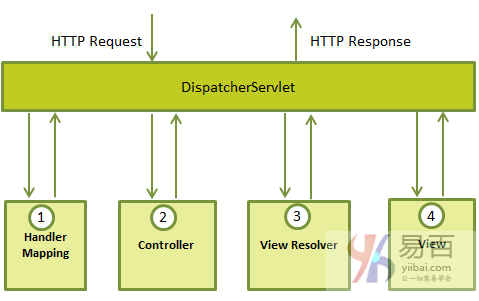

# SpringMVC
## SpringMVC概述
模型(Model)封装了应用程序数据，通常它们将由POJO类组成。
视图(View)负责渲染模型数据，一般来说它生成客户端浏览器可以解释HTML输出。
控制器(Controller)负责处理用户请求并构建适当的模型，并将其传递给视图进行渲染

### DispatcherServlet组件类

DispatcherServlet传入HTTP请求的事件顺序：
1、在接受到HTTP请求后，DispatcherServlet会查询HandlerMapping以调用相应的controller
2、Controller接受请求并根据使用的GET或POST方法调用相应的服务方法。服务方法将基于定义的业务逻辑设置模型数据，并将视图名称返回给DispatcherServlet。
3、DispatcherServlet将从ViewResolver获取请求的定义视图
4、当视图完成，DispatcherServlet将模型数据传递给最终的视图，并在浏览器上呈现
所有上述组件，即: HandlerMapping，Controller和ViewResolver是WebApplicationContext的一部分，它是普通ApplicationContext的扩展，带有Web应用程序所需的一些额外功能。

[servlet-name]-servlet.xml文件将用于创建定义的bean，它会覆盖在全局范围中使用相同名称定义的任何bean的定义。
<context：component-scan ...>标签将用于激活Spring MVC注释扫描功能，允许使用@Controller和@RequestMapping等注释。
InternalResourceViewResolver将定义用于解析视图名称的规则。根据上面定义的规则，hello的逻辑视图将委托给位于/WEB-INF/jsp/hello.jsp这个视图来实现。

### 定义控制器
DispatcherServlet将请求委派给控制器以执行特定于其的功能。@controller注释指示特定类充当控制器的角色
@RequestMapping注释用于URL映射到整个类或特定处理程序方法

    @Controller
    @RequestMapping("/hello")
    public class HelloController{
        @RequestMapping(method = RequestMethod.GET)
        public String printHello(ModelMap model){
            model.addAttibute("message","Hello Spring MVC Framework");
            return "hello";
        }
    }
@Controller注释将类定义为Spring MVC控制器。这里@RequestMapping的第一个用法表示此控制器上的所有处理方法都与/hello路径相关。 下一个注释@RequestMapping(method = RequestMethod.GET)用于声明printHello()方法作为控制器的默认服务方法来处理HTTP GET请求。可以定义另一个方法来处理同一URL的任何POST请求。

    @Controller
    public class HelloController{
        @RequestMapping(value = "/hello", method = RequestMethod.GET)
        public String printHello(ModelMap model){
            model.addAttibute("message","Hello Spring MVC Framework");
            return "hello";
        }
    }
value属性指示处理程序方法映射到的URL，method属性定义处理HTTP GET请求的服务方法

### 创建JSP视图
Spring MVC支持许多类型的视图用于不同的表示技术。包括 - JSP，HTML，PDF，Excel工作表，XML，Velocity模板，XSLT，JSON，Atom 和 RSS 源，JasperReports等。但最常见的是使用JSPL编写的JSP模板，这里使用的是JSP模板

### SpringMVC静态页面
这里使用<mvc:resources ..../>标记来映射静态页面。映射属性必须是指定http请求的URL模式的Ant模式。location属性必须指定一个或多个有效的资源目录位置，其中包含静态页面，包括图片，样式表，JavaScript和其他静态内容。可以使用逗号分隔的值列表指定多个资源位置。

