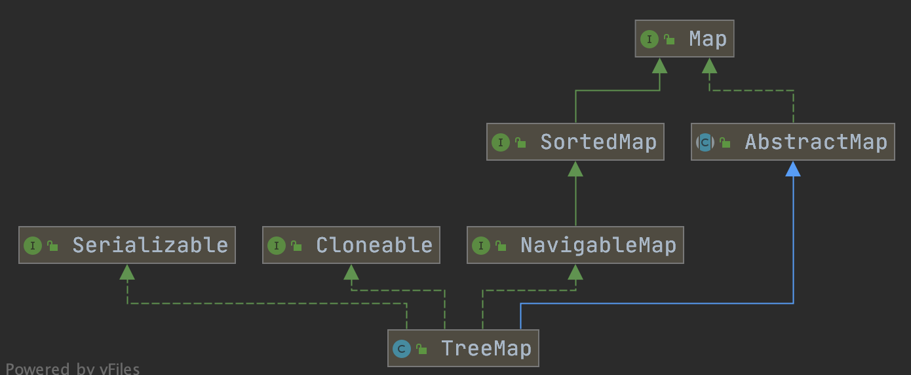

# 集合常见面试题
## 概述
### List，Set,Map三者的区别
**List**：List接口存储一组不唯一，有序的对象；对付顺序的好帮手；
**Set**：不允许重复的集合。不会有多个元素引用相同的对象；
**Map**：使用键值对的存储，Map会维护与Key有关的值，两个key可以引用相同的对象，但Key不能重复，典型的Key是String类型，但也可以是任何对象；

### 集合框架底层数据结构总结
**Collection**

**List**
ArrayList：Object数组
Vector：Object数组
LinkedList：双向链表

**Set**
HashSet：（无序，唯一):基于HashMap实现的，底层采用HashMap来保存元素
LinkedHashSet： LinkedHashSet继承与HashSet，并且其内部是通过LinkedHashMap来实现的。类似于我们之前说的LinkedHashMap其内部是基于HashMap实现一样，不过还是有一点点区别的；
TreeSet：（有序，唯一）：红黑树(自平衡的排序二叉树)

**Map**
HashMap：JDK1.8之前是由数组加链表实现的，数组是hashMap的主体，链表则是主要为了解决哈希冲突而存在的。JDK1.8之后做了较大改变，当链表长度大于阈值(默认为8)，将链表转换成红黑树，如果数组长度小于64，那么选择先进行数组扩容，而不是转换为红黑树，将链表转化为红黑树，减少搜索时间；
LinkedHashMap：LinkedHashMap继承自HashMap，所以他的底层仍然是基于拉链法的散列结构，数组和红黑树组成；在HashMap的基础上增加了一条双向链表，使得上面的结构可以保持键值对的插入顺序，实现了访问顺序的相关逻辑；
Hashtable：数组+链表组成的，数组是HashMap的主体，链表则是主要解决哈希冲突而存在的
TreeMap：红黑树；

## Iterator迭代器
迭代器Iterator是什么？

    public interface Iterator<E> {
        boolean hasNext();
        E next();
        ......
    }

迭代器Iterator称之为迭代器，迭代器可以对集合进行遍历，但是每一个集合内部的数据结构可能是不尽相同的，所以每一个集合存取都很可能是不一样的，虽然我们可以人为的在每一个类中定义hasNext()和next()方法，但是这样使得整个集合体系过于臃肿，于是就有了迭代器；

迭代器的定义：提供一种方法访问一个容器对象中各个元素，而又不需要暴露该对象的内部细节；

### 迭代器的作用
Iterator主要是用来遍历集合的，特点是更加安全，因为他确保了在当前遍历集合的元素被更改的时候，就会抛出ConcurrentModificationException异常；

如何使用呢？

    Map<Integer,String> map = new HashMap();
    map.put(1, "Java");
    map.put(2, "C++");
    map.put(3, "PHP");
    Iterator<Map.Entry<Integer,String>> iterator = map.entrySet().iterator();
    while(iterator.hasNext()){
        Map.Entry<Integer,String> entry = iterator.next();
        System.out.println(entry.getKey() + entry.getValue());
    }

## Collection子接口之List
### 1.3.1 ArrayList与LinkedList区别
**1. 是否保证线程安全**：ArrayList和LinkedList都是不同步的，都不保证线程安全；
**2. 底层数据结构**： ArrayList底层使用的Object数组，LinkedList底层使用的双向链表的数据结构；
**3. 插入和删除是否受元素位置的影响**： 1、ArrayList：数组存储，插入删除的时间复杂度受元素位置影响，插入或删除默认在队列尾部，此时时间复杂度是O(1),插入和删除列表中间的元素此时的时间复杂度是O(n-i);
2、LinkedList采用链表存储，所以对于add(E,e)的插入删除元素时间复杂度不受位置的影响，近似O(1),如果要在指定位置插入删除元素的话，时间复杂度近似为O(n),因为要移动到指定位置进行插入；

**4. 是否支持快速随机访问：**：LinkedList不支持高效的随机元素访问，ArrayList支持；底层数据结构的特性；
**5. 内存空间占用**：ArrayList空间浪费，list列表结尾会预留一定是容量空间，而LinkedList的空间划分主要体现在他的每一个元素都需要消耗比Arraylist更多的空间；

### RandomAccess接口

    public interface RandomAccess{

    }

源码中发现RandomAccess接口中什么都没有定义，RandomAccess接口不过是一个标识罢了，标识这个接口具有随机访问功能；

在binarySearch()方法中，他要判断传入的list是否RandomAccess的实例，如果是，调用indexedBinarySearch()方法不是的话，调用iteratorBinarySearch()方法；

    public static <T> int binaraySearch(List<? extends Comparable<? super T>> list,T key){
        if(list instanceof RandomAccess || list.size() < BINARYSEARCH_THRESHOLD>){
            return Collections.indexedBinarySearch(list,key);
        }else{
            return Collections.iteratorBinarySearch(list,key);
        }
    }

ArrayList实现了RandomAccess，LinkedList没有实现，因为ArrayList底层是数组，LinkedList是链表，数组天然支持随机访问，ArrayList 实现了 RandomAccess 接口，就表明了他具有快速随机访问功能。 RandomAccess 接口只是标识，并不是说 ArrayList 实现 RandomAccess 接口才具有快速随机访问功能的！

### 扩容机制
从ArrayList构造方法说起：

   /**
     * 默认初始容量大小，static final修饰，类静态变量和最终变量，不可被修改的静态变量
     */
    private static final int DEFAULT_CAPACITY = 10;
    

    private static final Object[] DEFAULTCAPACITY_EMPTY_ELEMENTDATA = {};

    /**
     *默认构造函数，使用初始容量10构造一个空列表(无参数构造)
     */
    public ArrayList() {
        //默认构造方法，赋值为空数组，object类型的
        this.elementData = DEFAULTCAPACITY_EMPTY_ELEMENTDATA;
    }
    
    /**
     * 带初始容量参数的构造函数。（用户自己指定容量）
     */
    public ArrayList(int initialCapacity) {
        if (initialCapacity > 0) {//初始容量大于0
            //创建initialCapacity大小的数组
            this.elementData = new Object[initialCapacity];
        } else if (initialCapacity == 0) {//初始容量等于0
            //创建空数组
            this.elementData = EMPTY_ELEMENTDATA;
        } else {//初始容量小于0，抛出异常
            throw new IllegalArgumentException("Illegal Capacity: "+
                                               initialCapacity);
        }
    }

   /**
    *构造包含指定collection元素的列表，这些元素利用该集合的迭代器按顺序返回
    *如果指定的集合为null，throws NullPointerException。 
    */
     public ArrayList(Collection<? extends E> c) {
        elementData = c.toArray();
        if ((size = elementData.length) != 0) {
            // c.toArray might (incorrectly) not return Object[] (see 6260652)
            if (elementData.getClass() != Object[].class)
                elementData = Arrays.copyOf(elementData, size, Object[].class);
        } else {
            // replace with empty array.
            this.elementData = EMPTY_ELEMENTDATA;
        }
    }

**以无参方法创建ArrayList时，实际上初始化赋值的是一个空数组**。当真正对数组进行添加元素操作的时候才真正分配容量；

**接下来看ArrayList的扩容机制**

**add方法：**
    add boolean add(E e){
        ensureCapacityInternal(size + 1);
        elementData(size++) = e;
        return true;
    }

**再来看看ensureCapacityInternal()方法：**
add方法调用了ensureCapacityInternal(size + 1);

    //得到最小扩容量
    private void ensureCapacityInternal(int minCapacity) {
        if (elementData == DEFAULTCAPACITY_EMPTY_ELEMENTDATA) {
              // 获取默认的容量和传入参数的较大值
            minCapacity = Math.max(DEFAULT_CAPACITY, minCapacity);
        }

        ensureExplicitCapacity(minCapacity);
    }
    //初始值和默认值选择其中更大的一个；
**ensureExplicitCapacity()方法**
如果调用ensureCapacityInternal()方法，就一定会讲过执行这个方法；

    private void ensureExplicitCapacity(int minCapacity){
        modCount++;

        if(minCapacity - elementData.length > 0){
            //调用grow方法进行扩容，调用此方法代表已经开始扩容了
            grow(minCapacity);
        }
    }
**grow()方法**

    /**
     * 要分配的最大数组大小
     */
    private static final int MAX_ARRAY_SIZE = Integer.MAX_VALUE - 8;

    /**
     * ArrayList扩容的核心方法。
     */
    private void grow(int minCapacity) {

        // oldCapacity为旧容量，newCapacity为新容量
        int oldCapacity = elementData.length;

        //将oldCapacity 右移一位，其效果相当于oldCapacity /2，
        //我们知道位运算的速度远远快于整除运算，整句运算式的结果就是将新容量更新为旧容量的1.5倍，
        int newCapacity = oldCapacity + (oldCapacity >> 1);

        //然后检查新容量是否大于最小需要容量，若还是小于最小需要容量，那么就把最小需要容量当作数组的新容量，
        if (newCapacity - minCapacity < 0)
            newCapacity = minCapacity;

       // 如果新容量大于 MAX_ARRAY_SIZE,进入(执行) `hugeCapacity()` 方法来比较 minCapacity 和 MAX_ARRAY_SIZE，
       //如果minCapacity大于最大容量，则新容量则为`Integer.MAX_VALUE`，否则，新容量大小则为 MAX_ARRAY_SIZE 即为 `Integer.MAX_VALUE - 8`。
        if (newCapacity - MAX_ARRAY_SIZE > 0)
            newCapacity = hugeCapacity(minCapacity);

        // minCapacity is usually close to size, so this is a win:
        elementData = Arrays.copyOf(elementData, newCapacity);
    }

**hugeCapacity()方法**

    private static int hugeCapacity(int minCapacity) {
        if (minCapacity < 0) // overflow
            throw new OutOfMemoryError();

        //对minCapacity和MAX_ARRAY_SIZE进行比较
        //若minCapacity大，将Integer.MAX_VALUE作为新数组的大小
        //若MAX_ARRAY_SIZE大，将MAX_ARRAY_SIZE作为新数组的大小
        //MAX_ARRAY_SIZE = Integer.MAX_VALUE - 8;

        return (minCapacity > MAX_ARRAY_SIZE) ?
            Integer.MAX_VALUE :
            MAX_ARRAY_SIZE;
    }

**源码中大量调用了System.arraycopy()和Arrays.copyOf()方法**

**System.arraycopy()方法**

    /**
     * 在此列表中的指定位置插入指定的元素。 
     *先调用 rangeCheckForAdd 对index进行界限检查；然后调用 ensureCapacityInternal 方法保证capacity足够大；
     *再将从index开始之后的所有成员后移一个位置；将element插入index位置；最后size加1。
     */
    public void add(int index, E element) {
        rangeCheckForAdd(index);

        ensureCapacityInternal(size + 1);  // Increments modCount!!

        //arraycopy()方法实现数组自己复制自己
        //elementData:源数组;index:源数组中的起始位置;elementData：目标数组；index + 1：目标数组中的起始位置； size - index：要复制的数组元素的数量；
        System.arraycopy(elementData, index, elementData, index + 1, size - index);
        elementData[index] = element;
        size++;
    }

**Arrays.copyOf()方法**

   /**
     以正确的顺序返回一个包含此列表中所有元素的数组（从第一个到最后一个元素）; 返回的数组的运行时类型是指定数组的运行时类型。 
     */
    public Object[] toArray() {
    //elementData：要复制的数组；size：要复制的长度
        return Arrays.copyOf(elementData, size);
    }

## Collection子接口之Set

### comparable和Comparator的区别

comparable 实际出自于java.lang包，它有一个comparaTo(Obkect obj)方法来排序；
comparator 接口实际上出自java.util包，它有一个compare（Object obj1，Object obj2)方法来排序；

对一个集合实行自定义排序的时候，我们重写compareTo()方法或者compare()方法，当我们需要对某一个集合实现两种排序方式时，比如一个song对象中的歌名和歌手名分别采用一种排序方法的话，我们可以重写compareTo方法和使用自制的Comparator方法或者以两个Comparator来实现歌名排序和歌星名排序，

        ArrayList<Integer> arrayList = new ArrayList<Integer>();
        arrayList.add(-1);
        arrayList.add(3);
        arrayList.add(3);
        arrayList.add(-5);
        arrayList.add(7);
        arrayList.add(4);
        arrayList.add(-9);
        arrayList.add(-7);
        System.out.println("原始数组:");
        System.out.println(arrayList);
        // void reverse(List list)：反转
        Collections.reverse(arrayList);
        System.out.println("Collections.reverse(arrayList):");
        System.out.println(arrayList);

        // void sort(List list),按自然排序的升序排序
        Collections.sort(arrayList);
        System.out.println("Collections.sort(arrayList):");
        System.out.println(arrayList);
        // 定制排序的用法
        Collections.sort(arrayList, new Comparator<Integer>() {
            //重写compare，反序输出
            @Override
            public int compare(Integer o1, Integer o2) {
                return o2.compareTo(o1);
            }
        });
        System.out.println("定制排序后：");
        System.out.println(arrayList);

重写compareTo方法实现年龄排序：

    // person对象没有实现Comparable接口，所以必须实现，这样才不会出错，才可以使treemap中的数据按顺序排列
    // 前面一个例子的String类已经默认实现了Comparable接口，详细可以查看String类的API文档，另外其他
    // 像Integer类等都已经实现了Comparable接口，所以不需要另外实现了
    public  class Person implements Comparable<Person> {
        private String name;
        private int age;

        public Person(String name, int age) {
            super();
            this.name = name;
            this.age = age;
        }

        public String getName() {
            return name;
        }

        public void setName(String name) {
            this.name = name;
        }

        public int getAge() {
            return age;
        }

        public void setAge(int age) {
            this.age = age;
        }

        /**
        * T重写compareTo方法实现按年龄来排序
        */
        @Override
        public int compareTo(Person o) {
            if (this.age > o.getAge()) {
                return 1;
            }
            if (this.age < o.getAge()) {
                return -1;
            }
            return 0;
        }
    }

### 无序性和不可重复性的含义是什么：

1. 什么是无序性，无序性不等于随机性，无序性是指存储数据在底层数组中并非按照数组索引的顺序添加，而是根据数据的哈希值添加的；
2. 什么是不可重复性，不可重复性是指添加的元素按照equals判断时，返回false，需要同时重写equals方法和HashCode方法；

### HashSet、LinkedHashSet和TreeSet三者的异同

HashSet是Set接口的主要实现类，HashSet的底层是HashMap，线程是不安全的，可以存储null值；
LinkedHashSet是HashSet的子类，能够按照条件的顺序遍历；
TreeSet是红黑树，能够按照元素的顺序进行遍历，排序的方式有自然排序和定制排序；

## Map接口
### HashMap和Hashtable的区别
**1. 线程是否安全**：HashMap是非线程安全的，HashTable是线程安全的，因为HashTable内部方法基本都经过synchronized修饰；
**2. 效率**：因为线程安全的问题，HashMap要比HashTable效率高一点。另外HashTable基本被淘汰了，不要在代码中使用它；
**3. 对Null key和Null value**：HashMap支持，但只能有null值的键一个，null值多个，HashTable不允许有null键和null值；
**4. 初始容量大小和每次扩容的不同**：1. 创建时如果不指定初始值HashTable默认是11，之后每次扩容都是2n+1，HashMap是16，之后每次扩容是原来的2倍。2. 如果给了容量初始值，那么HashTable直接使用初始值，HashMap是将其扩充为2的幂次方大小，HashMap的tableSizefor()方法保证，下面给出了源代码。HashMap总是使用2的幂次方倍大小；
**5. 底层数据结构**：1.8之后链表长度大于阈值（默认为8）的时候，将其转换为红黑树之前先判断，数组长度大小小于64的话选择先增加数组长度，而不是直接转化为红黑树；

    public HashMap(int initialCapacity, float loadFactor){
        if(initialCapacity < 0){
            throw new IllegalArgumentException("Illegal initial capacity: " + initialCapacity);
        }
        if(initalCapacity > MAXIMUM_CAPACITY){
            initialCapacity = MAXIMUM_CAPACITY;
        }
        if(loadFactor <= 0 || Float.isNaN(loadFactory)){
            throw new IllegalArgumentException("Illegal load factor: " + loadFactor);
        }
        this.loadFactor = loadFactor;
        this.threshold = tableSizeFor(initialCapacity);
    }
    public HashMap(int initialCapacity) {
        this(initialCapacity, DEFAULT_LOAD_FACTOR);
    }

    /**
     * Returns a power of two size for the given target capacity.
     */
    static final int tableSizeFor(int cap) {
        int n = cap - 1;
        n |= n >>> 1;
        n |= n >>> 2;
        n |= n >>> 4;
        n |= n >>> 8;
        n |= n >>> 16;
        return (n < 0) ? 1 : (n >= MAXIMUM_CAPACITY) ? MAXIMUM_CAPACITY : n + 1;
    }

**HashMap和HashSet的区别**
HashSet是基于HashMap实现的，HashSet源码很少，除了clone()，writeObject(),readObject()是HashSet自己不得不实现意外，其他方法都是直接调用的HashMap中的方法；

| HashMap | HashSet |
| - | - |
|实现Map接口 | 实现Set接口|
|存储键值对 | 存储对象 |
|调用put()向map添加 | 调用add()向Set添加 |
|HashMap使用键Key计算HashCode | HashSet使用成员对象计算hashcode，对于两个对象hashcode可能相同 |

**HashMap和TreeMap的区别**

实现NavigableMap接口让TreeMap有了对集合内元素搜索的能力；
实现SortMap接口让TreeMap有了对集合中元素根据键排序的能力。默认是按key的升序排序，不过我们可以指定排序的比较器；

    /**
    * @author shuang.kou
    * @createTime 2020年06月15日 17:02:00
    */
   public class Person {
       private Integer age;

       public Person(Integer age) {
           this.age = age;
       }

       public Integer getAge() {
           return age;
       }

       public static void main(String[] args) {
           TreeMap<Person, String> treeMap = new TreeMap<>(new Comparator<Person>() {
               @Override
               public int compare(Person person1, Person person2) {
                   int num = person1.getAge() - person2.getAge();
                   return Integer.compare(num, 0);
               }
           });
           treeMap.put(new Person(3), "person1");
           treeMap.put(new Person(18), "person2");
           treeMap.put(new Person(35), "person3");
           treeMap.put(new Person(16), "person4");
           treeMap.entrySet().stream().forEach(personStringEntry -> {
               System.out.println(personStringEntry.getValue());
           });
       }
   }

### HashSet如何检查重复
HashSet使用hashcode来判断元素加入的位置，如果没有hashcode相同的，HashSet认为没有相同的元素，如果发现有相同的hashcode值的对象，这时会调用equals()方法来检查hashcode相等的对象是否相同。相同就不会操作成功；

## HashMap的底层实现

JDK1.8之前HashMap底层是数组和链表，结合在一起使用就是链表散列。HashMap通过key的hashCode经过扰动函数处理过后得到hash值，然后通过(n - 1) & hash判断当前元素存放的位置（这里的n指的是数组的长度），如果当前位置存在元素的话，判断该元素与要存入的元素的hash值以及key是否相同，如果相同的话，直接覆盖，不相同的话就通过拉链法解决冲突。

所谓扰动函数就是HashMap的hash方法。使用hash方法就是扰动函数是为了防止一些实现比较差的hashCode()方法换句话说使用扰动函数之后可以减少碰撞；

    static final int hash(Object key){
        int h;
        // key.hashCode()：返回散列值也就是hashcode
        // ^ ：按位异或
        // >>>:无符号右移，忽略符号位，空位都以0补齐
        return (key == null) ? 0 : (h = key.hashCode()) ^ (h >>> 16);
    }

    static int hash(int h){
        // This function ensures that hashCodes that differ only by
        // constant multiples at each bit position have a bounded
        // number of collisions (approximately 8 at default load factor).

        h ^= (h >>> 20) ^ (h >>> 12);
        return h ^ (h >>> 7) ^ (h >>> 4);
    }

1.8的hash方法，1.7的hash方法性能稍差，因为毕竟扰动了4次；

### HashMap的长度为什么是2的幂次方
hash值的范围值-2147483648 到 2147483647，前后加起来大概40亿映射空间，只要哈希函数比较均匀松散，一般不会碰撞，但是40亿长度的数组，内存是放不下的，要对数组长度取模运算，得到余数才能用来存放的位置对应的是数组的下标，这个数组下标的计算方法是(n - 1) & hash，这就是说明了HashMap长度为什么是2的幂次方了；

**“取余(%)操作中如果除数是 2 的幂次则等价于与其除数减一的与(&)操作（也就是说 hash%length==hash&(length-1)的前提是 length 是 2 的 n 次方；）。” 并且 采用二进制位操作 &，相对于%能够提高运算效率，这就解释了 HashMap 的长度为什么是 2 的幂次方。**

## HashMap的几种最常见的遍历方式
总的来说是四种：
1. Iterator迭代器
2. For Each方式
3. lamda表达式遍历
4. StreamsAPI遍历
   
每一种有不同的实现方式：lamda只有一种实现方式，其余三种有两种实现方式；
1. 迭代器Iterator EntrySet方式遍历
2. 迭代器Iterator KeySet方式遍历
3. 使用For Each EntrySet方式遍历
4. 使用For Each KeySet方式遍历
5. Lamda表达式遍历
6. 使用StreamsAPI单线程遍历
7. 使用StreamsAPI多线程遍历

七种实现方式如下代码：

    public class HashMapTest {
        public static void main(String[] args) {
            // 创建并赋值 HashMap
            Map<Integer, String> map = new HashMap();
            map.put(1, "Java");
            map.put(2, "JDK");
            map.put(3, "Spring Framework");
            map.put(4, "MyBatis framework");
            map.put(5, "Java中文社群");

            Iterator<Map.Entry<Integer,String>> iterator = map.entrySet().iterator();
            while(iterator.hasNext()){
                Map.Entry<Integer,String> entry = iterator.next();
                System.out.print(entry.getKey() + " ");
                System.out.print(entry.getValue() + " ");
            }
            System.out.println();
            Iterator<Integer> iterator1 = map.keySet().iterator();
            while(iterator1.hasNext()){
                Integer key = iterator1.next();
                System.out.print(key + " ");
                System.out.print(map.get(key) + " ");
            }
            System.out.println();
            for(Map.Entry<Integer,String> m : map.entrySet()){
                System.out.print(m.getKey() + " ");
                System.out.print(m.getValue() + " ");
            }
            System.out.println();
            for(Integer i : map.keySet()){
                System.out.print(i + " ");
                System.out.print(map.get(i) + " ");
            }
            System.out.println();
            map.forEach((key,value) -> {
                System.out.print(key + " ");
                System.out.print(value + " ");
            });
            System.out.println();
            map.entrySet().stream().forEach((entry) -> {
                System.out.print(entry.getKey() + " ");
                System.out.print(entry.getValue() + " ");
            });
            System.out.println();
            map.entrySet().parallelStream().forEach((entry) -> {
                System.out.print(entry.getKey() + " ");
                System.out.print(entry.getValue() + " ");
            });
        }
    }
七种方式来看，EntrySet和KeySet代码差异不大，从性能上看EntrySet和KeySet几乎相近的，但是代码优雅性和可读性推荐使用EntrySet；

## HashMap多线程操作导致死循环问题
主要愿意是在于并发下Rehash会造成元素之间形成一个链表，不过jdk1.8后解决了这个问题，但是还是不加以在多线程下使用HashMap，会出现数据丢失等情况。并发情况下推荐使用ConcurrentHashMap；

## ConcurrentHashMap和Hashtable的区别
**底层数据结构**：JDK1.7的ComcurrentHashMap底层采用分段的数组+链表实现，JDK1.8采用的数据结构跟HashMap1.8结构一样，数组+链表/红黑树，Hashtable和JDK1.8之前的HashMap的底层数据结构都类似于数组+链表的形式；

**实现线程安全的方式**：在JDK1.7之前，ConcurrentHashMap对整个通数组进行了分割分段，每一把锁只锁容器的一部分，减少多线程的锁竞争提高并发访问率；JDK1.8的时候，已经摒弃了Segment的概念，而是直接用Node数组+链表+红黑树，并发控制使用synchronized和CAS来操作。
Hashtable同一把锁，使用synchronized保证线程安全，效率低下，竞争很大；

JDK1.7的ConcurrentHashMap：

JDK1.8 的 ConcurrentHashMap（TreeBin: 红黑二叉树节点 Node: 链表节点）

## ConcurrentHashMap线程安全的具体实现方式
JDK1.7：
数据分为一段一段的存储，然后给每一段数据配一把锁，当一个线程占用一个段数据时，其他段数据不受影响；

Segment实现了ReentrantLock，所以Segment是一种可重入锁，扮演锁的角色。HashEntry用于存储键值对数据；

一个ConcurrentHashMap里面包含一个Segment数组，Segment的结构和HashMap类似，是一种数组和链表结构的，一个Segment包含一个HashEntry数组，每个HashEntry是一个链表结构的元素，每个Segment守护着一个HashEntry数组里的元素，当对HashEntry数组数据进行修改时，必须首先获得对应的Segment的锁；

JDK1.8：
ConcurrentHashMap取消了Segment分段锁，采用CAS和synchronized来保证并发安全。数据结构跟HashMap1.8的结构类似，数组+链表/红黑树，java8在链表长度超过一定阈值8时，将链表转换为红黑树。数组大小小于64的时候要先增加数组大小；

## Collections工具类
Collections工具类常用方法：
1. 排序
2. 查询，替换操作
3. 同步控制（不推荐，需要线程安全的集合类型时考虑使用JUC包下的并发集合）
   
### 排序操作

    void reverse(List list)//反转
    void shuffle(List list)//随机排序
    void sort(List list) //按自然排序的升序排序
    void sort(List list,Comparator c)//定制排序，由Comparator控制排序逻辑
    void swap(List list, int i, int j)//交换两个索引位置的元素
    void rotate(List list, int distance)//旋转，当distance为正数时，将list后diatance个元素整体移到前面，当distance为负数的时候，将前diatance个元素整体移到后面

### 查找，替换操作

    int binarySearch(List list,Object key)//对List进行二分查找，返回索引，注意List必须是有序的
    int max(Collection coll)//根据元素的自然顺序，返回最大的元素，类比int min(Collection coll)
    int max(Collection coll, Comparator c)//根据定制排序，返回最大元素，排序规则由Comparatator类控制。类比int min(Collection coll, Comparator c)
    void fill(List list, Object obj)//用指定的元素代替指定list中的所有元素。
    int frequency(Collection c, Object o)//统计元素出现次数
    int indexOfSubList(List list, List target)//统计target在list中第一次出现的索引，找不到则返回-1，类比int lastIndexOfSubList(List source, list target).
    boolean replaceAll(List list, Object oldVal, Object newVal), 用新元素替换旧元素

### 同步控制

Collections提供多个Synchronized()方法，该方法可以将指定集合包装成同步的集合，从而解决多线程并发访问集合的线程安全问题；

常用的那些集合都是线程不安全的，但是Collections提供多种静态方法可以把它们包装成线程同步的集合；

但最好不要用这些方法，效率很低，最好使用JUC包中的那些方法；

## 其他重要问题

### 什么是快速失败
快速是吧在fail-fast是java中一种错误检测机制。在使用迭代器对集合进行遍历的时候，我们在多线程中操作非安全失败的集合类可能会触发fail-fast机制，导致ConcurrentModificationException异常，另外，在单线程下，如果在遍历过程对集合对象的内容进行修改的话，就会触发fail-fast机制；

多线程下，如果线程 1 正在对集合进行遍历，此时线程 2 对集合进行修改（增加、删除、修改），或者线程 1 在遍历过程中对集合进行修改，都会导致线程 1 抛出 ConcurrentModificationException 异常。

每当迭代器使用 hashNext()/next()遍历下一个元素之前，都会检测 modCount 变量是否为 expectedModCount 值，是的话就返回遍历；否则抛出异常，终止遍历。

如果我们在集合被遍历期间对其进行修改的话，就会改变 modCount 的值，进而导致 modCount != expectedModCount ，进而抛出 ConcurrentModificationException 异常。

### 什么是安全失败（fail-safe）呢？
明白了快速失败之后，安全失败就是在遍历时不直接在集合中访问，而是先复制原有集合内容，在拷贝的集合上进行遍历。所以，在遍历过程中对原集合所做的修改不能被迭代器检测到；

