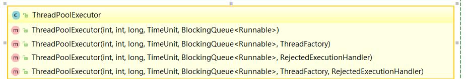
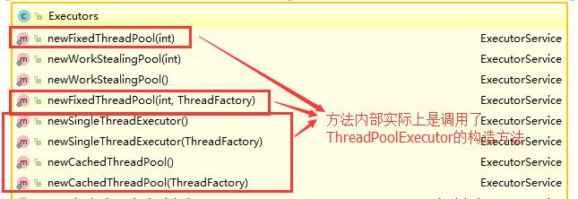

# Java并发基础总结
## 什么是线程和进程
### 何为进程
进程是程序的一次执行过程，是系统运行程序的基本单位，因此进程是动态的。系统运行一个程序即是一个进程从创建，运行到消亡的过程。
Java中启动了main函数时其实就是启动了一个JVM的进程，而main函数所在的这个线程就是进程的一个线程，也称主线程。

### 何为线程
线程是一个比进程更小的执行单位。一个进程在其执行的过程中可以产生多个线程。与进程不同的是多个线程共享进程的堆和方法区资源，但每个线程有自己的程序计数器、虚拟机栈和本地方法栈。所以系统在产生一个线程，或是各个线程之间切换工作时，负担要比进程小的多。

    public class MultiThread {
        public static void main(String[] args){
            //获取JAVA线程管理MXBean
            ThreadMXBean threadMXBean = ManagementFactory.getThreadMXBean();
            //不需要获取同步的monitor和synchronized信息，仅获取线程和线程堆栈的信息
            ThreadInfo[] threadInfos = threadMXBean.dumpAllThreads(false,false);
            for(ThreadInfo threadInfo : threadInfos){
                System.out.println("[" + threadInfo.getThreadId() + "]" + threadInfo.getThreadName());
            }
        }
    }//output:
    //[6]Monitor Ctrl-Break
    //[5]Attach Listener
    //[4]Signal Dispatcher
    //[3]Finalizer
    //[2]Reference Handler
    //[1]main
一个java程序的运行是main线程和多个其他线程同时运行。

## 简述线程和进程的关系，区别以及优缺点
**从JVM角度说进程和线程之间的关系**
### 图解进程和线程的关系
图解：

一个进程中可以有多个线程，多个线程共享进程的堆和方法区 (JDK1.8 之后的元空间)资源，但是每个线程有自己的程序计数器、虚拟机栈 和 本地方法栈。
### 程序计数器为何私有
字节码解释器通过改变程序计数器来依次读取指令，从而实现代码的流程控制，如：顺序执行、选择、循环、异常处理。
在多线程的情况下，程序计数器用于记录当前线程执行的位置，从而当线程被切换回来的时候能够知道该线程上次运行到哪儿了。
需要注意的是，如果执行的是 native 方法，那么程序计数器记录的是 undefined 地址，只有执行的是 Java 代码时程序计数器记录的才是下一条指令的地址。

所以，程序计数器私有主要是为了 **线程切换后能恢复到正确的执行位置**。

### 虚拟机栈和本地方法栈为什么是私有的
**虚拟机栈** : 每个Java方法在执行的同时会创建一个帧栈用于存储局部变量表、操作数栈、常量池引用等信息，方法调用直至执行完成的过程，对应一个栈帧在java虚拟机中入栈和出栈的过程。
**本地方法栈**：和虚拟机所发挥的作用非常相似，区别是虚拟机栈为虚拟机执行Java方法，而本地方法栈则为虚拟机使用到的native方法服务。 

### 一句话了解堆和方法区
堆和方法区是所有线程所共享的资源，其中堆是进程中最大的一块内存，主要用于存放新的对象，所有对象都在这里分配内存。方法区主要用于存放已被加载的类信息、常量、静态变量、即时编译器编译后的代码等数据。1.8之后没有了方法区，将方法区移到了元空间，直接内存中；

## 并发和并行的区别
并发： 同一时间段，多个任务都在执行（单位时间内不一定同时执行）
并行： 单位时间内，多个任务同时执行

## 为什么要使用多线程
总体上讲：
1、计算机底层来说：线程可以比作轻量级的进程，是程序的最小执行单位，线程间的切换和调度的成本远远小于进程
2、互联网发展趋势：现在的系统动不动就要求百万级甚至千万级的并发量，而多线程并发编程正是开发高并发系统的基础，利用好多线程机制可以大大提高系统整体的并发能力以及性能。

计算机底层说：
单核时代线程主要是为了提高CPU和IO设备的利用率，一个线程的时候，cpu计算，IO空闲；IO操作，CPU空闲，利用率50%，而两个线程就不一样了，当一个线程CPU计算另一个IO，理想情况下利用率100%
多核时代，多线程主要是为了提高CPU利用率。举个例子：假如我们要计算一个复杂的任务，我们只用一个线程的话，CPU 只会一个 CPU 核心被利用到，而创建多个线程就可以让多个 CPU 核心被利用到，这样就提高了 CPU 的利用率。

## 多线程的问题
内存泄漏、上下文切换、死锁还有就是受限于硬件和资源的闲置问题

## 线程生命周期和状态
生命周期中指定时刻只可能处于6种不同状态中的一个状态。
|状态名称 | 说明|
|--------|-----|
|NEW|初始状态，线程被构建，但是还没有调用start()方法|
|RUNNABLE|运行状态，Java线程将操作系统中就绪和运行两种状态笼统的称作“运行中”|
|BLOCKED|阻塞状态，表示线程阻塞于锁|
|WAITING|等待状态，表示线程进入等待状态，进入该状态表示当前线程需要等待某种条件达到|
|TIME_WAITING|超时等待状态，该状态不同于WAITING，他是可以指定的时间自行返回的|
|TERMINATED|终止状态，表示当前线程已经执行完毕| 

Java线程状态变迁随着代码的执行在不同状态下切换。具体如图：

线程创建之后它将处于 NEW（新建） 状态，调用 start() 方法后开始运行，线程这时候处于READY（可运行） 状态。可运行状态的线程获得了 CPU 时间片（timeslice）后就处于 RUNNING（运行） 状态。
当线程执行 wait()方法之后，线程进入 WAITING（等待） 状态。进入等待状态的线程需要依靠其他线程的通知才能够返回到运行状态，而 TIME_WAITING(超时等待) 状态相当于在等待状态的基础上增加了超时限制，比如通过 sleep（long millis）方法或 wait（long millis）方法可以将 Java 线程置于 TIMED WAITING 状态。当超时时间到达后 Java 线程将会返回到 RUNNABLE 状态。当线程调用同步方法时，在没有获取到锁的情况下，线程将会进入到 BLOCKED（阻塞） 状态。线程在执行 Runnable 的run()方法之后将会进入到 TERMINATED（终止） 状态。

## 什么是上下文切换
多线程编程中一般线程的数量都是大于CPU核心的个数的，但是一个CPU核心在任意时刻只能被一个线程使用，为了让这些线程都能得到有效的执行，CPU采取的策略是为每个线程分配时间片并轮转的形式，当一个线程的时间片用完的时候就会重新处于就绪状态让给其他线程使用，这个过程就属于上下文的切换。
概括来说就是：当前任务在执行完 CPU 时间片切换到另一个任务之前会先保存自己的状态，以便下次再切换回这个任务时，可以再加载这个任务的状态。任务从保存到再加载的过程就是一次上下文切换。

## 什么是线程死锁？如何避免死锁？
### 线程死锁
多个线程同时被阻塞，他们中的一个或者全部都在等待某个资源被释放。由于线程被无限期的阻塞，因此程序不可能正常终止。
（哲学家吃东西的例子，五个哲学家，五根筷子围在一起吃东西，先拿左筷子，再拿右筷子只有拿到左右两个筷子才能吃饭，死锁的状态就是所有人同时拿起了自己的左筷子）
如图所示，线程A持有资源2，线程B持有资源1，他们同时都想申请对方的资源，所以这两个线程就会相互等待，进入死锁状态。

    public class DeadLockDemo {
        private static Object resource1 = new Object();
        private static Object resource2 = new Object();

        public static void main(String[] args){
            new Thread(() ->{
                synchronized (resource1) {
                System.out.println(Thread.currentThread() + "get resource1");
                try {
                    Thread.sleep(1000);
                }catch (InterruptedException e){
                    e.printStackTrace();
                }
                    System.out.println(Thread.currentThread() + "waiting get resource2");
                synchronized (resource2) {
                    System.out.println(Thread.currentThread() + "get resource2");
                }
            }
            },"线程 1").start();

            new Thread(() ->{
                synchronized (resource2) {
                    System.out.println(Thread.currentThread() + "get resource2");
                    try {
                        Thread.sleep(1000);
                    }catch (InterruptedException e){
                        e.printStackTrace();
                    }
                    System.out.println(Thread.currentThread() + "waiting get resource1");
                    synchronized (resource1) {
                        System.out.println(Thread.currentThread() + "get resource1");
                    }
                }
            },"线程 2").start();
        }
    }
    //输出
    Thread[线程 1,5,main]get resource1
    Thread[线程 2,5,main]get resource2
    Thread[线程 2,5,main]waiting get resource1
    Thread[线程 1,5,main]waiting get resource2
线程A通过synchronized(resource1)获得resource1的监视器锁，然后通过Thread.sleep(1000)；让线程A休眠1s，之后B开始执行，然后获得resource2的监视器锁。线程A和线程B休眠结束了都开始起头请求获取对方的戏院，然后两个线程陷入互相等待的状态。就是死锁。

**死锁的四个条件：**
1、互斥条件：该资源任意一个时刻只有一个线程占用；
2、请求与保持条件：一个进程因请求资源而被阻塞时，对已获得资源保持不放；
3、不剥夺条件：线程已获得的资源在未使用完之前不能被其他线程强行剥夺，只有自己使用完毕后才释放资源；
4、循环等待条件:若干进程之间形成一种头尾相接的循环等待资源关系。

### 如何避免死锁
破坏四个条件中的一个就可以了
**破坏互斥条件**
这个条件无法破坏，使用锁的本意就是想让他们之间互斥的，临界资源序言互斥访问
**破坏请求与保持条件**
一次性申请所有的资源。（一次性申请resource1和resource2的资源）
**破坏不剥夺条件**
占用部分资源的线程进一步申请其他资源的时候，如果申请不到，可以主动释放它占有的资源
**破坏循环等待条件**
按序申请资源来预防，按照某一顺序申请资源，释放资源则反序释放，破坏循环等待条件

将上述代码修改为以下就不会死锁了：

    new Thread(() ->{
            synchronized (resource1) {
                System.out.println(Thread.currentThread() + "get resource1");
                try {
                    Thread.sleep(1000);
                }catch (InterruptedException e){
                    e.printStackTrace();
                }
                System.out.println(Thread.currentThread() + "waiting get resource2");
                synchronized (resource2) {
                    System.out.println(Thread.currentThread() + "get resource2");
                }
            }
        },"线程 2").start();
    //输出
    Thread[线程 1,5,main]get resource1
    Thread[线程 1,5,main]waiting get resource2
    Thread[线程 1,5,main]get resource2
    Thread[线程 2,5,main]get resource1
    Thread[线程 2,5,main]waiting get resource2
    Thread[线程 2,5,main]get resource2
因为当线程A申请到resource1的资源的时候，线程B就申请不到了，然后线程A继续执行，获取到resource2的资源，最后全部执行完线程A对resource1，resource2的资源释放。只有线程B才开始执行。

## sleep()方法和wait()方法的异同点
两者最大的区别在于：sleep方法没有释放锁，而wait方法释放了锁；
两者都可以暂停线程的执行；
wait通常用于线程之间的交互/通信，sleep通常被用于暂停执行；
wait方法被调用之后，线程不会自动苏醒，需要别的线程调用同一对象上的notify或notifyAll方法。sleep方法执行完之后，线程自动苏醒。或者使用wait(long timeout)超时后线程会自动苏醒。

## 为什么调用start()方法会执行run()方法，为什么我们不能直接调用run()方法？
new一个Thread，线程进入了新建状态；调用start(),会启动一个线程并使用线程进入到就绪状态，当分配到时间片后就可以运行了。start()会执行线程的相应准备工作，然后自动执行run()方法的内容，这是真正的多线程工作。而直接执行run()方法，会把run()方法当成一个main线程下的普通方法去执行，并不会在某个线程中执行它。所以这样不是多线程工作。

## synchronized关键字
### 对于synchronized关键字的了解
synchronized关键字解决了多个线程之间访问资源的同步性，synchronized关键字可以保证被它修饰的方法或者代码块在任意时刻只有一个线程执行。

### 自己怎么使用synchronized关键字，项目中使用到了吗
synchronized关键字三种使用方法：
1、修饰实例方法：作用于当前对象实例加锁，进入同步代码前要获得当前对象实例的锁；

    public class SynchronizedDemo2 {
        public synchronized void method() {
            System.out.println("synchronized 方法");
        }
    }
2、修饰静态方法：也就是给当前类加锁，会作用与类的所有对象实例，因为静态成员不属于任何一个实例对象，是类成员。所以如果一个线程A调用一个实例对象的非静态synchronized方法，而线程B需要调用这个实例对象所属类的静态synchronized方法，是允许的，不会发生互斥现象，因为访问静态synchronized方法占用的锁是当前类的锁，而访问非静态synchronized方法占用的锁是当前实例对象锁。
3、修饰代码块：指定加锁对象，对给定对象加锁，进入同步代码库前要获得给定对象的锁。

    public class SynchronizedDemo {
        public void method() {
            synchronized (this) {
                System.out.println("synchronized 代码块");
            }
        }
    }
总结：synchronized关键字加到static静态方法和synchronized(class)代码块上都是给Class类上锁。synchronized关键字加到实例方法上是给对象实例上锁。尽量不要使用synchronized(String a)因为JVM中，字符串常量池具有缓存功能。

面试中面试官经常会说：“单例模式了解吗？来给我手写一下！给我解释一下双重检验锁方式实现单例模式的原理呗！”
**双重校验锁实现对象单例**

    public class Singleton {
        private volatile static Singleton uniqueInstance;
        peivate Singleton(){

        }
        public static Singlrton getUnqueInstance() {
            //先判断对象是否已经实例过了，没有实例化才进入加锁代码
            if(uniqueInstance == null) {
                //类对象加锁
                synchronized (Singleton.class){
                    if(uniqueInstance == null){
                        uniqueInstance = new Singleton();
                    }
                }
            }
            return uniqueInstance;
        }
    }

uniqueInstance采用volatile关键字修饰很有必要，uniqueInstance=new Singleton();代码分三步执行：
1、为uniqueInstance分配内存空间
2、初始化uniqueInstance
3、将uniqueInstance指向分配的内存地址

但是由于JVM具有指令重排的特性，执行顺序有可能变成1，3，2。指令重排在单线程环境下不会出现问题，但是在多线程环境下导致一个线程获得还没有初始化的实例。线程A执行了1、3。此时线程B调用getUniqueInstance()后发现uniqueInstance不为空。因此返回uniqueInstance，但此时uniqueInstance还未被初始化

### synchronized和ReentrantLock的区别
1、两者都是可重入锁
两者都是可重入锁。可重入锁：自己可以再次获取自己内部的锁。比如一个线程获得了某个对象锁，在没有释放这个对象锁的时候，其想再次获取这个对象的锁的时候还是可以获取的，如果不可以重入的话就会造成死锁。只不过每次获取这个锁，锁的计数器自增1，直到下降为0的时候才可以释放锁。

    public class Widget{
        public synchronized void doSomething(){
            ........
        }
    }

    public class LoggingWidget extends Widget{
        public synchronized void doSomething(){
            super.doSomething();
        }
    }

2、synchronized依赖于JVM而ReentrantLock依赖于API
synchronized依赖于JVM实现，比如虚拟机团队在JDK1.6的时候对synchronized关键字做了很多优化，让synchronized关键字从一开始的重量级锁，效率低小引入了相应的一些轻量级锁的技术。但这些没有直接暴露给我们。ReentrantLock是从JDK层面实现的，需要显式定义锁，显式释放锁以及try、finally配合。

3、ReentrantLock 比 synchronized 增加了一些高级功能
主要三点：
（1）等待可中断
（2）可实现公平锁
（3）可实现选择性通知
ReentrantLock提供了一种能够中断等待锁的线程的机制，通过lock.lockInterruptibly()来实现这个机制。也就是说正在等待的线程可以选择放弃等待，改为处理其他事情。

    lock
    public void lock()
    获取锁。
    如果该锁没有被另一个线程保持，则获取该锁并立即返回，将锁的保持计数设置为 1。
    如果当前线程已经保持该锁，则将保持计数加 1，并且该方法立即返回。
    如果该锁被另一个线程保持，则出于线程调度的目的，禁用当前线程，并且在获得锁之前，该线程将一
    直处于休眠状态，此时锁保持计数被设置为 1。

    public void lockInterruptibly() throws InterruptedException
    1）如果当前线程未被中断，则获取锁。 
    2）如果该锁没有被另一个线程保持，则获取该锁并立即返回，将锁的保持计数设置为 1。 
    3）如果当前线程已经保持此锁，则将保持计数加 1，并且该方法立即返回。 
    4）如果锁被另一个线程保持，则出于线程调度目的，禁用当前线程，并且在发生以下两种情况之一以
    前，该线程将一直处于休眠状态： 
        1）锁由当前线程获得；或者 
        2）其他某个线程中断当前线程。 
    5）如果当前线程获得该锁，则将锁保持计数设置为 1。 
    如果当前线程： 
        1）在进入此方法时已经设置了该线程的中断状态；或者 
        2）在等待获取锁的同时被中断。 
    则抛出 InterruptedException，并且清除当前线程的已中断状态。 
    6）在此实现中，因为此方法是一个显式中断点，所以要优先考虑响应中断，而不是响应锁的普通获取或
    重入获取。

ReentrantLock可以指定是公平锁还是非公平锁。而synchronized只能是非公平锁。所谓的公平锁就是先等待的线程先获得锁。

synchronized关键字与wait和notify、notifyAll方法相结合可以实现等待通知机制。ReentrantLock类当然也可以实现，但是需要借助于Condition接口与newCondition() 方法。线程对象可以注册在指定的Condition中，从而可以有选择性的进行线程通知，在调度线程上更加灵活。 在使用notify()/notifyAll()方法进行通知时，被通知的线程是由 JVM 选择的，用ReentrantLock类结合Condition实例可以实现“选择性通知” 。

## volatile关键字
### java内存模型
在 JDK1.2 之前，Java的内存模型实现总是从主存（即共享内存）读取变量。
现在呢，线程可以把变量保存本地内存（比如机器的寄存器）中，而不是直接在主存中进行读写。这就可能造成一个线程在主存中修改了一个变量的值，而另外一个线程还继续使用它在寄存器中的变量值的拷贝，造成数据的不一致。

要解决这个问题，就需要把变量声明为volatile，这就指示 JVM，这个变量是不稳定的，每次使用它都到主存中进行读取。

## synchronized与volatile关键字区别
1、volatile关键字是线程同步的轻量级实现。性能上volatile肯定比synchronized好，但是volatile关键字只针对变量而synchronized关键字可以修饰方法及代码块。
2、多线程访问volatile关键字不会发生阻塞，而synchronized关键字可能会发生阻塞
3、volatile关键字能保证数据的可见性，但不能保证数据的原子性。synchronized关键字两者都能保证。
4、volatile关键字主要用于解决变量在多个线程之间的可见性，而 synchronized关键字解决的是多个线程之间访问资源的同步性

## ThreadLocal
### 简介
实现每一个线程都有自己的专属本地变量如何解决？
ThreadLocal类主要解决的就是让每个线程绑定自己的值，可以将ThreadLocal类形象的比喻成存放数据的盒子，盒子中可以存储每个线程的私有数据。
如果你创建了一个ThreadLocal变量，那么访问这个变量的每个线程都会有这个变量的本地副本，这也是ThreadLocal变量名的由来。他们可以使用 get（）和set（）方法来获取默认值或将其值更改为当前线程所存的副本的值，从而避免了线程安全问题。

    public class ThreadLocalExample implements Runnable{
        //SimpleDateFormat不是线程安全的，所以每个线程都要有自己的独立副本
        private static final ThreadLocal<SimpleDateFormat> formatter = ThreadLocal.withInitial(()-> new SimpleDateFormat("yyyyMMdd HHmm"));

        public static void main(String[] args) throws InterruptedException{
            ThreadLocalExample obj = new ThreadLocalExample();
            for(int i = 0;i < 10;i++){
                Thread t = new Thread(obj,""+i);
                Thread.sleep(new Random().nextInt(1000));
                t.start();
            }
        }

        @Override
        public void run() {
            System.out.println("Thread Name="+Thread.currentThread().getName()+" default Formatter = " + formatter.get().toPattern());
            try{
                Thread.sleep(new Random().nextInt(1000));
            }catch (InterruptedException e){
                e.printStackTrace();
            }

            formatter.set(new SimpleDateFormat());

            System.out.println("Thread Name= "+Thread.currentThread().getName()+" formatter = "+formatter.get().toPattern());
        }
    }
    输出为：
    Thread Name=0 default Formatter = yyyyMMdd HHmm
    Thread Name= 0 formatter = yy-M-d ah:mm
    Thread Name=1 default Formatter = yyyyMMdd HHmm
    Thread Name= 1 formatter = yy-M-d ah:mm
    Thread Name=2 default Formatter = yyyyMMdd HHmm
    Thread Name=3 default Formatter = yyyyMMdd HHmm
    Thread Name= 2 formatter = yy-M-d ah:mm
    Thread Name= 3 formatter = yy-M-d ah:mm
    Thread Name=4 default Formatter = yyyyMMdd HHmm
    Thread Name= 4 formatter = yy-M-d ah:mm
    Thread Name=5 default Formatter = yyyyMMdd HHmm
    Thread Name=6 default Formatter = yyyyMMdd HHmm
    Thread Name= 5 formatter = yy-M-d ah:mm
    Thread Name= 6 formatter = yy-M-d ah:mm
    Thread Name=7 default Formatter = yyyyMMdd HHmm
    Thread Name=8 default Formatter = yyyyMMdd HHmm
    Thread Name= 8 formatter = yy-M-d ah:mm
    Thread Name= 7 formatter = yy-M-d ah:mm
    Thread Name=9 default Formatter = yyyyMMdd HHmm
    Thread Name= 9 formatter = yy-M-d ah:mm

从输出中看虽然在线程中前面的Thread-0已经改变了formatter的值，但是在后面的线程thread中默认的格式化程序与初始值相同。

### ThreadLocal原理
Thread类源码：

    public class Thread implements Runnable {
    ......
    //与此线程有关的ThreadLocal值。由ThreadLocal类维护
    ThreadLocal.ThreadLocalMap threadLocals = null;

    //与此线程有关的InheritableThreadLocal值。由InheritableThreadLocal类维护
    ThreadLocal.ThreadLocalMap inheritableThreadLocals = null;
    ......
    }

Thread 类中有一个 threadLocals 和 一个 inheritableThreadLocals 变量，我们可以把 ThreadLocalMap 理解为ThreadLocal 类实现的定制化的 HashMap。默认情况下两个变量都是null，只有当前线程调用ThreadLocal类的set和get方法是才创建它。但实际上我们调用的是ThreadLocal类对应get（），set（）方法。

ThreadLocal类的set()方法

    public void set(T value) {
        Thread t = Thread.currentThread();
        ThreadLocalMap map = getMap(t);
        if (map != null)
            map.set(this, value);
        else
            createMap(t, value);
    }
    //当前进程的变量是否存在，存在则修改，否则创建
    ThreadLocalMap getMap(Thread t) {
        return t.threadLocals;
    }

最终的变量是放在了当前线程的 ThreadLocalMap 中，并不是存在 ThreadLocal 上，ThreadLocal 可以理解为只是ThreadLocalMap的封装，传递了变量值。 ThrealLocal 类中可以通过Thread.currentThread()获取到当前线程对象后，直接通过getMap(Thread t)可以访问到该线程的ThreadLocalMap对象。
每一个Thread中都具备一个ThreadLocalMap，而ThreadLocalMap可以存储以ThreadLocal为key的键值对。
比如我们在同一个线程中声明了两个 ThreadLocal 对象的话，会使用 Thread内部都是使用仅有那个ThreadLocalMap 存放数据的，ThreadLocalMap的 key 就是 ThreadLocal对象，value 就是 ThreadLocal 对象调用set方法设置的值。ThreadLocal 是 map结构是为了让每个线程可以关联多个 ThreadLocal变量。这也就解释了 ThreadLocal 声明的变量为什么在每一个线程都有自己的专属本地变量。

### ThreadLocal内存泄漏问题
ThreadLocal中使用key为ThreadLocal的弱引用，而value是强引用。所以如果ThreadLocal没有被外部强引用的情况下，在垃圾回收的时候，key会被清理掉，而value不会被清理掉。这样一来，ThreadLocalMap中就会chuxiankey为null的Entry。假如不做处理，value永远无法被GC回收。就会产生内存泄漏。在调用set（），get（），remove（）的时候，会清理掉key为null的记录。

## 线程池
### 为什么要用线程池
池化技术主要是为了减少每次获取资源的消耗，提高资源的利用率。
线程池的好处：
1、降低资源消耗，通过重复利用已创建的线程降低线程创建和销毁造成的消耗
2、提高响应速度。当任务到达之后，任务可以不需要等到线程创建就能立即执行。
3、提高线程的可管理性。线程是稀缺资源如果无限制的创建，不仅会消耗系统资源，还会降低系统的稳定性。使用线程池可以进行统一的分配，调优和监控。

### 实现Runnable和callable接口的区别
Runnable接口不会返回结果和抛出异常，但是Callable接口可以的。所以如果任务不需要返回结果或者抛出异常推荐使用Runnable接口，这样代码看起来整洁。

工具类Executors可以实现Runnable对象之间的相互转换。
Exexutors.callable（Runnable task）或者Executors.callable(Runable task,Object resule)

### 执行execute（）方法和submit（）方法的区别是什么呢？
execute()方法提交不需要返回值的任务，所以无法判断任务是否被线程池执行成功与否；
submit()方法用于提交需要返回值的任务。线程池会返回一个Future类型的对象，通过这个Future对象可以判断任务是否执行成功。并且可以通过Future的get()方法来获取返回值。get()方法会阻塞当前线程直到任务完成，而使用 get（long timeout，TimeUnit unit）方法则会阻塞当前线程一段时间后立即返回，这时候有可能任务没有执行完。

    public Future<?> submit(Runnable task) {
        if (task == null) throw new NullPointerException();
        RunnableFuture<Void> ftask = newTaskFor(task, null);
        execute(ftask);
        return ftask;
    }
上述方法调用了newTaskFor方法返回了一个FutureTask对象。

    protected <T> RunnableFuture<T> newTaskFor(Runnable runnable, T value) {
        return new FutureTask<T>(runnable, value);
    }

### 如何创建一个线程池
《阿里巴巴Java开发手册》中强制线程池不允许使用 Executors 去创建，而是通过 ThreadPoolExecutor 的方式，这样的处理方式让写的同学更加明确线程池的运行规则，规避资源耗尽的风险。

Executors返回线程池对象的弊端如下：
FixedThreadPool和SingleThreadExecutor：允许请求的队列长度为Integer.MAX_VALUE，可能堆积大量的请求，从而导致OOM
CachedThreadPool和ScheduledThreadPool：允许创建的线程数量为Integer.MAX_VALUE,可能会创建大量的线程。导致OOM

方式一：通过构造方法实现
ThreadPoolEcecutor（）
以及相应的重载方法

方式二：通过Executor框架的工具类Executors来实现，我们可以创建三种类型的ThreadPoolExecutor：
FixedThreadPool ： 该方法返回一个固定线程数量的线程池。该线程池中的线程数量始终不变。当有一个新的任务提交时，线程池中若有空闲线程，则立即执行。若没有，则新的任务会被暂存在一个任务队列中，待有线程空闲时，便处理在任务队列中的任务
SingleThreadExecutor： 方法返回一个只有一个线程的线程池。若多余一个任务被提交到该线程池，任务会被保存在一个任务队列中，待线程空闲，按先入先出的顺序执行队列中的任务。
CachedThreadPool： 该方法返回一个可根据实际情况调整线程数量的线程池。线程池的线程数量不确定，但若有空闲线程可以复用，则会优先使用可复用的线程。若所有线程均在工作，又有新的任务提交，则会创建新的线程处理任务。所有线程在当前任务执行完毕后，将返回线程池进行复用。

### ThreadPoolExecutor类分析
ThreadPoolExecutor类中提供的四个构造方法。看最长的最基础的一个。

    /**
     * 用给定的初始参数创建一个新的ThreadPoolExecutor。
     */
    public ThreadPoolExecutor(int corePoolSize,
                              int maximumPoolSize,
                              long keepAliveTime,
                              TimeUnit unit,
                              BlockingQueue<Runnable> workQueue,
                              ThreadFactory threadFactory,
                              RejectedExecutionHandler handler) {
        if (corePoolSize < 0 ||
            maximumPoolSize <= 0 ||
            maximumPoolSize < corePoolSize ||
            keepAliveTime < 0)
            throw new IllegalArgumentException();
        if (workQueue == null || threadFactory == null || handler == null)
            throw new NullPointerException();
        this.corePoolSize = corePoolSize;
        this.maximumPoolSize = maximumPoolSize;
        this.workQueue = workQueue;
        this.keepAliveTime = unit.toNanos(keepAliveTime);
        this.threadFactory = threadFactory;
        this.handler = handler;
    }

#### ThreadPoolExecutor构造函数重要参数分析
corePoolSize：核心线程数定义了最小可以同时运行的线程数量。
maximunPoolSize:队列中存放分任务达到队列容量的时候，当前可以同时运行的线程数量变成最大线程数。
workQueue：当新任务来的时候会先判断当前运行的线程数量是否达到核心线程数，如果达到的话，信任就会被存放在队列中。
keepAliveTime:当线程池中的线程数量大于 corePoolSize 的时候，如果这时没有新的任务提交，核心线程外的线程不会立即销毁，而是会等待，直到等待的时间超过了 keepAliveTime才会被回收销毁；
unit : keepAliveTime 参数的时间单位。
threadFactory :executor 创建新线程的时候会用到。
handler :饱和策略。关于饱和策略下面单独介绍一下；

#### 饱和策略
如果当前同时运行的线程数量达到最大线程数量并且队列也已经被放满了时，ThreadPoolTaskExecutor 定义一些策略:
ThreadPoolExecutor.AbortPolicy：抛出 RejectedExecutionException来拒绝新任务的处理。
ThreadPoolExecutor.CallerRunsPolicy：调用执行自己的线程运行任务。您不会任务请求。但是这种策略会降低对于新任务提交速度，影响程序的整体性能。另外，这个策略喜欢增加队列容量。如果您的应用程序可以承受此延迟并且你不能任务丢弃任何一个任务请求的话，你可以选择这个策略。
ThreadPoolExecutor.DiscardPolicy： 不处理新任务，直接丢弃掉。
ThreadPoolExecutor.DiscardOldestPolicy： 此策略将丢弃最早的未处理的任务请求。

### 线程池demo
Runnable + ThreadPoolExecutor

    class MyRunnable implements Runnable{
        private String command;

        public MyRunnable(String s){
            command = s;
        }

        @Override
        public void run() {
            System.out.println(Thread.currentThread().getName() + "start Time: " + new Date());
            processCommand();
            System.out.println(Thread.currentThread().getName() + "end Time: " + new Date());
        }

        private void processCommand() {
            try{
                Thread.sleep(5000);
            }catch (InterruptedException e) {
                e.printStackTrace();
            }
        }

        public String toString() {
            return this.command;
        }
    }

    public class ThreadPoolExecutorDemo {
        private static final int CORE_POOL_SIZE = 5;
        private static final int MAX_POOL_SIZE = 10;
        private static final int QUEUE_CAPACITY = 100;
        private static final Long KEEP_ALIVE_TIME = 1L;
        public static void main(String[] args){
            ThreadPoolExecutor executor = new ThreadPoolExecutor(CORE_POOL_SIZE,MAX_POOL_SIZE,KEEP_ALIVE_TIME, TimeUnit.SECONDS,new ArrayBlockingQueue<>(QUEUE_CAPACITY),new ThreadPoolExecutor.CallerRunsPolicy());

            for(int i = 0; i < 10; i++){
                //创建WorkerThread对象
                Runnable worker = new MyRunnable("" + i);
                executor.execute(worker);
            }
            //终止线程池
            executor.shutdown();
            while(!executor.isTerminated()){

            }
            System.out.println("Finished all threads");
        }
    }
    输出：
    pool-1-thread-2start Time: Tue Dec 10 09:10:20 CST 2019
    pool-1-thread-5start Time: Tue Dec 10 09:10:20 CST 2019
    pool-1-thread-1start Time: Tue Dec 10 09:10:20 CST 2019
    pool-1-thread-4start Time: Tue Dec 10 09:10:20 CST 2019
    pool-1-thread-3start Time: Tue Dec 10 09:10:20 CST 2019
    pool-1-thread-5end Time: Tue Dec 10 09:10:25 CST 2019
    pool-1-thread-1end Time: Tue Dec 10 09:10:25 CST 2019
    pool-1-thread-2end Time: Tue Dec 10 09:10:25 CST 2019
    pool-1-thread-5start Time: Tue Dec 10 09:10:25 CST 2019
    pool-1-thread-1start Time: Tue Dec 10 09:10:25 CST 2019
    pool-1-thread-2start Time: Tue Dec 10 09:10:25 CST 2019
    pool-1-thread-3end Time: Tue Dec 10 09:10:25 CST 2019
    pool-1-thread-4end Time: Tue Dec 10 09:10:25 CST 2019
    pool-1-thread-3start Time: Tue Dec 10 09:10:25 CST 2019
    pool-1-thread-4start Time: Tue Dec 10 09:10:25 CST 2019
    pool-1-thread-1end Time: Tue Dec 10 09:10:30 CST 2019
    pool-1-thread-5end Time: Tue Dec 10 09:10:30 CST 2019
    pool-1-thread-2end Time: Tue Dec 10 09:10:30 CST 2019
    pool-1-thread-4end Time: Tue Dec 10 09:10:30 CST 2019
    pool-1-thread-3end Time: Tue Dec 10 09:10:30 CST 2019
    Finished all threads

### 线程池分析
输出结果可以看出：线程池每次会同时执行 5 个任务，这 5 个任务执行完之后，剩余的 5 个任务才会被执行

为了搞懂线程池的原理，我们需要首先分析一下 execute方法

    //存放线程池的运行状态（runState）和线程池内有效线程的数量（WorkerCount）
    private final AtomicInteger ctl = new AtomicInteger(ctlOf(RUNNING,0))

    private static int workerCountOf(int c){
        return c & CAPACITY;
    }

    private final BlockingQueue<Runnable> workQueue;

    public void execute(Runnable command) {
        //如果任务为null，则抛出异常
        if(command == null){
            throw new NullPointerException;
        }
        //ctl中保存的线程池当前的一些状态信息
        int c = ctl.get();

        //下面会涉及到3步操作
        //1、首先判断当前线程池中执行的任务数量是否小于corePoolSize
        //如果小于的话，通过addWorker(command,true)新建一个线程，并将任务(command)添加到该线程中
        if(workerCountOf(c) < corePoolSize) {
            if(addWorker(command,true)){
                return;
            }
            c = ctl.get();
        }
        //2、如果当前执行的任务数量大于等于corePoolSize的时候，就会走到这里
        //通过isRunning方法判断线程池状态，线程池处于RUNNING状态才会被并且队列可以加入任务，该任务才会被加入进去
        if(isRunning(c) && workQueue.offer(command)){
            int recheck = ctl.get();
            //再次获取线程池状态，如果线程池状态不是RUNNING状态就需要从任务队列中移除任务，并尝试判断线程是否全部执行完毕。同时执行拒绝策略。
            if (!isRunning(recheck) && remove(command))
                reject(command);
                // 如果当前线程池为空就新创建一个线程并执行。
            else if (workerCountOf(recheck) == 0)
                addWorker(null, false);
        }
        //3. 通过addWorker(command, false)新建一个线程，并将任务(command)添加到该线程中；然后，启动该线程从而执行任务。
        //如果addWorker(command, false)执行失败，则通过reject()执行相应的拒绝策略的内容。
        else if (!addWorker(command, false))
            reject(command);
    }

所以前面的代码中，模拟了10个任务，配置的核心线程数为5，等待队列容量为 100 ，所以每次只可能存在 5 个任务同时执行，剩下的 5 个任务会被放到等待队列中去。当前的 5 个任务之行完成后，才会之行剩下的 5 个任务。

## Atomic原子类
### 介绍一下Atomic原子类
所谓原子类说简单点就是具有原子/原子操作特征的类。

原子类存放在java.util.concurrent.atomic下

### JUC包中的原子类是哪四类
基本类型
使用原子的方式更新基本类型：
AtomicInteger：整形原子类
AtomicLong：长整型原子类
AtomicBoolean：布尔型原子类

数组类型
使用原子的方式更新数组里的某个元素
AtomicIntegerArray：整形数组原子类
AtomicLongArray：长整形数组原子类
AtomicReferenceArray：引用类型数组原子类

引用类型
AtomicReference：引用类型原子类
AtomicStampedReference：原子更新引用类型里的字段原子类
AtomicMarkableReference ：原子更新带有标记位的引用类型

对象的属性修改类型
AtomicIntegerFieldUpdater：原子更新整形字段的更新器
AtomicLongFieldUpdater：原子更新长整形字段的更新器
AtomicStampedReference：原子更新带有版本号的引用类型。该类将整数值与引用关联起来，可用于解决原子的更新数据和数据的版本号，可以解决使用CAS进行原子更新时可能出现的ABA问题。

### AtomicInteger的使用
AtomicInteger类常用方法

    public final int get() //获取当前的值
    public final int getAndSet(int newValue)//获取当前的值，并设置新的值
    public final int getAndIncrement()//获取当前的值，并自增
    public final int getAndDecrement() //获取当前的值，并自减
    public final int getAndAdd(int delta) //获取当前的值，并加上预期的值
    boolean compareAndSet(int expect, int update) //如果输入的数值等于预期值，则以原子方式将该值设置为输入值（update）
    public final void lazySet(int newValue)//最终设置为newValue,使用 lazySet 设置之后可能导致其他线程在之后的一小段时间内还是可以读到旧的值。

### 简单介绍AtomicInteger类的原理

AtomicInteger类的部分源码：

    // setup to use Unsafe.compareAndSwapInt for updates（更新操作时提供“比较并替换”的作用）
    private static final Unsafe unsafe = Unsafe.getUnsafe();
    private static final long valueOffset;

    static {
        try {
            valueOffset = unsafe.objectFieldOffset
                (AtomicInteger.class.getDeclaredField("value"));
        } catch (Exception ex) { throw new Error(ex); }
    }

    private volatile int value;

AtomicInteger类主要使用CAS（compare and swap）+volitile和native方法来保证原子操作。从而避免了synchronized的高开销。
CAS的原理是拿期望的值和原本的一个值作比较，如果相同则更新成新的值。UnSafe类的objectFieldOffset()方法是一个本地方法，这个方法是用来拿到“原来的值”的内存地址，返回值是valueOffset。另外value是一个volatile变量，在内存中可见，因此JVM可以保证任何时刻任何线程总能拿到该变量的最新值。

## AQS
### AQS介绍
AQS全称为（AbstractQueuedSynchronizer），这个类在JUC.locks包下面
AQS是一个用来构建锁和同步器的框架，使用AQS能简单且高效的构造出应用广泛的大量的同步器。比如我们提到的ReentrantLock，Semaphore，其他的诸如ReentrantReadWriteLock，SynchronousQueue，FutureTask等等皆是基于AQS的。

### AQS原理分析
#### 原理概览
AQS的核心思想是，如果被请求的共享资源是空闲状态的，则将当前请求该资源的线程设置为有效工作线程，此时的资源应该为锁定状态。如果被请求的共享资源被占用了，那么就需要一套线程阻塞等待以及被唤醒时锁分配的机制，这个机制AQS是用CLH队列锁实现的，即将暂时获取不到资源的线程加入到队列中。

    CLH(Craig,Landin,and Hagersten)队列是一个虚拟的双向队列（虚拟的双向队列即不存在队列实例，仅存在结点之间的关联关系）。AQS是将每条请求共享资源的线程封装成一个CLH锁队列的一个结点（Node）来实现锁的分配。

AQS使用一个int成员变量来表示同步状态，通过内置的FIFO队列来完成获取资源线程的排队工作。AQS使用CAS对该同步状态进行原子操作实现对其值的修改。

    private volatile int state;

状态信息通过protected类型的getState，setState，compareAndSetState进行操作。

    //返回同步状态的当前值
    protected final int getState() {  
            return state;
    }
    // 设置同步状态的值
    protected final void setState(int newState) { 
            state = newState;
    }
    //原子地（CAS操作）将同步状态值设置为给定值update如果当前同步状态的值等于expect（期望值）
    protected final boolean compareAndSetState(int expect, int update) {
            return unsafe.compareAndSwapInt(this, stateOffset, expect, update);
    }

#### AQS对资源的共享方式
Exclusive（独占）：只有一个线程能执行，如ReentrantLock。又可以分公平锁和非公平锁
Share（共享）:多个线程可以同时执行，如如Semaphore/CountDownLatch。Semaphore、CountDownLatch、 CyclicBarrier、ReadWriteLock 我们都会在后面讲到。

#### AQS底层使用了模板方法模式
自定义同步器一般的方式是这样的：
1、使用者继承AbstractQueuedSynchronizer并重写指定的方法。
2、将AQS组合在自定义的同步组件实现上，并调用其模板方法，而这些模板方法会调用使用者重写的方法。

需要重写的下面几个AQS提供的模板方法：

    isHeldExclusively()//该线程是否正在独占资源。只有用到condition才需要去实现它。
    tryAcquire(int)//独占方式。尝试获取资源，成功则返回true，失败则返回false。
    tryRelease(int)//独占方式。尝试释放资源，成功则返回true，失败则返回false。
    tryAcquireShared(int)//共享方式。尝试获取资源。负数表示失败；0表示成功，但没有剩余可用资源；正数表示成功，且有剩余资源。
    tryReleaseShared(int)//共享方式。尝试释放资源，成功则返回true，失败则返回false。

### AQS组件总结
Semaphore（信号量）允许多个线程同时访问：synchronized和ReentrantLock都是一次只允许一个线程访问某个资源，Semaphore可以指定多个线程同时访问一个资源
CountDownLatch（倒计时器）:CountDownLatch是一个同步工具类，用来协调多个线程之间的同步，这个工具通常用来控制线程等待，他可以让某个线程等待直到倒计时结束再开始执行。
CyclicBarrier(循环栅栏)： CyclicBarrier 和 CountDownLatch 非常类似，它也可以实现线程间的技术等待，但是它的功能比 CountDownLatch 更加复杂和强大。主要应用场景和 CountDownLatch 类似。CyclicBarrier 的字面意思是可循环使用（Cyclic）的屏障（Barrier）。它要做的事情是，让一组线程到达一个屏障（也可以叫同步点）时被阻塞，直到最后一个线程到达屏障时，屏障才会开门，所有被屏障拦截的线程才会继续干活。CyclicBarrier默认的构造方法是 CyclicBarrier(int parties)，其参数表示屏障拦截的线程数量，每个线程调用await()方法告诉 CyclicBarrier 我已经到达了屏障，然后当前线程被阻塞。