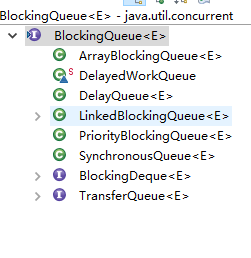

# 并发容器
JDK提供的这些容器大部分在java.uil.concurrent包中
ConcurrentHashMap:线程安全的HashMap
CopyOnWriteArrayList：线程安全的List，在读多写少的场合性能非常好，远远好于Vector
ConcurrentLinkedQueue：高效的并发队列，使用链表实现。可以看做一个线程安全的LinkedList，这是一个非阻塞的队列。
BlockingQueue：这是一个接口，JDK内部通过链表、数组等方式实现了这个接口。表示阻塞队列，非常适合用于作为数据共享的通道。
ConcurrentSkipListMap：跳表的实现。这是一个Map，使用跳表的数据结构进行快速查找。

## ConcurrentHashMap
HashMap不是线程安全的
可以使用Collections.synchronizedMap()方法来包装我们的HashMap，但这是一个全局锁，引起性能的问题。
在ConcurrentHashMap中不管读写都可以保证很高的性能。在读操作时几乎不需要加锁，在写操作时通过锁分段技术只对所操作的的段加锁。

底层数据结构： 
              
    JDK1.7的 ConcurrentHashMap 底层采用 分段的数组+链表 实现，
    JDK1.8 采用的数据结构跟HashMap1.8的结构一样，数组+链表/红黑二叉树。
    Hashtable 和 JDK1.8 之前的 HashMap 的底层数据结构类似都是采用 数组+链表 的形式，数组是 HashMap 的主体，链表则是主要为了解决哈希冲突而存在的；

实现线程安全的方式：

    在JDK1.7的时候，ConcurrentHashMap（分段锁） 对整个桶数组进行了分割分段(Segment)，每一把锁只锁容器其中一部分数据，多线程访问容器里不同数据段的数据，就不会存在锁竞争，提高并发访问率。
    到了 JDK1.8 的时候已经摒弃了Segment的概念，而是直接用 Node 数组+链表+红黑树的数据结构来实现，并发控制使用 synchronized 和 CAS 来操作。（JDK1.6以后 对 synchronized锁做了很多优化）。synchronized只锁定当前链表或红黑二叉树的首节点，这样只要hash不冲突，就不会产生并发，效率又提升N倍。
    Hashtable(同一把锁) :使用 synchronized 来保证线程安全，效率非常低下
    分段锁，synchronized锁，和整个锁

## CopyOnWriteArrayList

    public class CopyOnWriteArrayList<E> extends Object implements List<E>,RandomAccess,Cloneable,Serializable

读操作不会修改，且应用场景较多，对读操作进行加锁是一种资源浪费。
读写锁的思想，读读共享，写写互斥，读写互斥，写读互斥。jdk中提供的CopyOnWriteArrayList相比于读写锁更进一步。读取完全不加锁，写入不阻塞读取，只有写入和写入之间需要进行同步等待。

CopyOnWriteArrayList的可变操作通过底层数据复制成新副本。操作之后对原数据的替换来实现的。这样就可以保证读写操作不影响了。
从名字可以看出来，满足CopyOnWrite的ArrayList.如果你想要对一块内存进行修改时，我们不在原有内存块中进行写操作，而是将内存拷贝一份，在新的内存中进行写操作，写完之后呢，就将指向原来内存指针指向新的内存，原来的内存就可以被回收掉了。

### CopyOnWriteArrayList读取操作的实现
读取操作没有任何同步控制和锁操作，内部array不会发生修改，只会被另外一个array替换

    private transient volatile Object[] array;
    public E get(int index){
        return get(getArray(),index);
    }
    public E get(Object[] a,int index){
        return (E) a[index];
    }
    final Object[] getArray(){
        return array;
    }

### CopyOnWriteArrayList写入操作的实现
add()方法在添加集合的时候加了锁，保证了同步，避免了多线程写的时候copy出多个副本来

    public boolean add(E e){
        final ReentrantLock lock = this.lock;
        lock.lock();
        try{
            Object[] elements = getArray();
            int len = elements.length;
            Object[] newElements = Arrays.copyOf(elements,len+1);
            newElements[len] = e;
            setArray(newElements);
            return true;
        }finally{
            lock.unlock();
        }
    }

## ConcurrentLinkedQueue
java提供了安全的Queue可以分为阻塞和非阻塞队列，典型的阻塞队列是BlockingQueue，非阻塞是ConcurrentBlockedQueue。阻塞队列可以通过加锁实现，非阻塞队列可以通过CAS操作进行实现。
名字可以看出，ConcurrentLinkedQueue这个队列使用链表作为其数据结构．ConcurrentLinkedQueue 应该算是在高并发环境中性能最好的队列了。它之所有能有很好的性能，是因为其内部复杂的实现

## BlockingQueue
阻塞队列被广泛的使用在生产者-消费者问题中，其原因是BlockingQueue提供了可阻塞的插入和移除方法，当队列已满，生产者线程会被阻塞，直到队列未满；当队列容器为空，消费者线程会被阻塞，直到队列非空。

BlockingQueue 是一个接口，继承自 Queue，所以其实现类也可以作为 Queue 的实现来使用，而 Queue 又继承自 Collection 接口。下面是 BlockingQueue 的相关实现类：

### ArrayBlockingQueue
ArrayBlockingQueue是BlockingQueue接口的有界队列实现类，底层采用**数组**实现。ArrayBlockingQueue一旦创建，容量不再改变。其并发控制采用可重入锁来控制。不管是读取还是插入都需要获取到锁才能进行。当队列容量满的时候，尝试将元素放入队列导致操作阻塞，尝试从一个空队列中取出一个元素也会导致阻塞。
ArrayBlockingQueue 默认情况下不能保证线程访问队列的公平性。如果保证公平性，通常会降低吞吐量。如果需要获得公平性的 ArrayBlockingQueue，可采用如下代码：

    private static ArrayBlockingQueue<Integer> blockingQueue = new ArrayBlockingQueue<Integer>(10,true);

### LinkedBlokingQueue
LinkedBlockingQueue底层是基于单项链表实现的阻塞队列，可以当做误解队列也可以当做有界队列来使用，满足FIFO特性，与ArrayBlockingQueue相比起来具有更高的吞吐量，为了防止LinkedBlockingQueue容量迅速增加，通常在创建LinkedBlockingQueue对象时，会指定其大小，如果未指定，容量相等于Integer.MAX_VALUE

    //无界
    public LinkedBlockingQueue(){
        this(Integer.MAX_VALUE);
    }
    //有界
    public LinkedBlockingQueue(int capacity){
        if(capacity <= 0) throe new IllegalArgumentException();
        this.capacity = capacity;
        last = head = new Node<E>(null);
    }

### PriorityBlockingQueue
支持优先级的无界阻塞队列。默认情况下元素采用自然顺序进行排序，也可以按照自定义类实现compareTo方法来指定元素排序规则。
PriorityBlockingQueue 并发控制采用的是 ReentrantLock，队列为无界队列（ArrayBlockingQueue 是有界队列，LinkedBlockingQueue 也可以通过在构造函数中传入 capacity 指定队列最大的容量，但是 PriorityBlockingQueue 只能指定初始的队列大小，后面插入元素的时候，如果空间不够的话会自动扩容）

## ConcurrentSkipListMap 
理解跳表。