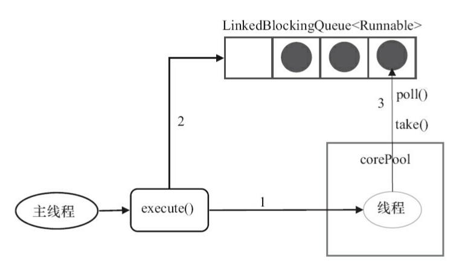
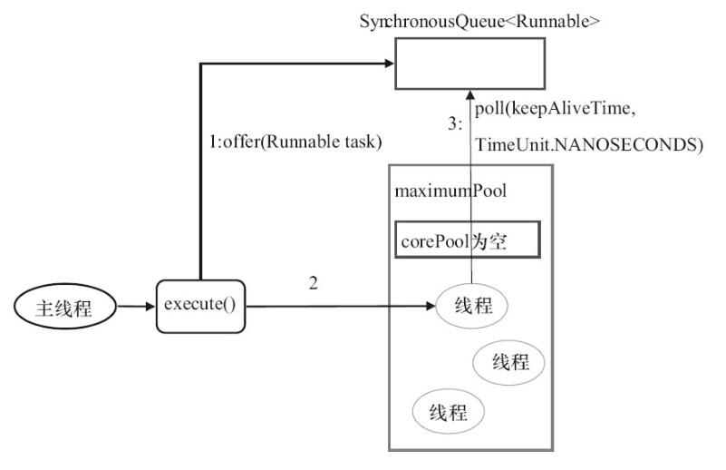

# 线程池
## 使用线程池的好处
赤化技术的常用就是线程池，数据库连接池以及http连接池等等，其主要思想就是减少每次获取资源的消耗，提高对资源的利用率。
使用线程池的好处：
1. 降低资源的消耗。通过重复利用已创建的线程降低线程创建和销毁造成的消耗
2. 提高响应速度。当任务到达时，任务可以不需要等到线程创建就可以立即执行
3. 提高线程的可管理性。线程是稀缺资源，如果无限制的创建，不仅会消耗系统资源，还会降低系统的稳定性。

## Executor框架
通过Exector来启东线程比使用Thread的start方法更好，易于管理，效率更好。关键一点优租寓避免this逃逸问题。
this逃逸问题：在构造函数返回之前其他线程就持有对象的引用，调用尚未构造完全的对象的方法可能引发令人疑惑的问题。

### Executor框架结构
1. 任务（Runnable/Callable）
执行任务需要实现的Runnable接口或Callable接口。Runnable接口或Callable接口实现类都可以被ThreadPoolExecutor或者ScheduledThreadPoolExecutor执行。

2. 任务的执行（Executor）
如下图所示，包括任务执行机制的核心接口 Executor ，以及继承自 Executor 接口的 ExecutorService 接口。ThreadPoolExecutor 和 ScheduledThreadPoolExecutor 这两个关键类实现了 ExecutorService 接口。

实际上我们需要更多关注的是 ThreadPoolExecutor 这个类.
ThreadPoolExecutor类描述：

    public classThreadPoolExecutor extends AbstractExecutorService
    //继承了AbstractExecutorService类

ScheduledThreadPoolExecutor类描述：

    public class ScheduledThreadPoolExecutor
         extends ThreadPoolExecutor
         implements ScheduledExecutorService

3. 异步计算的结果（Future）
Future 接口以及 Future 接口的实现类 FutureTask 类都可以代表异步计算的结果。

当我们把 Runnable接口 或 Callable 接口 的实现类提交给 ThreadPoolExecutor 或 ScheduledThreadPoolExecutor 执行。（调用 submit() 方法时会返回一个 FutureTask 对象）

### 框架使用示意图

1. 主线程首先创建实现Runnable或者Callable接口的任务对象
2. 把创建完成的Runnable或者Callable接口提交给ExecutorService进行执行：
ExecutorService.execute 或者也可以把Runnable对象或者Callable对象提交给ExecutorService执行ExecutorService.submit。
3. 如果执行ExecutorService.submit(),ExecutorService将会返回一个实现Future接口的对象。我们刚刚也提到过了执行 execute()方法和 submit()方法的区别，submit()会返回一个 FutureTask 对象）。由于 FutureTask 实现了 Runnable，我们也可以创建 FutureTask，然后直接交给 ExecutorService 执行。
4. 最后主线程可以执行FutureTask.get()方法来等待任务执行完成。主线程可以通过FutureTask.cancel来取消此任务的执行。

## ThreadPoolExecutor类的简单实现

### 类分析
构造方法：

    public ThreadPoolExecutor(int corePoolSize,//线程池的核心线程数量
                              int maximumPoolSize,//线程池的最大线程数
                              long keepAliveTime,//当线程数大于核心线程数时，多余的空闲线程存活的最长时间
                              TimeUnit unit,//时间单位
                              BlockingQueue<Runnable> workQueue,//任务队列，用来储存等待执行任务的队列
                              ThreadFactory threadFactory,//线程工厂，用来创建线程，一般默认即可
                              RejectedExecutionHandler handler//拒绝策略，当提交的任务过多而不能及时处理时，我们可以定制策略来处理任务
                               ) {
        if (corePoolSize < 0 ||
            maximumPoolSize <= 0 ||
            maximumPoolSize < corePoolSize ||
            keepAliveTime < 0) 
            //核心线程小于零，最大线程小于等于0，最大线程小于核心线程，线程数量大于核心线程数，对于线程存活时间小于0，这些情况都会抛出错误
            throw new IllegalArgumentException();
        if (workQueue == null || threadFactory == null || handler == null)
            throw new NullPointerException();
        this.corePoolSize = corePoolSize;
        this.maximumPoolSize = maximumPoolSize;
        this.workQueue = workQueue;
        this.keepAliveTime = unit.toNanos(keepAliveTime);
        this.threadFactory = threadFactory;
        this.handler = handler;
    }

参数（最重要三个）
corePoolSize：核心线程数定义了最小可以同时运行的线程数量
maximunPoolSize：当队列中存放的任务达到队列容量的时候，当前可以同时运行的线程数量变为最大的线程数。
workQueue：新任务请求，判断当前运行的线程数量是否达到核心线程数，如果达到的话，新任务就会存放到队列中。

（其他常见参数）
keepAliveTime:当线程池中的线程数量大于corePoolSize 的时候，如果这时没有新的任务提交，核心线程外的线程不会立即销毁，而是会等待，直到等待的时间超过了 keepAliveTime才会被回收销毁；
unit : keepAliveTime 参数的时间单位。
threadFactory :executor 创建新线程的时候会用到。
handler :饱和策略。关于饱和策略下面单独介绍一下。

饱和策略定义：
ThreadPoolExecutor.AbortPolicy:抛出RejectedExecutionException来拒绝新任务的处理
ThreadPoolExecutor.CallerRunsPolicy:调用执行自己的线程运行任务。但是这种策略会降低对于新任务提交速度，影响程序的整体性能。另外，这个策略喜欢增加队列容量。如果您的应用程序可以承受此延迟并且你不能任务丢弃任何一个任务请求的话，你可以选择这个策略。
ThreadPoolExecutor.DiscardPolicy： 不处理新任务，直接丢弃掉。
ThreadPoolExecutor.DiscardOldestPolicy： 此策略将丢弃最早的未处理的任务请求。

## 推荐使用ThreadPoolExecutor构造函数创建线程池
阿里巴巴，并发处理，明确指出线程资源必须通过线程池提供，不允许在应用中自行显示创建线程
好处是，减少在创建和销毁线程上所消耗的时间以及系统资源的开销，解决资源不足的问题。

在阿里巴巴java开发手册中强制线程池不允许使用Executors去创建，而是通过ThreadPoolExecutor构造函数的方式这样的处理方式让写的同学更加明确线程池的运行规则，避免资源耗尽的风险

Executors返回线程池的弊端：
FixedThreadPool和SingleThreadExecutor：允许请求的队列长度为Integer.MAX_VALUE，可能堆积大量的请求，从而导致OOM
CachedThreadPool和ScheduledThreadPool：允许创建的线程数量为Integer.MAX_VALUE,可能会创建大量线程，从而导致OOM

方式一：推荐ThreadPoolExecutor构造函数实现（推荐）

方式二：通过Executor框架的工具类Executors来实现，可以创建三种类型的ThreadPoolExecutor

    FixedThreadPool
    SingleThreadPool
    CachedThreadPool

## （重要）ThreadPoolExecutor使用示例
### 示例代码 Runnable+ThreadPoolExecutor
首先创建一个Runnable接口的实现类：

    class MyRunnable implements Runnable{
        private String command;

        public MyRunnable(String s){
            command = s;
        }

        @Override
        public void run() {
            System.out.println(Thread.currentThread().getName() + "start Time: " + new Date());
            processCommand();
            System.out.println(Thread.currentThread().getName() + "end Time: " + new Date());
        }

        private void processCommand() {
            try{
                Thread.sleep(5000);
            }catch (InterruptedException e) {
                e.printStackTrace();
            }
        }

        public String toString() {
            return this.command;
        }
    }

    public class ThreadPoolExecutorDemo {
        //corePoolSize核心线程数5
        private static final int CORE_POOL_SIZE = 5;
    //    maximumPoolSize最大线程数为10
        private static final int MAX_POOL_SIZE = 10;
    //    workQueue：任务队列为 ArrayBlockingQueue，并且容量为 100;
        private static final int QUEUE_CAPACITY = 100;
    //    keepAliveTime : 等待时间为 1L。
        private static final Long KEEP_ALIVE_TIME = 1L;
        public static void main(String[] args){
            ThreadPoolExecutor executor = new ThreadPoolExecutor(CORE_POOL_SIZE,MAX_POOL_SIZE,KEEP_ALIVE_TIME, TimeUnit.SECONDS,new ArrayBlockingQueue<>(QUEUE_CAPACITY),new ThreadPoolExecutor.CallerRunsPolicy());

            for(int i = 0; i < 12; i++){
                //创建WorkerThread对象
                Runnable worker = new MyRunnable("" + i);
                executor.execute(worker);
            }
            //终止线程池
            executor.shutdown();
            while(!executor.isTerminated()){

            }
            System.out.println("Finished all threads");
        }
    }
线程池每次会同时执行5个任务，这5个任务执行完之后，剩余的5个任务才开始执行。

搞懂线程池原理，首先分析一下executor方法
上述中使用executor.execute(worker)来提交一个任务到线程池中去。

    // 存放线程池的运行状态 (runState) 和线程池内有效线程的数量 (workerCount)
    private final AtomicInteger ctl = new AtomicInteger(ctlOf(RUNNING,0));

    private static int workerCountOf(int c){
        return c & CAPACITY;
    }

    private final BlockingQueue<Runable> workQueue;

    public void execute(Runnable command) {
        // 如果任务为null，则抛出异常。
        if (command == null)
            throw new NullPointerException();
        // ctl 中保存的线程池当前的一些状态信息
        int c = ctl.get();

        //  下面会涉及到 3 步 操作
        // 1.首先判断当前线程池中之行的任务数量是否小于 corePoolSize
        // 如果小于的话，通过addWorker(command, true)新建一个线程，并将任务(command)添加到该线程中；然后，启动该线程从而执行任务。
        if(wokerCounOf(c) < corePoolSize) {
            if(addWoker(command,true))
                return;
            c = ctl.get();
        }
        // 2.如果当前之行的任务数量大于等于 corePoolSize 的时候就会走到这里
        // 通过 isRunning 方法判断线程池状态，线程池处于 RUNNING 状态才会被并且队列可以加入任务，该任务才会被加入进去
        if(isRunning(c) && workQueue.offer(command)) {
            int recheck = ctl.get();
            //再次获取线程池状态，如果线程池不是RUNNING状态就需要从任务队列中移除任务，并尝试线程是否全部执行完毕，同时执行拒绝策略
            if(!isRunning(recheck) && Remove(command))
                reject(command);
            else if (workerCountOf(recheck)==0)
                addWorker(null,false);
        }
        //3. 通过addWorker(command, false)新建一个线程，并将任务(command)添加到该线程中；然后，启动该线程从而执行任务。
        //如果addWorker(command, false)执行失败，则通过reject()执行相应的拒绝策略的内容。
        else if(!addWoker(command,false))
            reject(command);

    }

### 几个常见的对比

####  Runnable和Callable
Runnable 接口不会返回结果或抛出检查异常，但是Callable 接口可以。所以，如果任务不需要返回结果或抛出异常推荐使用 Runnable 接口，这样代码看起来会更加简洁。
Executors可以实现Runnable对象和Callable对象之间的相互转换。
Runnable.java

    public interface Runnable {
        public abstract void run();
    }

Callable.java

    public interface Callable<V> {
        V call() throws Exception;
    }

#### shutdown()VSshutdownNow()
shutdown():关闭线程池，线程池的状态变为SHUTDOWN，线程池不再接受新的任务，但是队列中的任务得执行完毕
shutdownNow():关闭线程池，线程的状态变为STOP。线程池会终止当前正在运行的任务，并处理排队的任务并返回正在等待执行的List。

#### isTerminated() VS isShutdown()
isShutDown() 当调用shutdown() 方法后返回为true
isTerminated() 当调用shutdown()方法后，并且所有提交的任务完成后返回为true

#### Callable示例代码

    class MyCallable implements Callable {
        @Override
        public String call() throws Exception {
            Thread.sleep(1000);
            return Thread.currentThread().getName();
        }
    }

    public class CallableDome {
        private static final int CORE_POOL_SIZE = 5;
        private static final int MAX_POOL_SIZE = 10;
        private static final int QUEUE_CAPACITY = 100;
        private static final Long KEEP_ALIVE_TIME = 1L;

        public static void main(String[] args){
            ThreadPoolExecutor executor = new ThreadPoolExecutor(CORE_POOL_SIZE,MAX_POOL_SIZE,KEEP_ALIVE_TIME, TimeUnit.SECONDS,new ArrayBlockingQueue<>(QUEUE_CAPACITY),new ThreadPoolExecutor.CallerRunsPolicy());
            List<Future<String>> futureList = new ArrayList<>();
            Callable<String> callable = new MyCallable();
            for(int i = 0; i < 10; i++){
                Future<String> future = executor.submit(callable);
                futureList.add(future);
            }
            for (Future<String> fut : futureList) {
                try {
                    System.out.println(new Date() + "::" + fut.get());
                }catch (InterruptedException | ExecutionException e){
                    e.printStackTrace();
                }
            }
        }
    }

## 几种常见的线程池详解
### FixedThreadPool
FixedThreadPool被称为固定数量线程数线程池。源代码为：

    public static ExecutorService newFixedThreadPool(int nThreads, ThreadFactory threadFactory) {
        return new ThreadPoolExecutor(nThreads, nThreads,
                                     0L, TimeUnit.MILLISECONDS,
                                     new LinkedBlockingQueue<Runnable>(),
                                     threadFactory);
    }

还有两一个实现方法

    public static ExecutorService newFixedThreadPool(int nThreads) {
        return new ThreadPoolExecutor(nThreads, nThreads,
                                      0L, TimeUnit.MILLISECONDS,
                                      new LinkedBlockingQueue<Runnable>());
    }
FixedThreadPool的corePoolSize()和maximunPoolSize()都被设置为nThread，此参数由我们自己设置

1. 首先如果当前运行线程池线程数量小于corePoolSize，再来新任务直接创建新的线程
2. 当前任务等于corePoolSize，再来新任务的话，将任务加入到LinkedBlockingQueue;
3. 线程池的线程执行完手头的任务后，会循环反复从LinkedBlockingQueue中获取任务来执行。

### 为啥子不推荐使用FixedThreadPool
使用无界队列LinkedBlockingQueue，队列容量是Intger.MAX_VALUE作为线程池有以下影响：
1. 当线程池中的线程数达到 corePoolSize 后，新任务将在无界队列中等待，因此线程池中的线程数不会超过 corePoolSize；
2. 由于使用无界队列时 maximumPoolSize 将是一个无效参数，因为不可能存在任务队列满的情况。所以，通过创建 FixedThreadPool的源码可以看出创建的 FixedThreadPool 的 corePoolSize 和 maximumPoolSize 被设置为同一个值。
3. 由于 1 和 2，使用无界队列时 keepAliveTime 将是一个无效参数；
4. 运行中的 FixedThreadPool（未执行 shutdown()或 shutdownNow()）不会拒绝任务，在任务比较多的时候会导致 OOM（内存溢出）。

### SingleThreadExecutor
只有一个线程的线程池

    public static ExecutorService newSingleThreadExecutor(ThreadFactory threadFactory) {
        return new FinalizableDelegatedExecutorService
            (new ThreadPoolExecutor(1, 1,           //根上面的corepoolsize唯一区别
                                    0L, TimeUnit.MILLISECONDS,
                                    new LinkedBlockingQueue<Runnable>(),
                                    threadFactory));
    }
    或者
    public static ExecutorService newSingleThreadExecutor() {
        return new FinalizableDelegatedExecutorService
            (new ThreadPoolExecutor(1, 1,
                                    0L, TimeUnit.MILLISECONDS,
                                    new LinkedBlockingQueue<Runnable>()));
    }

上图说明：
同上，只是corePoolSize数量变为了1

不推荐SingleThreadPool的愿意也同上

### CachedThreadPool
CachedThreadPool 是一个会根据需要创建新线程的线程池

     public static ExecutorService newCachedThreadPool(ThreadFactory threadFactory) {
        return new ThreadPoolExecutor(0, Integer.MAX_VALUE,
                                      60L, TimeUnit.SECONDS,
                                      new SynchronousQueue<Runnable>(),
                                      threadFactory);
    }
    或者
    public static ExecutorService newCachedThreadPool() {
        return new ThreadPoolExecutor(0, Integer.MAX_VALUE,
                                      60L, TimeUnit.SECONDS,
                                      new SynchronousQueue<Runnable>());
    }

CachedThreadPool 的corePoolSize 被设置为空（0），maximumPoolSize被设置为 Integer.MAX.VALUE，即它是无界的，这也就意味着如果主线程提交任务的速度高于 maximumPool 中线程处理任务的速度时，CachedThreadPool 会不断创建新的线程。极端情况下，这样会导致耗尽 cpu 和内存资源。

说明：
1. 首先执行SynchronousQueue.offer(Runnable task)提交任务到队列，如果当前maximumPool中有闲线程正在执行SynchronousQueue.poll(keepAliveTime,TimeUnit.NANOSECONDS),那么主线程执行 offer 操作与空闲线程执行的 poll 操作配对成功，主线程把任务交给空闲线程执行，execute()方法执行完成，否则执行下面的步骤 2；
2. 当初始 maximumPool 为空，或者 maximumPool 中没有空闲线程时，将没有线程执行 SynchronousQueue.poll(keepAliveTime,TimeUnit.NANOSECONDS)。这种情况下，步骤 1 将失败，此时 CachedThreadPool 会创建新线程执行任务，execute 方法执行完成；

不推荐CachedThreadPool原因，
CachedThreadPool允许创建的线程数量为 Integer.MAX_VALUE ，可能会创建大量线程，从而导致 OOM

## 如何选择线程池大小
**CPU密集型（大量的上下文切换，N+1）**，这种任务主要是CPU资源，将线程数可以设置为N（CPU核心数）+1. 比 CPU 核心数多出来的一个线程是为了防止线程偶发的缺页中断，或者其它原因导致的任务暂停而带来的影响。一旦任务暂停，CPU 就会处于空闲状态，而在这种情况下多出来的一个线程就可以充分利用 CPU 的空闲时间
**I/O密集型任务（2N）** ，这种任务应用起来，系统会用大部分的时间来处理 I/O 交互，而线程在处理 I/O 的时间段内不会占用 CPU 来处理，这时就可以将 CPU 交出给其它线程使用。因此在 I/O 密集型任务的应用中，我们可以多配置一些线程，具体的计算方法是 2N