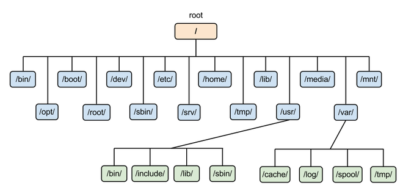
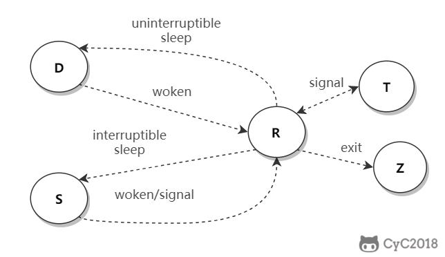

# 常用操作及概念
**man** 是 manual 的缩写，将指令的具体信息显示出来。当执行 man date 时，有 DATE(1) 出现，其中的数字代表指令的类型，常用的数字及其类型如下：
1	用户在 shell 环境中可以操作的指令或者可执行文件
5	配置文件
8	系统管理员可以使用的管理指令

**info** info与man类似但是info将文档分成一个个页面，每个页面可以跳转
**doc** /usr/share/doc存放着软件的一整套说明文件

# 关机
**who**，在关机之前使用who看看是否有其他用户在线
**sync**，为了加快对磁盘文件的读写速度，位于内存的文件数据不会立即同步到磁盘上，因此关机之前需要先进行sync同步操作；
**shutdown** 
**PATH**：在环境变量PATH中声明可执行文件的路径。
**sudo**

## 包管理工具
RPM和DPKG为常见的两类软件包管理工具；

## VIM三个模式
一般指令模式（Command mode）：VIM 的默认模式，可以用于移动游标查看内容； 查看
编辑模式（Insert mode）：按下 "i" 等按键之后进入，可以对文本进行编辑；   编辑
指令列模式（Bottom-line mode）：按下 ":" 按键之后进入，用于保存退出等操作。 指令

# Linux文件系统

## 组成
最主要的组成部分如下：
inode：一个文件占用一个inode，记录文件的属性，同时记录此文件内容所在的block编号；
block：记录文件的内容，文件太大时，会占用多个block；

## 文件读取
对于Ex2文件系统，当要读取一个文件的内容时候，先要在inode中查找文件内容所在的block，然后把所有block的内容读出来；像数组有索引
FAT文件系统，没有inode，每个block中存储着下一个block的编号；像链表有指针

**磁盘碎片**：文件内容所在的block过于分散，导致磁盘头移动距离过大，降低磁盘读写性能；

**block** ：在 Ext2 文件系统中所支持的 block 大小有 1K，2K 及 4K 三种，不同的大小限制了单个文件和文件系统的最大大小。

|大小	|1KB	|2KB	|4KB	|
|-|-|-|-|
|最大单一文件	|16GB	|256GB	|2TB    |
|最大文件系统	|2TB	|8TB	|16TB   |

**inode**:
具体包括以下信息：
权限，
拥有者和群组，
容量，
建立或状态改变的时间 (ctime)；
最近读取时间 (atime)；
最近修改时间 (mtime)；
定义文件特性的旗标 (flag)，如 SetUID...；
该文件真正内容的指向 (pointer)。

inode特点：每个inode大小128B，每个文件仅会占用一个inode。

## 目录
建立一个目录时，会分配一个inode和至少一个block。block记录的内容是目录下所有的inode和文件名；
可以看到文件的inode本身不记录文件名，文件名记录在目录中，因此新增，删除文件，更改文件名这些操作和目录的写权限有关。

## 挂载
挂载利用目录作为文件系统的进入点，也就是说，进入目录之后可以读取文件系统的数据；

## 目录配置
为了使不同Linux发行版本的目录结构保持一致，FHS规定了Linux的目录结构，最基础的三个目录是
/root：根目录
/usr：所有系统默认软件都会安装在这个目录；
/var：存放系统或程序运行过程中的数据文件。

## 文件
### 文件属性
用户分为三种：文件拥有者、群组以及其他人，对不同用户有不同的文件权限；
使用ls查看一个文件时，会显示一个文件的信息，例如drwxr-xr-x 3 root root 17 May 6 00:14 .config

drwxr-xr-x：文件类型以及权限，第 1 位为文件类型字段，后 9 位为文件权限字段
3：连接数
root：文件拥有者
root：所属群组
17：文件大小
May 6 00:14: 文件最后被修改的日期
.config：文件名
常见的文件类型及其含义有：
d：目录
-：文件
l：链接文件

9位文件权限，每三个一组，共三组，分布代表文件拥有者，所属群组，其他人的文件权限。一组权限中的3位分别是rwx权限，可读可写可执行；

## 文件基本操作
ls ：列出文件或目录信息，目录信息就是包括其中的文件 -a -d -l
cd : 更换当前目录
mkdir： 创建目录 -m 配置目录权限，-p递归创建目录
rmdir： 删除目录，目录必须为空
touch： 更新文件时间或者建立新文件
    touch [] filename: -a:更新atime，-c更新ctime 若改文件不存在则不建立新文件
                       -m：更新mtime
cp： 复制文件。如果源文件有两个以上，则目的文件一定要是目录才行；
rm： 删除文件
mv： 移动文件

## 修改权限
可以将一组权限用数字来表示此事权限的3个各位当做二进制的数字的位，从左到右权限对应的数字权值位r:4、w:2、x:1。
chmod [-R] xyz dirname/filename

将.bashrc文件的权限修改为-rwxr-xr-
chmod 754 .bashrc

## 默认权限
文件默认的权限是：没有可执行权限，因此也是666，-rw-rw-rw-；
目录权限：目录必须进入。也就是可以拥有可执行权限，因此777，也就是drwxrwxrwx。

## 目录权限
文件名不是存储在一个文件的内容中，而是存储在一个文件所在的目录中。因此，**拥有文件的 w 权限并不能对文件名进行修改**。

目录存储文件列表，一个目录的权限也就是对其文件列表的权限。因此，目录的 r 权限表示可以读取文件列表；w 权限表示可以修改文件列表，具体来说，就是添加删除文件，对文件名进行修改；x 权限可以让该目录成为工作目录，x 权限是 r 和 w 权限的基础，如果不能使一个目录成为工作目录，也就没办法读取文件列表以及对文件列表进行修改了。（只要能打开的目录就具有x权限）

## 获取文件内容
cat: 取得文件内容 -n 打印出行号， -b不会
tac：cat反向操作，从最后一行开始打印；
more：cat不同的是它可以一页一页的查看文件内容，比较适合大文件的查看
less：和more类似，但是多了一个向前翻页的功能；
head：取得文件前几行
tail：head反向操作，文件后几行
od： 以字符或者十六进制的形式显示二进制文件

## 指令与文件搜索
which： 指令搜索
whereis： 文件搜索，速度很快whereis 【】 dirname/filename
locate： 文件搜索，可以用关键字和正则表达式来进行搜索
find：文件搜索，可以用文件属性和权限进行搜索

## 压缩与打包
## 压缩命令
gzip：使用最广的压缩命令。经过gzip压缩之后源文件就不存在了，有9个压缩等级可以使用；
    -c ： 将压缩的数据输出到屏幕上
    -d ： 解压缩
    -t ： 检验压缩文件是否有错
    -v ： 显示压缩比

bzip2： 比gzip更高的压缩比
xz： 比bzip2还高的压缩比

## 打包
压缩指令只能对一个文件进行压缩，而打包能够将多个文件打包成一个大文件。tar 不仅可以用于打包，也可以使用 gzip、bzip2、xz 将打包文件进行压缩。

    $ tar [-z|-j|-J] [cv] [-f 新建的 tar 文件] filename...  ==打包压缩
    $ tar [-z|-j|-J] [tv] [-f 已有的 tar 文件]              ==查看
    $ tar [-z|-j|-J] [xv] [-f 已有的 tar 文件] [-C 目录]    ==解压缩
    -z ：使用 zip；
    -j ：使用 bzip2；
    -J ：使用 xz；
    -c ：新建打包文件；
    -t ：查看打包文件里面有哪些文件；
    -x ：解打包或解压缩的功能；
    -v ：在压缩/解压缩的过程中，显示正在处理的文件名；
    -f : filename：要处理的文件；
    -C 目录 ： 在特定目录解压缩

## Bash
可以通过shell请求内核提供服务，Bash正是Shell的一种；
特点：
命令历史，记录使用过的命令；
命令与文件补全：快捷键tab
命名别名：例如lm是la -al的别名
shell scripts
通配符：例如ls -l /usr/bin/X*列出/usr/bin 下面所有以X开头的文件

## 变量操作
对应变量赋值可以直接使用=
对变量进行取用需要在变量钱加上$ 也可以使用${}的形式；
输出变量使用echo命令；

变量内容如果有空格，必须使用双引号或者单引号。
双引号内的特殊字符可以保留原本特性，例如 `x="lang is $LANG"`，则 x 的值为 `lang is zh_TW . UTF-8；`
单引号内的特殊字符就是特殊字符本身，例如 `x='lang is $ LANG'`，则 x 的值为 `lang is $LANG`。
(双引号中间的变量存在替换的情况，单引号就是纯特殊字符)

**指令搜索顺序**
以绝对或者相对路径来执行指令
用别名找到该指令来执行
用bash内置的指令来执行
按$PATH变量指定的搜索路径的顺序找到第一个执行来执行

**数据流重定向**
重定向指的是使用文件代替标准输入、标准输出和标准错误输出。
有一个箭头的表示以覆盖的方式重定向，而有两个箭头的表示以追加的方式重定向。

|1	|代码	|运算符|
|-|-|-|
|标准输入 (stdin)	|0	|< 或 <<|
|标准输出 (stdout)	|1	|> 或 >>|
|标准错误输出 (stderr)	|2	|2> 或 2>>|

如果需要将标准输出以及标准错误输出同时重定向到一个文件，需要将某个输出转换为另一个输出，例如2>$1表示将标准错误输出转换为标准输出；

## 提取指令
cut对数据进行切分，去除想要的部分；
切分过程一行一行的进行
$ cut
-d:分隔符
-f:经过-d分隔后，使用-f n 取出第n个区间
-c：以字符为单位取出区间

## 排序指令
sort用于指令

    $ sort [-fbMnrtuk] [file or stdin]
    -f ：忽略大小写
    -b ：忽略最前面的空格
    -M ：以月份的名字来排序，例如 JAN，DEC
    -n ：使用数字
    -r ：反向排序
    -u ：相当于 unique，重复的内容只出现一次
    -t ：分隔符，默认为 tab
    -k ：指定排序的区间

## 双向输出重定向
输出重定向会将输出内容重定向到文件中，而tee不仅能够完成这个功能，还能保留屏幕上的输出。也就是说使用tee指令，一个输出会同时传送到文件和屏幕上；

## 字符转换指令
tr 用来删除一行中的字符，或者对字符进行替换。

## 分区指令
split 将一个文件划分成多个文件。

## 正则表达式
grep： 使用正则表示式进行全局查找并打印。

## 进程管理
查看进程
ps ： ps -l 查看自己的进程
      ps aux查看系统所有进程
      ps aux | grep threadx 查看特定的进程

pstree 查看进程树
    pstree -A
top：实时显示进程信息
    top -d 2
netstat：查看占用端口的进程
    netstat -anp | grep port

## 进程状态

|状态 | 说明|
|-|-|
|R | 正在执行或者可以执行，此时进程正位于执行队列中|
|D | 不可中断阻塞，通常为IO阻塞 |
|S | 可中断阻塞，此时进程正在等待某个事件完成 |
|Z | 僵死，进程已经终止但是不可被其父进程获取信息 |
|T | 结束，进程既可以被作业控制信号结束，也可能是正在被追踪 |

**SIGCHID**
当一个子进程改变了他的状态时，停止运行，继续运行或者退出，有两件事会发生在父进程中：

得到SIGCHILD信号
waitpid()或者wait()调用会返回

其中子进程发送的 SIGCHLD 信号包含了子进程的信息，比如进程 ID、进程状态、进程使用 CPU 的时间等。

在子进程退出时，它的进程描述符不会立即释放，这是为了让父进程得到子进程信息，父进程通过 wait() 和 waitpid() 来获得一个已经退出的子进程的信息。

**wait()**
pid_t wait(int *status)

父进程调用wait()会一直阻塞，直到收到一个子进程退出的SIGCHILD信号，之后wait()函数会销毁子进程并返回；

如果成功，返回被收集的子进程的进程ID；如果调用进程没有子进程，调用就会失败，此时返回 -1，同时 errno 被置为 ECHILD。

参数 status 用来保存被收集的子进程退出时的一些状态，如果对这个子进程是如何死掉的毫不在意，只想把这个子进程消灭掉，可以设置这个参数为 NULL。

**waitpid()**
pid_t waitpid(pid_t pid, int *status, int options)

作用和 wait() 完全相同，但是多了两个可由用户控制的参数 pid 和 options。

pid 参数指示一个子进程的 ID，表示只关心这个子进程退出的 SIGCHLD 信号。如果 pid=-1 时，那么和 wait() 作用相同，都是关心所有子进程退出的 SIGCHLD 信号。

options 参数主要有 WNOHANG 和 WUNTRACED 两个选项，WNOHANG 可以使 waitpid() 调用变成非阻塞的，也就是说它会立即返回，父进程可以继续执行其它任务。

## 孤儿进程
父进程退出，而他的一个或者多个子进程还在进行，那么这些子进程将会成为孤儿进程

孤儿进程将被init进程，进程号为1的所收养，并由init进程对他们完成状态收集工作。

由于孤儿进程将被init进程收养，所有孤儿进程不会对系统造成危害

## 僵尸进程
一个子进程的进程描述符在子进程退出时不会释放，只有当父进程通过 wait() 或 waitpid() 获取了子进程信息后才会释放。如果子进程退出，而父进程并没有调用 wait() 或 waitpid()，那么子进程的进程描述符仍然保存在系统中，这种进程称之为僵尸进程。

僵尸进程通过ps命令显示出来的状态时Z；

