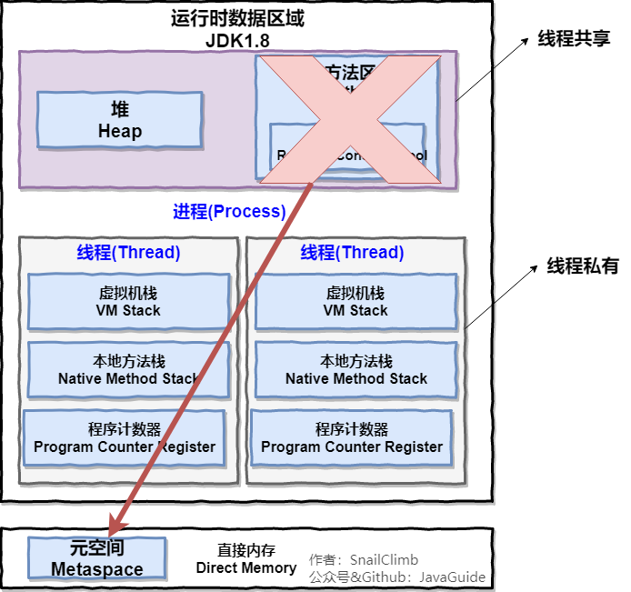

# 操作系统基础
## 1. 什么是操作系统
四点：
1. 操作系统是管理计算机硬软件资源的程序，是计算机系统的内核和基石；
2. 操作系统本质上是运行在计算机上的软件程序；
3. 操作系统为用户提供一个与系统交互的界面；
4. 操作系统分内核和外壳；（外壳理解成围绕着内核的应用程序，而内核就是操作硬件系统的程序）

内核负责管理系统的进程、内存、设备驱动程序、文件和网络系统等等，决定着系统的性能和稳定性。是链接应用程序和硬件的桥梁。内核是操作系统背后的核心；

## 2.系统调用
什么是系统调用呢？
系统调用要先了解用户态和系统态；

根据进程访问资源的特点，可以将进程在系统上的运行分为两个级别：
1. 用户态(user mode)：用户态运行的进程或可以直接读取用户程序的数据
2. 系统态(kernel mode): 可以简单的理解系统态运行的进程或者程序几乎可以访问计算机的任何资源不受限制；

所以到底什么是系统调用呢？
我们运行的程序基本都运行在用户态，如果想要调用系统提供的系统态级别的子功能，者就需要系统调用了！

用户程序中凡是要与系统级别的资源有关的操作(如文件管理、进程控制、内存管理等),都必须通过系统调用方式向操作系统提出服务请求，并由操作系统代为完成；

这些系统调用按照功能大致可以分为如下几类：
设备管理，完成设备的请求和释放，以及设备启动等功能；
文件管理，完成文件的读写创建以及删除等功能。
进程控制，完成进程的创建、撤销、阻塞及唤醒等功能。
进程通信，完成进程之间的消息传递或信号传递等功能。
内存管理，完成内存的分配、回收以及虎丘作业占用内存区大小及地址等功能。

# 进程和线程
## 1.进程及线程的区别

一个进程中可以有多个线程，多个线程共享进程的堆和方法区资源，但是每个线程有自己的程序计数器、虚拟机栈和本地方法栈。

总结: 线程是进程划分成的更小的运行单位，一个进程在其执行的过程中可以产生多个线程。线程和进程最大的区别在基本上各进程是独立的，但是各线程则不一定，因为同一进程中的线程极有可能会互相影响。线程执行开销小，但是不利于资源的管理和保护；而进程正相反。

## 2.进程有哪几种状态
进程大致分为5种状态，这一点和线程很想：
**创建状态(new)**：进程正在被创建，尚未达到就绪状态；
**就绪状态(ready)**:进程处于准备运行状态，进程获得了除了cpu时间片以外的所有资源，一旦获得时间片就可以运行;
**运行状态(running)**:进程正在处理器上运行；
**阻塞状态(waiting)**:进程正在等待某一事件而暂停运行，比如等待某资源或者IO操作；
**结束状态(terminated)**:进程正在从系统中消失。可能是进程正常结束或者其他原因中断退出运行；

## 3. 进程之间的通信
进程通信有哪几种方式呢？
1. **管道/匿名管道(pipes)**:用于具有亲缘关系的父子进程间或者兄弟进程间的通信；
2. **有名管道(Names Pipes)**: 为了克服匿名管道只能亲缘关系的进程通信。为了克服这个缺点，提出了有名管道。有名管道严格遵循先进先出。有名管道以磁盘文件方式存在，可以实现本机任意两个进程通信；
3. **信号(Signal)**: 信号是一种比较复杂的通信方式，用于通知接受进程某个事件已经发生；
4. **消息队列(Message Queuing)**: 消息队列是消息的链表，具有特定的格式，存放在内存中由消息队列标识符标识。管道和消息队列的通信数据都是现金先出的原则。与管道（无名管道：只存在于内存中的文件；命名管道：存在于实际的磁盘介质或者文件系统）不同的是消息队列存放在内核中，只有在内核重启(即，操作系统重启)或者显示地删除一个消息队列时，该消息队列才会被真正的删除。消息队列可以实现消息的随机查询,消息不一定要以先进先出的次序读取,也可以按消息的类型读取.比 FIFO 更有优势。消息队列克服了信号承载信息量少，管道只能承载无格式字 节流以及缓冲区大小受限等缺。
5. **信号量(Semaphores)**:信号量是一个计数器，用于多进程对共享数据的访问，信号量的意图在于进程间的同步，这种通信方式主要用于解决与同步相关的问题，避免竞争条件；
6. **共享内存(Shared memory)**:使得多个进程可以访问同一块内存空间，不同进程可以及时看到对方进程中对共享内存数据的更新。这种方式需要依靠某种同步操作，如互斥锁和信号量等。可以说这是最有用的进程间通信方式；
7. **套接字(Sockets)**:次方式主要用于在客户端和服务器之间通过网络进行通信；

## 4.线程间的同步方式
线程同步是两个或多个共享关键资源的线程的并发执行。应该同步线程以避免关键的资源使用冲突。操作系统一般有下面三种线程同步的方式；
1. **互斥量(Mutex)**:采用互斥对象机制，只有拥有互斥对象的线程才有访问公共资源的权限。因为互斥对象只有一个，所以可以保证公共资源不会被多个线程同时访问。比如Java中synchronized关键字和Lock都是这种机制；
2. **信号量(Semphares)**:他允许同一时刻多个线程访问同一资源，但是需要控制同一时刻访问次资源的最大线程数量；
3. **事件(Event)**:wait/Notify 通过通知操作的方式来保持多线程同步，还可以方便的实现多线程优先级的比较操作；

## 5.进程的调度算法
系统中的进程调度算法有哪些？
1. **先到先服务FCFS调度算法**：从就绪队列选择一个最先进入该队列的进程为之分配资源，使他立即执行并一直执行到完成或发生某事件而被阻塞放弃占有CPU时再重新调度；
2. **短作业优先SJF调度算法**:从就绪队列中选出一个估计运行时间最短的进程为之分配资源，是他立即执行并一直到完成或某件事发生而被阻塞放弃占有CPU为止；
3. **时间片轮转调度算法**：时间片轮转最简单最公平使用最广的算法，又称RR调度。每个进程被分配一个时间段，称之为他的时间片，集该进程运行运行的时间；
4. **多级反馈队列调度算法**：前面介绍的几种算法有一定局限性，短作业优先对长作业不公平，极端情况长作业得不到运行。多级反馈队列调度算法技能使高优先级的作业得到相应又能使短作业迅速完成。一种公认的最好的进程调度算法；
5. **优先级调度**：为每个流程分配优先级，首先执行的具有最高优先级的进程，一次类推，具有相同优先级的进程以FCFS方式执行。

# 操作系统内存管理基础
## 1.内存管理介绍
内存管理主要做什么？
操作系统的内存管理主要负责内存的分配和回收 malloc函数申请内存，free函数释放内存，另外地址转换也就是将逻辑地址转换成相应的物理地址等功能也是内存管理要做的事情；

## 2.常见的几种内存管理机制
操作系统的内存管理机制是怎样的呢，有哪几种方式呢？
简单的分为**连续分配管理方式**和**非连续分配管理方式**两种，连续分配管理方式是指一个程序分配一个连续的内存空间，块式管理；
非连续分配管理方式允许一个程序使用的内存分布在离散或者不相邻的内存中，常见的有页式管理和段式管理；

**块式管理**：远古时期的内存管理方式，内存分为几个固定大小的快，每个快中包括一个进程，如果程序运行需要内存的话，操作系统就分配给他一块。如果程序运行秩序要很小的空间的话，分配的这块内存很大的一部分就被浪费了。未被利用的部分就是碎片；

**页式管理**：把主存分为大小相等且固定的一页一页的形式，页较小，相对相比于块式管理的划分力度更大，提高了内存利用率，减少了碎片。页式管理通过页表对应的逻辑地址和物理地址。

**段式管理**：页式管理虽然提高了内存利用率，但是页式管理其中的页实际上并无任何实际意义。段式管理把主存分为一段段的，每一段的空间又要比一页的空间小很多。但是最重要的段是有实际意义的，每个段定义了一组逻辑信息，例如主程序段MAIN，子程序段X，数据段D及栈段S等；段式管理通过段表对应逻辑地址和物理地址；

**段页式管理**：结合段式管理和页式管理的优点，简单来说就是段页式管理机制把主存先分成若干段，每个段有分成若干页，也就是说短夜式管理机制中段与段之间以及段的内部都是离散的；

## 3.快表和多级页表
页表管理机制中由两个很重要的概念：块表和多级页表。

分页内存管理中，很重要的两点是：
1. 虚拟地址到物理地址的重要转换要快；
2. 解决虚拟地址空间大，页表也会很大的问题；
   
### 快表
为了解决虚拟地址到物理地址的转换速度，操作系统在页表方案基础上引入块表来加快虚拟地址到物理地址的转换。我们可以把快表理解为一种特殊的高速缓冲存储器Cache，其中的内容是页表的一部分或者全部内容。作为页表的Cache，他的作用与页表相似，但是提高了访问速率。由于采用页表作为地址转换，读写内存数据时CPU要访问两次主存。有了快表有时只要访问一次高速缓冲存储器，一次主存，这样可加快查找速度并提高指令执行速度；

使用快表之后地址转换流程是这样的；
1、根据虚拟地址中的页号查找表；
2、如果该页在快表中，直接从快表中读取相应的物理地址；
3、如果该页不在快表中，就访问内存中的页表，再从页表中得到物理地址，同时将页表中的该映射表项添加到快表中；
4、当快表填满后，又要登记新页时，就按照一定的淘汰策略淘汰掉快表的一个页；
快表和经常使用的缓冲Redis很像；

### 多级页表
入多级页表的主要目的是为了避免把全部页表一直放在内存中占用过多空间，特别是那些根本就不需要的页表就不需要保留在内存中。多级页表属于时间换空间的典型场景；

### 总结
为了提高内存的空间性能，提出了多级页表的概念；但是提到空间性能是以浪费时间性能为基础的，因此为了补充损失的时间性能，提出了快表（即 TLB）的概念。 不论是快表还是多级页表实际上都利用到了程序的局部性原理，局部性原理在后面的虚拟内存这部分会介绍到。

多级页表是以时间换空间提高了空间性能，然后又用快表补偿损失的时间性能；

## 4. 分页机制和分段机制的共同点和区别
1. **共同点**
   分页机制和分段机制都是为了提高内存利用率的，减少内存碎片；
   页和段都是离散存储的，所有两者都是离散分配内存的方式，但是每个页和段的内存都是连续的；段页间不连续，段页内连续；
2. **区别**
   页的大小都是固定的，由操作系统决定的，而段的大小不固定，取决于我们当前运行的程序；
   分页仅仅是为了满足操作系统内存管理的需求，而段是逻辑信息的单位，在程序中可以体现为代码段，数据段可以更好的满足用户的需求。

## 5.逻辑(虚拟)地址和物理地址
编程一般只和逻辑地址打交道，比如C语言中指针里面存储的数值可以理解成内存的一个地址，这个地址也就是我们说的逻辑地址，逻辑地址由操作系统决定。物理地址指得是真实物理内存中的地址，更具体的一点就是说内存地址寄存器中的地址。物理地址是内存单元真正的地址；

## 6.CPU寻址了解吗？为什么需要虚拟地址空间？
处理器使用的是一种称为 虚拟寻址(Virtual Addressing) 的寻址方式。使用虚拟寻址，CPU 需要将虚拟地址翻译成物理地址，这样才能访问到真实的物理内存。
实际上完成虚拟地址转换为物理地址转换的硬件是 CPU 中含有一个被称为 内存管理单元（Memory Management Unit, MMU） 的硬件；

为什么要有虚拟地址空间呢？
没有虚拟地址空间的时候，程序都是直接访问和操作的都是物理内存 。但是这样有什么问题呢？
1. 用户直接访问任意内存，寻址内存中的每一个字节，这样就很容易破坏操作系统，造成操作系统崩溃。
2. 想要同时运行多个程序特别困难，比如你想同时运行一个微信和一个 QQ 音乐都不行。为什么呢？举个简单的例子：微信在运行的时候给内存地址 1xxx 赋值后，QQ 音乐也同样给内存地址 1xxx 赋值，那么 QQ 音乐对内存的赋值就会覆盖微信之前所赋的值，这就造成了微信这个程序就会崩溃。

**总结来说：如果直接把物理地址暴露出来的话会带来严重问题，比如可能对操作系统造成伤害以及给同时运行多个程序造成困难。**

**虚拟内存优势**
程序可以使用一系列相邻的虚拟地址来访问物理内存中不相邻的大内存缓冲区；
程序可以使用一系列虚拟地址来访问大于可用物理内存的内存缓冲区。当物理内存的供应量变小时，内存管理器会将物理内存页保存到磁盘文件。数据和代码也会根据物理内存和磁盘之间移动。
不同的进程使用虚拟地址彼此隔离。一个进程中的代码无法更改正在由另一进程或操作系统使用的物理内存。

# 虚拟内存
## 1. 什么是虚拟内存Virtual Memory
Windows系统中太常见了，很多时候点开了很多占内存的软件，已经超过了电脑本身的物理内存，为什么这样的呢？因为虚拟内存的存在，可以让程序拥有超过物理内存大小的可用内存空间。
虚拟内存为每一个进程提供一个一致的，私有的地址空间，它让每个进程产生了一种自己在独享主存的错觉（每个进程拥有一块连续完整的内存空间).

虚拟内存的重要意义是它定义了一个连续的虚拟地址空间，并且把内存扩展到硬盘空间；

## 2.局部性原理
局部性原理，既适用于程序结构也适用于数据结构；
局部性原理是虚拟内存技术的基础，正是因为程序运行具有局部性原理，才可以只装入部分程序到内存就开始运行；

两个方面：
**时间局部性**： 如果程序中某条指令一旦执行，不久之后该指令可能再次执行；如果某数据被访问过，不久之后数据可能再次被访问。产生时间局部性的典原因是程序中存在大量的循环操作；

**空间局部性**： 一旦程序访问了某个存储单元，在不久之后其附近发存储单元也将被访问，即程序在一段时间内所访问的地址可能几种在一定的范围内，这是因为指令通常是顺序访问，顺序执行的，数据也一般是以向量数组表的形式簇聚存储的；

时间局部性，是通过将近来使用的指令和数据保存在高速缓存存储器中，并使用高速缓存的层次结构实现，空间局部性通常是使用较大的高速缓存，并将预取机制集成到高速缓存控制逻辑中实现。虚拟内存技术实际上就是建立了内存-外存的良机存储器结构，利用局部性原理实现高速缓存。

## 3. 虚拟存储器
局部性原理，在程序装入时，可以将程序的一部分装入内存，而将其他部分留在外存，就可以启动程序执行。由于外存往往比内存大很多，所以我们运行的软件的内存大小实际上需要比计算机系统实际的内存大小大的。在程序执行当所访问的信息不在内存时，由操作系统将所需要的部分调入内存，然后继续执行程序。另一方面，操作系统将内存中暂时不使用的内容换到外存上，从而腾出空间存放将要调入内存的信息。这样，计算机好像为用户提供了一个比实际内存大的多的存储器——虚拟存储器。

## 4. 虚拟内存技术实现
虚拟内存需要建立在离散分配的内存管理方式基础上的；
1. 请求分页式存储管理：
建立在分页管理之上，为了支持虚拟存储器功能而增加了请求调页功能和页面置换功能。请求分页是目前最常用的一种实现虚拟存储器的方法;
请求分页存储管理系统中在程序运行之前，仅装入现在要执行的部分段即可运行，在运行过程中发现访问的页面不存在，则由处理器通知操作系统按照对应的页面置换对；
2. 请求段页式存储管理：
   建立在分段存储管理之，增加了请求调段的功能、分段置换的算法，请求分段存储管理方法如同请求分页储存管理方式一样，在作业开始之前，仅装入当前要执行的部分段就可运行，在执行过程中，可使用请求调入中断动态装入要访问但又不在内存的程序段；当内存空间已满，而又需要装入新的段时，根据置换功能适当调出某个段，以便腾出空间而装入新的段。

3. 请求段页式存储管理

## 5. 页面置换算法
地址映射过程中，若在页面中发现所要访问的页面不在内存中，则发生缺页中断 。

缺页中断是指要访问的页不在主存中，需要操作系统调入内存后再进行访问。

如果当前内存中并没有空闲的页面，操作系统就必须在内存选择一个页面将其移出内存，以便为即将调入的页面让出空间。用来选择淘汰哪一页的规则叫做页面置换算法；

**OPT页面置换算法**：置换算法所选择的被淘汰页面将是以后永不使用的，或者是在最长时间内不再被访问的页面,这样可以保证获得最低的缺页率。但由于人们目前无法预知进程在内存下的若千页面中哪个是未来最长时间内不再被访问的，因而该算法无法实现

**FIFO页面置换算法**：总是淘汰那些最先进入内存分页面；选择在内存中驻留时间最长的页面近些淘汰

**LRU算法**：最近最久未访问的算法；

**LFU**: 该置换算法选择在之前时期使用最少的页面。

