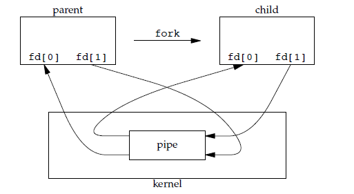

# 进程与线程
## 1.进程
资源分配的基本单位

进程控制块（Process Control Block，PCB）描述进程的基本信息和运行状态，所谓的创建进程和撤销进程都是指对PCB的操作。

## 2.线程
独立调度的基本单位。
一个进程中多个线程，他们共享进程资源。

## 区别
1. **拥有资源**
进程是资源分配的基本单位，但是线程不拥有资源，线程只能访问隶属于进程的资源。

2. **调度**
线程是独立调度的基本单位。同一进程中线程的切换不会引起进程的切换，但是不同进程中线程的切换回引起进程的切换。

3. **系统开销**
由于创建和撤销进程时，系统都要为之分配或回收资源，比如内存空间、IO设备等，所付出的开销远大于创建和撤销线程时的开销。类似的在进程切换时，涉及到当前执行进程CPU环境保存和新调度进程CPU环境的设置，而线程切换时只需要保存和设置少量寄存器内容，开销很小。

4. **通信方面**
线程间可以直接读写同一进程中的数据进行通信，但是简称通信需要借助IPC

# 进程状态切换

就绪状态（ready）：等待被调度
运行状态（running）
阻塞状态（waiting）：等待资源

只有就绪态和运行态之间可以相互转换，其他的都是单向转换。就绪状态的进程通过调度算法从而获得CPU时间，转为运行状态；而运行状态的进程，在分配给它CPU时间片用完之后就会转为就绪状态，等待下一次被调度。
阻塞状态是缺少需要的资源从而由运行状态转换而来的，但是该资源不包括CPU时间，缺少CPU时间就会从运行态转换为就绪态。

# 进程调度算法
## 1.批处理系统
### 1.1 先来先服务
FCFS first-come first-serverd
非抢占式的调度算法，按照请求的顺序进行调度。有利于长作业，不利于短作业，短作业要等到前面的作业执行完毕之后才能执行，长作业又需要很长时间，造成了短作业等待时间过长。

### 1.2 短作业优先 shortest job first
非抢占式的调度算法，按照运行时间的顺序进行调度，长作业可能会被饿死，如果一直有短作业到来，长作业一直得不到调度

### 1.3 最短剩余时间优先 shortest remaining time next
最短作业优先的抢占式版本，按照剩余运行时间的顺序进行调度。当一个新的作业到达时，其整改运行时间和当前进程的剩余时间作比较，如果新的进程需要时间更少，则挂起当前进程运行新的进程。否则新的进程等待。

## 2.交互式系统
存在大量的用户交互操作，在该系统中调度算法的目标是快速响应。
### 2.1时间片轮转
将所有就绪进程按FCFS的原则排成一个队列，每次调度时，把CPU时间分配给队首进程，该进程执行一个时间片，当时间片用完之后，由计时器发出时钟中断，调度程序便停止该进程的执行，病将他送往就绪队列的队尾，同时继续把CPU时间分配给队首的进程。

效率和时间片大小有很大关系：
因为进程切换保存进程信息，载入新进程的新信息，时间片太小，会导致切换频繁进程切换上花很多时间。
时间片太长实时性么有保证；

### 2.2优先级调度
为每一个进程分配一个优先级，按照优先级进行调度。
为了防止低优先级进程永远得不到调度，可以随着时间的推移增加等待的优先级；

### 2.3多级反馈队列
一个进程需要执行 100 个时间片，如果采用时间片轮转调度算法，那么需要交换 100 次。

多级队列是为这种需要连续执行多个时间片的进程考虑，它设置了多个队列，每个队列时间片大小都不同，例如 1,2,4,8,..。进程在第一个队列没执行完，就会被移到下一个队列。这种方式下，之前的进程只需要交换 7 次。

每个队列优先权也不同，最上面的优先权最高。因此只有上一个队列没有进程在排队，才能调度当前队列上的进程。

## 3.实时系统
要求一个请求在一个确定时间内得到响应。

## 进程同步
### 1.临界区
对临界资源进行访问的那段代码称之为临界区。

为了互斥访问临界资源，每个进程在进入临界区之前需要先进行检查。

### 2.同步与互斥
同步：多个进程因为合作产生直接的制约关系，使得进程有一定的先后执行关系。
互斥：多个进程在同一时刻只有一个进程能进入临界区。

### 3.信号量
信号量是一个整形变量，可以对其执行down和up操作，也就是常见的P和V操作。

down： 如果信号量大于0，执行-1操作；如果信号量等于0，进程睡眠，等待信号量大于0；
up： 对信号量执行+1操作，唤醒睡眠的进程让其完成down操作；

down和up被设计成原语。不可分割，通常做法是执行这些操作的时候屏蔽中断；

如果信号量的取值只能是0或者1，那么就成为了互斥量，0表示临界区已经加锁，1表示临界区解锁。

**使用信号量实现生产者-消费者的问题**
问题描述：使用一个缓冲区来保存物品，只有缓冲区没有满，生产者才可以放入物品；只有缓冲区不为空，消费者才可以拿走物品。

缓冲区属于临界资源，使用互斥量mutex控制对缓冲区的互斥访问；

同步生产者和消费者的行为，需要记录缓冲区物品的数量。数量可以使用信号量来统计，需要使用两个信号量：empty记录空缓冲区的数量，full记录满缓冲区的数量。其中empty信号量在生产者进程中使用，empty不为0时，生产者才可以放入物品，full信号量在消费者进程中使用，当full信号量不为0时，消费者才可以取走物品。

不可以先对缓冲区进行加锁，在测试信号量。也就是说，不能先执行down（mutex）再执行down（empty）。如果这么做了，那么就可能出现这种情况：生产者对缓冲区加锁后，执行down（empty），发现empty=0，此时生产者睡眠。消费者也不能进入临界区，因为生产者对缓冲区加锁了，消费之就无法执行up（empty）操作了，empty永远为0，导致生产者永远等待，不会释放锁，消费也永远等待。

    #define N 100
    typedef int semaphore;
    semaphore mutex = 1;
    semaphore empty = N;
    semaphore full = 0;

    void producer() {
        while(TRUE) {
            int item = produce_item();
            down(&empty);
            down(&mutex);
            insert_item(item);
            up(&mutex);
            up(&full);
        }
    }

    void consumer() {
        while(TRUE) {
            down(&full);
            down(&mutex);
            int item = remove_item();
            consume_item(item);
            up(&mutex);
            up(&empty);
        }
    }

### 4.管程
使用信号量机制实现的生产-消费问题需要客户端代码做很多控制，而使用管程吧控制的代码独立出来，不仅不容易出错，也使得客户端调用更容易。

示例代码的管程提供了 insert() 和 remove() 方法，客户端代码通过调用这两个方法来解决生产者-消费者问题。

    monitor ProducerConsumer
        integer i;
        condition c;

        procedure insert();
        begin
            // ...
        end;

        procedure remove();
        begin
            // ...
        end;
    end monitor;
重要特性：同一时刻只能有一个进程使用管程。进程无法继续执行的时候不能一直占用管程，否者其他进程永远也不能使用管程；

管程引入条件变量以及相关的操作：wait()和signal()来实现同步操作。对条件变量执行wait()操作，会导致调用进程阻塞，把管程让出来给另一个进程持有。signal()操作用于唤醒被阻塞的进程。

    monitor ProducerConsumer
        condition full，empty；
        integer count := 0;
        condition c;

        procedure insert(item: integer);
        begin
            if count = N then wait(full);
            insert_item(item);
            count := count + 1;
            if count = 1 then signal(empty);
        end;

        function remove: integer;
        begin
            if count = 0 then wait(empty);
            remove = remove_item;
            count := count - 1;
            if count = N -1 then signal(full);
        end;
    end monitor;

    // 生产者客户端
    procedure producer
    begin
        while true do
        begin
            item = produce_item;
            ProducerConsumer.insert(item);
        end
    end;

    // 消费者客户端
    procedure consumer
    begin
        while true do
        begin
            item = ProducerConsumer.remove;
            consume_item(item);
        end
    end;

## 经典同步问题
### 1.哲学家进餐问题
五个哲学家围着一张圆桌，每个哲学家面前放着食物。哲学家的生活有两种交替活动：吃饭以及思考。当一个哲学家吃饭时，需要先拿起自己左右两边的两根筷子，并且一次只能拿起一根筷子。

所有人拿起左手筷子那么将会死锁；

    void philosopher（int i){
        while(TRUE) {
            think();
            take(i);
            take((i+1)%N);
            eat();
            put(i);
            put((i+1)%N);
        }
    }

防止死锁产生可以设置两个条件：
1.必须同时拿起左右两根筷子；
2.只有两根邻居都没有进餐的时候才允许进餐；

    void philosopher(int i){
        while(TRUE){
            think(i);
            take_two(i);
            eat(i);
            put_two(i);
        }
    }

    void take_two(int i){
        down(&mutex);
        state[i] = HUNGRY;
        check(i);
        up(&mutex);
        down(&s[i]);
    }

    void put_two(i) {
        down(&mutex);
        state[i] = THINKING;
        check(LEFT); // 尝试通知左右邻居，自己吃完了，你们可以开始吃了
        check(RIGHT);
        up(&mutex);
    }

    void eat(int i) {
        down(&mutex);
        state[i] = EATING;
        up(&mutex);
    }

    // 检查两个邻居是否都没有用餐，如果是的话，就 up(&s[i])，使得 down(&s[i]) 能够得到通知并继续执行
    void check(i) {         
        if(state[i] == HUNGRY && state[LEFT] != EATING && state[RIGHT] !=EATING) {
            state[i] = EATING;
            up(&s[i]);
        }
    }

**读者-写者问题**

允许多个进程同时对数据进行读操作，但是不允许读和写以及写和写操作同时发生。

一个整型变量count记录在对数据进行读操作的进程数量，一个互斥量count_mutex用于对count加锁，一个互斥量data_mutex用于对读写的数据加锁。

    typedef int semaphore;
    semaphore count_mutex = 1;
    semaphore data_mutex = 1;
    int count = 0;

    void reader() {
        while(TRUE) {
            down(&count_mutex);
            count++;
            if(count == 1) down(&data_mutex); // 第一个读者需要对数据进行加锁，防止写进程访问
            up(&count_mutex);
            read();
            down(&count_mutex);
            count--;
            if(count == 0) up(&data_mutex);
            up(&count_mutex);
        }
    }

    void writer() {
        while(TRUE) {
            down(&data_mutex);
            write();
            up(&data_mutex);
        }
    }

## 进程通信
进程同步和进程通信容易混淆，区别是：
进程同步：控制多个进程按一定顺序执行；
进程通信：进程间传输信息；
进程通信是一种手段，而进程同步是一种目的。也可以说，为了达到进程同步的目的，需要让进程进行通信；传输一些进程同步所需要的的信息。

### 1.管道
通过调用pipe()函数创建的，fd[0]用于读，fd[1]用于写；

int pipe(int fd[2]);

限制：
只支持半双工通信单向交替传输；
只能在父子进程或兄弟进程中使用。

### 2.FIFO
也称之为命名管道，去除了只能在父子进程中使用的限制。
常用在客户端-服务端的应用程序中，FIFO用作汇聚点，在客户端进程和服务器进程之间传递数据。

### 3.消息队列
相比于FIFO，消息队列具有以下优点：
消息队列可以独立于读写进程存在，从而避免了 FIFO 中同步管道的打开和关闭时可能产生的困难；
避免了 FIFO 的同步阻塞问题，不需要进程自己提供同步方法；
读进程可以根据消息类型有选择地接收消息，而不像 FIFO 那样只能默认地接收。

### 4.信号量
计数器，用于多个进程提供共享数据对象的访问

### 5.共享存储
允许多个进程共享一个给定的存储区，因为数据不需要再进程之间复制，所以这是最快的一种IPC。
需要使用信号量来同步对共享存储的访问；

### 6.套接字
可以用于不同机器上的进程通信。