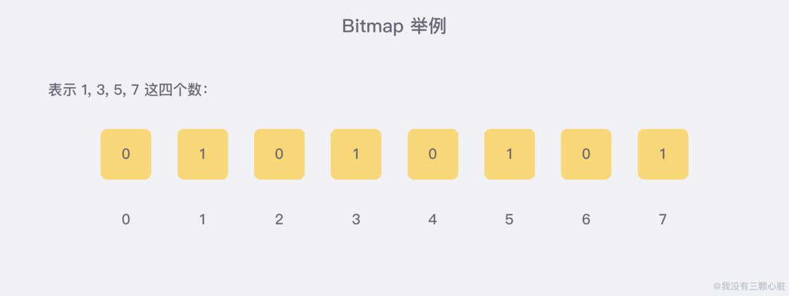

# HyperLogLog简介
HyperLogLog提出的一种估算基数的近似最优算法。

## 关于基数统计
基数统计通常是用来统计一个集合中不重复的元素个数；

思考这样的一个场景： 如果你负责开发维护一个大型的网站，有一天老板找产品经理要网站上每个网页的 UV(独立访客，每个用户每天只记录一次)，然后让你来开发这个统计模块，你会如何实现？

如果是统计PV（浏览量，用户每点一次就记录一次），那非常好办，给每一个页面都配置一个独立的Redis计数器就可以了，吧这个计数器的key后缀加上当天的日期，这样一来每一个请求，就执行一次INCRBY指令一次，最终就可以统计出所有的PV数据了；

但是UV不一样了，它要去重，同一个用户一天之内的多次访问请求只能计数一次。这就要求了每一个网页请求都需要带上用户的 ID，无论是登录用户还是未登录的用户，都需要一个唯一 ID 来标识。

为每一个页面设置一个独立的set集合，来存储所有当天的访问页面的用户ID；这样的问题就是“
1. 存储空间巨大：如果网站访问量一大，就需要为每一个页面set集合，就会非常大，如果页面一多，存储量巨大；
2. 统计复杂：这么多set集合如果要聚合一下，又是一个复杂的事情；

## 基数统计的常用方法

### 第一种：B树
B树最大的优势就是插入和查找效率高，果用 B 树存储要统计的数据，可以快速判断新来的数据是否存在，并快速将元素插入 B 树。要计算基础值，只需要计算 B 树的节点个数就行了。

不过将 B 树结构维护到内存中，能够解决统计和计算的问题，但是 并没有节省内存。

### 第二种：bitmap

bitmap可以理解为通过一个bit数组来存储数据的一种数据结构，每一个bit位都能独立包含信息，bit 是数据的最小存储单位，因此能大量节省空间，也可以将整个 bit 数据一次性 load 到内存计算。如果定义一个很大的 bit 数组，基础统计中 每一个元素对应到 bit 数组中的一位，例如：

bitmap 还有一个明显的优势是 可以轻松合并多个统计结果，只需要对多个结果求异或就可以了，也可以大大减少存储内存。可以简单做一个计算，如果要统计 1 亿 个数据的基数值，大约需要的内存：100_000_000/ 8/ 1024/ 1024 ≈ 12 M，如果用 32 bit 的 int 代表 每一个 统计的数据，大约需要内存：32 * 100_000_000/ 8/ 1024/ 1024 ≈ 381 M

》》》》》》》》》》》》》》》》》》》》》》》》》》》》