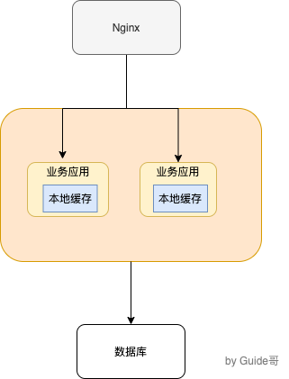
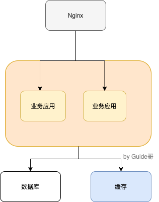
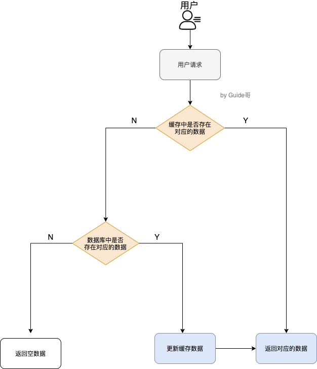
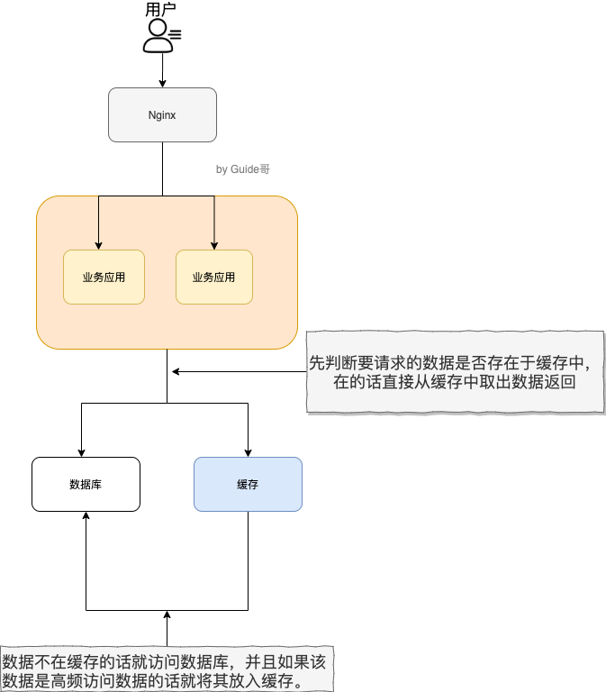

## 简单说说有哪些本地缓存解决方案

单体架构，数据量不大，没有分布式要求，使用本地缓存还是可以的；

常见的单体架构图，我们适应Nginx做负载均衡，部署两个相同的服务器，两个服务器使用同一个数据库，使用本地缓存；

1. **自带HashMap和ConcurrentHashMap**
ConcurrentHashMap可以看做线程安全的HashMap，两者都是存放key/value形式的键值对。但是大部分场景来说，不会使用这个两者做缓存，只提供个了缓存功能，一个稍微完善点的缓存框架至少提供：过期时间，淘汰机制和命中率三点；

2. **Ehcache、Guava Cache、Spring Cache这三者使用的比较多的本地缓存框架**

Ehcache相比于其他两个更加重要，不过相比于Guava Chche、Spring Cache来说，Ehcache支持可以嵌入到hiberate和Mybatis作为多级缓存，并且可以讲缓存的数据持久化到本地磁盘中；

Guava Cache和Spring Cache两者的话比较像。

Guava相比于Spring Cache的话使用的更多一些，他提供的API非常方便我们使用，同时也提供了设置缓存有效时间等功能。使用SpringCache注解实现缓存的话，代码会看着干净和优雅；

3. **Caffeine**
相比于Guava来说Caffeine在各个方面比如性能更加优秀 ，一般建议使用其来代替Guava。并且，Guava和Caffine使用方法很像；

## 为什么要使用分布式缓存？为什么不直接用本地缓存？
如下图所示，就是一个简单的使用分布式缓存的架构图。我们使用Nginx来做负载均衡，部署两个相同的服务到服务器，两个服务使用同一数据库做缓存；

本地缓存的优势是低依赖，比较轻量，并且相比于使用分布式缓存更加简单；

再来分析一下本地缓存的局限性：
1. 本地缓存都分布式架构支持不好，比如同一个服务部署在多台机器上的时候，各个服务之间的缓存是无法共享的，因为本地服务职能在当前服务器上有；
2. 容量跟随服务器限制明显；

使用分布式缓存之后，缓存部署在一台单独的服务器上，即使同一个相同的服务部署在再多的机器上，也是用的同一份缓存，并且单独分布式的缓存服务的性能、容量和提供的功能都要更加强大；

## 分布式缓存有哪些常见的技术选型方案呢?

分布式缓存的话，使用的比较多的主要是Memcached和Redis。分布式缓存主要解决的是单机缓存的容量受服务器限制并且无法保存通用的信息。本地缓存只在当前服务中有效；

## 简单介绍一下Redis
Redis是C语言开发的，存储在内存中的数据库，读写很快用于缓存方向；也清楚作为分布式锁甚至是消息队列；

## 说一下Redis和Memcached的区别和共同点

**共同点**：
1. 基于内存的； 
2. 都有过期策略；
3. 都性能很高；

**区别**：
1. **Redis支持更丰富是数据类型，支持更加复杂的场景**，Redis不仅仅支持kv类型的数据，同时还提供list，set，zset，hash等数据结构的存储。Memcached只支持最简单的kv数据类型；
2. **Redis，可以将内存中的数据保持在磁盘中，重启的时候再次加载使用，而Memcache把数据全部存在内存中**；
3. **Redis有灾难恢复机制，可以持久换到磁盘中；**
4. **Redis可以在内存用满之后，将不用的数据从内存移到硬盘中，而Memcache直接在内存满了之后报错**；
5. **Memcached没有原生的集群模式，需要依靠客户端来实现往集群中分片写入数据；但是Redis目前是原生支持cluster模式的**
6. **Memcached是多线程，非阻塞IO复用的网络模型，Redis使用单线程的多路IO复用模型**；
7. **Redis支持发布订阅模型，Lua脚本。事务等功能，而Memcached不支持，并且Redis支持更多的编程语言**；
   
### 缓存数据的处理流程

如果用户请求的数据在缓存中就直接返回；
缓存中不存在的话，就看数据库中是否存在；
数据库中存在的话就更新缓存中的数据；
数据库中不存在的话返回空数据；

### 为什么要用Redis/为什么要用缓存？

**高性能：**
对照上图用户访问数据属于高频数据并且不会经常改变的话，那么我们就很放心的将该用户访问的数据存在缓存中了；

**好处是：**
保证用户下一次再访问这些数据的时候，可以直接从缓存中获取。操作缓存直接操作内存所以速度相当快；

**高并发：**
一般像MySQL这类的数据库的QPS大概都在1W左右，但是使用Redis缓存之后，很容易达到10W+，甚至最高能达到30W+;

## Redis的线程模型
Redis内部使用文件事件处理器file event handler，这个文件时间处理器是单线程的，所以Redis才叫做单线程的模型，它采用IO多路复用机制同时监听多个socket，根据socket上的时间来选择对应的事件处理器进行处理；

文件事件处理器结构的4个部分：
多个socket；
IO多路复用程序；
文件事件分派器；
事件处理器（连接应答处理器，命令请求处理器，命令回复处理器）;

多个 socket 可能会并发产生不同的操作，每个操作对应不同的文件事件，但是 IO 多路复用程序会监听多个 socket，会将 socket 产生的事件放入队列中排队，事件分派器每次从队列中取出一个事件，把该事件交给对应的事件处理器进行处理。

## Redis常见的数据结构以及使用场景分析

1. **String**
常见命令：set、get、decr、incr、mget等；
String数据结构是简单的key-value类型，value其实不仅可以是String，也可以是数字。常规的kay-value缓存应用；

2. **Hash**
常见命令：hget，hset，hgetall等；
hash是一个string类型的field和value的映射表，hash特别适合用于存储对象，后续操作的时候，你可以直接仅仅修改这个对象中的某个字段的值。比如我们可以hash数据结构来存储用户信息，商品信息等等。比如下面我们就用hash类型存放了一些用户的信息：

    key = JavaUser293847;
    value = {
        "id": 1,
        "name": "zyq",
        "age": 22,
        "location": "Wuhan, Hubei"
    }

3. **List**
常用命令是：lpush，rpush，lpop，rpop，lrange等；
list就是链表，Redis list的应用场景非常多，也是Redis最重要的数据结构之一，比如微博的关注列表，粉丝列表，消息列表等功能都可以用redis的list结构实现；

Redis list的实现为一个双向链表，即可以支持反向查找和遍历，更方便操作，不过带来了部分额外的内存开销。

另外可以通过lrange命令，就是从某个元素开始读取多少个元素，可以基于list实现分页查询，基于redis实现简单的高性能分页，可以做类似微博那种不断分页的东西；

4. **Set**
常用命令：sadd，spop，smembers,sunion等
Redis中的set类型是一种无序集合，集合的元素没有先后顺序。

当你需要存储一个列表数据，又不希望出现重复数据时，set是一个很好的选择，并且set提供了判断某个成员是否在一个set集合内的重要接口。这个是list不能做到的；可以基于此实现交集，并集和差集的重要接口；

在微博应用中，可以将一个用户所有的关注人存在一个集合中，将其所有粉丝存在一个集合。redis可以非常方便的实现，如共同关注、共同粉丝。共同喜好等功能。这个过程也就是求交集的过程；

    sinterstore key1 key2 key3

5. **Sorted Set**
常用命令：zadd,zrange,zrem,zcard等；

和set相比，sorted set增加一个权重系数score，使得集合中的元素能够按score进行有序排列。

举例：在直播系统中，实时排行信息包含直播间在线用户列表，各种礼物排行榜，弹幕消息等信息，适合用Redis中的Sorted Set存储；

**Redis设置过期时间**
登录信息，token，短信验证码等等都是有时间限制的，我们set key的时候，可以给一个过期时间；

删除方式：
定期删除 + 惰性删除

**定期删除**：Redis默认是每隔100ms就随机抽取一些设置过期时间的key，检查其是否过期，过期就删除。注意这里是随机抽取的。加入Redis存了几十万个key，没隔100ms就遍历所有设置过期时间的key的话，就会给CPU带来很大的负载！

**惰性删除**：已经过期的key并没有被删除掉。所以有了惰性删除。加入你的过期key，靠定期删除没有被删除掉，还停留在内存中，除非你的系统去查一下那个key，才会被Redis删除掉。

定期删除没有删除，又长时间没有防问，大量过期内存导致redis内存块耗尽，怎么解决这个问题呢？**Redis内存淘汰机制**

## Redis内存淘汰机制(MySQL有2000W的数据，Redis中只有20W数据，如何保证Redis中的数据都是热点数据？)

**6种淘汰机制**
1. **volatile-lru**：从已设置过期的数据集中挑选最近最少使用的数据淘汰；
2. **volatile-ttl**：已设置过期时间的数据集中挑选将要过期的数据淘汰；
3. **volatile-random**：设置过期的数据集中任意选择数据淘汰；
4. **allkeys-lru**：内存不足以容纳新写入数据时，在键空间中，移除最近最少使用key，这个是最常使用的；
5. **allkeys-random**：从数据集中任意选择数据淘汰；
6. **no-eviction**：机制驱逐数据，内存不足的时候，新写数据报错；
增加两种：
7. **volatile-lfu**：已设置过期时间的数据集中挑选最不经常用的数据淘汰；
8. **allkeys-lfu**: 内存不足以容纳新写入数据时，在键空间中，移除最不经常用的key；

## Redis持久化机制（怎么保证Redis挂掉之后再重启数据可以进行恢复）

Redis不同于Memcached最重的一点是，Redis支持持久化，**Redis的一种持久化方式叫快照，另一种方式时只追加文件**。这两种方法各有千秋；

**快照持久化**：Redis可以通过创建快照来获取存储在内存里面的数据在某个节点上的副本。redis创建快照之后，对快照进行备份，可以将快照复制到其他服务器从而创建具有相同数据的服务器副本（Redis主从结构，主要用来提高Redis性能），还可以将快照留在原地以便于重启服务器的时候使用；

快照持久化是Redis默认采用的持久化方式，Redis.conf配置文件中默认有以下配置：

    save 900 1           #在900秒(15分钟)之后，如果至少有1个key发生变化，Redis就会自动触发BGSAVE命令创建快照。
    save 300 10          #在300秒(5分钟)之后，如果至少有10个key发生变化，Redis就会自动触发BGSAVE命令创建快照。
    save 60 10000        #在60秒(1分钟)之后，如果至少有10000个key发生变化，Redis就会自动触发BGSAVE命令创建快照。

**AOF（append-only file）持久化**

AOF实时性更好，因此成为主流持久化方案，默认情况下Redis没有开启AOF方式的持久化方案，默认情况下没有开启AOF方式的持久化，可以通过appendly参数开启：

    appendonly yes

开启AOF之后每执行一条会更改Redis中数据的命令，Redis就会将该命令写入硬盘中的AOF文件。AOF文件的保存位置和RDB文件的位置一样，dir参数设置；

Redis的配置文件中存在三种不同的AOF持久化方式，他们分别是：

    appendfsync always    #每次有数据修改发生时都会写入AOF文件,这样会严重降低Redis的速度
    appendfsync everysec  #每秒钟同步一次，显示地将多个写命令同步到硬盘
    appendfsync no        #让操作系统决定何时进行同步

兼顾性能和数据的情况下可以选择 appendfsync everysec 每一秒同步一次，当硬盘忙于执行写入操作的时候，redis还会优雅的放慢写入操作，Redis还会优雅的放慢自己的速度以便适应硬盘的最大写入速度；

Redis4.0支持RDB和AOF混合持久化
如果混合持久化打开，AOF重写的时候，就直接把RDB的内容写到AOF文件开头，结合RDB和AOF的优点，快速价值同时避免丢失过多的数据。当然确定也是有的，AOF里面的RDB部分是压缩格式不再是AOF格式，可读性较差；

**AOF重写**：
产生一个新的AOF文件，这个新的AOF文件保存的数据库状态是一样的，但体积更小；

AOF重写是一个有歧义的名字，功能是通过读取数据库中的键值对来实现的，程序无须对现有AOF文件进行任何读入、分析或者写入操作。

在执行BGREWRITEAOF命令时，Redis服务器会维护一个AOF重写缓冲区，该缓冲区会在子进程创建新AOF期间，记录服务器的所有写命令，当子进程完成创建新的AOF文件之后，服务器会重写缓冲区中所有内容追加到AOF文件末尾，是的新旧两个AOF文件所保持的数据库状态一致。最后服务器用心的AOF文件替代旧的AOF文件，一次完成AOF文件重写操作；

## Redis事务
Redis通过MuLTI、EXEC、WATCH等命令来实现事务功能。事务提供了一种将多个命令请求打包，然后一次性、按顺序的执行多个命令的机制，并且在事务执行期间，服务器不会中断事务而去执行其他客户端的命令请求，他会将事务中所有命令都执行完，才处理器其他客户端请求；

Redis中事务总是具有原子性Atomicity，一致性Consistency和隔离性Isolation，在某种特定的持久化模式中事务也具有持久性Durability。

Redis中同一事务如果有一条命令执行失败，其后的命令任然会被执行，没有回滚；

## 缓存穿透
### 什么是缓存穿透？
缓存穿透就是大量请求的key根本不存在与缓存中，导致请求直接到了数据库上，根本没有经过缓存这一层。举个例子：某个黑客故意制造我们缓存中不存在的key发起大量请求，导致大量请求落到数据库中；

### 缓存穿透的处理流程是这样的

### 有哪些解决方法
最基本的是做好参数的校验，一些不合法的参数请求直接抛出异常，返回给客户端，比如查询的数据库id不能小于0，传染的邮箱格式等等；

1. **缓存无效key**

如果缓存和数据库都查不到某个key的数据，就写一个key到Redis中并设置过期时间，具体命令如下：`SET key value EX 10086` 这种方式可以解决请求key变化不频繁的情况，如果黑客恶意攻击每次构建不同的请求key，会导致Redis缓存大量无效的key。很明显这种方案并不能根本上解决此问题。如果非要用这种方法，尽量将无效的key的过期时间设置短一点如1分钟；

一般情况下我们是这么设计key的：`表名：列名：主键名：主键值`

    public Object getObjectInclNullById(Integer id){
        //缓存中获取数据
        Object cacheValue = cache.get(id);
        //缓存为空
        if(cacheValue == null){
            //从数据库中获取
            Object storageValue = storage.get(key);
            //缓存空对象
            cache.set(key,storageValue);
            //如果存储数据为空，需要设置一个过期时间（300级）
            if(storageValue == null){
                //必须设置过期时间，否则有被攻击的风险
                cache.expire(key,60 * 5);
            }
            return storageValue;
        }
        return cacheValue;
    }

2. **布隆过滤器**
通过它我们可以非常方便地判断一个给定数据是否存在于海量数据中。我们需要的就是判断 key 是否合法，有没有感觉布隆过滤器就是我们想要找的那个“人”；

把所有存在的请求的值都存在布隆过滤器中，当用户请求过来，先判断用户发来的请求的值是否存在于布隆过滤器中，不存在的话，直接返回请求参数错误信息给客户端，存在的话才会走下面的流程；

加入布隆过滤器之后的缓存处理流程图如下：

布隆过滤器判断存在的话，有可能误判，但是判断不存在的话一定不存在；

**当一个元素加入布隆过滤器中的时候，会进行哪些操作：**

使用布隆过滤器中的哈希函数对元素值进行计算，得到哈希值（有几个哈希函数得到几个哈希值）。
根据得到的哈希值，在位数组中把对应下标的值置为 1。

**当我们需要判断一个元素是否存在于布隆过滤器的时候，会进行哪些操作：**

对给定元素再次进行相同的哈希计算；
得到值之后判断位数组中的每个元素是否都为 1，如果值都为 1，那么说明这个值在布隆过滤器中，如果存在一个值不为 1，说明该元素不在布隆过滤器中。

不同字符串哈希出来的位置可能相同，适当增加位数组调整我们的哈希函数降低概率；

## 缓存雪崩
### 什么是缓存雪崩
简单场景就是：**缓存在同一时间大面积失效，后面的请求直接落到数据库上，造成数据库短时间内承受大量请求**。
这好像雪崩一样，摧枯拉朽之势，数据库压力可想而知，直接可能就宕机了；

**有一些被大量访问数据（热点缓存）在某一时刻大面积失效，导致对应的请求直接落到了数据库上。** 这样的情况，有下面几种解决办法：

举个例子 ：秒杀开始12个小时之前，我们统一存放了一批商品到 Redis 中，设置的缓存过期时间也是12个小时，那么秒杀开始的时候，这些秒杀的商品的访问直接就失效了。导致的情况就是，相应的请求直接就落到了数据库上，就像雪崩一样可怕。

### 有哪些解决办法
Redis服务不可用：
1. 采用Redis集群，避免单机出现问题整个缓存服务没办法使用；
2. 限流，避免同时处理大量请求；

热点缓存失效：
1. 设置不同的失效时间比如随机设置缓存的失效时间；
2. 缓存永不失效；

## 如何解决Redis的并发竞争key问题

所谓 Redis 的并发竞争 Key 的问题也就是多个系统同时对一个 key 进行操作，但是最后执行的顺序和我们期望的顺序不同，这样也就导致了结果的不同！

推荐一种方案：分布式锁（zookeeper和Redis都可实现分布式锁）。（如果不存在Redis并发竞争key的问题，不要使用分布式锁，影响性能）；

基于zookeeper临时有序节点可以实现的分布式锁。大致思想为：每个客户端对某个方法加锁时，在zookeeper上与该方法对应的指定节点的目录下，生成一个唯一瞬时有序节点。同时可以避免服务器宕机导致的锁无法释放，而产生的死锁问题。完成业务流程后，删除对应的子节点释放锁；

## 如何保证缓存和数据库双写时数据一致性

一般来说，就是如果你的系统不是严格要求缓存+数据库必须一致性的话，缓存可以稍微的跟数据库偶尔有不一致的情况，最好不要做这个方案，读请求和写请求串行化，串到一个内存队列里去，这样就可以保证一定不会出现不一致的情况

串行化之后，就会导致系统的吞吐量会大幅度的降低，用比正常情况下多几倍的机器去支撑线上的一个请求。
