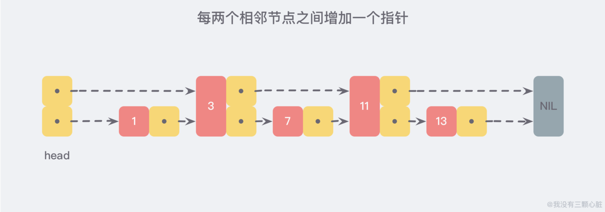
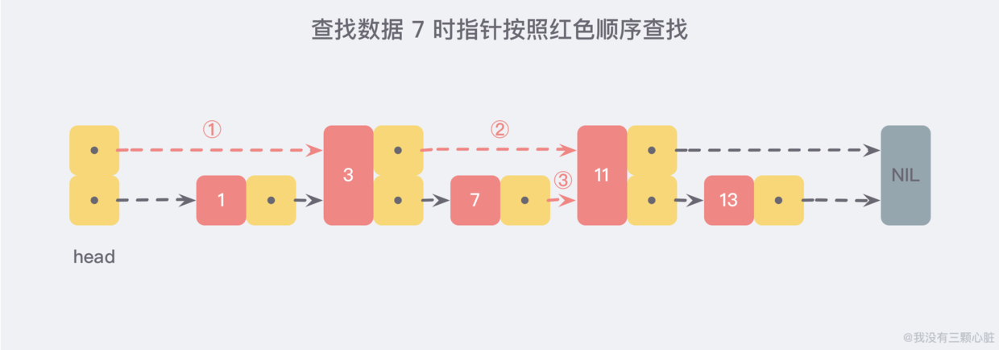
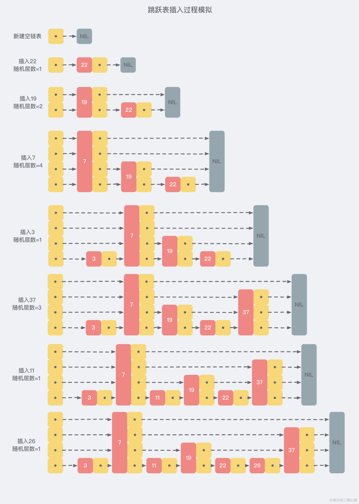
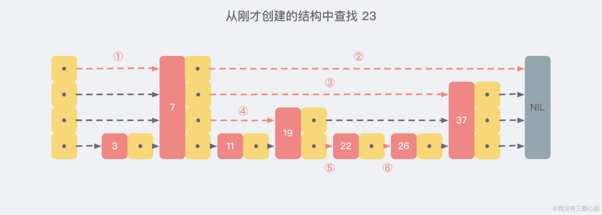

参考：  https://www.wmyskxz.com/2020/02/29/redis-2-tiao-yue-biao/
        https://snailclimb.gitee.io/javaguide/#/docs/database/Redis/redis-collection/Redis(2)
# Redis跳表
有序列表zset中使用，类似于java中SortedSet和HashMap的结合；set保证了value的唯一性，另一方面每个value赋予一个排序的权重score排序目的；

## 为什么使用跳表
zset要随机插入删除，数组不满足条件；
排序的特性让我们想到了红黑树和平衡树这样的结构，为什么不用呢？

1. **性能考虑**：高并发情况下，红黑树需要rebalance的操作，而跳表只需要涉及到局部链表的变化；
2. **实现考虑**：跳表比红黑树更易实现；
   
## 本质是查找问题
我们需要按照score值进行排序，这就意味着，当我们需要添加新的元素时，我们需要定位到插入点，这样才可以继续保证链表是有序的，通常我们使用二分查找，但是链表中没办法进行位置定位，看起来我们除了遍历没有别的方法了；

但是如果我们每相邻两个节点之间就增加一个指针，这样的指针就连成了新的链表，但是包含的数据只有原来的一半；

利用同样的方法可以在新产生的第二层链表上再生成第三层，这样我们的查找就先在上层索引上去查找，一层一层的查找到数据节点。比原来是不是更快；

## 更进一步跳表

按照上面那只生成链表的方式，上面每一次链表的节点都是下面的一半，这样查找的过程类似二分，时间复杂度Olog(n);

但是这种在插入数据有很大问题，新插入节点会破坏对应的2：1的节点关系，如果重新维护这个关系的话，新插入节点后面就重新调整，这让时间复杂度又重新退化；

跳表为避免这个问题，不要求上下链表节点之间有严格的对应关系，而是为了每一个节点随机出一个层数；具体过程如下图：

从上面的创建和插入过程中可以看出，每一个节点的层数都是随机出来的，而且新插入的节点不会影响其他层的节点，因此插入操作只需要修改节点前后的指针，而不是对每个节点都进行调整；

# 跳表的实现

zskiplistNode 和 zskiplist两个结构定义，前者为跳表节点，后者为相关关系；

    typedef struct zskiplistNode{
        //value
        sds ele;
        //分值
        double score;
        //后退指针
        struct zskiplistNode *backward;
        //层
        struct zskiplistLevel {
            //前进指针
            struct zskiplistNode *forward;
            //跨度
            unsigned long span;
        }level[];
    }zskiplistNode;

    typedef struct zskiplist {
        //跳跃表头指针
        struct zskiplistNode *header,*tail;
        //表中节点的数量
        unsigned long length;
        //表中层数最大的节点的层数
        int level;
    }zskiplist;

## 随机层数

    int zslRandomLevel(void) {
        int level = 1;
        while ((random()&0xFFFF) < (ZSKIPLIST_P * 0xFFFF))
            level += 1;
        return (level<ZSKIPLIST_MAXLEVEL) ? level : ZSKIPLIST_MAXLEVEL;
    }

直观上期望的目标是50%概率分到lavel 1，25% 分到level 2 ， 12.5% 的概率被分配到 Level 3，以此类推...有 2-63 的概率被分配到最顶层，因为这里每一层的晋升率都是 50%。

**Redis 跳跃表默认允许最大的层数是 32**，被源码中 ZSKIPLIST_MAXLEVEL 定义，当 Level[0] 有 264 个元素时，才能达到 32 层，所以定义 32 完全够用了。

