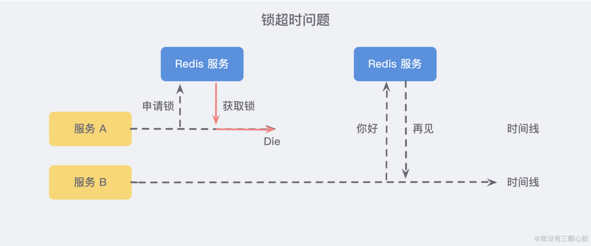
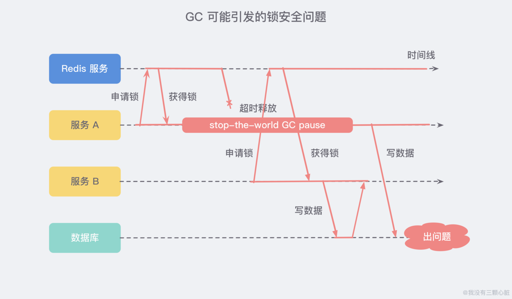

# 分布式锁简介
锁是一种解决多个执行线程访问共享资源错误或者数据不一致的工具；

## 为什么需要锁
1. **避免不同节点重复相同的工作**：比如用户执行某个操作有可能不同节点会发送多封邮件；
2. **避免破坏数据的正确性**：如果两个节点在同一个数据上同时进行操作，可能会造成数据错误或不一致的情况出现；

## Java中实现的常见方式

有简单的比喻说明了锁的本质，同一时间只允许一个用户操作。
1. **基于MySQL中的锁**：MySQL本身有自带悲观锁`for update`关键字，也可以自己实现悲观/乐观锁达到目的；
2. **基于Zookeeper有序节点**：Zookeeper允许临时创建有序的子节点，这样客户端获取节点列表时，就能够当前子节点列表中的序号判断是否能够获得锁；
3. **Redis的单线程**：由于 Redis 是单线程，所以命令会以串行的方式执行，并且本身提供了像 SETNX(set if not exists) 这样的指令，本身具有互斥性；

## Redis分布式锁的问题
### 1. 锁超时
假设有两个平行的服务A,B，其中A服务在获取锁之后由于某种什么力量挂了，那么B服务就永远无法获取锁了；

所以我们要额外设置一个超时时间，来保证服务的可用性；

但是如果加锁和释放锁之间的逻辑执行时间太长，超出了锁的超时限制，也就会出现新的问题如果第一个线程执行时间长了持有锁失效，而临界区的逻辑还没有执行完，这时第二个线程提前拥有了这个锁，就会导致临界区的代码不能得到严格的串行执行；

为了避免这个问题，Redis分布式锁不要用于较长时间的任务，如果真的出现问题就需要人工的干预；

稍微安全的方案，是将锁的value值设置成一个随机所，释放锁之前先匹配随机数是否一致，然后删除key，这是为了确保当前线程占有的锁不会被其他线程释放，触发这个锁因为过期而被服务器自动释放；

## GC可能引发安全问题

GC的时候会发生STW（Stop-The-World），这本身就是为了保证垃圾回收器的正常执行，可能引发以下的问题。

A获得锁并设置了超时时间，但是A出现了STW时间较长，导致了分布式锁进行了超时释放，在这个期间服务B获得了锁，待服务A STW介绍之后恢复了锁，这就导致了服务A和服务B同时获得了锁，这个时候分布式锁就不安全了；

## 单点/多点的问题
如果Redis采用单机部署模式，那就意味着Redis故障了，就会导致整个服务不可用。

采用主从模式部署，我们想象一个这样的场景：服务 A 申请到一把锁之后，如果作为主机的 Redis 宕机了，那么 服务 B 在申请锁的时候就会从从机那里获取到这把锁，为了解决这个问题，Redis 作者提出了一种 RedLock 红锁 的算法；

    private static final String LOCK_SUCCESS = "OK"; 
    private static final Long RELEASE_SUCCESS = 1L; 
    private static final String SET_IF_NOT_EXIST = "NX"; 
    private static final String SET_WITH_EXPIRE_TIME = "PX"; 
    
    @Override 
    public String acquire() { 
        try { // 获取锁的超时时间，超过这个时间则放弃获取锁 
            long end = System.currentTimeMillis() + acquireTimeout; 
            // 随机生成一个 
            value String requireToken = UUID.randomUUID().toString(); 
            while (System.currentTimeMillis() < end) { 
                String result = jedis.set(lockKey, requireToken, SET_IF_NOT_EXIST, SET_WITH_EXPIRE_TIME, expireTime); 
                if (LOCK_SUCCESS.equals(result)) { 
                    return requireToken; 
                } 
                try { 
                    Thread.sleep(100); 
                } catch (InterruptedException e) { 
                    Thread.currentThread().interrupt(); 
                } 
            } 
        } catch (Exception e) { 
            log.error("acquire lock due to error", e); 
        } 
        
        return null; 
        
    } 
    
    @Override 
    public boolean release(String identify) { 
        if (identify == null) { 
            return false; 
        } 
        String script = "if redis.call('get', KEYS[1]) == ARGV[1] then return redis.call('del', KEYS[1]) else return 0 end"; 
        
        Object result = new Object(); 
        try { 
            result = jedis.eval(script, Collections.singletonList(lockKey), Collections.singletonList(identify)); 
            
            if (RELEASE_SUCCESS.equals(result)) { 
                log.info("release lock success, requestToken:{}", identify); 
                return true; 
            } 
        } catch (Exception e) { 
            log.error("release lock due to error", e); 
        } finally { 
            if (jedis != null) { 
                jedis.close(); 
            } 
        } 
        
        log.info("release lock failed, requestToken:{}, result:{}", identify, result);
        return false; 
    }

# RedLock

## 什么是RedLock
有以下特性：
安全特性：互斥访问，永远只有一个client能拿到锁；
避免死锁：最终client都可能拿到锁，不会出现死锁的情况，即使是原本锁住某资源的client crash了或者出现了网络分区；
容错性：只要大部分Redis节点存活就可以正常提供服务；

## 怎么在单节点上实现分布式锁

    SET resource_name my_random_value NX PX 30000

主要依靠上述命令，该命令仅当key不存在时（NX保证）set值，并且设置过期时间是3000ms（PX保证）,值值 my_random_value 必须是所有 client 和所有锁请求发生期间唯一的，释放锁的逻辑是：

    if redis.call("get",KEYS[1])== ARGV[1] then 
        return redis.call("del",KEYS[1])
    else
        return 0;
    end

上述实现可以避免释放另一个client创建的锁，如果只有 del 命令的话，那么如果 client1 拿到 lock1 之后因为某些操作阻塞了很长时间，此时 Redis 端 lock1 已经过期了并且已经被重新分配给了 client2，那么 client1 此时再去释放这把锁就会造成 client2 原本获取到的锁被 client1 无故释放了，但现在为每个 client 分配一个 unique 的 string 值可以避免这个问题;

## RedLock算法
算法易懂，起5个master节点，分布在不同的机房尽量保证可用性，为了获得锁，client会进行如下操作：

    1. 等到当前时间，微妙单位
    2. 尝试顺序的在5个实例上申请锁，当然需要相同的key和random value，这里一个client需要合理设置与master节点沟通的timeout时间大小需要控制，避免和一个已经fail掉的节点浪费时间；
    3. 当client在大于等于3个master上申请到锁的时候，且他会计算申请耗费多少时间，这部分消耗的时间采用获得锁的当下时间减去第一步获得的时间戳得到，如果持续时间比流失时间长，那么锁就获得了。
    4. 如果锁申请到了，那么锁真正的lock validity time应该是 origin - 申请流失的时间；
    5. 如果client申请失败了，那么他就会在少部分申请成功锁的master上执行释放锁的操作，重置状态；

