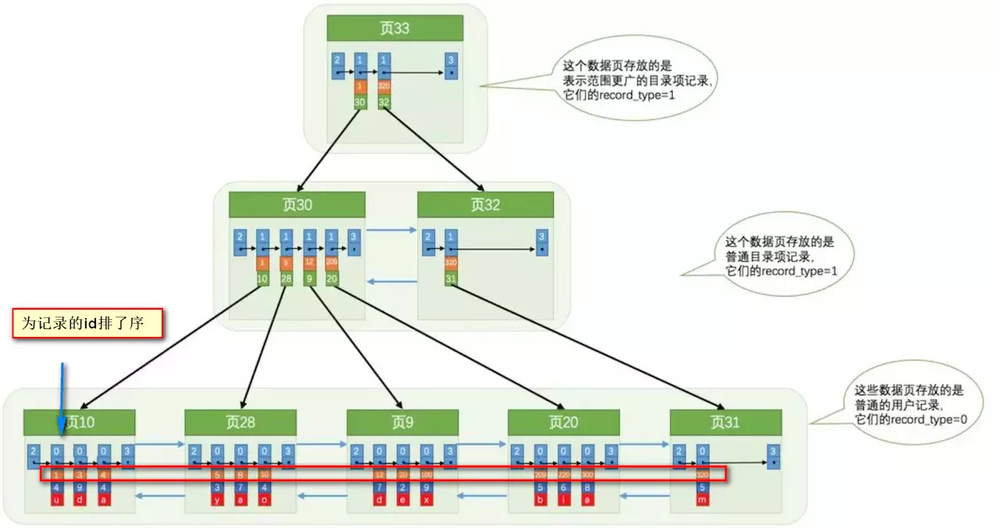

# 索引总结

## 为什么使用索引
1. 通过创建唯一性索引，数据库中每一行数据的唯一性；
2. 可以大大加快数据的检索速度（大大减少检索的数据量），这也是创建索引的最主要原因；
3. 帮助服务器避免排序和临时表
4. 将随机IO变成顺序IO
5. 可以加速表和表之间的连接，特别是实现数据的参考完整性特别有意义；

## 索引这么多优点，为什么不对表中的每一个列创建一个索引呢
1. 表中数据的更新过程要同时动态的维护索引，这样就降低了数据的维护速度；
2. 索引本身会增减空间物理开销，每一个索引都要占用一定的空间，如果建立聚簇索引就需要更大空间；
3. 创建索引和维护索引要耗时，这种时间根据数据量的增加而增加；
   
## 使用索引的注意事项

1. 适合使用索引的字段：
   经常搜索的列上、WHERE子句经常判断的列上、需要排序的列上（索引已排序，可以利用索引加快排序）、大中型表索引是有效的但是特大型表的话就需要维护开销不适合、经常用于连接的列上，这些列都是一下外键，加快连接；
2. 避免where子句对字段施加函数，造成无法命中索引；
3. 使用InnoDB使用自增主键作为主键，即使是逻辑主键也不要使用业务主键；
4. 某一列设置为default null，where可以走索引，另外索引列是可以设置null值的，但是不建议，很多时候null值无法参与某些运算；
5. 删除长期未使用的索引，不用的索引早场不必要的性能损耗；
6. 使用limit offset查询缓慢的时候，借助索引来提高性能；

## MySQL索引主要使用的两种数据结构
### 哈希索引
哈希索引来说，底层是是哈希表，绝大多的需求为单条记录查询的时候可以选择哈希索引，查询性能最快，绝大多数场景建议选择Btree索引；

### BTree索引

**MyISAM索引**
B+树叶节点的data域就是数据记录的地址。在索引检索的时候，首先按照B+Tree搜索算法搜索索引，如果指定的key存在则取出其data域值，然后以data域的值为地址读取对应的数据记录，这被称之为非聚簇索引；

**InnoDB索引**
其数据文件本身就是索引文件，相比于MyISAM，索引文件和数据文件是分离的，其表数据文件本身就是按照B+Tree组织的一个索引结构，树的叶节点data域保存了完整的数据记录。这个索引的key是数据表的主键，因此InnoDB表数据文件本身就是主索引。这被称为“聚簇索引（或聚集索引）”，而其余的索引都作为辅助索引，辅助索引的data域存储相应记录主键的值而不是地址，这也是和MyISAM不同的地方。在根据主索引搜索时，直接找到key所在的节点即可取出数据；在根据辅助索引查找时，则需要先取出主键的值，在走一遍主索引。 因此，在设计表的时候，不建议使用过长的字段作为主键，也不建议使用非单调的字段作为主键，这样会造成主索引频繁分裂。

## 覆盖索引介绍
### 什么是覆盖索引
如果一个索引包括所有需要查询的字段的值，我们称之为覆盖索引，我们知道InnoDB存储索引中，如果不是主键索引，叶子结点存储的是主键+列值。最终还是要回表，也就是在通过主键查找一次，覆盖索引就是把要查询出的列和索引是对应的，不做回表操作！

### 覆盖索引使用实例
现在我创建了索引，下面执行下面的sql语句：

    select username , age from user where username = 'Java' and age = 22;

在查询数据的时候，要查询出的列在叶子结点都存在，所以不用回表；

### 选择索引和编写利用这些索引的查询的3个原则
1. 单行访问是很慢的，如果从服务器存储中读取一个数据块只是为了获取其中一行，那么久浪费了很多工作。最好读取的块中包含尽可能多的行。使用索引可以创建位置引，提高效率；
2. 按顺序访问范围数据是很快的，第一，顺序IO不需要多次磁盘寻道，所以比随机IO要快很多；第二，如果服务器能够按需要顺序读取数据，那么久不需要额外的排序操作，并且GROUPBY查询也无须再做排序和将行按组进行聚合计算；
3. 索引覆盖查询时很快的。如果一个索引包含查询所需要的的列，那么存储引擎就不需要再回表查找行，避免单行查询；

## 为什么索引能提高查询速度
### MySQL的基本存储结构说起

1. 各个数据页可以组成一个双向链表；
2. 每个数据页中的记录又可以组成一个单向链表；
   每个数据也都会为存储在其中的数据生成一个页目录，通过主键查找某条记录的时候可以根据二分法快速定位到对应的槽，遍历该槽即可快速找到指定的记录；

   以其他列作为搜索条件的话，只能从最小记录开始依次遍历每条记录；

执行select * from user where indexname = 'xxx'这样没有进行任何优化的sql语句：

1. 定位到记录所在的页，需要遍历双向链表，找到所在的页；
2. 从所在的页中查对应的记录：由于不是根据主键查询，只能遍历所在页中单链表；

### 使用索引之后

很明显的是：没有用索引我们是需要遍历双向链表来定位对应的页，现在通过 “目录” 就可以很快地定位到对应的页上了！（二分查找，时间复杂度近似为O(logn)）

## 索引内容的补充

### 最左前缀原则
按照一定顺序引用多列，这种索引叫做联合索引；最左前缀原则就是，如果查询条件精确匹配索引的左边连续一个列或者几列，则此列就可以使用；

### 注意避免冗余索引
冗余索引就是索引功能相同，能够命中后者，就肯定能命中前者，那么就是冗余索引如（name,city)和(name)这两个索引就是冗余索引；

》》》》》》》》》》》》》》》》》》》》》》

## B树和B+树的区别

1. 所有的B树都是存储key和data的，B+树是叶子节点存储key和data其他上层节点存储key；
2. B树的叶子节点是分离的，B+树的叶子结点是用双向两边连接的；
3. B树的检索相当于对节点做二分查找，可能没有到叶子节点就结束了，但是B+树的检索比较稳定，任何查找都是从根节点到叶子节点的过程；

## Hash索引和B+树索引优劣分析
Hash索引模块定位快，存在Hash冲突，最大的问题是Hash索引不支持顺序和范围查询；

## 索引类型

### 主键索引
数据表的主键列使用的就是主键索引，一张数据表只能是主键，并且主键不能null，不能重复。
在mysql的InnoDB中，当没有显式指定的主键时，先检查有没有唯一索引的字段，如果有，则选择该字段为默认的主键，否则InnoDB为默认的主键，否则InnoDB会自动创建一个6Byte的自增主键；

### 二级索引
二级索引又称之为辅助索引，是因为二级索引的叶子节点存储的数据是主键。二级索引定位到主键的位置。
唯一索引，普通索引，前缀索引属于二级索引；

**唯一索引**：唯一索引也是一种约束，唯一索引的属性不能出现重复的数据，但是允许数据为null，一张表运行创建多个唯一索引；
**普通索引**：普通索引的唯一作用就是为了快速查询数据，一张表允许创建多个普通索引，并且允许数据重复和NULL；
**前缀索引**：前缀索引只适用于字符串类型的数据。前缀索引是对文本的前几个字符创建索引，相比普通索引建立的数据更小， 因为只取前几个字符。
**全文索引**：全文索引主要是为了检索大文本数据中关键字的信息，是目前搜索引擎中使用是一种技术；

## 聚集索引和非聚集索引
### 聚集索引
聚集索引就是索引结构和数据存放在一起的索引，主键索引就是聚集索引；

### 聚集索引的优缺点
聚集索引查询速度非常快，因为整个B+树本身就是一颗多叉平衡树，定位到索引的节点相当于定位到了数据；

缺点：
**依赖于有序的数据**：B+树是多路平衡树，如果索引的数据不是有序的，那么就需要在插入的时候排序，如果数据是整形还好，否则类似于字符串或UUID这种又长又难比较的数据，插入或者查找的速度肯定是比较慢的；
**更新代价大**：如果对索引列的数据被修改时，那么对应的索引页将会修改，而且叶子节点存放数据，修改代价比较大，对于主键索引一般不可被修改；

## 非聚集索引
将索引结构和数据分开存放的索引；

非聚集索引的叶子节点并不一定存放数据的指针， 因为二级索引的叶子节点就存放的是主键，根据主键再回表查数据。

### 非聚集索引的优缺点
更新代价比聚集索引要小；

跟聚集索引一样，非聚集索引依赖于也依赖于有序的数据；
可能会二次查询(回表)：查到主键之后，可能还需要根据指针或者主键再到数据文件中查询；

非聚集索引不一定回表查询。如果用户准备使用SQL查询用户名，而用户名字段正好建立了索引，直接返回对应的name就可以了，无须回表查询，即使是MYISAM也是这样的，虽然MYISAM主键索引确实需要回表，因为他的主键索引的叶子节点存放的是指针，但是如果SQL查询的是主键呢，主键索引本身的key就是主键，查到返回就行了。

