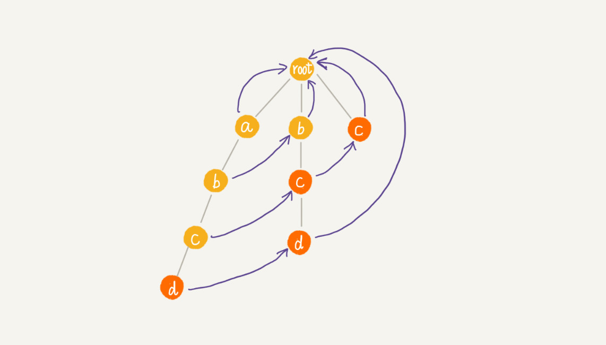

# AC自动机：如何用多模式串匹配实现敏感词过滤功能呢？
很多网站有一些敏感词过滤功能，这些功能如何实现的呢？

这些功能最基本的原理就是字符串的匹配算法，也就是通过维护一个敏感词的字典，当用户输入一段文字内容之后，通过字符串匹配算法，来查找用户输入的这段文字，是否包括敏感词，如果有就用“***”替代；

**如何实现一个高性能的敏感词过滤系统呢？**

## 基于单模式串和Trie树实现的敏感词过滤

多模式串匹配算法，就是在多个模式串和一个主串之间做匹配，也就是说，在一个主串中查找多个模式串。

Trie树就是一种多模式串匹配算法，如何用Trie树实现敏感词过滤呢？

我们首先对敏感词字典进行预处理，构建成Trie树结构，这个预处理的操作只需要做一次，如果敏感词字典动态更新了，比如删除，添加一个敏感词，那我们只需要动态的更新一下trie树就可以了；

我们把用户输入的内容作为主串，从第一个字符（假设是字符C）开始，在Trie树中匹配，当匹配到Trie树的叶子节点，或者中途遇见不匹配的字符的时候，我们将主串的开始匹配位置后移一位，也就是从字符C的下一个字符开始重新在Trie树中匹配；

这种方法类似于BF算法，单模式中KMP算法对BF算法进行改造，引进next数组，可以一次性向后多滑动几位；借鉴单模式串的改进方法，能否堆多模式串Trie树进行改进呢？进一步提高Trie树的效率呢？这时就要用到AC自动机了；

## 经典的多模式串匹配算法：AC自动机

Trie树和AC自动机之间就像BF算法和KMP算法之间的关系一样；
**AC自动机实际上就是在Trie树之上，加了类似于KMP算法的next数组，只不过此处的next数组是构建在树上罢了**

    public class AcNode {
        public char data;//节点的值
        public AcNode[] children = new AcNode[26];//AC自动机的孩子节点数组
        public boolean isEndingChar = false;//是否是结尾字符
        public int length = -1;//结尾字符时，字符串长度
        public AcNode fail;//失败指针
        public AcNode(char data){
            this.data = data;
        }
    }

所以AC自动机上包含两个操作：
1. 将多个模式串构建成Trie树；
2. 在Trie树上构建失败指针；

构建Trie树上节已经讲述，**如何在Trie树上构造失败指针？**

使用以下例子，这里有4个模式串，分别是串c，bc，bcd，abcd；主串是abcd。
首先构造Trie树，如下：

**看懂接下来的内容，首先要理解KMP算法中next数组的构建过程**

假设我们沿着Trie树走到了p节点，也就是下图中的紫色节点，那p的失败指针就是从root走到紫色节点形成的字符串abc，跟所有模式串前缀匹配的最长后缀子串，就是箭头指的bc模式串；

字符串 abc 的后缀子串有两个 bc，c，我们拿它们与其他模式串匹配，如果某个后缀子串可以匹配某个模式串的前缀，那我们就把这个后缀子串叫作可匹配后缀子串。

我们从所有可匹配后缀子串中，找出最长的一个，就是最长匹配后缀子串，我们将p节点的失败节点执行那个最长匹配后缀子串的最后一个节点，就是图中箭头指向的节点；

计算每个节点的失败指针这个过程有些复杂，但其实我们把树中相同深度的节点放在一层，那么某个节点的失败指针只有可能出现在他所在层的上一层。

像KMP算法那样，当我们求某个节点的失败指针的时候，我们应该已经求得了深度更小的那些节点的失败指针来推导；实际上失败指针的构建过程就是一个按层遍历树的过程；

首先root的失败指针是null，也就是指向自己；**当我们已经求得了某个节点的p的失败指针之后，如何寻找他的子节点的失败指针呢？**

我们假设节点p的失败指针指向q，我们看p的子节点pc对应的字符，是否也可以在节点q的子节点中找到，如果找到了子节点q的一个子节点qc，对应的字符跟节点pc对应的字符相同则节点pc的失败指针指向节点qc；

如果节点q中，没有子节点的字符等于pc包含的字符，则令q = q->fail（fail表示失败指针）继续上面的查找，直到q是root为止，如果找到相同子节点，就让节点pc的失败指针指向root；

具体的代码实现；

    /**
     * 寻找失败节点
     * @param root
     */
    public void buildFailurePointer(AcNode root){
        Queue<AcNode> queue = new LinkedList<>();
        root.fail = null;
        queue.add(root);
        while(!queue.isEmpty()){
            //遍历Trie树
            AcNode p = queue.remove();
            for(int i = 0; i < 26; i++){
                //依次取p的孩子pc
                AcNode pc = p.children[i];
                //如果pc的孩子节点为空，下一个孩子节点
                if(pc == null) continue;
                //如果p节点是根节点那么失败节点也为根节点
                if(p == root){
                    pc.fail = root;
                }else{
                    //如果p不是根节点，取p的失败节点
                    AcNode q = p.fail;
                    //当q不为null时
                    while(q != null){
                        //取q的失败节点的孩子节点
                        AcNode qc = q.children[pc.data - 'a'];
                        //判断p的孩子节点好失败节点的孩子节点是否相同，相同则找到p孩子节点的失败节点
                        if(qc != null){
                            pc.fail = qc;
                            break;
                        }
                        //否则继续寻找失败节点的失败节点，直到失败节点为null停止
                        q = q.fail;
                    }
                    //如果失败节点是null，就把失败节点对应为根节点
                    if(q == null){
                        pc.fail = root;
                    }
                }
                queue.add(pc);
            }
        }
    }

所以上述例子的失效指针构造完之后，AC自动机是下面的样子；

**如何在AC自动机上匹配主串？**

在匹配过程中，主串从0开始，AC自动机从指针root开始，假设模式串是b主串是a；

1. 如果p执行的节点有一个等于b[i]的子节点x，我们就更新p指向x，这个时候我们需要通过失败指针，检测一系列失败指针为结尾的路径是否是模式串。这一句不好理解，结合代码看，处理完之后，我们i加1，继续上述过程；
2. 如果p指向的节点没有等于b[i]的子节点，那么失败指针就排上用场了，我们让p=p->fail，然后继续这两个过程；

    /**
     * ac自动机匹配
     * @param text
     */
    public void match(char[] text){
        int n = text.length;
        AcNode p = root;
        for(int i = 0; i < n; ++i){
            int idx = text[i] - 'a';
            while(p.children[idx] == null && p != root){
                p = p.fail; //孩子节点没有办法匹配，找到失败指针继续匹配
            }
            //继续往下匹配
            p = p.children[idx];
            if(p == null) p = root; //如果没有匹配的，从root开始重新匹配
            AcNode tmp = p;
            //打印出可以匹配的模式串
            while(tmp != root){
                if(tmp.isEndingChar == true){
                    int pos = i - tmp.length + 1;
                    System.out.println("匹配起始下标" + pos + "; 长度" + tmp.length);
                }
                tmp = tmp.fail;
            }
        }
    }

## 解答开篇
上述的AC自动机就是一个敏感词过滤系统，只需稍加改造将匹配的字符串用“***”代替即可；

**AC自动机实现的敏感词过滤系统，是否比单模式串匹配方法更高效**

首先，我们需要将敏感词构建成 AC 自动机，包括构建 Trie 树以及构建失败指针。

Trie树的构建时间复杂度是O(m*len),其中len表示敏感词平均长度，m表示敏感词的个数

构建失败指针的复杂度是：假设Trie树中总的节点个数是k，每个节点构建失败指针的时候，最耗时的的环节是while 循环中的 q=q->fail，每运行一次这个语句，q 指向节点的深度都会减少 1，而树的高度最高也不会超过 len，所以每个节点构建失败指针的时间复杂度是 O(len)。整个失败指针的构建过程就是 O(k*len)。

**AC自动机做匹配的时间复杂度是多少呢**

for 循环依次遍历主串中的每个字符，for 循环内部最耗时的部分也是 while 循环，而这一部分的时间复杂度也是 O(len)，**所以总的匹配的时间复杂度就是 O(n*len)**。因为敏感词并不会很长，而且这个时间复杂度只是一个非常宽泛的上限，**实际情况下，可能近似于 O(n)，**所以 AC 自动机做敏感词过滤，性能非常高。

实际上，因为失效指针可能大部分情况下都指向 root 节点，所以绝大部分情况下，在 AC 自动机上做匹配的效率要远高于刚刚计算出的比较宽泛的时间复杂度。只有在极端情况下，如图所示，AC 自动机的性能才会退化的跟 Trie 树一样。

## 内容小结
整个 AC 自动机算法包含两个部分，第一部分是将多个模式串构建成 AC 自动机，第二部分是在 AC 自动机中匹配主串。第一部分又分为两个小的步骤，一个是将模式串构建成 Trie 树，另一个是在 Trie 树上构建失败指针。

## 课后思考

到此为止，字符串匹配算法我们全都讲完了，你能试着分析总结一下，各个字符串匹配算法的特点和比较适合的应用场景吗？

1. BF： 简单场景，主串和模式串都不太长, O(m*n)
2. KP：字符集范围不要太大且模式串不要太长， 否则hash值可能冲突，O(n)
3. naive-BM：模式串最好不要太长（因为预处理较重），比如IDE编辑器里的查找场景； 预处理O(m*m), 匹配O(n)， 实现较复杂，需要较多额外空间.
4. KMP：适合所有场景，整体实现起来也比BM简单，O(n+m)，仅需一个next数组的O(n)额外空间；但统计意义下似乎BM更快，原因不明.
5. naive-Trie: 适合多模式串公共前缀较多的匹配(O(n*k)) 或者 根据公共前缀进行查找(O(k))的场景，比如搜索框的自动补全提示.
6. AC自动机: 适合大量文本中多模式串的精确匹配查找, 可以到O(n).