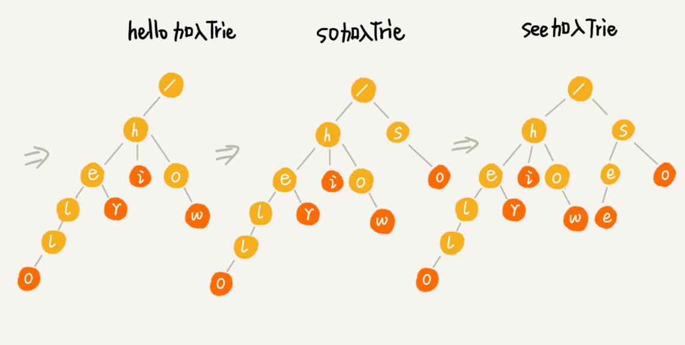
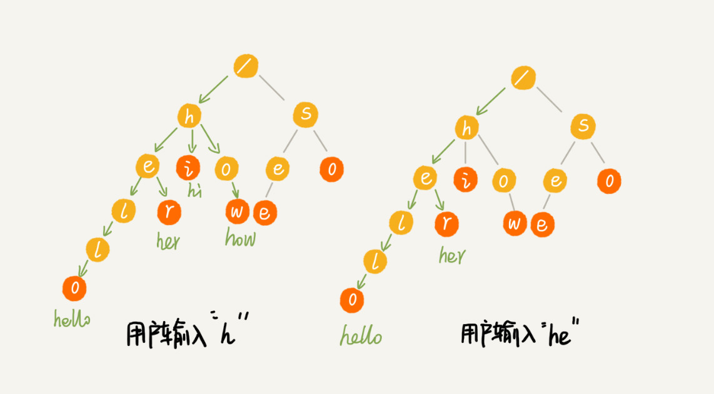

# Trie树：如何实现搜索引擎的搜索关键字提示功能？

搜索引擎关键词提示功能，基本上都用过，底层的最基本原理就是今天要讲的这种数据结构；Trie树；

## 什么是Trie树？

Trie树，也叫做字典树，顾名思义，它是一个树形结构。是一种专门处理字符串匹配的数据结构，用来解决在一组字符串集合中快速查找某个字符串的问题。

上述的问题有很多解决方法，比如散列表，红黑树等等。但是Trie树在解决问题上有它独特的优点；

假设现在我们有6个字符串，他们分别是：how,hi,her,hello,so,see。我们希望可以在这里面多次查找某个字符串是否存在，如果每次都去匹配这六个字符串，效率太低；

这个时候是不是可以对6个字符做一下预处理，组织成Trie树的结构，之后每次查找都是在Trie树中匹配；

**Trie树的本质，就是利用字符串之间的公共前缀，将重复的前缀合并在一起**；
例如下图所示：

其中根节点不包含任何信息，每个节点表示一个字符串中的字符，从根节点到红色节点的一条路径表示一个字符串（红色节点并不都是叶子结点）

如下图简单的一个Trie树构造的分解过程，构造的每一步，都相当于往Trie树中插入一个字符串；

当我们在Trie树中查找一个字符串的时候，比如查找字符串“her”,我们就将要查找的字符分隔开成单个的字符h，e，r然后从Trie树中根节点去匹配；下图绿色路径就是匹配过程；

如果我们查找的字符串是he，如图所示he匹配路径，最后一个节点并不是红色的，也就是说，he是某个字符串的前缀子串。但是并不能完全匹配任何字符串；

## 如何实现一棵Trie树？

Trie树主要有两个操作，**一个是将字符串集合构成Trie树。**这个过程分解开来的话，就是一个将字符串插入到Trie树的过程。**另一个是在Trie树中查询一个字符串**;

首先我们要知道如何存储一个Trie树，在二叉树中左右节点是通过两个指针来存储的，在Trie树这种多叉树中如何存储一个节点的指针呢？

经典的做法是，借助散列表的思想，我们通过一个下标与字符一一对应的数组，来存储子节点的指针；

假设我们只有字符串中从a到z这26个小写字母，我们再数组中下标为0的位置存储a的指针，下标为1的位置存储b，下标为25的地方存储z的指针，如皋港某个字符的子节点不存在，我们就再对应位置存储null；

代码实现就是：

    class TrieNode {
        char data;
        TrieNode children[26];
    }

当我们再Trie树中查找字符串的时候，我们就可以通过字符的ASCII码，迅速的找到匹配子节点的指针，比如：d的ASCII码减去a的ASCII码就是3，那么下标3的位置存储的就d的指针；

描述这么多将上面的操作实现成代码为：

    /**
    * Trie树
    */
    public class Trie {
        private TrieNode root = new TrieNode('/');

        /**
        * Trie树插入一个新的字符串
        * @param text
        */
        public void insert(char[] text){
            TrieNode p = root;
            for(int i = 0; i < text.length; i++){
                int index = text[i] - 'a';
                if(p.children[index] == null){
                    TrieNode newNode = new TrieNode(text[i]);
                    p.children[index] = newNode;
                }
                p = p.children[index];
            }
            p.isEndingChar = true;
        }

        /**
        * 查找一个模式串是否存在
        * @param pattern
        * @return
        */
        public boolean find(char[] pattern){
            TrieNode p = root;
            for(int i = 0; i < pattern.length; i++){
                int index = pattern[i] - 'a';
                if(p.children[index] == null){
                    return false;
                }
                p = p.children[index];
            }
            if(p.isEndingChar == false){
                return false;
            }else{
                return true;
            }
        }
    }

**在Trie树中，查找某个字符串的时间复杂度是多少呢？**

构建Trie树的过程需要扫描所有字符串，时间复杂度是O(n),(n表示所有字符串的长度和)。但是构建成功之后，后续的查询操作会非常高效；

查询操作，我们只需要对比大约k个节点，构建好Trie树之后，在其中查找字符串的时间复杂度度是O(k),k表示要查找的字符串的长度；

## Trie树真的很消耗内存吗？
有一种说法Trie树非常消耗内存，用的是一种空间换时间的思路，这是为什么呢？

正如上面所说的如果字符串中只包含a到z这26个小写字母，那么每个节点都要存储一个长度为26的数组，并且每个数组存储一个8字节的指针，节点一个节点只有很少的子节点，远远小于26个，只要3，4个我们也要维护一个长度为26的数组；

Trie树的本质是为了避免重复存储一组字符法相同前缀子串，但是现在每个字符的存储远远大于一个字符，每个节点就会额外需要26*8=208个字节，这还只是包含26个小写字母呢，如果是汉字呢？

实际上Trie树的变体有很多，比如，缩点优化。就是将只有一个子节点的节点，而且此节点不是一个串的结束节点，可以将此节点与子节点合并；

## Trie树与散列表、红黑树的比较

字符串的匹配问题说白了就是数据的查找问题，对于支持动态数据高效操作的数据结构，如散列表，红黑树，跳表的功能
在一组字符串的查找上，Trie树其实表现的并不好；

第一，字符串中包含的字符集不能太大。我们前面讲到，如果字符集太大，那存储空间可能就会浪费很多。即便可以优化，但也要付出牺牲查询、插入效率的代价。

第二，要求字符串的前缀重合比较多，不然空间消耗会变大很多。

第三，如果要用 Trie 树解决问题，那我们就要自己从零开始实现一个 Trie 树，还要保证没有 bug，这个在工程上是将简单问题复杂化，除非必须，一般不建议这样做。

第四，我们知道，通过指针串起来的数据块是不连续的，而 Trie 树中用到了指针，所以，对缓存并不友好，性能上会打个折扣。

## 解答开篇

如何利用Trie树，实现搜索关键词的提示呢？

我们假设关键词词库由热门搜索关键词组成，我们将这个词库构建成一个Trie树。当用户输入其中某个单词的时候，把这个词作为一个前缀子串在Trie树中匹配，我们假设词库中只有hello、her、hi、how、so、see这6个关键词，当用户输入了字母h的时候，我们就把以h为前缀的hello，hi，how，her展示在搜索提示栏中。当用户继续键入字母e的时候，我们就把以he为前缀的hello，her展示在搜素提示栏中；这就是搜索关键词的最基本算法原理；

这只是最基本的实现原理，如果再往下思考，还有以下的问题：

1. 刚刚的思路只针对英文的搜索关键词提示，对于更加复杂的中文来说，词库中的数据又该如何构建Trie树呢？
2. 如果词库中很多关键词，在搜索提示的时候，用户输入关键词，作为前缀的Trie树中，可以匹配的关键词很多，如何选择展示那些内容呢？
3. 像google这样的搜索引擎，用户拼写错误的情况下，Google还是可以使用正确的拼写来做关键词提示，这些又是怎么做到呢？

## 内容小结
Trie 树是一种解决字符串快速匹配问题的数据结构。如果用来构建 Trie 树的这一组字符串中，前缀重复的情况不是很多，那 Trie 树这种数据结构总体上来讲是比较费内存的，是一种空间换时间的解决问题思路。
在 Trie 树中做字符串匹配还是非常高效的，时间复杂度是 O(k)，k 表示要匹配的字符串的长度
Trie 树的优势并不在于，用它来做动态集合数据的查找，因为，这个工作完全可以用更加合适的散列表或者红黑树来替代。Trie 树最有优势的是查找前缀匹配的字符串，比如搜索引擎中的关键词提示功能这个场景，

## 课后思考
Trie 树应用场合对数据要求比较苛刻，比如字符串的字符集不能太大，前缀重合比较多等。如果现在给你一个很大的字符串集合，比如包含 1 万条记录，如何通过编程量化分析这组字符串集合是否比较适合用 Trie 树解决呢？也就是如何统计字符串的字符集大小，以及前缀重合的程度呢？

依次读取每个字符串的字符构建 Trie 树，用散列表来存储每一个节点。每一层树的所有散列表的元素用一个链表串联起来，
求某一长度的前缀重合，在对应树层级上遍历该层链表，求链表长度，除以字符集大小，值越小前缀重合率越高。

遍历所有树层级的链表，存入散列表，最后散列表包含元素的个数，就代表字符集的大小。