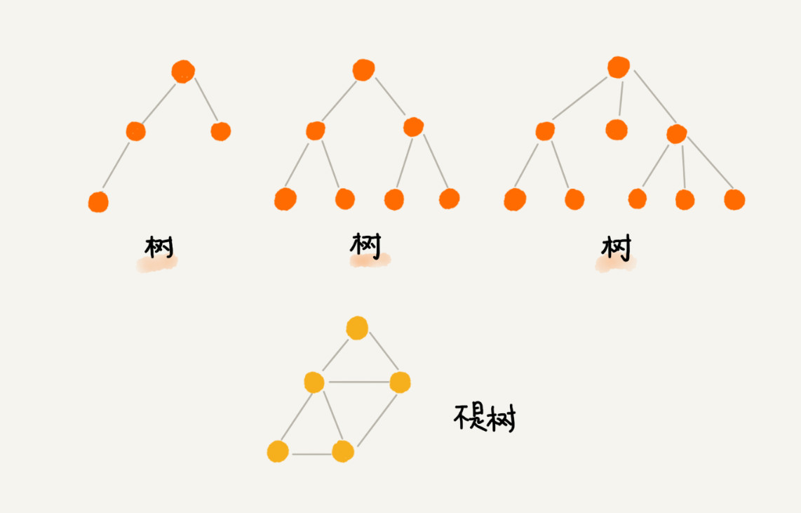

# 二叉树基础上：什么样的二叉树适合用数组来存储？

非线性数据结构，树。树这种数据结构比线性表的数据结构复杂的多，内容也比较多，所以我分四节来讲解。

**二叉树有哪几种存储方式？什么样的二叉树适合用数组来存储**

## 树（Tree）
什么是树？直接上图：

树中每个元素叫做“节点”；用来连接相邻节点之间的关系，叫做“父子关系”;

其中A节点是B节点的**父节点**，B节点是A节点的**子节点**。B,C,D这三个节点的父节点是同一个节点，所以他们之间互称**兄弟节点**。没有父节点的节点是**根结点**，E节点就是根节点。没有子节点的节点叫做**叶子节点**或者叶节点，比如图中的G,H,I,J,K,L都是叶子结点。

**树的高度，树的深度，树的层**

    节点的高度 = 节点到叶子节点的最长路径（边数）
    节点的深度 = 根节点到这个节点所经历的边的个数
    节点的层数 = 节点深度 + 1
    树的高度   = 根节点的高度

具体如下图：

高度这个概念要从下往上看，从最底层开始计数，并且计数的起点是0 。

深度这个概念从上往下看，从根节点开始往下度量，并且计数起点也是0 。

层数跟深度计数类似，不过计数起点是1，也就是根节点位于第一层。

## 二叉树（Binary Tree)
二叉树，顾名思义，每个节点最多两个叉，也就是两个子节点，分别是左子节点和右子节点。不过二叉树并不要求每个节点都有两个子节点，有的节点自由左子节点，有的只有右子节点。

图中，编号2的二叉树，叶子节点全都在最底层，除了叶子结点，每个节点都有左右两个子节点，这种二叉树就叫做**满二叉树**。

编号3的二叉树，所有的叶子结点都在最下面两层，最后一层的叶子节点，都靠左排列，并且除了最后一层，其它层的节点个数都要达到最大，这种二叉树叫做**完全二叉树**。

## 如何表示或者存储一颗二叉树？
想要存储一颗二叉树，我们有两种方法，一种基于指针引用的二叉链式存储法，一种是基于数组的顺序存储法。

### 链式存储法

### 顺序存储法
我们把根节点存储在下标为1的位置，左子节点存储在下标为 2 * i = 2 的位置，右子节点存储在 2 * i + 1 = 3的位置。

总结：如果节点X存储在数组中下标为i的位置，下标为 2 * i 的位置存储的就是左子节点，下标为 2 * i + 1 位置存储的就是右子节点。反过来，下标为i/2的位置存储的就是他的父节点。

一颗完全二叉树，所以仅仅浪费了一个下标为0的存储位置。如果是非完全二叉树，会浪费比较多的数组存储空间。

如果某棵二叉树是一棵完全二叉树，那用数组存储无疑是最节省内存的一种方式。因为数组的存储方式并不需要像链式存储法那样，要存储额外的左右子节点的指针。这也是为什么完全二叉树会单独拎出来的原因，也是为什么完全二叉树要求最后一层的子节点都靠左的原因。

## 二叉树的遍历

三种经典方法，**前序遍历、中序遍历和后序遍历**

前序遍历：树中任意结点来说，先打印这个节点，然后打印它的左子树，最后打印他的右子树。

中序遍历：树中任意结点来说，先打印左子树，然后打印它本身，最后打印它的右子树。

后序遍历：树中任意结点来说，先打印左子树，然后打印它的右子树，最后打印它本身。

**二叉树的前中后序遍历就是一个递归的过程**
递推公式如下：

    前序遍历的递推公式：
    preOrder(r) = print(r) -> preOrder(r -> left) -> preOrder(r -> right)
    中序遍历的递推公式：
    inOrder(r) = inOrder(r->left) -> print r -> inOrder(r -> right)
    后序遍历的递推公式：
    postOrder(r) = postOrder(r -> left) -> postOrder(r -> right) -> print r

相应的伪代码如下：

    void preOrder(Node* root) {
        if(root == null){
            return;
        }
        preOrder(root -> left);
        preOrder(root -> right);
    }

    void inOrder(Node* root){
        if(root == null){
            return;
        }
        inOrder(root -> left);
        print root;
        inOrder(root -> right);
    }

    void postOrder(Node* root){
        if(root == null) {
            return;
        }
        postOrder(root -> left);
        postOrder(root -> right);
        print root;
    }

代码实现：中序遍历

    public List<Integer> inorderTraversal(TreeNode root) {
        List list = new ArrayList<>();
        if(root == null){
            return list;
        }
        if(root.left != null){
            list.addAll(inorderTraversal(root.left));
        }
        list.add(root.val);
        if(root.right != null){
            list.addAll(inorderTraversal(root.right));
        }
        return list;
    }

**二叉树遍历的时间复杂度是多少呢？**
遍历操作的时间复杂度，跟结点的个数n成正比，也就是说，二叉树的时间复杂度是O(n).

## 解答开篇&内容小结
根节点、叶子节点、父节点、子节点、兄弟节点，还有节点的高度、深度、层数，以及树的高度。

二叉树中，有两种比较特殊的树，分别是满二叉树和完全二叉树。满二叉树又是完全二叉树的一种特殊情况。

二叉树既可以用链式存储，也可以用数组顺序存储。数组顺序存储的方式比较适合完全二叉树，其他类型的二叉树用数组存储会比较浪费存储空间。除此之外，二叉树里非常重要的操作就是前、中、后序遍历操作，遍历的时间复杂度是 O(n)，你需要理解并能用递归代码来实现。

## 课后思考
1. 给定一组数据，比如 1，3，5，6，9，10。你来算算，可以构建出多少种不同的二叉树？

n！个组合。

2. 我们讲了三种二叉树的遍历方式，前、中、后序。实际上，还有另外一种遍历方式，也就是按层遍历，你知道如何实现吗？

        public ArrayList<Integer> PrintFromTopToBottom(TreeNode root) {
            Deque<TreeNode> queue = new LinkedList<TreeNode>();
            ArrayList list = new ArrayList();
            if(root == null){
                return list;
            }
            //将根节点加入到队列中
            queue.add(root);
            //队列为空就结束循环
            while(!queue.isEmpty()){
                //取头节点
                TreeNode node = queue.peek();
                //将头节点弹出
                queue.poll();
                //将头节点的元素值加入到列表中
                list.add(node.val);
                //如果头节点有左右子节点就将子节点加入到队列中
                if(node.left != null){
                    queue.add(node.left);
                }
                if(node.right != null){
                    queue.add(node.right);
                }
            }
            return list;
        }