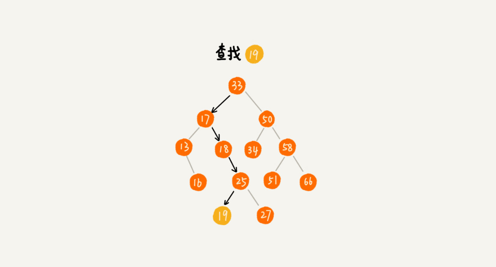
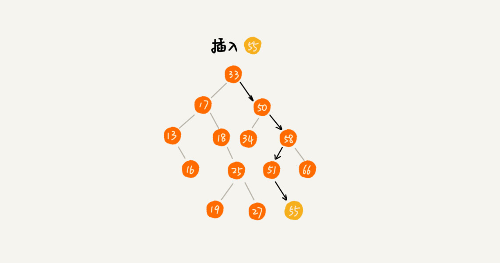

# 二叉树基础下：有了如此高效的散列表，为什么还需要二叉树？

二叉查找树，支持动态数据集合的快速插入、删除、查找操作。

之前说散列表也支持这样的操作，并且时间复杂度是O(1)。**既然有了这么高效的散列表，使用二叉树的这些地方是不是都可以替换成散列表呢？有没有哪些地方是散列表做不了，必须要用二叉树来做的呢？**

## 二叉查找树 （Binary Search Tree）
二叉查找树要求，在树中的任意一个节点，其左子树中的每一个节点的值，都要小于这个节点的值，而右子树节点的值都大于这个节点的值。

### 1、二叉查找树的查找操作
如何在二叉查找树中查找一个节点。我们先取根节点，如果他等于我们要查找的数据就返回。如果查找数据比根节点小，那就在其左子树中递归查找；如果要查找的数据比根节点的值大，那就在右子树中递归查找。

代码实现：

    public class BinarySearchTree {
        public static class Node{
            private int data;
            private Node left;
            private Node right;

            public Node(int data){
                this.data = data;
            }
        }
        private Node tree;

        public Node find(int data){
            Node p = tree;
            while (p != null){
                if(data < p.data){
                    p = p.left;
                }else if(data > p.data){
                    p = p.right;
                }else return p;
            }
            return null;
        }
    }

### 2、二叉查找树的插入操作
插入过程有点类似于插座操作。
如果插入数据比节点的数据大，并且节点的右子树为空，就将新数据直接插到右子节点的位置；如果不为空，就递归遍历右子树，查找插入位置。同理，如果要插入的数据比节点数值小，并且节点的左子树为空，就将新数据插入到左子节点的位置；如果不为空，就再递归遍历左子树，查找插入位置。

代码实现：

    public void insert(int data){
        if(tree == null){
            tree = new Node(data);
            return;
        }
        
        Node p = tree;
        while(p != null){
            if(data > p.data){
                if(p.right == null){
                    p.right = new Node(data);
                    return;
                }
                p = p.right;
            } else { //data < p.data
                if(p.left == null){
                    p.left = new Node(data);
                    return;
                }
                p = p.left;
            }
        }
    }

### 3、二叉查找树的删除操作
第一种情况是，如果删除的节点没有子节点，我们只需要直接将父节点中，指向要删除节点的指针置null，如图删除结点55；
第二种情况是，如果删除节点只有一个子节点（只有左子节点或者右子节点），我们需要更新父节点中，指向要删除节点的指针，让他指向删除节点的子节点就可以了。如图节点13；
第三种情况是，如果要删除节点中有两个子节点，这就比较麻烦了。我们需要找到这个节点的在右子树的最小节点，把它替换到要删除的节点上。然后再删除这个最小节点，因为最小节点肯定没有左子节点，所以我们可以用上面两条规则来删除这个最小节点。如图删除节点18；

代码实现：

    public void delete(int data){
        Node p = tree;
        Node pp = null;
        while(p != null && p.data != data){
            pp = p;
            if(data > p.data){
                p = p.right;
            }else{
                p = p.left;
            }
            if(p == null){
                return;
            }
            
            //要删除的节点有两个子节点
            if(p.left != null && p.right != null){
                Node minP = p.right;
                Node minPP = p;
                while(minP.left != null){
                    minPP = minP;
                    minP = minP.left;
                }
                p.data = minP.data;
                p = minP;
                pp = minPP;
            }
            
            Node child ;
            if(p.left != null) child = p.left;
            else if(p.right != null) child = p.right;
            else child = null;
            
            if(pp == null) tree = child;
            else if(pp.left == p) pp.left = child;
            else pp.right = child;
            
        }
    }

### 4、二叉查找树的其他操作

快速的查找最大节点和最小节点、前驱节点和后继节点。

按照中序遍历二叉查找树，可以输出有序的数据序列，时间复杂度是O(n)非常高效。

## 支持重复数据的二叉查找树
实际开发中，我们在二叉树中存储的，是一个包含很多字段的对象。我们利用对象的某个字段作为键值来构建二叉查找树，对象的其他字段叫做卫星数据。

如果存储的两个对象的键值相同，这种情况如何处理呢？
第一种方法：二叉查找树中每一个节点不仅会存储一个数据，因此我们通过链表和支持动态扩容的数组等数据结构，把值相同的数据都存储在同一个节点上。

第二种方法：在查找插入位置的过程中，如果碰到一个节点的值，与要插入数据的值相同，我们就将这个要插入的数据放到右子树，也就是把新插入的数据当做大于这个节点的值处理。

当要查找数据的时候，遇到值相同的节点，我们并不停止查找操作，而是继续在右子树中查找，知道遇到叶子节点，才停止。

对于删除操作，我们也需要先查找每个要删除的节点，然后再按前面讲的删除操作的方法，依次删除；

## 二叉查找树的时间复杂度分析
图中第一种二叉查找树已经退化成链表，查找的时间复杂度变成了O(n);

理想情况下，二叉查找树是一颗完全二叉树或满二叉树，这时插入、删除、查找的时间复杂度是多少呢？

不管操作是插入、删除还是查找，时间复杂度其实都跟树的高度成正比，也就是 O(height)。现在问题就转变成另外一个了，也就是，如何求一棵包含 n 个节点的完全二叉树的高度？

第 K 层包含的节点个数就是 2^(K-1)。

对于完全二叉树来说，最后一层的节点个数有点儿不遵守上面的规律了。它包含的节点个数在 1 个到 2^(L-1) 个之间（我们假设最大层数是 L

如果节点个数是n，那么n满足这样一个关系：

    n >= 1+2+4+8+...+2^(L-2)+1
    n <= 1+2+4+8+...+2^(L-2)+2^(L-1)

借助等比数列的求和公式，我们可以计算出，L 的范围是 [log2(n+1), log2n +1]。完全二叉树的层数小于等于 log2n +1，也就是说，完全二叉树的高度小于等于 log2n。

## 解答开篇

散列表的插入，删除，查找复杂度可以做到常量级O(1),二叉查找树的，插入，删除，查找操作时间复杂度才是O(logn)，因此为啥还要使用二叉查找树？

第一：散列表的数据是无序存储的，如果要输出有序数据，要先排序，而对于二叉查找树只需要中序遍历，就可以在O(n)的时间复杂度中，输出有序数据序列。

第二：散列表扩容耗时很多，而且遇到散列冲突，性能不稳定，尽管二叉查找树的性能不稳定，但在工程中我们最常用的平衡二叉查找树的性能非常稳定，时间复杂度稳定在 O(logn)。

第三：笼统的来说，尽管散列表的查找等操作的时间复杂度是常量级的，但因为哈希冲突的存在，这个常量不一定比logn小，所以实际查找速度可能不一定比O(logn)快，加上哈希函数的耗时，也不一定就比平航查找树的效率高。

第四：散列表的构造比二叉查找树要复杂，需要考虑的东西很多。比如散列函数的设计、冲突解决办法、扩容、缩容等。平衡二叉查找树只需要考虑平衡性这一个问题，而且这个问题的解决方案比较成熟、固定。

最后，为了避免过多的散列冲突，散列表装载因子不能太大，特别是基于开放寻址法解决冲突的散列表，不然会浪费一定的存储空间。

## 课后思考
今天我讲了二叉树高度的理论分析方法，给出了粗略的数量级。如何通过编程，求出一棵给定二叉树的确切高度呢？