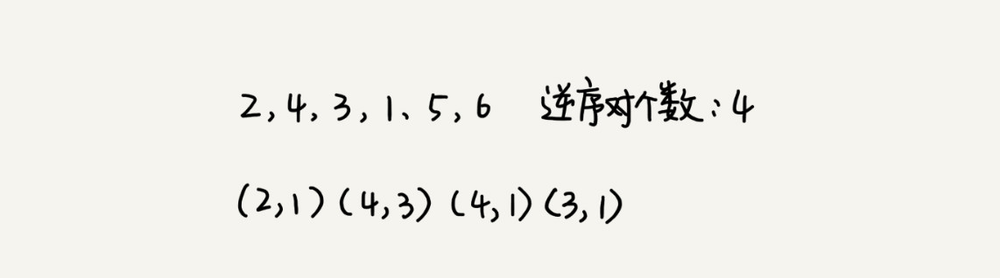
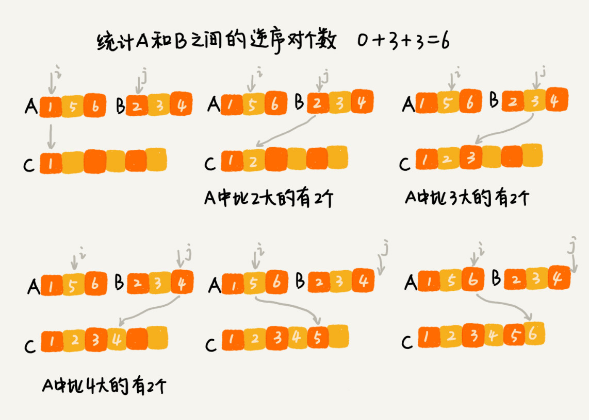

# 分治算法：谈一谈大规模计算框架MapReduce中的分治思想

MapReduce是Google大数据处理的三驾马车，另外两个是GFS和Bigtable。

## 如何理解分治算法？

分治算法的本质其实只有四个字，分而治之，也就是将原问题划分成n个规模更小，并且结构与原问题相似的子问题，递归的解决这些子问题，然后在合并其结果，就能得到原问题的解；

**分治算法是一种处理问题的思想，递归是一种编程技巧**。

在每一层递归中都会涉及这样三个操作：

1. 分解：将原问题分解成一系列子问题；
2. 解决：递归的求解各个子问题，若子问题足够小，则直接求解；
3. 合并：将子问题的结果合并成原问题；

分治算法能解决的问题一把满足一下这几个条件：
1. 原问题与分解成的小问题具有相同的模式；
2. 原问题分解成的子问题可以独立求解，子问题之间没有相关性，这一点是分治算法跟动态规划之间明显的区别，等到动态规划再具体对比两种算法；
3. 具有分解终止条件，也就是在问题足够小的时候可以直接求解；
4. 可以将子问题合并成原问题，而这个合并操作的复杂度不能太高，否则就起不到减少算法总体复杂度的效果了；

## 分治算法应用举例分析
计算一组数据的逆序度；

假设我们有 n 个数据，我们期望数据从小到大排列，那完全有序的数据的有序度就是 n(n-1)/2，逆序度等于 0；相反，倒序排列的数据的有序度就是 0，逆序度是 n(n-1)/2；

**如何编程求出一组数据的有序对个数或者逆序对个数呢？**因为有序对个数和逆序对个数的求解方式是类似的，所以你可以只思考逆序对个数的求解方法。

最笨的方法就是进行遍历求出整个逆序度，这样的遍历需要两重循环，时间复杂度是O(n^2);

使用分治算法来试试，我们使用分治算法的思想来求数组A的逆序度个数。我们将数组A1和A2，分别计算A1和A2的逆序对个数K1和K2，然后在计算A1与A2之间的逆序对个数K3.那数组A的逆序对个数就等于K1+K2+K3。

使用分治算法其中一个要求是，子问题合并的代价不能太大，否则就起不了降低时间复杂度的效果了。那回到这个问题，如何快速计算出两个子问题 A1 与 A2 之间的逆序对个数呢？

这个问题我们要借用归并排序算法，每次合并过程操作的时候就要计算逆序对个数，把那些计算出来的逆序对个数求和，就是整个数组的逆序对个数了；

代码实现：

    private int num = 0;

    /**
     * 逆序度计数
     * @param a
     * @param n
     * @return
     */
    public int count(int[] a,int n){
        num = 0;
        mergeSortCounting(a,0,n-1);
        return num;
    }

    /**
     * 归并排序，分而治之
     * @param a
     * @param p
     * @param r
     */
    private void mergeSortCounting(int[] a,int p,int r){
        if(p >= r){
            return ;
        }
        int q = (p + r) / 2;
        mergeSortCounting(a,p,q);
        mergeSortCounting(a,q+1,r);
        merge(a,p,q,r);
    }

    /**
     * 合并过程，加逆序度计数
     * @param a
     * @param p
     * @param q
     * @param r
     */
    private void merge(int[] a,int p,int q,int r){
        int i = p,j = q + 1,k = 0;
        int[] tmp = new int[r-q+1];
        while(i <= q && j <= r){
            if(a[i] <= a[j]){
                tmp[k++] = a[i++];
            }else{
                num += (q - i + 1);
                tmp[k++] = a[j++];
            }
        }
        while(i <= q){
            tmp[k++] = a[i++];
        }
        while(j <= r){
            tmp[k++] = a[j++];
        }
        for(i = 0; i <= r - p;i++){
            a[p+i] = tmp[i];
        }
    }

关于分治算法有两道比较经典的问题，可以自己练习一下。

1. 二维平面上有n个点，如何计算出两个距离最近的点；
2. 有两个n * n的矩阵A,B，如何快速求解两个矩阵的成绩 C=A * B

## 分治思想在海量数据处理中的应用
比如给10GB订单文件进行排序的需求，一个简单的排序问题，但因为数据量大，有10GB，也就无法直接单纯的用快排，归并算法来解决了；

要解决这种数据量大到内存装不下的问题，我们就可以合理利用分治算法，将海量数据集合根据某种方法，划分为几个小的数据集合，每个小的数据集合单独加载解决；

比如在这个订单金额排序的问题中，我们先讲数据按照金额区间进行分类，在对每个区间内的数据进行排序；

还可以将每个小区间的数据加载到不同的机器上并行处理；

## 解答开篇

为什么说 MapReduce 的本质就是分治思想？

那如果我们要处理的数据是 1T、10T、100T 这样子的，那一台机器处理的效率肯定是非常低的。而对于谷歌搜索引擎来说，网页爬取、清洗、分析、分词、计算权重、倒排索引等等各个环节中，都会面对如此海量的数据（比如网页）。所以，利用集群并行处理显然是大势所趋。

实际上，MapReduce 框架只是一个任务调度器，底层依赖 GFS 来存储数据，依赖 Borg 管理机器。它从 GFS 中拿数据，交给 Borg 中的机器执行，并且时刻监控机器执行的进度，一旦出现机器宕机、进度卡壳等，就重新从 Borg 中调度一台机器执行。

## 内容小结

分治算法用四个字概括就是“分而治之”，将原问题划分成 n 个规模较小而结构与原问题相似的子问题，递归地解决这些子问题，然后再合并其结果，就得到原问题的解。这个思想非常简单、好理解

两种分治算法的典型的应用场景，一个是用来指导编码，降低问题求解的时间复杂度，另一个是解决海量数据处理问题。比如 MapReduce 本质上就是利用了分治思想。