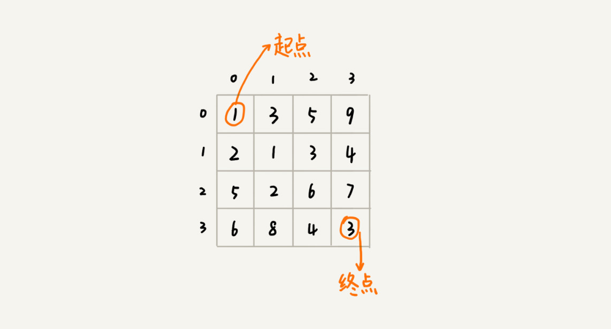
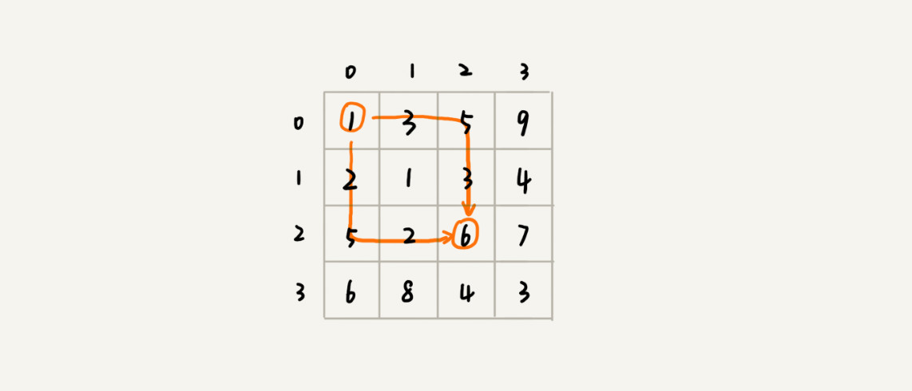
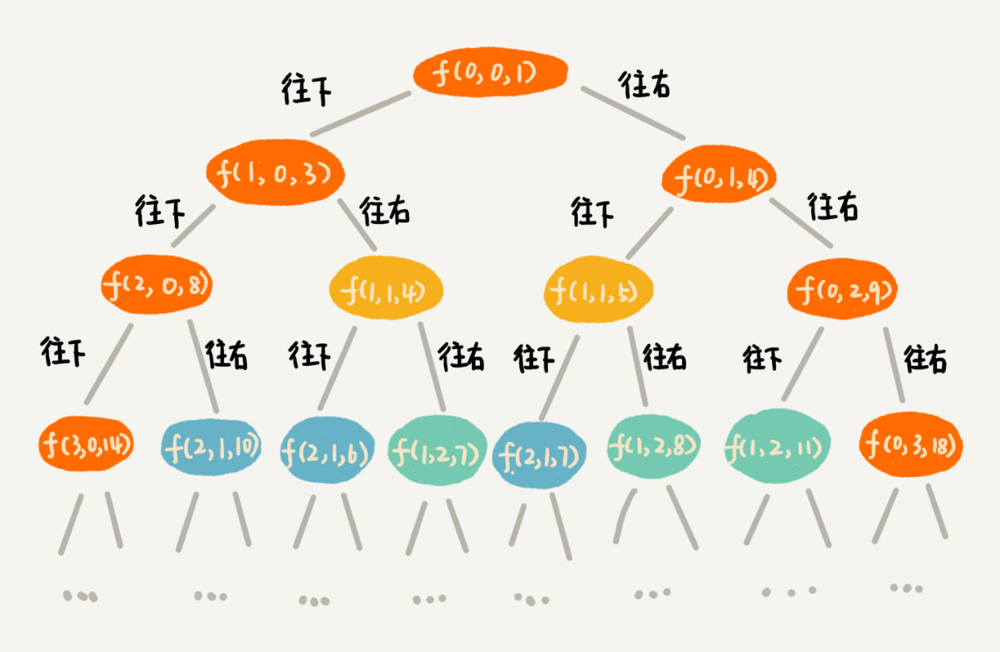

# 动态规划理论：一篇文章带你彻底搞懂最优子结构、无后效性和重复子问题

什么样的问题可以用动态规划解决？解决动态规划问题的一般思考过程是怎样的？贪心、分治、回溯、动态规划这四种算法思想的区别和联系？

## “一个模型三个特征”理论讲解

什么样的问题适合用动态规划来解决呢？
什么是**一个模型**？它指的是动态规划适合解决的问题的模型，这个模型可以称之为“**多阶段决策最优解模型**”；

一般是用动态规划来解决最优问题。而解决问题的过程，需要经历多个决策阶段。每个决策阶段都对应着一组状态。然后我们寻找一组决策序列，经过这组决策序列，能够产生最终期望求解的最优值。

什么是**三个特征**，分别是**最优子结构、无后效性和重复子问题**

### 1、最优子问题
最优子结构是指，问题的最优解包含子问题的最优解。反过来我们可以通过子问题的最优解，推导出来问题的最优解。通俗的理解就是后面阶段的状态可以通过前面阶段的状态推导出来；

### 2、无后效性
无后效性两层含义，第一层含义是，在推导后面阶段的问题时，我们只关心前面阶段的状态值，不关系这个状态是怎么一步一步推导出来的，第二层含义就是，某个阶段状态一旦确定，就不受之后阶段的决策影响；

### 3、重复子问题
简单来说就是，不同的决策序列，到达某个相同的阶段时，可能会产生重复的状态；

## “一个模型三个特征”实例剖析
假设我们有一个 n 乘以 n 的矩阵 w[n][n]。矩阵存储的都是正整数。棋子起始位置在左上角，终止位置在右下角。我们将棋子从左上角移动到右下角。每次只能向右或者向下移动一位。从左上角到右下角，会有很多不同的路径可以走。我们把每条路径经过的数字加起来看作路径的长度。那从左上角移动到右下角的最短路径长度是多少呢？

从(0,0)走到(n-1, n-1)，总共要走 2*(n-1) 步，也就对应着 2*(n-1) 个阶段。每个阶段都有向右走或者向下走两种决策，并且每个阶段都会对应一个状态集合。

我们把状态定义为min_dist(i,j)，其中 i 表示行，j 表示列。min_dist 表达式的值表示从 (0, 0) 到达 (i, j) 的最短路径长度。（多阶段决策最优解，符合动态模型的问题）；

这时候再看问题是否符合三个特征：

使用回溯法，画出递归图之后，会发现有重复节点，这说明到达节点对应的位置，有多种路线，说明这个问题存在重复子问题；

走到(i, j) 这个位置，我们只能通过 (i-1, j)，(i, j-1) 这两个位置移动过来，也就是说，我们想要计算 (i, j) 位置对应的状态，只需要关心 (i-1, j)，(i, j-1) 两个位置对应的状态；这就是所谓的前面阶段的状态确定下来之后，不会被后面阶段的决策所改变，这就是无后效性；

上述的我们只能由两个位置到达(i,j)，所以min_dist(i,j)必定是从min_dist(i-1,j)和min_dist(i,j-1)推导过来，这就说明这个问题符合最优子结构；

    min_dist(i,j) = w[i][j] + min(min_dist(i-1,j),min_dist(i,j-1));

## 两种动态规划解题思路总结
状态转移表法 和 状态转移方程法；

### 1、状态转移表法
我们可以先用简单的回溯算法解决，然后定义状态，每个状态表示一个节点，然后对应画出递归树。从递归树中，我们很容易可以看出来，是否存在重复子问题，以及重复子问题是如何产生的。以此来寻找规律，看是否能用动态规划解决；

找到重复子问题之后，两种思路，第一种是：**回溯算法加备忘录的方法**，避免重复子问题，从执行效率上这种方法和动态规划思路已经没有差别了，第二种是**状态转移表法；**

状态转移表法，先画出一个状态表，状态表一般都是二维的，可以想象成二维数组，其中每个状态表示三个量，行列值以及数组值；决策的过程就是填充状态表的过程；

    private int minDist = Integer.MIN_VALUE;

    /**
     * 回溯算法求最短距离
     * @param i 第i行
     * @param j 第j列
     * @param dist 到此的最短距离
     * @param w 棋盘
     * @param n 最后目的
     */
    public void minDistBT(int i,int j,int dist,int[][] w,int n){
        if(i == n && j == n){
            if(dist < minDist){
                minDist = dist;
                return;
            }
        }
        if(i < n){//往下走
            minDistBT(i + 1,j,dist+w[i][j],w,n);
        }
        if(j < n){//往右走
            minDistBT(i,j+1,dist+w[i][j],w,n);
        }
    }

上述代码画成递归树之后，一个状态包括三个量(i,j,dist),其中 i，j 分别表示行和列，dist 表示从起点到达 (i, j) 的路径长度。

图中，我们看出，尽管 (i, j, dist) 不存在重复的，但是 (i, j) 重复的有很多。对于 (i, j) 重复的节点，我们只需要选择 dist 最小的节点，继续递归求解，其他节点就可以舍弃了。

使用动态规划，我们先画一个二维状态，图表中的行、列表示棋子所在的位置，表中的数值表示从起点到这个位置的最短路径。

将上述过程中的填表过程翻译成代码就是：

    /**
     * 动态规划求距离
     * @param matrix 棋盘
     * @param n 要求位置
     * @return
     */
    public int minDistDP(int[][] matrix,int n){
        int[][] states = new int[n][n];
        int sum = 0;
        for(int j = 0; j < n; j++){
            sum += matrix[0][j];
            states[0][j] = sum;
        }
        sum = 0;
        for(int i = 0; i < n; i++){
            sum += matrix[i][0];
            states[i][0] = sum;
        }
        for(int i = 1; i < n; i++){
            for(int j = 1; j < n; j++){
                states[i][j] = matrix[i][j] + Math.min(states[i][j - 1],states[i - 1][j]);
            }
        }
        return states[n-1][n-1];
    }

### 2、状态转移方程法

上述转移方程法有点类似递归的方法，个问题如何通过子问题来递归求解，也就是所谓的最优子结构。根据最优子结构，写出递归公式，也就是所谓的状态转移方程。有了状态转移方程，代码实现就非常简单了。

    min_dist(i,j) = w[i][j] + min(min_dist(i-1,j),min_dist(i,j-1));

状态转移方程是解决动态规划的关键。如果我们能写出状态转移方程，那动态规划问题基本上就解决一大半了，而翻译成代码非常简单

    private int[][] matrix = {{1,3,5,9},{2,1,3,4},{5,2,6,7},{6,8,4,3}};
    private int n = 4;
    private int[][] mem = new int[n][n];

    public int minDistDP1(int i,int j){
        if(i == 0 && j == 0){
            return matrix[0][0];
        }
        if(mem[i][j] > 0) return mem[i][j];
        int minLeft = Integer.MAX_VALUE; //便于比较,使用最大值
        if(j - 1 >= 0){
            minLeft = minDistDP1(i,j-1);
        }
        int minUp = Integer.MAX_VALUE;
        if(i - 1 >= 0){
            minUp = minDistDP1(i-1,j);
        }
        int currMinDist = matrix[i][j] + Math.min(minLeft,minUp);
        mem[i][j] = currMinDist;
        return currMinDist;
    }

不是每个问题都同时适合这两种解题思路。有的问题可能用第一种思路更清晰，而有的问题可能用第二种思路更清晰，所以，你要结合具体的题目来看，到底选择用哪种解题思路。

## 四种算法思想比较
贪心，回溯，动态规划可以归为一类，而分治单独一类。
前三个算法解决问题的模型可以抽象成今天所讲的多阶段决策最优解模型，而分治算法解决的问题尽管大部分是最优解问题，大部分都不能抽象层多阶段决策模型；

回溯算法是个万金油，基本上贪心算法和动态规划能解决的问题我们都可以回溯算法解决，回溯算法相当于穷举算法，穷举所有的情况，对比得到最优解，大规模数据量的时候，回溯算法解决的执行效率太低；

尽管动态规划比回溯算法高效，但是不是所有问题都可以用动态规划解决。能用动态规划的需要满足三个特征，最优子结构，无后效性和重复子问题，再重复子问题这一点上，动态规划和分治算法的区分非常明显。分治算法要求分割成的子问题，不能有重复子问题，而动态规划正好相反，动态规划之所以高效，就是因为回溯算法实现中存在大量的重复子问题。

贪心算法实际上是动态规划算法的一种特殊情况。它解决问题起来更加高效，代码实现也更加简洁。不过，它可以解决的问题也更加有限。它能解决的问题需要满足三个条件，最优子结构、无后效性和贪心选择性（这里我们不怎么强调重复子问题）。
贪心选择性”的意思是，通过局部最优的选择，能产生全局的最优选择；

## 内容小结
一个模型”指的是，问题可以抽象成分阶段决策最优解模型。“三个特征”指的是最优子结构、无后效性和重复子问题。

状态转移表法解题思路大致可以概括为，**回溯算法实现 - 定义状态 - 画递归树 - 找重复子问题 - 画状态转移表 - 根据递推关系填表 - 将填表过程翻译成代码**。状态转移方程法的大致思路可以概括为，**找最优子结构 - 写状态转移方程 - 将状态转移方程翻译成代码。**

## 课后思考
硬币找零问题，我们在贪心算法那一节中讲过一次。我们今天来看一个新的硬币找零问题。假设我们有几种不同币值的硬币 v1，v2，……，vn（单位是元）。如果我们要支付 w 元，求最少需要多少个硬币。比如，我们有 3 种不同的硬币，1 元、3 元、5 元，我们要支付 9 元，最少需要 3 个硬币（3 个 3 元的硬币）。