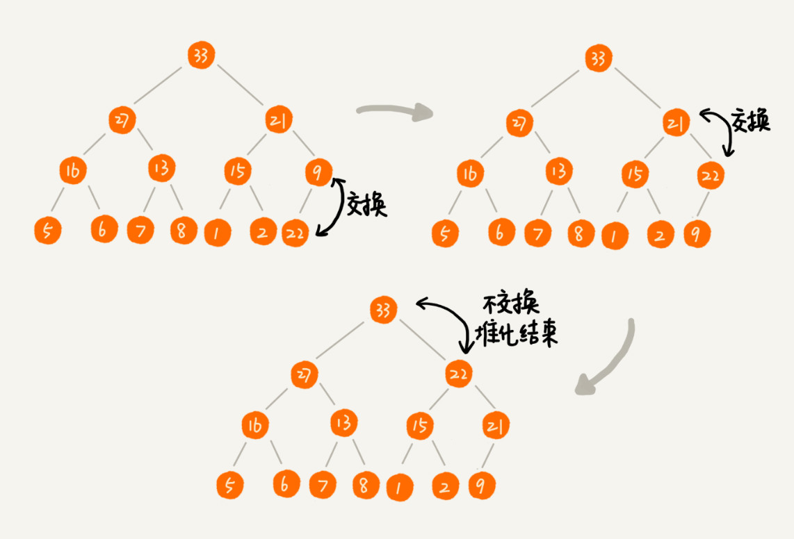

# 堆和堆排序：为什么说堆排序没有快速排序快呢？
一种特殊的树： 堆（heap）
堆排序是一种原地的，时间复杂度为O(nlogn)的排序算法；

快速排序，平均情况下，他的时间复杂度为O(nlogn).尽管这两种排序算法的时间复杂度都是O(nlogn).
但是，**在实际的软件开发中，快速排序的性能要比堆排序好，这是为什么呢？**

## 如何理解堆？
两点要求：
1. 堆是完全二叉树；
2. 堆中每一个节点的值都必须大于等于（或者小于等于）其子树中的每个节点的值；

完全二叉树的定义，除了最后一层，其它层的节点个数都是满的，最后一层的节点都靠左排列。

堆中的每个节点的值都必须大于等于或者小于等于其子树的每一个节点的值。时间上换一种说法，堆中每个节点的值都必须大于等于或者小于等于其左右子节点的值。

对于每个节点的值都大于等于子树中每个节点的值的堆，我们称之为大顶堆，反之称之为小顶堆。

其中1，2是大顶堆，3是小顶堆，4不是堆；

## 如何实现一个堆？

堆支持哪些操作以及如何存储一个堆。

完全二叉树适合用数组来存储，不需要左右子节点的指针，只需要单纯的通过数组的下标就可以实现。

（数组中下标为0的，不存储数据）

数组中下标为i的节点的左子节点，就是小标为i * 2的节点，右子节点就是下标为i * 2 + 1的节点，父节点就是小标为i/2的节点。

### 往堆中插入一个元素
如果，我们将新插入的元素直接插入到堆的最后，肯定是不符合堆的特性的，我们需要对其进行调整，让其满足堆的特性，这个过程起一个名字就叫做“堆化”。

堆化的方法实际上有两种，从下往上和从上往下。先讲从下往上的堆化过程。

堆化的过程非常简单，就是顺着节点所在的路径，向上或者向下对比然后进行交换。

堆化的分解图，让新插入的节点与父节点对比大小，如果不满足子节点小于等于父节点的大小关系，哦们就互换两个节点，一直重复这个过程指导父子节点之间满足刚刚说的那种大小关系。

代码实现：

    /**
     * 堆数据的插入
     * @param data
     */
    public void insert(int data){
        if(count >= n){
            return ;
        }

        ++count;
        a[count] = data;
        int i = count;
        while(i / 2 > 0 && a[i] > a[i / 2]){ //自上而下的堆化
            swap(a,i,i/2); //swap交换函数
            i = i / 2;
        }
    }

### 删除堆顶元素

假如我们构造的是大顶堆，堆顶元素就是最大的元素。当我们删除堆顶元素之后，就需要吧第二大的元素放到堆顶，那第二大的元素肯定出现在左右子节点中。然后我们再迭代的删除第二大节点，以此类推。

但是这个过程最后出来的堆不满足完全二叉树的条件。

改变一种思路就是，我们将最后一个节点放到堆顶，然后利用同样的父子节点对比方法，对于不满足父子节点关系的互换两个节点，知道父子节点之间满足大小关系为止。这就是从下往上的堆化方法。

因为一开始移除的是最后一个元素，在堆化的过程中，都是交换操作，不会出现数组的空洞。；

代码实现的过程：

    /**
     * 删除堆顶元素
     */
    public void removeMax(){
        if (count == 0){
            return;
        }
        a[1] = a[count];
        --count;
        heapify(a,count,1);
    }

    /**
     * 自上而下的堆化过程
     * @param a
     * @param n
     * @param i
     */
    public void heapify(int[] a,int n,int i){
        while(true){
            int maxPos = i;
            if(i*2 <= n && a[i] < a[i * 2]) maxPos = i * 2;
            if(i*2+1 <= n && a[i] < a[i*2 +1]) maxPos = i*2+1;

            if(maxPos == i) break;
            swap(a,i,maxPos);
            i = maxPos;
        }
    }

堆化的过程是顺着节点所在路径进行操作的，所以堆化的主要逻辑跟树的高度成正比，也就是O(logn)。插入数据和删除堆顶数据的主要逻辑都是堆化过程，所以网堆中插入一个元素和删除堆顶元素的时间复杂度都是O(logn).

## 如何给予堆实现排序呢？
借助堆实现的排序算法就叫做堆排序，这种排序方法的时间复杂度非常稳定，是O(nlogn),而且他还是原地排序算法。

排序的过程主要有，建堆和排序两个过程。

### 建堆
在原地建堆有两种思路。
第一种是，借助之间的知识，在堆中插入一个元素的思路，建设数组中包含n个数据，就是我们可以假设起初堆中只包含一个数据就是下标为1的数据，然后调用前面的插入操作，将之后的数据一次插入堆中。

第二种思路恰恰相反，第二种实现思路，是从后往前处理数组，并且每个数据都是从下往上堆化的。
具体的建堆步骤图如下，我们直接从第一个非叶子节点开始，一次堆化就行了。

    /**
     * 建堆
     * @param a
     * @param n
     */
    public static void bulidHeap(int[] a,int n){
        for(int i = n/2; i >= 1; --i){
            heapify(a,n,i);
        }
    }

这段代码中我们对n/2开始到1的数据进行堆化，小标是n/2+1到n的节点都是叶子节点，不需要我们进行堆化。

现在来看，建堆时间复杂度是多少呢？
每个节点堆化的时间复杂度是O(logn)。那么n/2+1个节点总的时间复杂度就是O(nlogn)。但是时间上堆排序的时间复杂度是O(n).

因为叶子节点不需要堆化，所以需要堆化的节点从倒数第二层开始，每个节点堆化过程中，需要比较和交换的节点个数，跟这个节点的高度k成正比。我们只需要将每个节点的高度求和，得出的就是建堆的时间复杂度。

我们将每个非叶子节点的高度求和，就是下面这个公式：

左右乘2错位相减，求和

最后结果为：

因为h = logn,带入公式S，就能S = O(n),所以建堆的时间复杂度是O(n);

### 排序
排序之后就已经按照大顶堆的规则组成堆，当堆顶元素移除之后，我们 把下标为n的元素放到堆顶，然后通过对话的方法，将剩下n-1个元素重新构建成堆。堆化完成之后，再取堆顶元素放到小标为n -1的位置。一种重复这个过程之后到下标只剩1的一个元素为止。

    /**
     * 排序
     * @param a
     * @param n
     */
    public static void sort(int[] a,int n){
        bulidHeap(a,n);
        int k = n;
        while(k > 1){
            swap(a,1,k);
            --k;
            heapify(a,k,1);
        }
    }

整个堆排序的过程中，都只需要极个别临时存储空间，所以堆排序是原地排序算法。堆排序包括建堆和排序两个操作。建堆的过程时间复杂度是O(n),排序的时间复杂度是O(nlogn),所以最终整体的时间复杂度是O(nlogn).

但是堆排序不是稳定的排序算法，因为在排序过程中存在节点互换的操作，所以就有可能改变值相同数据的原始相对顺序。

## 解答开篇

**第一点，堆排序数据访问的方式没有快速排序的友好**
快速排序中数据是顺序访问的，对于堆排序中数据是跳着访问的，跳着访问堆CPU缓存是不友好的。

**第二点，对于同样的数据，在排序过程中，堆排序算法的数据交换次数要多于快速排序**

## 内容小结
堆中比较重要的两个操作是插入一个数据和删除堆顶元素。这两个操作都要用到堆化。插入一个数据的时候，我们把新插入的数据放到数组的最后，然后从下往上堆化；删除堆顶数据的时候，我们把数组中的最后一个元素放到堆顶，然后从上往下堆化。这两个操作时间复杂度都是 O(logn)。

除此之外，我们还讲了堆的一个经典应用，堆排序。堆排序包含两个过程，建堆和排序。我们将下标从 n/2​ 到 1 的节点，依次进行从上到下的堆化操作，然后就可以将数组中的数据组织成堆这种数据结构。接下来，我们迭代地将堆顶的元素放到堆的末尾，并将堆的大小减一，然后再堆化，重复这个过程，直到堆中只剩下一个元素，整个数组中的数据就都有序排列了。

## 课后思考
在讲堆排序建堆的时候，我说到，对于完全二叉树来说，下标从 2n​+1 到 n 的都是叶子节点，这个结论是怎么推导出来的呢？

我们今天讲了堆的一种经典应用，堆排序。关于堆，你还能想到它的其他应用吗？