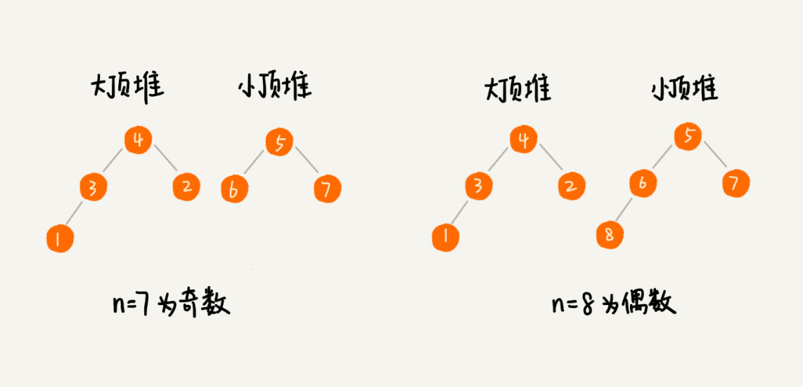

# 堆的应用：如何快速的获取到Top10的最热门的搜索关键词

**假设有一个包含10亿个搜索关键词的日志文件，如何能快速的获取到热门榜Top10的搜索关键词**

介绍几个堆的非常重要的应用：优先级队列，求TopK和求中位数。

## 堆的应用一：优先级队列
在优先级队列中，数据的出队顺序不是先进先出，而是按照优先级来，优先级最高的，最先出队。

如何实现一个优先级队列呢？方法其实很多，但是用堆来实现是最直接最高效的。堆和优先级非常相似。往优先级队列中插入一个元素，就相当于往堆中插入一个元素；从优先级中取出优先级最高的元素就相当于取出堆顶元素。

### 1. 合并有序小文件
假设有100个小文件，每个小文件的大小是100MB，每个文件中存储的都是有序的字符串。我们希望讲这些100个小文件合并成一个有序的大文件，这里就会用到优先级队列。

整体的思路有点像归并排序中的合并函数，我们把这100个文件中，各取第一个字符串，放入数组中，然后比较大小，把最小的那个字符串放入到合并后的大文件中，并从数组中删除。然后我们就再从这个小文件取出下一个字符串，放到数组中，重新比较大小，并且选择最小的放入合并后的大文件中，比较大小重复上面的操作。直到所有的文件中的数据都放入到大文件为止。

显然每次从数组中取出最小的元素都要遍历一次数组，并不高效。

这里我们可以用到优先级队列，也可以说是堆。我们将从小文件中取出来的字符串放入到小顶堆中，那么堆顶的元素也就是优先级队列队首的元素，也就是最小的字符串，我们将这个字符串放入到大文件中，并将其从堆中删除。然后再从小文件中取出下一个字符串，放入到堆中，循环这个过程，就可以将100个小文件中的数据依次放入到大文件中。

删除和往堆中插入数据的时间复杂度是O(logn)，n表示的是堆中的数据个数，也就是100，是不是比原来的方式高效很多。

### 2. 高效定时器

假设我们有一个定时器，定时器中维护着很多定时任务，每个任务都设定了一个要触发执行的时间点。定时器每过一个很小的单位时间（比如1秒），就扫描一遍任务，看是否有任务达到了执行时间，如果达到了就拿出来执行。

但是每一秒扫描一次做法比较低效，主要原因两点：第一任务的约定时间还有很长，前面的扫描是徒劳的；第二，每次都要扫描整个任务列表，如果任务列表很大的话，肯定会很耗时。

针对这样的问题，我们使用优先级队列来解决，也就是使用堆来解决，使用小顶堆，堆顶存储的是最先执行的任务。

定时器不用再每隔一秒就扫描一遍任务列表。使用队首任务的执行时间点减去当前时间点，得到一个时间间隔T。

时间间隔是从现在时间开始需要等待的时间，才会有第一个任务需要执行。
T秒间隔之后，定时器取优先级队列中队首的任务执行，然后在计算新的队首任务的执行时间点与当前时间点的差值，把这个值作为定时器执行下一个任务需要等待的时间。

## 堆的应用二：利用堆求TopK
我们把这种求TopK的问题，抽象成两类，一类是针对静态数据集合，数据事先是确定的。另一类是针对动态数据集合，也就是说数据集合事先是不确定，有数据动态的加入到集合中。

针对静态数据，如何在一个包含n个数据的数组中，查找K大数据呢？
我们维护一个大小为K的小顶堆，顺序遍历数组，从数组中取出数据与堆顶元素比较。如果比堆顶元素大，我们就把堆顶元素删除，并且将这个元素插入到堆中；如果比堆顶元素小，则不作任何处理，继续遍历数组。这一数组中的数据都遍历完之后，堆中的数据就是前K大元素。

遍历数组的时间复杂度是O(n),一次堆化操作的时间复杂度是O(logK),所以最坏情况下，n个元素都要入堆一次，时间复杂度就是O(nlogK).

针对动态数据，求TopK就是实时的TopK。实际上，我们可以一直都维护一个K大小的小顶堆，当有数据被添加到集合中时，我们就拿它和堆顶元素对比，如果比堆顶元素大，我们就将堆顶元素删除，并且将这个元素插入到堆中；如果比堆顶元素小，则不作处理。这一无论任何时候需要查询的前K大数据，我们都可以立即返回给他。

## 堆的应用三：利用堆求中位数

中位数，处在中间位置的那个数。如果数据的个数是奇数，把数据从小到大排列，从第n/2 + 1个数据就是中位数，假设数据是从0开始编号的；如果数据的个数是偶数的话，那处于中间位置的数据就是两个，第n/2和第n/2+1个数据。这个时候我们可以随意取一个作为中位数。

对于一组静态数据，中位数是固定了，先排序取出n/2个数据就是中位数，每次询问中位数时，直接给出数据就好了。虽然排序的代价比较高，但是边际成本很小。
如果是动态数据集合，中位数时在不停的变化的，再使用先排序的方法就效率很低了。

**借助堆这种数据结构，我们不用排序，就可以非常高效的实现求中位数操作，具体做法如下：**

我们需要维护两个堆，一个大顶堆，一个小顶堆。大顶堆中存储前半部分数据，小顶堆存储后半部分数据。且小顶堆中数据都大于大顶堆中的数据。

如果有n个数据，n是偶数，我们从小到大排序，那前n/2个数据存储在大顶堆中，后n/2个数据存储在小顶堆中。这样，大顶堆中的堆顶元素就是我们要找的中位数。如果n是奇数。情况是类似的，大顶堆就存储n/2+1个数据，小顶堆中就存储n/2个数据。

动态数据的时候。我们如何调整两个堆；

如果新加入的数据小于等于大顶堆的堆顶元素，我们就将这个元素插入到大顶堆中；否则，我们就将这个新数据插入到小顶堆。

这个时候就有可能出现，两个堆中数据个数不符合前面约定的情况；如果n是偶数，两个堆中的数据个数是n/2；如果n是奇数，大顶堆有n/2+1个数据，小顶堆中有n/2个数据。这个时候我们需要将一个堆中的数据不停的移动到另一个堆。通过这样的调整来让两个堆中的数据满足上面的约定。

于是我们就可以利用两个堆，一个大顶堆，一个小顶堆，实现动态数据集合中求中位数的操作。插入数据涉及堆化操作，所以时间复杂度变成了O(logn),但是求中位数我们只需要返回大顶堆的堆顶元素就可以了，所以时间复杂度是O(1)。

同理，如何快速的求出接口的99%相应时间？

首先什么是99%相应时间？

如果一组数据从小到大排列这个99百分位数，就是大于前面99%数据的数据。

假设有100个数，分别是1，2，3，4……100，那99百分位数就是99，因为小于等于99的数占总个数的99%。

弄懂了99百分位数，再来看99%相应时间。如果有100个接口请求，每个接口请求的相应时间不同，我们把这100个接口的相应时间从小到大排列，排在第99的那个数据就是99%相应时间，也叫99百分位响应时间。

我们总结一下，如果有 n 个数据，将数据从小到大排列之后，99 百分位数大约就是第 n * 99% 个数据，同类，80 百分位数大约就是第 n * 80% 个数据。

我们维护两个堆，一个大顶堆，一个小顶堆，大顶堆中保持n * 99%个数据，小顶堆中保存 n * 1%个数据。此时大顶堆堆顶元素就是99%相应时间。

为了保持大顶堆中数据占99%，小顶堆中数据占1%，在每次新插入数据之后，我们要重新计算两个堆中数据，做相应的移动操作。

## 解答开篇
学习了上面的处理思路，我们应该可以解答开篇的那个问题了吧。假设我们有一个包含10亿个搜索关键词的日志文件，如何快速获取到Top10最热门的的搜索关键词呢？

如果我们将使用场景设定为单机，可以使用的内存是1GB，问题如何解决呢？

用户搜索的关键词，有很多可能是重复的，所以我们首先要统计每个搜索关键词出现的频率。
假设我们选用散列表，顺序扫描10亿个搜索关键词，当搜索到某个关键词时，我们去散列表中查询，如果存在的话，我们就将对应的次数加一；如果不存在就将他插入到散列表中，并记录次数是1。以此类推就将10亿个搜索关键词按照出现的次数存储在散列表中。

然后我们再根据前面所讲的TopK的方法，建立一个大小为10的小顶堆，遍历散列表，依次取出每个搜索关键词及对应的次数，然后与堆顶的搜索关键词对比，如果出现次数比堆顶搜索关键词次数多，那就删除堆顶的关键词，将这个出现更多的关键词加入到堆中。

依次类推遍历完整个散列表中的搜索关键词之后，堆中搜索关键词就是出现次数最多的Top10搜索关键词。

但是，上面的解决思路其实有漏洞，10亿关键词还是很多的。我们假设10亿关键词中不重复的有1亿条，如果每个关键词平均长度是50个字节，那么一亿个关键词起码需要5GB的内存空间。而散列表中因为要避免频繁冲突，不会选择太大的装载因子，所以消耗的内存空间就更多了，而机器只有1GB内存，无法一次性加入内存。

在哈希算法中我们讲过，相同数据经过哈希算法之后的哈希值是一样的。我们可以根据哈希算法这个特点，将10亿个搜索关键词先通过哈希算法分片到10个文件中。

具体做法是：将创建的10个空文件00，01，。。。。09。我们遍历这10亿个关键词，并通过某个哈希算法对其求哈希值，然后哈希值同10取模，得到的结果就是这个搜索关键词应该被分到的文件编号。

对10亿个关键词分片之后，每个文件都只有1亿的关键词，确定重复的，可能就只有1000万个，没干过关键词平均50个字节，总的大小就是500MB，1GB的内存完全可以放下。

我们针对1亿条搜索关键词的文件，利用散列表和堆，分别求出Top 10,然后把这个10个Top10，放在一起，然后取100个关键词中，出现最多的10个关键词，这就是这10亿数据中的Top10最频繁搜索关键词。

## 课后思考

有一个访问量非常大的新闻网站，我们希望将点击量排名 Top 10 的新闻摘要，滚动显示在网站首页 banner 上，并且每隔 1 小时更新一次。如果你是负责开发这个功能的工程师，你会如何来实现呢？

