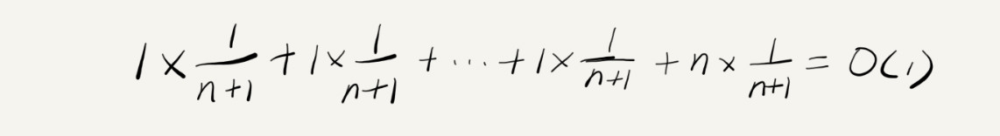

# 复杂度分析
实实在在跑一边得到的数据称之为时候统计法，但有很大局限性；
1、测试结果非常依赖测试环境，比如i3处理器和i9处理器跑同一个代码；
2、测试结果受数据规模影响很大，同样的算法，在不同数据规模下其效率是不一样的；

我们需要一个不用具体的测试数据来测试，就可以粗略的估计算法的执行效率的方法。

## 大O复杂度表示法
假设每行代码对应的执行时间都一样，为unit_time，因此对于一段代码来说，**所有代码的执行时间T(n)与每行代码的执行次数成正比**。换个思路就是所有代码的执行时间T(n)与每行代码的执行次数n成正比。

    T(n) = O(f(n))

n表示数据规模的大小；f(n)表示每行代码执行的次数总和。所以公式中的O表示代码的执行时间T(n)与f(n)表达式成正比。
这就是大O时间复杂度表示法。大O时间复杂度表示法实际上并不代表代码真正的执行时间，而是表示代码执行时间随数据规模增长的变化趋势，所以也称之为渐进时间复杂度，简称时间复杂度。

## 时间复杂度分析
三个方法：
**1、只关注循环执行次数最多的一段代码**
我们通常会忽略掉公式中常量、低阶、系数只需要记录一个最大阶的量级就可以了。
所以，我们咋分析一个算法，一段代码的时间复杂度的时候，也只关注循环执行次数最多的一段代码就可以了
    
    int cal(int n) {
        int sum = 0;
        int i = 1;
        for (; i <= n; ++i) {
            sum = sum + i;
        }
        return sum;
    }

前面所讲，for循环的两行代码被执行了n次，所以总的时间复杂度是O(n)

**2、加法法则：总的复杂度等于量级最大的那段代码的复杂度**

    int cal(int n) {
        int sum_1 = 0;
        int p = 1;
        for (; p < 100; ++p) {
            sum_1 = sum_1 + p;
        }

        int sum_2 = 0;
        int q = 1;
        for (; q < n; ++q) {
            sum_2 = sum_2 + q;
        }
        
        int sum_3 = 0;
        int i = 1;
        int j = 1;
        for (; i <= n; ++i) {
            j = 1; 
            for (; j <= n; ++j) {
            sum_3 = sum_3 +  i * j;
            }
        }
        
        return sum_1 + sum_2 + sum_3;
    }
代码分为三部分，sum_1,sum_2,sum_3分析每一部分的时间复杂度，然后放在一块取一个量级最大的作为整段代码的复杂度。
sum_1,循环100次，但是常数，所以O(1)
sum_2,循环n次，所以O(n)
sum_3,循环n*n次，所以O(n2)
总的时间复杂度就等于量级最大的那段代码的时间复杂度。
抽象成公式：
T1(n)=O(f(n))，T2(n)=O(g(n))；那么 T(n)=T1(n)+T2(n)=max(O(f(n)), O(g(n))) =O(max(f(n), g(n))).

**3、乘法法则：嵌套代码的复杂度等于嵌套内外代码的复杂度的乘机**
如果T1(n)=O(f(n)),T2(n)=O(g(n));
那么T(n)=T1(n)*T2(n) = O(f(n))*O(g(n))=O(f(n)*g(n)).

    int cal(int n) {
        int ret = 0; 
        int i = 1;
        for (; i < n; ++i) {
            ret = ret + f(i);
        } 
    } 
        
    int f(int n) {
        int sum = 0;
        int i = 1;
        for (; i < n; ++i) {
            sum = sum + i;
        } 
        return sum;
    }

T1(n) = O(n)。但 f() 函数本身不是一个简单的操作，它的时间复杂度是 T2(n) = O(n)
整个 cal() 函数的时间复杂度就是，T(n) = T1(n) * T2(n) = O(n*n) = O(n2)。

## 常见的几种时间复杂度分析
按照数量级递增顺序为：
（多项式量级）O(1),O(logn),O(n),O(nlogn),O(n^2) | O(n^3) ... O(n^k),
（非多项式量级）O(2^n),O(n!)

### O(1)

O(1) 只是常量级时间复杂度的一种表示方法
一般情况下，只要算法中不存在循环语句、递归语句，即使有成千上万行的代码，其时间复杂度也是Ο(1)。

### O(logn)、O(nlogn)

    i=1;
    while (i <= n)  {
        i = i * 2;
    }

x=log2n，所以，这段代码的时间复杂度就是 O(log2n)。
在采用大 O 标记复杂度的时候，可以忽略系数，即 O(Cf(n)) = O(f(n))。所以，O(log2n) 就等于 O(log3n)。

### O(m+n)、O(m*n)

    int cal(int m, int n) {
        int sum_1 = 0;
        int i = 1;
        for (; i < m; ++i) {
            sum_1 = sum_1 + i;
        }

        int sum_2 = 0;
        int j = 1;
        for (; j < n; ++j) {
            sum_2 = sum_2 + j;
        }

        return sum_1 + sum_2;
    }

我们需要将加法规则改为：T1(m) + T2(n) = O(f(m) + g(n))。但是乘法法则继续有效：T1(m)*T2(n) = O(f(m) * f(n))。
m,n两者都是变量都没办法舍弃

## 空间复杂度分析

空间复杂度全称就是渐进空间复杂度（asymptotic space complexity），**表示算法的存储空间与数据规模之间的增长关系**。
我们常见的空间复杂度就是 O(1)、O(n)、O(n2)，像 O(logn)、O(nlogn) 这样的对数阶复杂度平时都用不到。而且，空间复杂度分析比时间复杂度分析要简单很多。

# 复杂度分析下：最好，最坏，平均，均摊时间复杂度

不同的代码在不同情况下代码的时间复杂度是不一样的。因此引入三个概念：最好情况时间复杂度、最坏情况时间复杂度和平均情况时间复杂度

**最好情况时间复杂度**就是，在最理想的情况下，执行这段代码的时间复杂度
**最坏情况时间复杂度**就是，在最糟糕的情况下，执行这段代码的时间复杂度
例如：查找数组中的某个数，最好情况下就是第一个位置就是要查找的目标值，即O(1)；最坏情况就是最后一个位置是目标值，或者数组中没有该目标值，即O(n)

**平均情况时间复杂度**

    // n表示数组array的长度
    int find(int[] array, int n, int x) {
        int i = 0;
        int pos = -1;
        for (; i < n; ++i) {
            if (array[i] == x) {
            pos = i;
            break;
            }
        }
        return pos;
    }
在刚刚上面例子中的情况分析中，在0~n-1位置中和不在数组中的情况下，
首先在数组中存在目标值的情况下，n中情况又是每次都执行i次；不在的情况下又执行n次
所以最终的计算为

第二种分析方法，根据概率，数组中是否存在目标值概率各1/2
那么在存在的一半概率中，计算如下：

不存在的一半概率时，计算为 n*1/2
最终的平均时间复杂度为：

在大多数情况下，我们并不需要区分最好、最坏、平均情况时间复杂度三种情况,只有同一块代码在不同的情况下，时间复杂度有量级的差距，我们才会使用这三种复杂度表示法来区分。

**均摊时间复杂度**
摊还分析

    // array表示一个长度为n的数组
    // 代码中的array.length就等于n
    int[] array = new int[n];
    int count = 0;
    
    void insert(int val) {
        if (count == array.length) {
        int sum = 0;
        for (int i = 0; i < array.length; ++i) {
            sum = sum + array[i];
        }
        array[0] = sum;
        count = 1;
        }

        array[count] = val;
        ++count;
    }
最理想的情况下，数组中有空闲空间，我们只需要将数据插入到数组下标为 count 的位置就可以了，所以最好情况时间复杂度为 O(1)。最坏的情况下，数组中没有空闲空间了，我们需要先做一次数组的遍历求和，然后再将数据插入，所以最坏情况时间复杂度为 O(n)
假设数组的长度是 n，根据数据插入的位置的不同，我们可以分为 n 种情况，每种情况的时间复杂度是 O(1)。除此之外，还有一种“额外”的情况，就是在数组没有空闲空间时插入一个数据，这个时候的时间复杂度是 O(n)。而且，这 n+1 种情况发生的概率一样，都是 1/(n+1)。所以，根据加权平均的计算方法，我们求得的平均时间复杂度就是：

上述代码跟前一个代码有不同之处，在于只有极端情况下，复杂度才比较高，而且出现复杂度高的情况跟普通情况有一定的时序规律，是周期性的。

这种特殊的场景，我们引入了一种更加简单的分析方法：摊还分析法，通过摊还分析得到的时间复杂度我们起了一个名字，叫均摊时间复杂度。

每一次 O(n) 的插入操作，都会跟着 n-1 次 O(1) 的插入操作，所以把耗时多的那次操作均摊到接下来的 n-1 次耗时少的操作上，均摊下来，这一组连续的操作的均摊时间复杂度就是 O(1)。

### 使用场景：
一个数据结构进行一组连续操作中，大部分情况下时间复杂度都很低，只有个别情况下时间复杂度比较高，而且这些操作之间存在前后连贯的时序关系，这个时候，我们就可以将这一组操作放在一块儿分析，看是否能将较高时间复杂度那次操作的耗时，平摊到其他那些时间复杂度比较低的操作上。而且，在能够应用均摊时间复杂度分析的场合，一般均摊时间复杂度就等于最好情况时间复杂度。

### 课后思考

    // 全局变量，大小为10的数组array，长度len，下标i。
    int array[] = new int[10]; 
    int len = 10;
    int i = 0;

    // 往数组中添加一个元素
    void add(int element) {
        if (i >= len) { // 数组空间不够了
            // 重新申请一个2倍大小的数组空间
            int new_array[] = new int[len*2];
            // 把原来array数组中的数据依次copy到new_array
            for (int j = 0; j < len; ++j) {
            new_array[j] = array[j];
            }
            // new_array复制给array，array现在大小就是2倍len了
            array = new_array;
            len = 2 * len;
        }
        // 将element放到下标为i的位置，下标i加一
        array[i] = element;
        ++i;
    }

最好情况数组没有满，O(1)
最坏情况数组满了，O(n)
平均复杂度是，前面n个都是O(1),第n+1个是O(n),则计算方法是， (1+1+...+1+n)/(n+1) = 2n/(n+1)
摊还时间复杂度，前n个都是O(1),第n+1个是O(n)，所以讲O(n)摊还到前面n次，最后的操作复杂度是O(1)