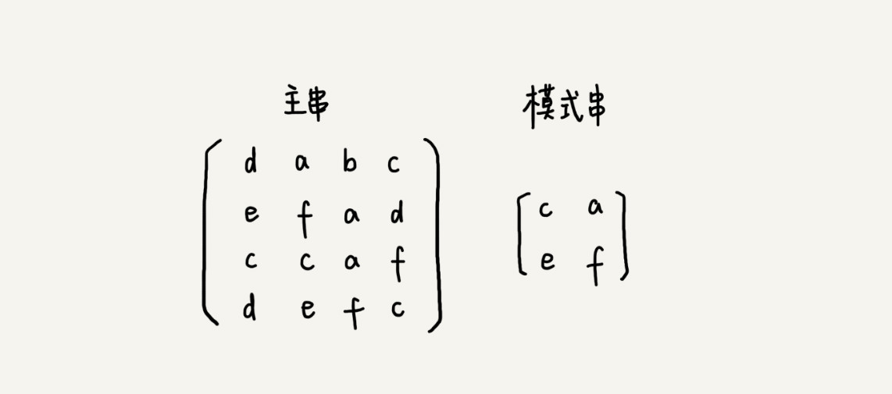

# 字符串匹配基础（上）：如何借助哈希算法实现高效字符匹配？

这一节主要讲解两个算法：BF算法和RK算法；
这两种算法比较简单，好理解，下一节将会讲解更加高效的BM和KMP算法；

这两节主要讲解的是单模式的字符串匹配的算法，也就是一个串和另一个串进行匹配。
多模式的匹配算法，也就是在一个串中同时查找多个串，他们分别是Trie树和Ac自动机；

**开篇问题：RK算法是如何借助哈希算法来实现高效字符串的匹配的呢？**

## BF算法
BF算法是Brute Force的缩写，中文名字就是暴力匹配算法，也叫朴素匹配算法；

首先应该明白两个概念，主串和模式串的概念；

比如说,我们再字符串A中查找字符串B，那么字符串A就是主串，字符串B就是模式串；
将主串的长度记为n，模式串的长度记为m。因为在主串中查找模式串，所以n>m;

作为最简单最暴力的字符串匹配算法，BF算法的思想就是：**我们在主串中检查起始位置分别是0，1，2……n-m，且长度为m的n-m+1个子串，看有没有跟模式串匹配的。**

其实BF算法就是重头到尾进行一一匹配；

在极端情况下，主串是“aaaaaaaaaa……aaa"，模式串是”aaab“，我们每次都对比m个字符，要对比n-m—+1次，所以最坏情况时间复杂度就是O(n*m);

但是实际开发中，BF算法经常用到，因为，原因有两点：

原因一：实际软件开发中，模式串和主串的长度都不会太长，而且每次模式串与主串的子串匹配过程中，当中途发现不能匹配的字符时就可以停止了，不需要把m个字符都对比一下；

原因二：朴素字符串匹配算法思想简单，代码实现也非常简单，简单就以为着不容易出错，如果出现bug也好暴露和修复；

## RK算法

RK算法全称是Rabin-Karp算法，是由两个发明者的名字命名的；是BF算法的升级版；

在BF算法中每次检查主串和子串是否匹配，需要依次对比每一个字符，所以BF算法的时间复杂度就比较高，是O(n*m);对这个过程引入哈希算法，时间复杂度就会立刻降低；

RK算法的思想是：**我们通过哈希算法对主串中的n-m+1个子串分别求哈希值，然后逐个与模式串比较大小**

如果哈希值相同就认为相同，先不考虑哈希冲突，哈希值作为一个数字数字之间比较是否相等是非常快的。

通过哈希算法计算子串的哈希值的时候，我们需要遍历子串中的每一个字符。尽管模式串和子串比较的效率提高了，但是整体的效率并没有提高；

有什么方法可以提高哈希算法计算子串哈希值的效率呢；
这就需要哈希算法计算的非常有技巧了，我们假设要匹配的字符串的字符集中包括K个字符，我们可以用一个K进制数来表示子串，这个K进制数转化成十进制，作为子串的哈希值。具体如下图：

比如要处理的字符串包含a~z这26个小写字母，那么我们就用二十六进制来表示一个字符串，a对应0，b对应1，一直到z表示25；

所以cba这个字符串的哈希值为：

方便讲解，我们在下面的讲解中假设字符串只包括a~z这26个小写字符；这种计算哈希值的计算方法有一个特点，在主串中相邻两个子串的哈希值有关系：

相邻两个子串s[i-1]和s[i]哈希值关系如上图。

计算中出现很多26的n次方，可以将这些值存储在一个数组中，需要的时候到对应的位置直接取用；

**时间空间复杂度**
通过这种特殊设计的哈希算法，只需要扫描一遍主串就能计算出所有子串的哈希值，所以这部分时间复杂度就是O(n);

模式字符串和每个子串之间比较的复杂度是O(1),总共需要比较n-m+1个子串的哈希值，所以这部分的时间复杂度是O(n);

所以RK算法整体的时间复杂度是O(n);

但是这种哈希算法有一个问题就是，模式串很长就会导致哈希值很大，超出整形表示范围；

改进方法是假设a~z字符对应26进制，没干过字符串的哈希值是所有字符代表的进制数相加，其和作为哈希值，这样铲射的哈希值的数据范围就相对小很多；

但是这样就会产生哈希冲突，解决哈希冲突方法就是如果哈希值相同就再比较一次子串和模式串；

如果哈希冲突很大，算法有可能退化成O(n*m),但是一般情况下，冲突不会很多；

## 解答开篇 & 内容小结

BF算法是最简单的，粗暴的匹配算法，整体思路就是一一对比，时间复杂度是O(n*m);

RK算法是基于BF算法经过哈希算法改造的，即对每个子串分别求哈希值，然后拿子串哈希值和模式串哈希值进行比较，减少了比较的时间，理想情况下，RK算法的时间复杂度是O(n),跟BF算法相比，效率提高不少。但在极端情况下，哈希算法大量冲突，时间复杂度就退化为O(n*m);

## 课后思考
两种算法类比到二维空间，假设有下面这样一个二维支付串矩阵，借助今天讲的二维空间，如何在其中查找另一个二维字符串矩阵呢？

如果使用BF算法，就一个一个窗口进行对比，
堆窗口中的二维子串求hash值之后这样的就是RK算法；
