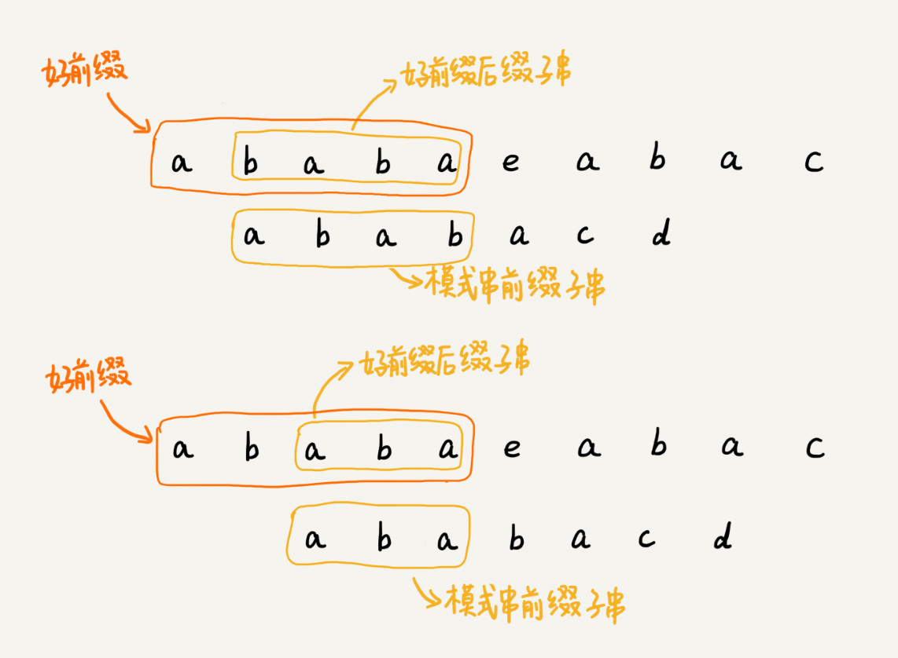

# 字符串匹配（下）：如何借助BM算法轻松理解KMP算法

借助BM算法的思路，更好的理解KMP算法；

## KMP算法的基本原理
KMP算法的核心思想和BM很相近，我们假设主串是a，模式串是b，在模式串和主串匹配的过程中，当遇到不匹配的字符的时候，我们希望找到一些规律，可以将模式串往后多滑动几位，跳过那些肯定不匹配的情况；

在模式串和主串匹配的过程中，我们把不能匹配的那个字符还叫做坏字符，把已经匹配好的那段字符串叫做好前缀；

当遇到坏字符的时候，我们把模式串往后滑动，只要模式串和好前缀有上下重合，前面的几个字符就相当于拿好前缀的后缀子串和模式串的前缀子串在比较，这个过程是否高效呢？

KMP算法在试图寻找这种规律：在模式串和主串的匹配过程中，当遇到坏字符后，对于已经对比过的好前缀，能否找到一种规律，将模式串一次性滑动很多位；

也就是说，我们只需要拿好前缀本身，在他的后缀子串中，查找最长的那个可以跟好前缀的前缀子串匹配的。假设最长的可匹配的那部分前缀子串是{v}，长度是k。我们把模式串一次性的往后滑动j-k位，相当于每次遇到坏字符的时候，我们就把j更新为k，i不变，然后继续比较；

为了表述起来方便，我把好前缀的所有后缀子串中，最长的可匹配前缀子串的那个后缀子串叫做**最长可匹配后缀子串**；对应的与之匹配的前缀子串，叫做**最长可匹配前缀子串**；

如何来求好前缀的最长可匹配前缀和后缀子串，这个问题不涉及主串，自己就可以求解；

KMP算法中提前定义一个数组，用来存储模式串中每个前缀（在实际匹配中这些前缀都有可能成为好前缀）的最长可匹配前缀子串的结尾字符下标。这个数组称之为next数组，很多书中给这个数组起一个名字叫失效函数；

有了next数组很容易就可以实现KMP算法了；假设已经存在了next数组，KMP算法框架是；

    /**
     * KMP算法
     * @param a 主串
     * @param n 主串长度
     * @param b 模式串
     * @param m 模式串长度
     * @return
     */
    public static int kmp(char[] a,int n,char[] b,int m){
        int[] next = getNexts(b,m);
        int j = 0;
        for(int i = 0; i < n;i++){
            while(j > 0 && a[i] != b[i]){
                j = next[j - 1] + 1;//出现坏字符，则前面的字符串是好前缀，取这个好前缀的next值，加一就该是接下来要比较的字符了
            }
            //如果相等说明匹配，j+1继续下次比较
            if(a[i] == b[j]){
                ++j;
            }
            //j == m匹配完成
            if(j == m){
                return i - m + 1;
            }
        }
        return -1;
    }

## 失效函数计算方法

计算这个next数组，可以用比较笨的方法，比如下面的这个模式串b的next[4],我们可以把b[0,4]的所有后缀子串从长到短找出来，一次查看能否跟模式串的前缀子串匹配。很显然，这个方法计算next数组，效率很低；

实际上这里有一种很巧妙的处理方法，我们按照下标来算，依次计算next数组的值，当我们要计算next[i]的时候，前面next[0]...next[i-1]应该已经计算出来了。利用已经计算出来的next值，我们是否可以推导出来next[i]的值呢？

如果next[i-1] = k - 1;也就是说b[0,k-1]是b[0,i-1]的最长可匹配前缀子串。如果子串b[0,k-1]的笑一个字符b[k]，正好与b[i-1]的下一个字符b[i]匹配，那么子串b[0,k]就是b[0,i]的最长可匹配前缀子串。所以此时next[i]就等于k。但是如果b[k]和b[i]不匹配，这个时候怎么办呢？

![b[k]==b[i]](img/b[k]==b[i].jpg)

我们假设b[0,i]的最长可匹配后缀子串是b[r,i]，如果我们把最后一个字符去掉，那么b[r,i-1]肯定是b[0,i-1]的可匹配后缀子串，但是不一定是最长可匹配后缀子串。所以，既然b[0,i-1]最长可匹配后缀子串对应的模式串的前缀子串的下一个字符并不等于b[i],那么我们就可以考察b[0,i-1]的次长可匹配后缀子串b[x,i-1]对应的可匹配前缀子串b[0,i-1-x]的下一个字符b[i-x]是否等于b[i]，如果等于，b[x,i]就是b[0,i]的最长可匹配后缀子串；

可是如何求得b[0,i-1]的次长可匹配后缀子串呢？次长可匹配后缀子串肯定被包含在最长可匹配后缀子串中，而最长可匹配后缀子串又对应最长可匹配前缀子串b[0,y].于是查找b[0,i-1]的次长可匹配后缀子串这个问题就变成了查找b[0,y]的最长匹配后缀子串的问题了；

按照这个思路，我们可以考察完所有的b[0,i-1]的可匹配后缀子串b[y,i-1],直到找到一个可匹配的后缀子串，它对应的下一个字符等于b[i],那么b[y,i]就是b[0,i]的最长可匹配后缀子串；

所以这个代码就是：

    /**
     * 寻找next数组
     * @param b
     * @param m
     * @return
     */
    private static int[] getNexts(char[] b, int m){
        int[] next = new int[m];
        next[0] = -1;
        int k = -1;
        for(int i = 1; i < m; ++i){
            //如果b[i] != b[k+1] 就要找0到i-1的次长可匹配子串，因为b[0,i-1]跟前面的匹配前缀子串是相同的，
            // 所以直接求前面前缀子串的最长可匹配子串就可以了。如有不懂仔细看上图
            while(k != -1 && b[k + 1] != b[i]){
                k = next[k];
            }
            //如果b[i] == b[k+1]所以就直接是最长
            if(b[k+1] == b[i]){
                ++k;
            }
            next[i] = k;
        }
        return next;
    }

## KMP算法分析
空间复杂度分析容易分析，KMP算法只需要找一个额外的next数组，数组的大小跟模式串相同，所以空间复杂度是O(m),m表示模式串的长度；

KMP算法包含两部分，第一部分构建next数组，第二部分次啊是借助next数组匹配，所以时间复杂度要分两部分分析；

计算第一部分也就是next数组中的复杂度时，第一层for循环i从1到m-1，也就是说，内部代码被执行了m-1次，for循环内部代码有一个while循环，如果我们能知道每次for循环中，while执行的次数，假设是k，那么时间复杂度是O(k*m)但是k并不好统计，所以我们放弃这种方法；

我们找一些参照变量，i和k。i从1开始一直到m，而k并不是每次for虚幻都会增加，所以k累计增加的值肯定小于m，而while循环中，k=next[k],实际上是在减小k的值，k累计都没有增加超过m，所以while里面k=next[k]总的执行次数也不可能超过m，因此next数组计算时间复杂度是O(m);

第二部分的时间复杂度；
i从0循环增长到n-1，j的增长量不可能超过i，所以肯定小于n，而while循环中的那条next[j-1]的值肯定小于j-1，所以while循环中的语句实际上也是在让j的值减小，而j的总共增长量都不会超过n，那减少量也不可能超过n，所以while循环中的这条语句总的执行次数不会超过n，所以这部分时间复杂度是O(n);

综合两部分时间复杂度KMP算法的时间复杂度是O(n+m);

## 解答开篇&内容小结

BM 算法有两个规则，坏字符和好后缀。KMP 算法借鉴 BM 算法的思想，可以总结成好前缀规则。这里面最难懂的就是 next 数组的计算。如果用最笨的方法来计算，确实不难，但是效率会比较低。所以，我讲了一种类似动态规划的方法，按照下标 i 从小到大，依次计算 next[i]，并且 next[i]的计算通过前面已经计算出来的 next[0]，next[1]，……，next[i-1]来推导。

时间复杂度是O(n+m);

## 课后思考

至此，我们把经典的单模式串匹配算法全部讲完了，它们分别是 BF 算法、RK 算法、BM 算法和 KMP 算法，关于这些算法，你觉得什么地方最难理解呢？
