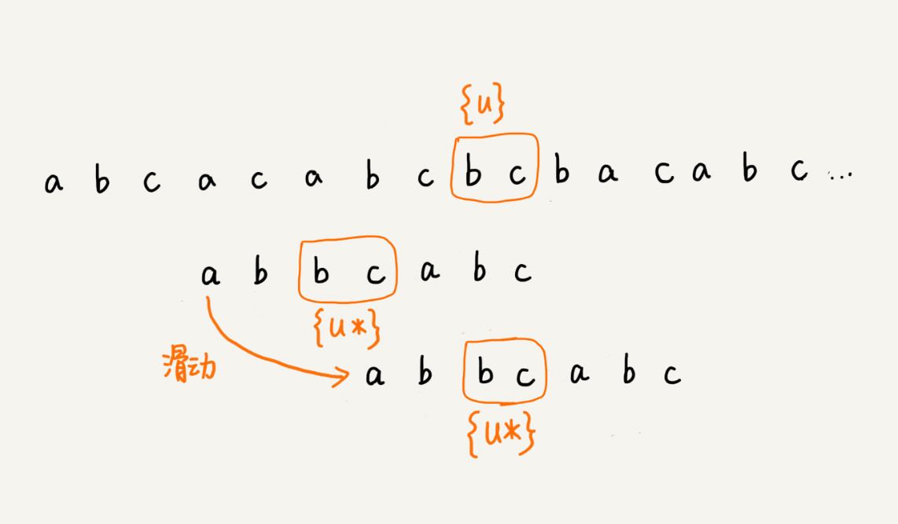

# 字符串匹配基础(中)：如何实现文本编辑器中的查找功能

在某种极端的情况下，BF算法退化很严重，而RK算法设计一个应对所有类型字符的哈希算法并不简单；

**对于查找功能是重要功能的软件来说，比如一些文本编辑器，他们的查找功能都是用哪种算法来实现的呢？有没有比BF算法和RK算法更加高效的字符串匹配呢？**

## BM算法的核心思想

在BF算法和RK算法中，遇见不匹配的字符时，模式串往后滑动一位，然后从模式串的第一个字符开始重新匹配；

在这个例子中，主串中的c在模式串中是不存在的，所以模式串向后滑动的时候，只要c和模式串有重合，肯定是无法匹配的，所以一次性的讲模式串往后多滑动几位，把模式串移动到c的后面；

所以BM算法本质上就是在寻找相应的规律，借助这种规律在模式串和主串进行匹配的过程中尽可能的多滑动几位，从而提高匹配效率；

## BM算法原理分析

BM算法主要包括两部分，分别是**坏字符原则**和**好后缀规则**；

### 1、坏字符规则
不同于前面算法的从前向后匹配字符，BM算法的匹配顺序比较特别，他是按照模式串下标从大到小的顺序，倒着匹配的。

在倒着匹配过程中，当我们发现某个字符没法匹配的时候，我们把这个没有匹配的字符叫做坏字符。

这个时候，我们将会在模式串中寻找坏字符，如上图所示，我们发现在模式串中没有坏字符，字符c不会和模式串中任何字符匹配，我么可以直接把模式串向后滑动三位，也就是c后面的位置，再开始从模式串末尾开始匹配；

这个时候，我们发现新的坏字符是a，但是模式串中存在a，我们不可以将模式串往后滑动3位了，这个时候我们应该滑动两位，让两个a上下对齐，然后再从末尾重新匹配；

所以上面的过程中，具体的规律是什么呢？
当发生不匹配时，我们把坏字符对应的模式串中的字符下标记做si，如果坏字符在模式串中存在，我们把这个坏字符在模式串中的下标记做xi，如果不存在，我们就把xi记做-1.那么模式串往后移动的位数等于si-xi；（注意这里所说的小标都是字符在模式串中的下标）；

特别说明：如果坏字符在模式串中多处出现，那我们在计算xi的时候，要选择最靠后的那个，因为这样不会让模式串滑动过多，导致本来可能匹配的情况被滑动略过；

**时空复杂度**
根据坏字符规则，BM算法最好情况复杂度非常低，是O(n/m);比如主串是aaabaaabaaabaaab，模式串是aaaa;模式串每次都可以直接后移四位；

但是单纯的坏字符规则是不可以的，因为在坏字符规则中会出现si-xi为负，模式串向前滑动的情况；
比如主串是aaaaaaaaaaaaaaaaaaaaaa，模式串是baaa，si永远是0，xi是3，最后si-xi是-3；

### 2、好后缀规则

好后缀规则和坏字符规则思路类似，当模式串滑动到图中的位置的时候，模式串和主串有2个字符时匹配的，倒数第三个字符发生了不匹配的情况；

我们把已经匹配的bc叫做好后缀，记做{u}。我们拿这个已经匹配的后缀去模式串中查找，如果找到了另一个跟{u}相匹配的子串{u*}，那么我们就将模式串滑动到子串{u*}与主串{u}对齐的位置；

如果模式串中找不到另一个等于{u}的子串，我们就直接将模式串，滑动到主串{u}的后面，因为之前的任何一次往后滑动，都没有匹配主串中{u}的情况；

但是在模式串中不存在等于{u}的子串时，我们直接将模式串滑动到主串{u}后面，这样有可能滑动过头，如下图所示，就会滑动过头了。

如果好后缀在模式串中不存在匹配的子串，那么我们一步一步往后滑动模式串的过程中，只要主串中的{u}与与模式串有重合，那么久肯定无法完全匹配，但是当模式串滑动到前缀与主串中{u}的后缀有部分重合的时候，并且重合的部分相等的时候，就有可能存在完全匹配的情况；
（通俗的讲，就是好后缀的后缀和模式串的前缀有重合的时候不可以直接滑动到最后）

这种情况下我们不仅要看好后缀在模式串中，是否有另一个匹配的子串，我们还要考察好后缀的后缀子串，是否和模式串的前缀子串匹配的；

所谓某个字符串s的后缀子串，就是最后一个字符跟s对齐的子串，比如abc的后缀包括：串，bc。所谓前缀就是起始字符跟s对齐的子串，比如abc的前缀子串有：a，ab。

当模式串和主串中的某个字符不匹配的时候，如何选择好后缀还是坏字符规则，来计算模式串往后滑动的位数？

分别计算好后缀和坏字符往后滑动位数，然后取两个数中最大的，作为模式串往后滑动的位数；

## BM算法代码实现
坏字符规则本身不难理解，当遇到坏字符时，要计算往后移动的位数si-xi，其中xi的计算是重点，我们如何求得xi呢？
如果我们拿坏字符在模式串中顺序查找，这样就很低效，势必影响这个算法的性能；我们之前学的散列表，这里就可以排上用场。我们可以将模式串的每个字符及其下标都存在散列表中，这样就可以快速找到坏字符在模式串的位置下标了；

假设字符串的字符集不是很大，每个字符长度是1字节，我们用大小为256的数组，来记录每个字符在模式串中出现的位置。数组的下标对应字符的ASCII码值，数组中存储这个字符在字符串中出现的位置；

(模式串中出现多次的字符记录下标最大的下标)

将上面的过程翻译为代码：

    private static final int SIZE = 256;
    private void generateBC(char[] b,int m,int[] bc){
        for(int i = 0; i < SIZE;i++){
            bc[i] = -1;
        }
        for(int i = 0; i < m; i++){
            int ascii = (int)b[i];//计算b[i]的SACII值
            bc[ascii] = i;
        }
    }

掌握坏字符规则之后，将BM算法的大框架写好，先不考虑好后缀规则，仅仅考虑坏字符，且不考虑si-xi出现负数情况；

    /**
     * bm算法
     * @param a 主串
     * @param n 主串长度
     * @param b 模式串
     * @param m 模式串长度
     * @return
     */
    public int bm(char[] a,int n,char[] b,int m){
        int[] bc = new int[SIZE];//记录模式串中每个字符最后出现的位置
        generateBC(b,m,bc);//构建字符哈希表
        int i = 0;//i表示主串和模式串对齐的第一个字符
        while ( i <= n - m){
            int j;
            //模式串从后往前匹配
            for(j = m - 1; j >= 0; --j){
                if(a[i+j] != b[j]) break;//遇见坏字符跳出
            }
            //判断是否是已经匹配完全
            if(j < 0){
                return i;
            }
            //否则将i向后挪动到si - xi的位置，j是坏字符在模式串的位置，bc中记录的是坏字符的下标
            i = i + (j - bc[(int)a[i+j]]);
        }

    }

代码中已经很清楚了，方便理解下面是示意图：

代码中已经实现了坏字符规则，如何实现好后缀规则，实现要比坏字符规则复杂一点。

好后缀规则核心内容：
1. 在模式串中，查找一个跟好后缀匹配的另一个子串；
2. 在好后缀的子串中，查找最长的，能跟模式串前缀子串匹配的后缀子串；

不考虑效率的情况下，上述的两个操作可以很暴力的解决，如果考虑效率这部分代码应该更高效；

因为好后缀的模式串本身的后缀子串，所以我们就再模式串和主串正式匹配之前，通过预处理模式串，预先计算好模式串的每个后缀子串，对应另一个可匹配的子串的位置，这个过程很巧妙，**难点**；

我们先来看，**如何表示模式中不同的后缀子串？**后缀子串的最后一个字符位置是固定的，下标是m-1，我们只需要记录长度就可以了，通过长度我们就可以确定这个唯一的后缀子串。

现在我们要**引入最重要的变量suffix数组**，suffux数组的下标k，表示后缀子串的长度，下标对应的数组值存储的是，在模式串中跟好后缀{u}相匹配的子串{u*}的起始下标值。

如图所示，suffix[1]中存储的是后缀子串长度为1，也就是后缀串为b，在模式串中对应的u* 串在模式串中的起始下标，也就是位置从下标2开的是b；其余的存储也都一样，如果没找到相匹配的u*，就存储-1；

如果模式串中有多个子串和后缀子串相匹配，那么suffix数组中就该存储最靠后的那个子串的起始位置，也就是下标最大的那个子串的起始位置。

到这里还远远不够，在好后缀规则中，不仅仅要查找好后缀匹配的另一个子串，还要在好后缀子串中，查找最长的能跟模式串前缀子串匹配的后缀子串；

suffix数组只能处理到规则的前半部分，因此我们需要再定义一个boolean类型的prefix数组，来记录模式串的后缀子串是否能匹配模式子串的前缀子串；

如何来计算并填充两个数组的值？我们拿下标从0到i的子串（i可以从0到m-2）与整个模式串，求公共后缀子串；
如果公共后缀子串的长度是k，那我们就记录suffix[k] = j(j表示公共后缀子串的起始下标)。
如果j等于0，也就是说，公共后缀子串也是模式串的前缀子串，我们就记录prefix[k] = true;

    /**
     * 生成suffix，prefix数组
     * @param b 模式串
     * @param m 模式串长度
     * @param suffix 模式串中是否有好后缀，且其长度为k的起始下标存放在suffix[i]中
     * @param prefix 是否存在跟模式串相同的前缀子串
     */
    private void generateGS(char[] b,int m, int[] suffix,boolean[] prefix){
        //初始化
        for(int i = 0; i < m; ++i){
            suffix[i] = -1;
            prefix[i] = false;
        }
        //i从0到m-2求公共子串
        for(int i = 0; i < m - 1;++i){
            int j = i;
            int k = 0;//公共后缀子串的长度
            while(j >= 0 && b[j] == b[m - 1 - k]) {
                --j;
                ++k;
                suffix[k] = j+1; //j+1表示公共后缀子串在b[0,i]的起始下标
            }
            if(j == i) prefix[k] = true;//如果公共后缀子串也是模式串的前缀子串
        }
    }

有了这两个数组之后，我们现在看来，在模式串跟主串匹配的过程中，遇到不能匹配的字符时，如何根据好后缀规则计算模式串往后滑动的位数？

假设好后缀的长度是k，我们先拿好后缀，在suffix数组中，查找其匹配的子串，如皋港suffix[k]不等于-1，那我们就将模式串后移j-suffix[k]+1位，j表示坏字符对应的模式串中的字符下标，如果suffix[k]等于-1，表示模式串不存在另一个跟好后缀匹配的子串片段，我们使用下面这条规则来处理；

![存在suffix[k]不等-1](img/存在suffix[k]不等-1.jpg)

好后缀的后缀子串b[r,m-1]（其中，r取值j+2到m-1）的长度k = m - r,如果prefix[k]等于true，表示长度为k的后缀子串有可能匹配前缀子串，这样我们可以把模式串后移r位。

如果两条规则都没找到，就将整个模式串后移m位；

    /**
     * bm算法
     * @param a 主串
     * @param n 主串长度
     * @param b 模式串
     * @param m 模式串长度
     * @return
     */
    public int bm(char[] a,int n,char[] b,int m){
        int[] bc = new int[SIZE];//记录模式串中每个字符最后出现的位置
        generateBC(b,m,bc);//构建字符哈希表
        int[] suffix = new int[m];
        boolean[] prefix = new boolean[m];
        generateGS(b,m,suffix,prefix);
        int i = 0;//i表示主串和模式串对齐的第一个字符
        while ( i <= n - m){
            int j;
            //模式串从后往前匹配
            for(j = m - 1; j >= 0; --j){
                if(a[i+j] != b[j]) break;//遇见坏字符跳出
            }
            //判断是否是已经匹配完全
            if(j < 0){
                return i;
            }
            int x = j - bc[(int)a[i+j]];
            int y = 0;
            if(j < m -1){
                y = moveByGS(j,m,suffix,prefix);
            }
            i = i + Math.max(x,y);
        }
        return -1;
    }

    /**
     * 
     * @param j
     * @param m
     * @param suffix
     * @param prefix
     * @return
     */
    private int moveByGS(int j,int m,int[] suffix,boolean[] prefix){
        int k = m - 1 - j;
        if(suffix[k] != -1) return j - suffix[k] +1;
        for(int r = j + 2; r <= m -1;++r){
            if(prefix[m-r] == true){
                return r;
            }
        }
        return m;
    }

## BM算法的性能分析及优化
内存消耗，额外用到3个数组，其中bc数组的大小跟字符集有关，suffix和prefix大小和模式字符串大小m有关。

实际上，BM算法时间复杂度分析比较复杂，有论文证明，在最坏情况下，BM算法比较上限是5n，还有论文证明在最坏情况下是3n 。

## 解答开篇 & 内容小结

BM 算法核心思想是，利用模式串本身的特点，在模式串中某个字符与主串不能匹配的时候，将模式串往后多滑动几位，以此来减少不必要的字符比较，提高匹配的效率。BM 算法构建的规则有两类，坏字符规则和好后缀规则。好后缀规则可以独立于坏字符规则使用。因为坏字符规则的实现比较耗内存，为了节省内存，我们可以只用好后缀规则来实现 BM 算法。

