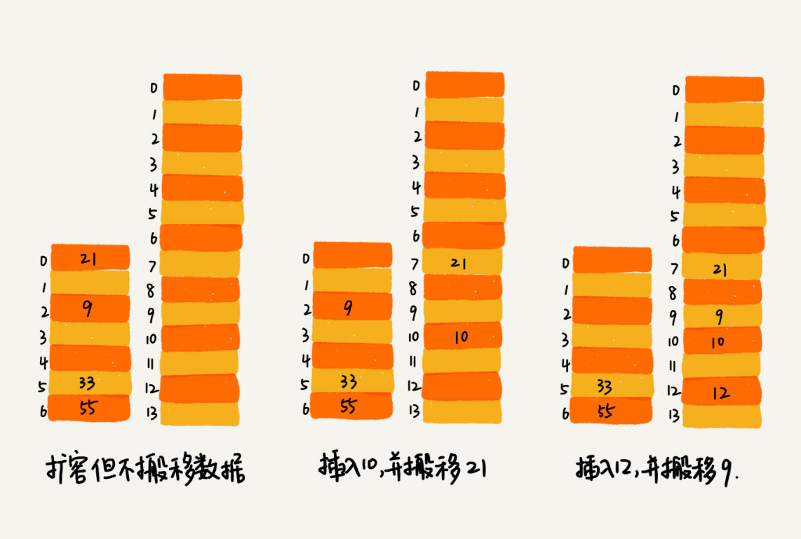

# 散列表中：如何打造一个工业级水平的散列表

散列表碰撞攻击的基本原理：
如果散列表中有10万个数据，恶意攻击者通过设计将所用的数据通过散列表之后，散列在同一个槽内，散列表就退化为链表，查询的时间复杂度就从O(1)变成了O(n)。如果之前查询100次需要0.1秒，现在就需要1万秒。这样就消耗大量的CPU或者线程资源，从而达到拒绝服务攻击的目的。

**如何设计一个可以应对各种异常情况的工业级散列表，来避免在散列冲突的情况下，散列表性能急剧下降，并且能抵抗散列碰撞攻击？**

## 如何设计散列函数
散列函数的好坏决定了散列表冲突的概率大小，也直接决定了散列表的性能。

首先散列函数的设计不能太复杂。否则散列过程本身就会消耗很多时间。
其次散列函数生成的值要尽可能随机并且均匀分布，这样才会避免或者最小化散列冲突。

实际工作中还要考虑各种因素，包括关键字的长度、特点、分布还有散列表的大小等。

运动会的例子，通过分析参赛编号的特点，把编号中的后两位作为散列值，这种散列函数的设计方法，我们一般叫做“数据分析法”

第二个例子，word拼写检查功能；将单词的每个字母的ASCII码进位相加，然后再跟散列表的大小求余取模，作为散列值。比如nice，散列值为：

    hash("nice")=(("n" - "a") * 26*26*26 + ("i" - "a")*26*26 + ("c" - "a")*26+ ("e"-"a")) / 78978

## 装载因子过大了怎么办？

针对散列表，装载因子过大时，我们可以通过进行动态扩容，重新申请一个更大的散列表，将数据搬移到这个新的散列表中，假设每次扩容我们都申请一个原来散列表两倍的空间。如果原来散列表的装载因子是0.8，那经过扩容之后，新散列表的装载因子就下降为原来的一半，变为0.4；

针对散列表的扩容，数据搬移要复杂的多。因为散列表的大小变了，数据存储位置变了，所以我们需要经过散列函数重新计算每个数据的存储位置。

时间复杂度分析：
最好情况，插入不扩容，时间复杂度是O(1)；
最坏情况下，散列表装载过高，启动扩容，时间复杂度是O(n);
摊还分析：时间复杂度接近最好情况，就是O(1);

随着数据的删除，散列表中数据会越来越少，空闲空间会越来越多，如果我们对空间消耗非常敏感，可以在装载因子小于某个值以后，启动动态缩容；

## 如何避免低效的扩容
极端例子：如果散列表大小为1GB，要想扩容到原来的两倍，那就需要对1GB的数据重新计算哈希值，兵器散列表要搬移到新的散列表中。

如果这样的业务代码直接服务于用户，尽管大部分情况下，插入一个数据的操作很快，但是极个别的非常慢的插入操作，就会让用户崩溃。

为了解决一次性扩容耗时过多的情况，我们可以将扩容操作穿插在正常的插入操作中。分批完成，当装载因子触发阈值之后，我们只申请新的空间，但不将老的数据立即搬移。

当有新的数据要插入时，我们将新数据插入到新的散列表中，并且从老的散列表中拿出一个数据放入到新的散列表中。每次插入一个数据就重复上面的过程。多次插入后，老的散列表就被一点点搬移过来了。

对于查找操作，为了兼容新老散列表中的数据，我们先从新散列表中查找，如果没有找到，再去老的散列表中查找。

对于上述的均摊方法，将以此扩容代价均摊到多次操作中，这种实现方法，任何情况下插入一个数据的时间复杂度都是O(1);

## 如何选择冲突解决方法？

两种冲突解决方法各自优势和劣势：

### 开发寻址法
优点：
散列表中的数据存储在数组中，可以有效利用CPU缓存加快查询速度；
这种方法实现的散列表，序列化起来比较简单。

缺点：
删除数据比较麻烦，需要特殊标记已经删除掉的数据。
冲突代价更高。

**总结一下，当数据量小、装载因子小的时候，适合采用开放寻址法。这也是Java中的ThreadLocalMap使用开放寻址法解决散列冲突的原因**

### 链表法
链表法对内存的利用率比开放寻址法要高。

链表法比起开放寻址法，对大装载因子的容忍度更高。开放寻址法只适用于装载因子小于1的情况。接近1的时候，就可能会有大量的散列冲突，导致大量探测，在散列等。性能会下降很多。但是对于链表法来说，只要散列函数的随机均匀，即便装载因子变成了10，也就是链表的长度变长了而已，虽然查找效率下降，但是比起顺序查找还是快很多。

但是链表中的节点是零散分布在内存中的，不是连续的，所以对CPU缓存不是友好的。

我们对链表法稍加改造，可以实现一个更加高效的散列表。那就是，我们将链表法中的链表改造为其他高效的动态数据结构，比如跳表、红黑树。即便出现散列冲突，极端情况下，所有的数据都散列到同一个桶内，最终退化成的散列表的查找时间也不过是O(logn);

**总结一下，基于链表的散列冲突处理方法比较适合存储大对象，大数据量的散列表，而且，比起开放寻址法，他更加灵活，支持更多的优化策略，比如红黑树代替链表。**

## 工业级散列表举例分析

java中的
HashMap这样的工业级散列表：
### 1、初始大小
HashMap默认的初始大小是16，默认值可以修改。

### 2、装载因子和动态扩容
最大装载因子是0.75，当HashMap中元素的个数超过0.75*capacity的时候，就会启动扩容，每次扩容就会扩容为原来的两倍大小。

### 3、散列冲突解决方法
HashMap底层采用链表法来解决冲突。即使负载因子和散列函数设计的再合理，也免不了出现拉链过长的情况，则会影响HashMap的性能。

在JDK1.8之后，对HashMap做进一步的优化，我们引入了红黑树，当链表长度太长（默认为8）链表就转换为红黑树。当红黑树节点个数少于8个的时候，优惠将红黑树转化为链表。

### 4、散列函数
简单高效，分布均匀；

    int hash(Object key) {
        int h = key.hashCode()；
        return (h ^ (h >>> 16)) & (capicity -1); //capicity表示散列表的大小
    }
其中hashCode()返回的是Java对象的hash code。

    public int hashCode() {
    int var1 = this.hash;
    if(var1 == 0 && this.value.length > 0) {
        char[] var2 = this.value;
        for(int var3 = 0; var3 < this.value.length; ++var3) {
        var1 = 31 * var1 + var2[var3];
        }
        this.hash = var1;
    }
    return var1;
    }

## 解答开篇
设计一个工业级的散列函数？如何从那几个方面思考？
首次思考，**什么是一个工业级的散列表？工业级的散列表具有哪些特性？**

1. 支持快速的查询、插入、删除操作；
2. 内存占用合理，不能浪费过多的内存空间；
3. 性能稳定，极端情况下，性能不能退化到无法接受的情况；

**如何实现一个这样的散列表呢？** 三个方面思考：

1. 设计一个合适的散列函数；
2. 定义装载因子阈值，并且设计动态扩容策略；
3. 选择合适的散列冲突解决办法；
