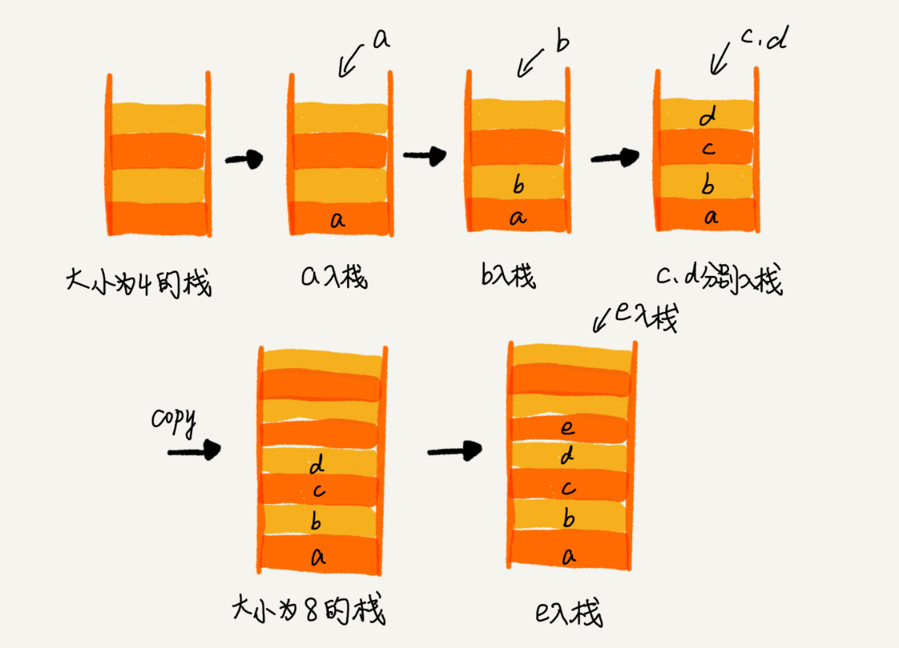

# 栈：如何实现浏览器的前进和后退功能

开篇问题：浏览器的前进，后退功能如何实现？

## 如何理解栈？
栈可以理解为一摞盘子，正常人取放盘子都是在最上面拿取。
后进者先出，先进者后出，这是典型的栈结构。

从栈的操作特性来看，栈是一种受限的线性表，只允许在一端插入和删除数据。

特定的数据结构是对特定场景的抽象，而且，数组或链表暴露了太多的操作接口，操作上灵活自由，但使用起来就比较不可控，孜然也就更容易出错。

当某个数据集合只设计在一端插入和删除数据，并且满足后进先出，先进后出的特性，我们就应该首选栈的数据结构

## 如何实现一个栈？
栈的关键操作，主要有两个，入栈和出栈，也就是是栈顶插入，栈顶删除。

实际上数组实现的栈，我们也叫顺序栈，用链表实现的栈也叫链式栈

    // 基于数组实现的顺序栈
    public class ArrayStack {
    private String[] items;  // 数组
    private int count;       // 栈中元素个数
    private int n;           //栈的大小

    // 初始化数组，申请一个大小为n的数组空间
    public ArrayStack(int n) {
        this.items = new String[n];
        this.n = n;
        this.count = 0;
    }

    // 入栈操作
    public boolean push(String item) {
        // 数组空间不够了，直接返回false，入栈失败。
        if (count == n) return false;
        // 将item放到下标为count的位置，并且count加一
        items[count] = item;
        ++count;
        return true;
    }
    
    // 出栈操作
    public String pop() {
        // 栈为空，则直接返回null
        if (count == 0) return null;
        // 返回下标为count-1的数组元素，并且栈中元素个数count减一
        String tmp = items[count-1];
        --count;
        return tmp;
    }
    }

基于链表实现的链式栈：

    public class MyStack {
        //链式栈实现
        private Node head;
        private Node last;
        private int size;
        private int count;
        //栈的初始化
        public MyStack(int n){
            this.head = new Node();
            this.last = new Node();
            head.next = last;
            this.size = n;
            this.count = 0;
        }
        //out
        public void out(){
            System.out.print("head: " + this.head.data + " ");
            System.out.print("last: " + this.last.data + " ");
            System.out.print("count: " + this.count + " -> ");
            Node p = this.head;
            while (p != null){
                System.out.print(p.data + " ");
                p = p.next;
            }
            System.out.println();
        }
        //出栈
        public boolean pop(){
            if(count == 0){
                return false;
            }
            if(count == 1){
                head = null;
                return true;
            }
            Node p = head;
            while(p.next != this.last){
                p = p.next;
            }
            last = p;
            last.next = null;
            --count;
            return true;
        }
        //入栈
        public boolean push(int item){
            if(count == size){
                return false;
            }
            Node p = new Node(item);
            p.next = null;
            if(count == 0){
                head = p;
                last = p;
            }else{
                last.next = p;
                last = p;
            }
            count++;
            return true;
        }
        public static void main(String[] args){
            MyStack myStack = new MyStack(10);
            for(int i = 0; i < 5; i++){
                myStack.push(i);
            }
            myStack.out();
            myStack.pop();
            myStack.out();
            myStack.pop();
            myStack.out();
            myStack.pop();
            myStack.out();
            myStack.pop();
            myStack.out();
        }
    }

在入栈和出栈过程中，只需要一两个临时变量存储空间，所以空间复杂度是O(1)。

我们在说空间复杂度的时候，指的是出了原本的数据存储空间外，算法运行还需要多少额外的存储空间。

## 支持动态扩容的顺序栈
（底层使用支持动态扩容的数组即可）
当数组空间不够时，我们就重新申请一块更大的内存，将原来数组中数据统统拷贝过去。这样就实现了一个支持动态扩容的数组。

时间复杂度的分析：
对于出栈操作来说，我们不会涉及内存的重新申请和数据的搬移，所以出栈的时间复杂度仍然是 O(1)。
对于入栈操作，当栈中有空闲空间时，入栈操作的时间复杂度为 O(1)。但当空间不够时，就需要重新申请内存和数据搬移，所以时间复杂度就变成了 O(n)。

因为O(n)出现的频率是规律的，大部分情况时为O(1)，使用摊还时间分析法
这 K 次入栈操作，总共涉及了 K 个数据的搬移，以及 K 次 simple-push 操作。将 K 个数据搬移均摊到 K 次入栈操作，那每个入栈操作只需要一个数据搬移和一个 simple-push 操作。以此类推，入栈操作的均摊时间复杂度就为 O(1)

## 栈在函数调用中的应用
操作系统给每个线程分配一块独立的内存空间，这块内存被组织成栈这种结构，用来存储函数调用时的临时变量

    int main() {
        int a = 1; 
        int ret = 0;
        int res = 0;
        ret = add(3, 5);
        res = a + ret;
        printf("%d", res);
        reuturn 0;
    }

    int add(int x, int y) {
        int sum = 0;
        sum = x + y;
        return sum;
    }
在执行add()函数时候，函数调用栈的情况是：

## 栈在表达式求值的时的应用
编译器使用栈，实现表达式的求值
编译器通过两个栈来实现，其中一个保存操作数的栈，另一个是保存运算符的栈，我们从左到右遍历表达式，遇到数字直接压入操作数栈，当遇到运算符基于运算符栈顶元素进行比较。
如果比运算符栈顶元素优先级高，就讲当前运算符压入栈；如果比运算符栈顶元素的优先级低或者相同，从运算符栈中取栈顶运算符，从操作数栈的栈顶取 2 个操作数，然后进行计算，再把计算完的结果压入操作数栈，继续比较。

## 栈在括号匹配中的应用
假设表达式中只包含三种括号，圆括号 ()、方括号 [] 和花括号{}，并且它们可以任意嵌套
如何检查它是否合法呢？
栈来保存未匹配的左括号，从左到右依次扫描字符串。当扫描到左括号时，则将其压入栈中；当扫描到右括号时，从栈顶取出一个左括号。如果能够匹配，比如“(”跟“)”匹配，“[” 跟 “]”匹配，“{”跟“}”匹配，则继续扫描剩下的字符串。如果扫描的过程中，遇到不能配对的右括号，或者栈中没有数据，则说明为非法格式。
当所有的括号都扫描完成之后，如果栈为空，则说明字符串为合法格式；否则，说明有未匹配的左括号，为非法格式。

## 解答开篇
我们使用两个栈，X 和 Y，我们把首次浏览的页面依次压入栈 X，当点击后退按钮时，再依次从栈 X 中出栈，并将出栈的数据依次放入栈 Y。当我们点击前进按钮时，我们依次从栈 Y 中取出数据，放入栈 X 中。当栈 X 中没有数据时，那就说明没有页面可以继续后退浏览了。当栈 Y 中没有数据，那就说明没有页面可以点击前进按钮浏览了。

如果中间跳转了其他新的页面将无法在Y栈中的页面将无法再通过前进后退进行访问了。

## 课后思考：
JVM 内存管理中有个“堆栈”的概念。栈内存用来存储局部变量和方法调用，堆内存用来存储 Java 中的对象。那 JVM 里面的“栈”跟我们这里说的“栈”是不是一回事呢？如果不是，那它为什么又叫作“栈”呢？

答：
内存中的堆栈和数据结构中堆栈不是一个概念，可以说内存中的堆栈是真实存在的物理区，数据结构中的堆栈是抽此昂的数据存储结构。

内存空间在逻辑上分为三部分：代码区，静态数据区和动态数据区，动态数据区又分为栈区和堆区。

代码区：存储方法体的二进制代码。高级调度（作业调度）、中级调度（内存调度）、低级调度（进程调度）控制代码区执行代码的切换。

静态数据区：存储全局变量、静态变量、常量，常量包括final修饰的常量和String常量。系统自动分配和回收。

栈区：存储运行方法的形参。局部变量。返回值。由系统分配和回收。
堆区：new一个对象的引用或地址存储在栈区，执行该对象在栈区中真实的数据。

