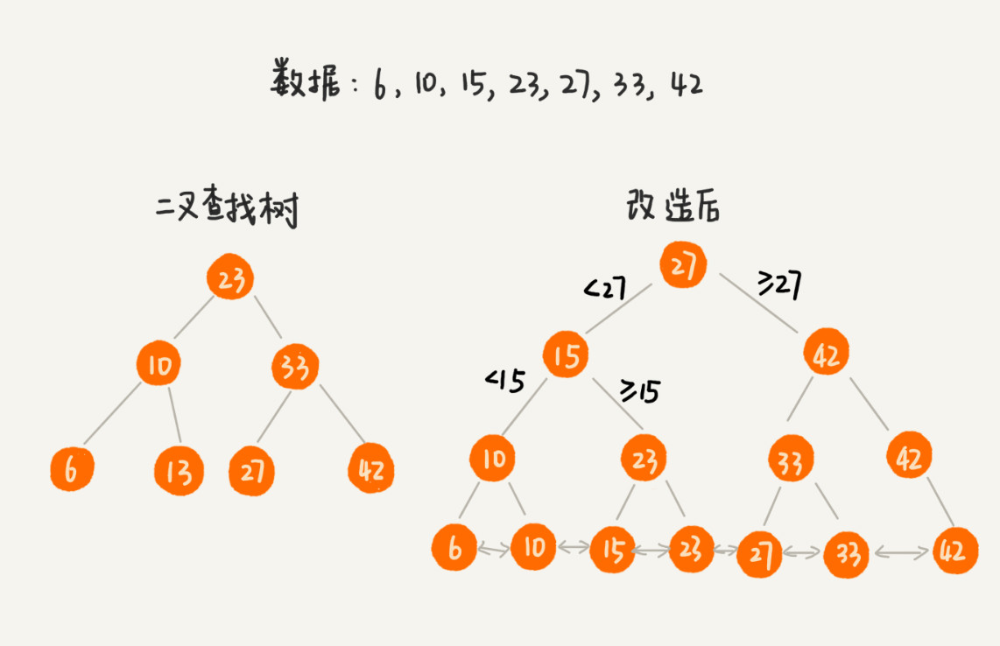
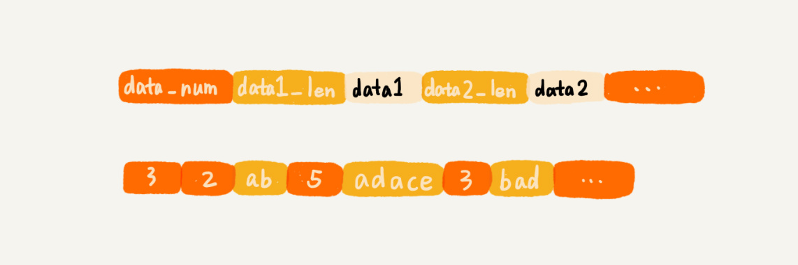

# B+树，索引，Redis实战相关总结

## B+树，MySQL数据库索引的相关实现
数据库索引是如何实现的呢？底层使用的是怎样的数据结构和算法呢？

### 1、解决问题的前提是定义清楚问题
需求：简单来说就是两点：
根据某个值来查找数据，比如select * from user where id = 1234;
根据区间值来查找某些数据，比如select * from user where id > 1234 and id < 2345;

除了这些功能性的需求，再者就是要兼顾效率和空间；

### 2、尝试用学过的数据结构来解决这个问题
支持快速查询插入操作的动态结构，有散列表，跳表，红黑树；

散列表：插入查询时间复杂度都是O(1),但是散列表不支持按区间快速查找；

平衡二叉查找树：尽管性能很高，时间复杂度是O(logn)，对树进行中序排列之后也可以得到一个从小到大的数据序列，但是这仍然不能按照区间快速查找；

跳表：跳表是在链表基础上加了很多层索引构成的，他支持快速查找，插入删除数据，时间复杂度是O(logn),并且跳表是支持快速按照区间查找的，只需要找到起点，然后往后遍历即可；

数据库索引所用到的数据结构跟跳表非常相似，叫做B+树；

### 3、改造二叉树解决问题
对二叉树进行改造，树中的节点并不只是数据本身，而是作为索引，除此之外我们把每个叶子节点串在一起，形成一个链表；
（所谓跳表就是一层一层的链表，通俗讲链表+链表；所谓B+树就是树+链表，上面是树(二叉查找树），下面是链表）

改造之后的按区间查找：

如果成千万上亿的数据构建索引，如果索引都存储在内存中，尽管内存访问的速度恒快但是占用内存很大；比如一亿数据构建二叉树索引，就要包含大约一亿个节点，每个节点16字节，就需要1GB的内存空间；如果更大的表呢？

借助时间换空间的思路，将索引存储在磁盘中的话，尽管减少了内存的消耗，但是在数据查找的过程中需要读取磁盘的索引，因此数据查询效率就会相应的降低很多；

因此每个节点的读取或者访问，都对应一次磁盘操作，树的高度就等于磁盘操作次数；
所以我们继续改造，如果我们不使用二叉树索引，改成m叉树，高度就会变小，效率就会变高；

m叉树实现的B+树索引，代码实现出来就是：假设数据库存储的int类型的数据；

对于相同个数的数据构建m叉树索引，m越大，树的高度就越小，那么m是不是越大越好呢？

不管是内存还是磁盘，操作系统都是按页进行读取的，我们选择m的大小时候，要尽量让每一个节点的大小等于一个页的大小，读取一个节点只需要一次IO操作；

对于一个B+树来说，m值是根据页的大小事先计算好的，也就是说，每个节点最多只能有m个子节点。在数据库的写入数据过程中，这样就有可能使索引中某些节点的子节点个数超过m，这个节点的大小就超过了一个页的大小，读取这样的节点就会导致多次IO操作，如何解决这个问题呢？

实际上处理思路不复杂，我只需将这个节点分裂为两个节点，但是节点分裂之后，其上层的父节点的子节点个数就可能超过m个，不过这个没关系，我们用同样的方法，将父节点也分裂为两个节点，这种级联的反应会从下往上，一直影响到根节点。这个分裂过程如下图所示

因为要时刻保持B+树索引是一个m叉树，所以索引的存在会导致数据库写入数据降低，实际上，不光下入数据会变慢，删除数据也会变慢；

我们再删除过程中，也要更新索引节点，这个处理思路类似于跳表中删除数据的处理思路。频繁的数据删除必然会导致某些节点中，子节点的个数变得非常少，长此以往，如果每个节点的子节点都比较少，势必会影响索引的效率；

我们可以设置一个阈值，在B+树中，这个阈值是m/2。如果某个节点的子节点的个数小于m/2，我们就把他和相邻的兄弟节点合并，不过合并之后的节点个数可能会超过m，我们可以借助插入数据的处理方法，在分裂节点；

### 总结引申
B+树的特点：
1. 每个节点中子节点的个数不能超过m，也不能小于m/2;
2. 根节点的子节点个数可以不超过m/2，这是一个例外；
3. m叉树只存储索引，并不真正的存储数据，这个有点类似跳表；
4. 通过链表将叶子节点串联在一起，这样可以方便按区间查找；
5. 一般情况下，根节点会被存储在内存中，其他节点存储在磁盘中；

B树实际上就是B-树；
1. B+树中的节点不存储数据，只是索引，而B树中的节点存储数据；
2. B树中的叶子节点并不需要链表来串联；

其实 B树只是一个节点的子节点不能小于m/2的m叉树；

## 索引：如何在海量数据中快速查找到某个数据

MySQL底层依赖的是一个B+树这种数据结构，类似Redis这样的k-v数据库中索引，又是什么呢？

### 为什么需要索引
如何节省存储空间，如何提高数据增删改查的执行效率，这样的问题就成了设计的重点；这些系统的实现都离不开索引；

索引换句话来说就好像是书记的目录；

### 索引的需求定义
#### 功能性需求
1. 数据是格式化数据还是非格式化数据：格式化数据就是MySQL的数据，非格式化的数据就是类似于网页这样的数据，需要先做预处理，提取查询关键词；
2. 数据是静态的还是动态的：静态数据不会有数据的增加，删除，更新操作，只需要考虑查询效率就可以；动态数据就要考虑查询效率，还要考虑支持动态的数据集合的索引；
3. 索引存储在内存还是硬盘：主要是存储的位置不同访问的效率不同；
4. 单值查找还是区间查找：
5. 单关键词查找还是多关键词组合查找：

### 非功能性需求
1. 不管是存储在内存中还是磁盘中，索引堆空间的消耗不能过大。
2. 在考虑索引查询效率的同时，我们还要考虑索引维护成本；
   
### 构建索引的常见数据结构有哪些
散列表：增删查改性能都比较好，时间复杂度是O(1),用在一些键值数据库中，比如Redis，Memcache,这类索引一般存在于内存中；

红黑树：一种常用的平衡查找二叉树，数据插入，删除，查找的时间复杂度是O(logn)，也非常适合构建内存索引，Ext文件系统中，对磁盘块的索引就是红黑树；

B+树，比起红黑树来讲，更适合构建存储在磁盘中的索引，B+树是一个多叉树，所以对相同个数的数据构建索引，B+树的高度要低于红黑树，借助索引来查询数据的时候，读取B+树索引，需要的磁盘IO次数会更少。大部分关系型数据库的索引，比如MySQL，都是用B+树来实现的；

跳表：也支持快速的添加，删除，查找数据，我们通过灵活调整索引节点的个数和数据个数之间的比例，可以很好的平衡索引对内存的消耗及其查询效率，Redis中的有序集合，就是用跳表来构建的；

布隆过滤器，有一定的判错率，但是我们要规避他的短处，发挥长处，如果布隆过滤器判断不存在的数据就一定不存在，因此查询数据之前进行布隆过滤器，如果不存在就不用访问磁盘了；

## 剖析Redis常用数据类型对应的数据结构
经典数据库Redis中常用的数据类型，底层都是用那些数据结构实现的呢？

### Redis数据库介绍：
一种键值对数据库，非关系型数据库；
redis主要是是作为内存数据库使用，也就是说，数据是存储在内存中的，尽管他经常被用作内存数据库，但是他也支持数据存在在硬盘上；

Redis中键的数据类型是字符串，值的数据类型就很多，主要有，字符串，列表，字典，集合有序集合；

### 列表
列表支持存储一组数据，这种类型的两种实现方法，一种是压缩列表，一种是双向循环列表；

采用压缩列表的条件是：
1. 列表中保存的单个数据（也有可能是字符串）小于64字节；
2. 列表中数据个数少于512个；

而是 Redis 自己设计的一种数据存储结构。它有点儿类似数组，通过一片连续的内存空间，来存储数据。不过，它跟数组不同的一点是，它允许存储的数据大小不同。具体的存储结构也非常简单：

压缩列表将不再像数组一样使用统一的大小来存储数据，而是需要多少是多少，相互连接起来；
这样比较节省内存，另一方面可以支持不同类型数据的存储，而且因为数据存储在一片连续的内存空间中，通过键来获取值我列表类型的数据，读取效率也非常高。

当列表中存储的数据量非常大的时候，也就是不能同时满足刚刚讲的两个条件时候，列表就要通过双向循环链表来实现了；

    typedef struct listnode {
        struct listnode *prev;
        struct listnode *next;
        void *value;
    } listNode;

    typedef struct list{
        listNode *head;
        listNode *tail;
        unsigned long len;
    } list;

### 字典（hash)
字典类型用来存储一组数据对，每个数据对又包含键值两部分。字典类型也有两种实现方式，一种是我们刚刚讲到的压缩列表，一种是散列表；

同样当存储的数据量比较小的情况下，Redis才使用压缩列表来实现字典类型；
1. 字典中保存的键值大小都要小于64字节；
2. 字典中键值的个数要小于512。

当不能满足上述条件的时候，Redis使用散列表来实现字典类型。Redis使用MurmurHash2这种运行速度快、随机性好的哈希算法作为哈希函数。对于哈希冲突问题，Redis 使用链表法来解决。除此之外，Redis 还支持散列表的动态扩容、缩容；

当装载因子大于1的时候，Redis会触发扩容，将散列表扩大到2倍；
当装载因子小于0.1的时候，Redis会触发缩容，缩小到字典数据个数的大约2倍；

扩容缩容需要大量的数据搬移和哈希值的重新计算，比较耗时，针对这个问题，Redis使用的是渐进式扩容缩容机制，避免一次性的数据搬移导致的服务停顿；

### 集合（set）
集合中数据类型用来存储一组不重复的数据，两种实现方法一种基于有序数组，一种基于散列表；

如果满足下面两个条件Redis使用有序数组，实现集合中数据类型；
1. 存储的数据都是整数；
2. 存储的数据元素个数不超过512个；

否则Redis使用散列表来存储集合中数据；

### 有序集合（sortedset）
有序集合，它用来存储一组数据，并且每个数据会附带一个得分，通过得分的大小，我们将数据组织成跳表这样数据结构，以支持，快速的按照的得分值，得分区间获取数据；

有序集合不仅仅只有跳表这一种实现方式，当数据量比较小的时候Redis会用压缩列表来实现有序集合，具体点说就是，使用压缩列表来实现有序集合的前提：
1. 所有数据的大小都要小于64字节；
2. 元素要小于128个；

### 数据持久化

Redis 遇到的这个问题并不特殊，很多场景中都会遇到。我们把它叫作数据结构的持久化问题，或者对象的持久化问题。这里的“持久化”，你可以笼统地可以理解为“存储到磁盘”。

第一种是清除原有的存储结构，只将数据存储到磁盘中。当我们需要从磁盘还原数据到内存的时候，再重新将数据组织成原来的数据结构。实际上，Redis 采用的就是这种持久化思路。

第二种方式是保留原来的存储格式，将数据按照原有的格式存储在磁盘中。

