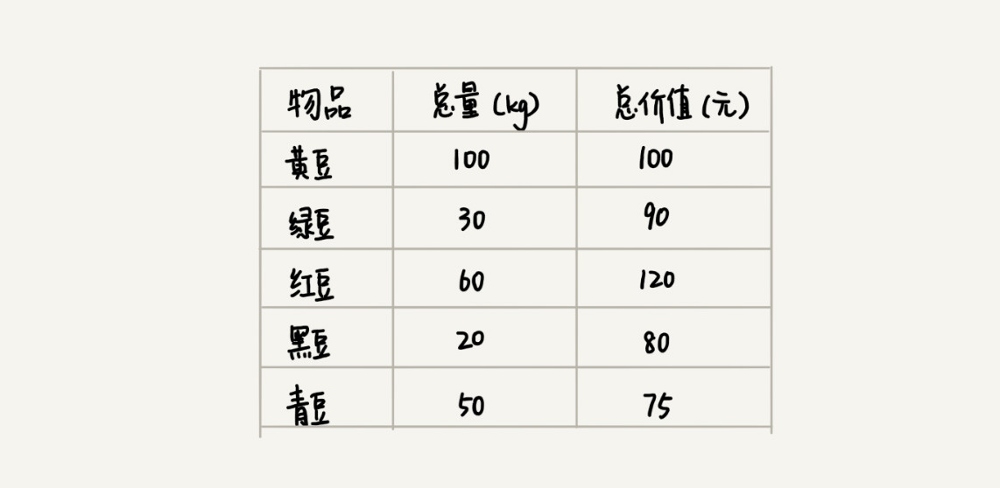
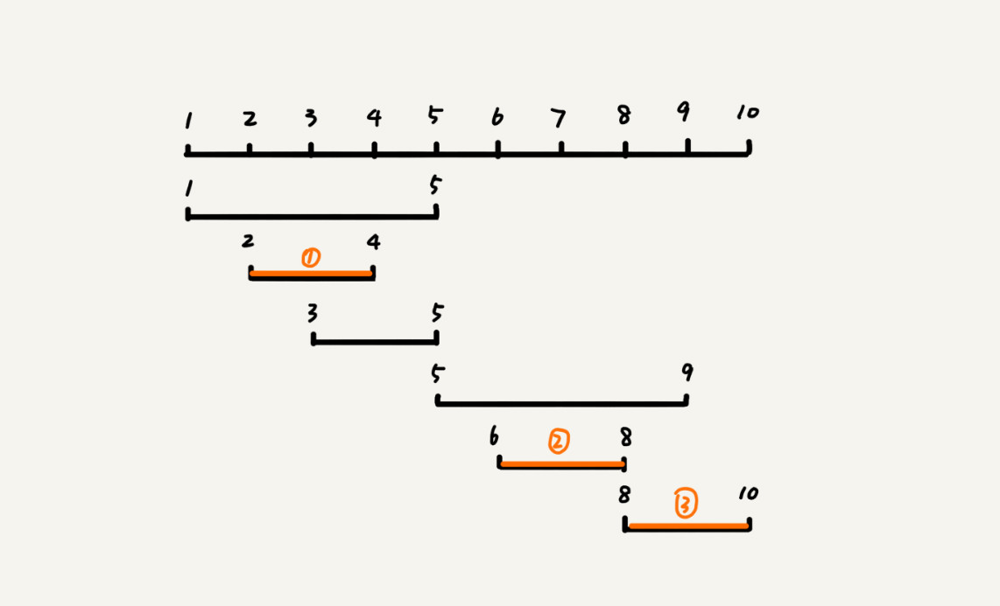

# 贪心算法：如何用贪心算法实现Huffman压缩编码

几种更加基本的算法，分别是贪心算法，分治算法，回溯算法，动态规划；

贪心算法比较经典的应用，比如霍夫曼编码，Prim和Kruskal最小生成树算法，还有Dijkstra单源最短路径算法。
**霍夫曼编码是如何利用贪心算法来实现对数据压缩编码，有效节省数据存储空间的**

## 如何理解贪心算法呢？

先看一个例子，假设有一个可以容纳100kg的背包，有以下5种豆子，每种豆子的总量和总价值都各不相同，如何才能让背包中的物品价值最大呢？

实际上这个问题很简单，我们只需要算一下每个物品的单价，按照从高到低来装就好了，所以最后的结果是包中装20kg黑豆，30kg绿豆，50kg红豆；

结合上面的例子，我们来总结一下贪心算法解决问题的步骤；
**第一步，当我们看到这类问题的时候，首先要联想到贪心算法**：针对一组数据，定义了限制值和期望值，希望从中选出几个数据，在满足限制值的情况下，期望值最大。

上述例子中，背包重量不可以超过100kg就是限制值，物品的总价值就是期望值。

**第二步，我们尝试看下这个问题是否可以用贪心算法解决**，每次选择当前情况下，在对限制值同等贡献量的情况下，对期望值贡献最大的数据；

**第三步，我们举几个例子看下贪心算法产生的结果是否最优的**，大部分情况下，举几个例子就可以了，严格证明贪心算法的正确性，是比较复杂度；

实际上，用贪心算法解决问题的思路，并不总能给出最优解。
我来举一个例子，比如在一个有权的无向图中寻找从顶点S到顶点T的最短路径；

按照贪心算法解出的最短路径S，A，E，T，但是实际的最短路径是S，B，D，T；

在这个问题上，贪心算法不能工作的主要原因是因为前面的选择对后面的选择是产生影响的，所以即使是我们第一步的路径最小，但是导致了后面的每一步选择都很糟糕，最终没办法解出全局最优解；

## 贪心算法实战分析
掌握贪心算法的关键在于多练习，具体问题具体分析；

### 1、分糖果
有m个糖果，n个孩子，我们现在要把糖果分给这些孩子吃，但是糖果少，孩子多，（m < n)，所以糖果只能分配给一部分孩子；

糖果大小不等，这m个糖果大小分别是s1，s2，s3，……，sm，除此之外每个孩子对糖果大小的需求也是不一样的，糖果大小必须大于孩子对糖果大小的需求。假设这n个孩子对糖果大小的需求分别是g1，g2，g3，……，gn。

问题是：如何分配糖果，能尽可能的满足最多数量的孩子？

从n个孩子中，抽取一部分孩子分配糖果，让满足的孩子数量最多，这个问题的限制值是糖果个数m。

对于一个孩子来说，如果小的糖果可以满足，我们没有必要用更大的糖果，这样更大的就可以留给其他对糖果大小需求更大的孩子，另一方面，对糖果大小需求小的孩子更容易满足，所以我们可以从需求更大的孩子。开始分配糖果，因为满足一个大的孩子和满足一个需求小的孩子，对我的期望值贡献是一样的；

所以最后的做法就是，我们每次从剩下的孩子中，找出堆糖果需求最小的孩子，然后发给他剩下糖果中能满足她的最小的糖果，这样的分配方案也就是满足孩子个数最多的方案；

### 2、钱币找零
假设我们有1元，2元，5元，10元，20元，50元，100元面额的纸币，他们的张数分别是c1，c2，c5，c10，c20，c50，c100；我们现在要用这些钱来支付K元，最少要用多少张纸币呢？

生活中我们肯定优先使用面值最大的来支付，如果不够继续使用面值更下一点的，以此类推，最后剩下的用1元补齐；

在贡献相同期望值（纸币数目）的情况下，我们希望多贡献点金额，这样就可以让纸币树更少，这就是一种贪心算法的解决思路；

### 3、区间覆盖
假设我们有n个区间，区间起始端点和结束端点分别是[l1,r1],[l2,r2],……,[ln,rn];我们从这n个区间中选出一部分区间，这部分区间满足两两不相交（端点相交不算），最多能找出多少个区间呢？

这道题思路涉及比如任务调度，教师排课等；

解决思路：我们假设这n个区间中最左边的端点是lmin，最右边的端点是rmax，这个问题就相当于选择几个不相交的区间，从左到右将[lmin,rmax]覆盖上，我们按照起始端点从小到大的顺序对这n个区间排序；

每次选择的时候，左端点跟前面的已经覆盖的区间不重合，右端点又尽量小的，这样可以让剩下的未覆盖区间尽可能的大，就可以放置更大的区间；

## 解答开篇
假设我有一个包含1000个字符的文件，每个字符占1个byte，存储这个1000字符文件就需要8000bit，那么有没有更加节省空间的存储方式呢？

假设统计发现，这1000个字符中只包含6种不同的字符，分别是a,b,c,d,e,f。而3个二进制位就可以表示8个不同的字符，所以可以用3个二进制位表示，此时只需要3000bit就可以了，还有没有更加省空间的存储方式呢？

霍夫曼编码是一种十分有效的编码方式，广泛用于数据压缩中，其中压缩率通常在20%~90%，霍夫曼编码不仅会考察文本中有多少个不同的字符，霍夫曼编码不等长，出现概率越高的字符编码越短；

为了避免歧义，霍夫曼编码要求各个字符编码之间，不可以出现摸个编码是另一个编码前缀的情况；

假设这 6 个字符出现的频率从高到低依次是 a、b、c、d、e、f。我们把它们编码下面这个样子，任何一个字符的编码都不是另一个的前缀，在解压缩的时候，我们每次会读取尽可能长的可解压的二进制串，所以在解压缩的时候也不会歧义。经过这种编码压缩之后，这 1000 个字符只需要 2100bits 就可以了。

我们把每个字符看做一个节点，并且附带着把频率放到优先级队列中，我们从队列中取出频率最小的两个节点A，B，然后新建一个节点C，把频率设置为两个节点的频率之和，并把这个新节点C作为节点A，B的父节点，最后再把C放入优先级队列中，重复上述过程，知道队列中没有数据；

现在我们给每一条表加上一个权值，指向左节点的边我们统统记做1，那从根节点到叶子节点的路径就是叶子节点对应的字符的霍夫曼编码；

## 内容小结

比如最小生成树算法、单源最短路径算法，这些算法都用到了贪心算法。
不要刻意去记忆贪心算法的原理，多练习才是最有效的学习方法。

## 课后思考

1. 在一个非负整数 a 中，我们希望从中移除 k 个数字，让剩下的数字值最小，如何选择移除哪 k 个数字呢？
   1、从高位往下走，删掉高位比低位大的数，假如4596743只能删除一位，我们会删除第三位的9，删除一个数字剩下的数字位数一样，这个时候在越高位上删除数字最大的数字会使得剩下数字更小；
   如果数字是递增的，直接删除最后k位就好了；

2. 假设有 n 个人等待被服务，但是服务窗口只有一个，每个人需要被服务的时间长度是不同的，如何安排被服务的先后顺序，才能让这 n 个人总的等待时间最短？
   想让所有人的等待时间最短，那么我们得先处理服务时间短的，尽快把他们处理完了才能够处理后面的人；
   先处理时间长的下面的人就要等待一个长的处理时间，先处理短的下面人员就需要等以短的时间；