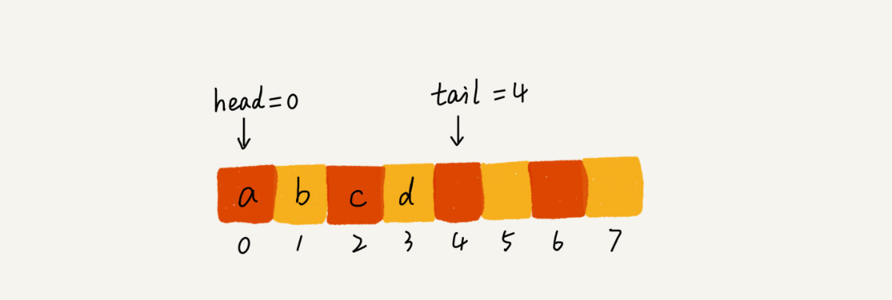
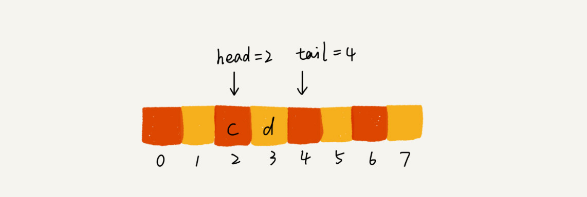
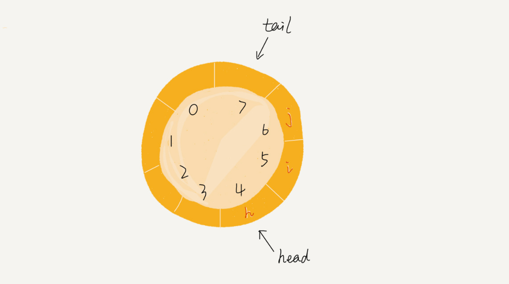

# 队列

当我们向固定大小的线程池中请求一个线程时，如果线程池中没有空闲资源了，这个时候线程池如何处理这个请求？是拒绝请求还是排队请求？各种处理策略有事怎么实现的？

## 如何理解队列呢？
队列先进者先出，这就是典型的队列。

队列的两个基本操作，入队enqueue()，放一个数据到队列尾部；出队dequeue()，从队列头部取一个元素。

队列和栈一样，也是一种操作受限的线性表结构。

队列的应用非常广泛，特别是一些具有额外特性的队列，例如循环队列、阻塞队列、并发队列。

## 顺序队列和链式队列
队列可以用数组实现，也可以链表实现，数组实现的是顺序队列，链表实现的是链式队列。

基于数组实现的顺序队：

    public class MyArrayQueue {
        private String[] items;
        private int n = 0;
        private int head = 0;
        private int tail = 0;

        //初始化
        public MyArrayQueue(int capacity){
            items = new String[capacity];
            n = capacity;
        }

        //入队
        public boolean enqueue(String item){
    //        if(tail == n) {
    //            return false;
    //        }
    //        items[tail] = item;
    //        ++tail;
    //        return true;

            //数据搬移的入队操作
            if(tail == n) {
                if(head == 0){
                    return  false;
                }
                for(int i = head; i < tail; ++i){
                    items[i - head] = items[i];
                }

                tail -= head;
                head = 0;
            }
            items[tail] = item;
            ++tail;
            return true;
        }

        //出队
        public String dequeue(){
            if(head == tail) return null;
            String ret = items[head];
            ++head;
            return ret;
        }
    }
    
基于链表实现的队列：

    public class MyListQueue {
        private Node head;
        private Node tail;
        private int n;
        private int count = 0;

        //初始化
        public MyListQueue(int capacity){
            head = tail = new Node();
            n = capacity;
        }

        //入队
        public boolean enqueue(int item){
            if(count == n){
                return false;
            }
            tail.data = item;
            tail.next = new Node();
            tail = tail.next;
            count++;
            return true;
        }

        //出队
        public String dequeue(){
            if(count == 0){
                return null;
            }
            Node p = head;
            head = head.next;
            count--;
            return p.data+"";
        }

        public void out(){
            Node p = head;
            System.out.print("head: " + head.data + " ");
            System.out.print("count: " + count + " -> ");
            while (p != tail){
                System.out.print(p.data + " ");
                p = p.next;
            }
            System.out.println();
        }

        public static void main(String[] args){
            MyListQueue myListQueue = new MyListQueue(5);
            for(int i = 0; i < 6; i++){
                myListQueue.enqueue(i);
            }
            myListQueue.out();
            myListQueue.dequeue();
            myListQueue.out();
            myListQueue.dequeue();
            myListQueue.out();
            myListQueue.dequeue();
            myListQueue.out();
            myListQueue.dequeue();
            myListQueue.out();
            myListQueue.dequeue();
            myListQueue.out();
            myListQueue.enqueue(5);
            myListQueue.out();
            myListQueue.enqueue(6);
            myListQueue.out();
            myListQueue.enqueue(7);
            myListQueue.out();
            myListQueue.dequeue();
            myListQueue.out();

        }
    }

结合下面这幅图来理解。当 a、b、c、d 依次入队之后，队列中的 head 指针指向下标为 0 的位置，tail 指针指向下标为 4 的位置。

当我们调用两次出队操作只会，对重head指针指向下标为2的位置，tail指针仍然指向下标为4的位置。

随着不停的入队和出队操作，head和tail都会持续往后移动，当tail移动到最右边，即便数组中还有空闲空间，也无法继续往队列中添加数据了。

数据不连续，使用数据搬移。但如果每次出队操作的都搬移一次队列中的数据，这样出队操作时间复杂度就从O(1)变成了O(n)。
实际上，我们在出队时可以不用搬移数据。如果没有空闲空间了，我们只需要在入队时，再集中触发一次数据的搬移操作。

    // 入队操作，将item放入队尾
    public boolean enqueue(String item) {
        // tail == n表示队列末尾没有空间了
        if (tail == n) {
        // tail ==n && head==0，表示整个队列都占满了
        if (head == 0) return false;
        // 数据搬移
        for (int i = head; i < tail; ++i) {
            items[i-head] = items[i];
        }
        // 搬移完之后重新更新head和tail
        tail -= head;
        head = 0;
        }
        
        items[tail] = item;
        ++tail;
        return true;
    }

基于链表的队列我们同样需要两个指针：head和tail指针。具体的实现原理为：如图所示，入队时，tail->next= new_node, tail = tail->next；出队时，head = head->next

## 循环队列
原本的队列首尾相连就变成了循环队列，如图：

上图中这个队列大小为8，当前head=4，tail=7，当有一个新元素a入队后放到下标为7的位置。单这个时候我们并不把tail更新为8，而是将其在环中后移一位，到下标为0的位置。再有一个元素 b 入队时，我们将 b 放入下标为 0 的位置，然后 tail 加 1 更新为 1

通过这样的方法，成功避免了数据搬移操作，但是循环队列的代码实现难度要比前面讲的非循环队列难多了。最关键的是，确定好**队空和队满的判定条件**

    队列为空的判断条件还是：head==tail
    队列为满的情况是：（tail+1）%n = head

循环队列代码：

    public class CircularQueue {
        // 数组：items，数组大小：n
        private String[] items;
        private int n = 0;
        // head表示队头下标，tail表示队尾下标
        private int head = 0;
        private int tail = 0;

        // 申请一个大小为capacity的数组
        public CircularQueue(int capacity) {
            items = new String[capacity];
            n = capacity;
        }

        // 入队
        public boolean enqueue(String item) {
            // 队列满了
            if ((tail + 1) % n == head) return false;
            items[tail] = item;
            tail = (tail + 1) % n;
            return true;
        }

        // 出队
        public String dequeue() {
            // 如果head == tail 表示队列为空
            if (head == tail) return null;
            String ret = items[head];
            head = (head + 1) % n;
            return ret;
        }
    }

## 阻塞队列和并发队列

**阻塞队列**其实就是在队列基础上增加了阻塞操作。简单来说，就是在队列为空的时候，从队列头取数据会被阻塞；如果队列已经满了，那么插入数据就会被阻断。

上述定义就是一个生产者-消费者模型，使用阻塞队列，可以轻松实现一个生产者-消费者模型。

基于阻塞队列实现的生产者-消费者模型，可以有效的协调生产者和消费的速度。当生产者生产数据的速度过快，消费者来不及消费时，存储数据的队列很快就会满。这个时候，生产者就阻塞等待直到消费者消费了数据，生产者才会被唤醒继续生产。

还可以多配置几个消费者，来应对一个生产者。

**并发队列**线程安全的队列我们称之为并发队列，最直接的实现方法就是在enqueue和dequeue方法上加锁，但是锁粒度大，并发度会比较低。

## 解答开篇
线程池没有空闲线程时，新的任务请求线程资源时，线程池该如何处理？各种处理策略又是如何实现的呢？

答：两种处理策略：第一种非阻塞处理方式，直接拒绝任务请求；另外一种是阻塞的处理方式，将请求排队，等有空闲线程时，去除排队的请求继续处理，
我们希望公平的处理每个排队的请求，先进队者先服务，所以这种数据结构就很适合来存储排队请求。

实际上，对于大部分资源有限的场景，当没有空闲资源时，基本上都可以通过“队列”这种数据结构来实现请求排队。

## 课后题
1. 除了线程池这种池结构会用到队列排队请求，你还知道有哪些类似的池结构或者场景中会用到队列的排队请求呢？
2. 今天讲到并发队列，关于如何实现无锁并发队列，网上有非常多的讨论。对这个问题，你怎么看呢？

答：
1. 分布式应用中的消息队列，也是一种队列结构
2. 考虑使用CAS实现无锁队列，则在入队前，获取tail位置，入队时比较tail是否发生变化，如果否，则允许入队，反之，本次入队失败。出队则是获取head位置，进行cas。