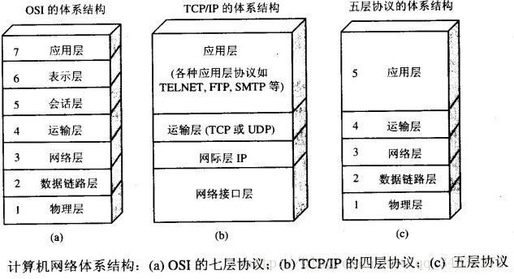

#  OSI与TCP/IP各层的结构与功能,都有哪些协议?
常见的几种计算机网络的分层：

OSI七层协议包括：应用层，表示层，会话层，运输层，网络层，数据链路层，物理层；
五层协议包括：应用层，运输层，网络层，数据链路层，物理层；

以五层协议为例介绍每层协议的作用：

## 1，应用层
**应用层的任务是通过应用进程间交互来完成特定的网络应用**。应用层协议是应用进程之间通信和交换的协议。
应用层常见的协议有，域名系统DNS，支持万维网的HTTP协议，以及支持电子邮件的SMTP协议等；
应用层交换数据单元是：报文；

## 2、运输层
**运输层的主要任务是负责两台主机进程之间的通信提供通用的数据传输服务；**
应用进程利用该服务传输应用层报文。
“通用的”指的是不针对特定应用的，是大家都可以用的，一台主机多个应用，多个进程，因此运输层应该有复用和分用的功能；
“复用”也就是多个应用层进程可以同时使用运输层的服务；
“分用”将运输层的信息分别交付给上面应用层的相应进程；
主要协议：
    TCP协议，面向连接，可靠数据传输；
    UDP协议，提供无连接的，不保证数据传输可靠性；
    具体对比详见后述；

## 3、网络层
**在计算机网络中进行通信的两个计算机之间可能经过很多个数据链路，也可能经过很多通信子网。**
**网络层的任务是选择合适的网间路由和交换结点，确保数据及时传输。**
网络层要将上层运输层产生的报文或者用户数据进行分组打包然后传送；
TCP/IP协议结构中，网络层使用的**IP协议**，分组也称IP数据报，简称数据报；
互联网是由大量的异构网络通过路由器相互连接起来的，互联网使用的网络层协议是无连接的网际协议和许多路由选择协议，因此互联网的网络层也叫网际层或者IP层；

## 4、数据链路层
**数据链路层通常简称为链路层，两台主机之间的数据传输，总是一段一段的传输的，这就需要专门的链路层的协议。**
在两个相邻节点中传输数据时，数据链路层将网络层交下来的IP数据报组装成帧，在两个节点之间传输帧，每一帧包括必要的控制信息（同步信息，地址信息，差错控制）；

控制信息可以控制每一帧哪个比特开始和到哪个比特结束；便于网络层拼接；
还可以判断错误，有的可以纠错，或者有的直接要求重传；避免继续传递更大的错误；

## 5、物理层
**物理层的作用是实现相邻计算机节点之间比特流的透明传输，尽可能的屏蔽掉具体的传输介质和物理设备的差异；**
 使其上面的数据链路层不必考虑网络的具体传输介质是什么。“透明传送比特流”表示经实际电路传送后的比特流没有发生变化；

 

具体工作在不同层的设备：
物理层主要是：网卡，网线，集线器，中继器，调制解调器；
数据链路层：网桥，交换机；
网络层：路由器；
网关工作在第四层传输层及其以上；

交换机用来进行报文交换的机器。多为链路层设备（二层交换机）能够进行地址学习，采用存储转发的形式来交换报文；
路由器的作用就是联通不同的网络，另一个作用就是选择信息传送的线路；选择通畅快捷的近路，能够大大提高通信速度，减轻网络系统通信负荷；

## 交换机和路由器的区别

1. 外形上，交换机有更多的端口，路由器端口少体积小；
2. 工作层次不同：交换机工作在数据链路层，路由器工作在网络层；
3. 数据的转发对象不同：
   交换机是根据自身维护自动学习的一个MAC地址来转发数据帧的；
   路由器是根据IP地址来转发数据报的；
   IP地址是决定数据最终要到大某一台主机的，但是MAC地址是决定下一跳将要交给那一台设备的；
   IP地址是由软件实现的，可以描述主机所在的网络，MAC地址是由硬件实现的；
   每一个网卡咋出厂时有全世界唯一的MAC地址，固定在ROM中，但是IP地址是可以变化的；
4. 分工不同：
   **交换机主要是组建局域网，而路由器则负责让主机连接到外网**，多台主机可以通过网线连接到交换机，这个时候可以通过网线连接到交换机，也就组好了局域网；局域网之内的主机就可以进行数据之间的转发，但是这个时候是不能访问外网的；
   如果想访问外网就需要使用路由器，路由器负责为局域网中是IP转换成公网的IP，从而实现访问外网；
5. 冲突域和广播域：
   交换机分割冲突域，但不分割广播域，而路由器分割广播域；
   由交换机练级的网段，仍然属于同一个广播域，广播的数据包会在交换机连接的所有网段上传播，从而导致广播风暴。而连接到路由器的网段会被分配到不同的广播域。路由器不会转发广播数据，交换机会转发广播数据到局域网中的所有主机；
总结：
    路由器是给局域网自动分配IP，虚拟拨号。交换机则只是用来分配网络数据的；
    路由器可以把一个IP分配给多个主机使用，这些主机对外表现只有一个IP，交换机将很多主机连接起来，这些主机对外各不相同的IP；
    交换机工作在数据链路层，根据MAC地址寻址，不处理TCP/IP协议；
    路由器工作在网络层，根据IP寻址，可以处理TCP/IP协议；
    路由器可以提供防火墙功能；

## 集线器和交换机的不同
    HUB也就是集线器，将所有机器连接在一起组成局域网，交换机又名交换式集线器，集线器是采用共享式带宽的工作方式，而交换机是独享带宽；

# OSI七层协议介绍
## 物理层
七层协议最底层，简单来说就是比特流的透明传输；
利用传输介质为数据链路层提供物理连接，实现比特流的透明传输，也就是在相邻两个计算机节点之间尽可能屏蔽掉所有因为传输介质产生的差异，让上层的数据链路层感受不到比特流传输前后的差别；
（发送节点发送的是什么电流比特，接收节点就接受的是什么电流比特）

## 数据链路层
主要是负责建立和管理节点之间的链路，改层的主要功能就是：通过各种控制协议将有差错的物理信道变成无差错的，可靠的传输数据帧的数据链路；具体方式是才有差错控制，流量控制等方法；

其中该层有两个子层：MAC介质访问控制和LLC逻辑链路控制
MAC子层，主要解决的是共享性的网络中，多用户对信道竞争的问题，完成网络介质的访问控制；
LLC子层，主要任务是建立和维护网络连接，执行差错校验，流量控制和链路控制。

具体工作就是，将物理层的比特流封装成帧，传送到上一层，同样将上一层的数据帧，拆分成比特流转发给物理层；复杂处理接收端发回的确认帧信息；

## 网络层
是OSI参考模型中最复杂的一层，也是通信子网最高一层；主要任务是通过路由选择算法，为报文或者分组通过通信子网选择最适当的路径。控制链路层和传输层之间的信息转发，建立，维护和终止网路的连接；
具体来说，数据链路层的数据在这一层被封装成数据包，然后通过路径选择，分段，组合，顺序，进出路由控制，从一个网路设备传送到另一网路设备；

简单来说，数据链路层解决的是同一个网路内节点的通信，使用的是物理地址MAC地址进行寻址，
网络层主要解决的是不同子网之间的通信，例如在广域网之间通信，必然会有很多路由选择问题；

网路层因为不同的子网之间的物理技术不同，不再使用物理地址来寻址，而是使用逻辑地址，也就是IP地址；

交换：规定的信息交换方式，常见的是：线路交换技术和存储转发技术，其中后者有分为报文交换技术和分组交换技术；

路由算法：两个节点之间存在多条路径的时候，通过网络为数据分组选择最佳路径，将信息从最合适的路径发送到接受端；

连接服务：与数据链路层流量控制不同的是，前者控制的是网路相邻节点间的流量，后者控制的是源节点到目的节点之间的流量；

## 传输层
OSI下三层的主要任务是数据通信，上三层的任务是数据处理，传输层起到的是承上启下的作用；
主要任务：向用户提供可靠的端到端的差错和流量控制功能，保证报文的正确传输，向高层屏蔽下层的数据通讯细节，向用户透明的传送报文，常见协议就是TCP协议；

提供会话层和网络层之间的连接，从会话层获得数据，并在必要时对数据进行分割，传输层负责两个节点之间数据的可靠传送；

主要功能是：
传输连接管理：提供建立，维护和拆除传输连接的功能，传输层为高层提供面向连接和面向无连接两种服务；

在提供面向连接的服务的时候，这一层传输的数据将由目标设备确认，如果指定的时间内没有收到确认信息，数据将被重发；

## 会话层

是用户应用程序和网络之间的接口，主要任务就是向两个实体的表示层提供建立和使用连接的方法，将不同实体之间的表示层连接成会话，协调两个会话进程之间的通信，对数据交换进行管理；

用户可以按照半双工，单工或者全双工的方式建立会话，建立会话的时候用户必须提供想要连接的远程地址，但是这里的地址跟MAC地址和网络的逻辑地址不一样，而是用户专门设计的易于记忆的，比如域名就是一种远程地址；

## 表示层
对来自应用层的命令和数据进行解释，对各种语法赋予相应的含义，按照一定格式传送到会话层；
主要功能就是，处理信息的表示问题，比如加密解密，编码数据转换等；

数据格式处理，协商字符集和数字的转换，解决各个应用程序之间表示的差异；
数据编码，处理字符集和数字的转换；
压缩与解压缩：数据的传输量太大，需要压缩和解压缩；
数据的加密和解密，提高网络的安全性；

## 应用层
它是计算机用户，以及各种应用程序和网络之间的接口，其功能是直接向用户提供服务，完成用户希望在网络上完成的各种工作。

在下面6层的基础上完成在网络上完成的各种工作；

应用层协议主要有，文件服务，目录服务，文件传输服务，远程登录服务，电子邮件服务，等等服务；

