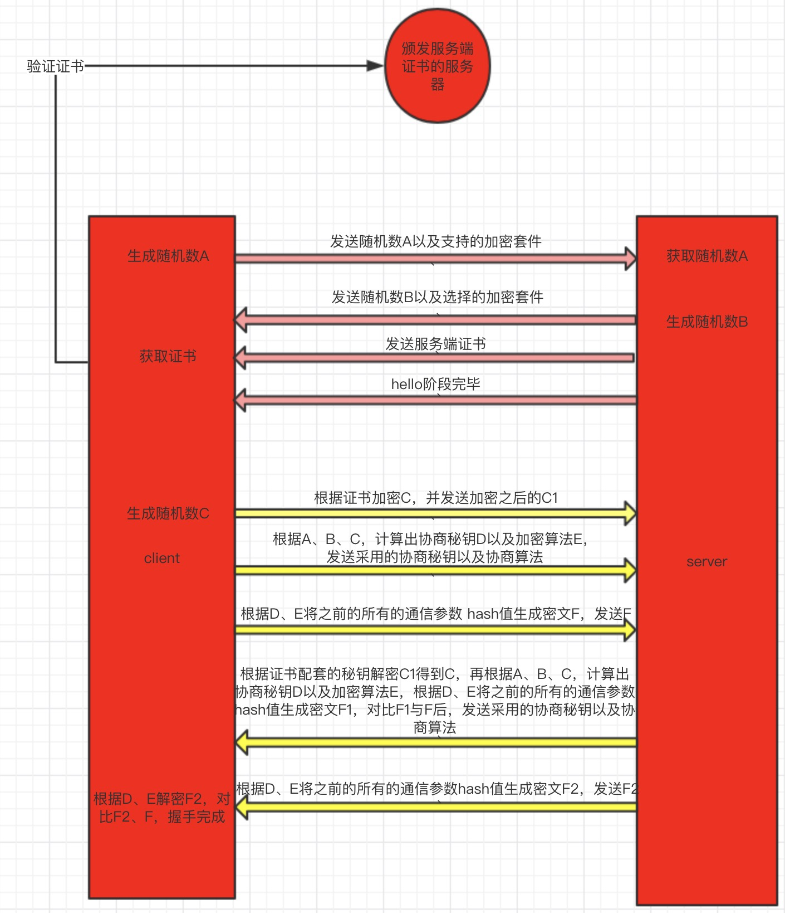
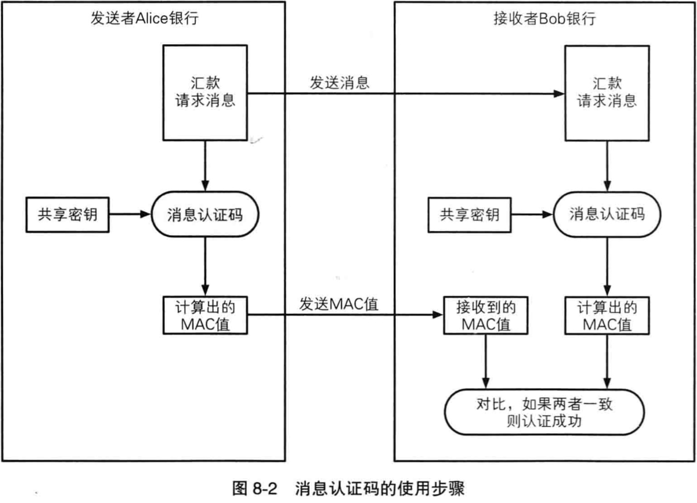
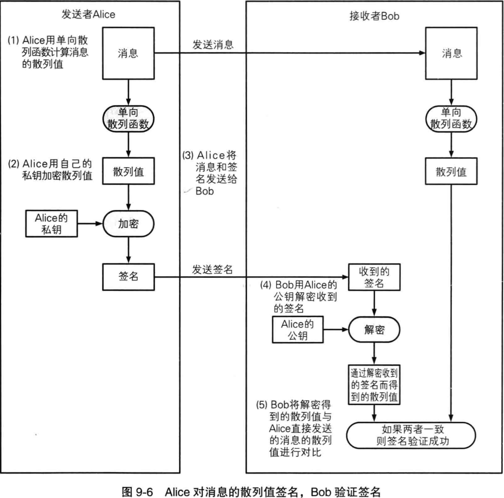
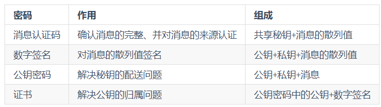

# SSL和TLS
SSL：安全套接层；
TLS：传输层安全性协议；

HTTP：HyperText Transfer Protocol 超文本传输协议
HTTPS：Hypertext Transfer Protocol Secure 超文本传输安全协议
TLS：位于HTTP和TCP之间的协议，其内部有TLS握手协议，TLS记录协议；
HTTPS经由HTTP进行通信，但利用TLS来保护安全，即HTTPS = HTTP + TLS；

## 从密码学来理解HTTPS
HTTPS使用TLS来保证安全，安全分为两个方面，一是传输内容加密，二是服务端的身份认证；

## 密码基础
### 伪随机数生成器
作用在于生成对称密码的秘钥，用于公钥密码生成秘钥对；

### 消息认证码
消息验证码主要用于验证消息的完整性和消息的认证，其中消息的认证指 消息来自正确的发送者；

1. 发送者与接收者实现共享秘钥；
2. 发送者根据发送消息计算MAC值；
3. 发送者发送消息和MAC值；
4. 接受者根据接收到的消息计算MAC值；
5. 将计算MAC值与接收到的MAC对比；
6. 对比成功消息完整，并且来自正确的发送者；
   
## 数字签名
消息认证码的缺点在于**无法防止否认**，因为共享秘钥被client，server两端拥有，server可以为找client给自己发送消息，解决这个问题就应该各自有一个各自的秘钥；

数字签名和消息认证码都不是为了加密，可以将单向散列函数获取散列值的过程理解为使用md5获取摘要的过程；

使用自己的私钥对自己所认可的消息生成一个该消息专属的签名，这就是数字签名，表明我承认该消息来自自己；
**私钥用于加签，公钥用于解签，每个人都可以解签，查看消息的归属人**

## 公钥密码
公钥密码也叫非对称密码，由公钥和私钥组成，它最开始是为了解决私钥的配送传输安全问题，即我们不配送私钥，只配送公钥，私钥由本人保管；

它与数字签名相反，公钥密码的私钥用于解密、公钥用于加密，每个人都可以用别人的公钥加密，但只有对应的私钥才能解开密文；

client：明文 + 公钥 = 密文
server：密文 + 私钥 = 明文

注意：**公钥用于加密，私钥用于解密，只有私钥的归属者，才能查看消息的真正内容**

### 证书
证书：全称公钥证书，里面保存着归属者的基本信息，以及证书的过期时间，归属者的公钥，并由认证机构施加数字签名，表明，某个认证机构认定该公钥确属于此人；

## 密码小结

## TLS使用的密码技术
1. 伪随机数生成器，秘钥生成随机性，更难被猜测；
2. 对称密码：对称密码使用的秘钥是用伪随机数生成，相较于非对称密码，效率更高；
3. 消息验证码：保证消息信息的完整性、以及验证消息信息的来源；
4. 公钥密码：证书技术使用的就是公钥密码；
5. 数字签名：验证证书的签名，确定由真实的摸个CA颁发；
6. 证书：解决公钥的真实归属问题，降低中间人攻击概率；

## TLS总结
TLS 是一系列密码工具的框架，作为框架，它也是非常的灵活，体现在每个工具套件它都可以替换，即：客户端与服务端之间协商密码套件，从而更难的被攻破，例如使用不同方式的对称密码，或者公钥密码、数字签名生成方式、单向散列函数技术的替换等；

## RSA简单示例
RSA 是一种公钥密码算法，我们简单的走一遍它的加密解密过程
加密算法：密文 = (明文^E) mod N，其中公钥为{E,N}，即”求明文的E次方的对 N 的余数“
解密算法：明文 = (密文^D) mod N，其中秘钥为{D,N}，即”求密文的D次方的对 N 的余数“
例：我们已知公钥为{5,323}，私钥为{29,323}，明文为300，请写出加密和解密的过程：

加密：密文 = 123 ^ 5 mod 323 = 225
解密：明文 = 225 ^ 29 mod 323 = [[(225 ^ 5) mod 323] * [(225 ^ 5) mod 323] * [(225 ^ 5) mod 323] * [(225 ^ 5) mod 323] * [(225 ^ 5) mod 323] * [(225 ^ 4) mod 323]] mod 323 = (4 * 4 * 4 * 4 * 4 * 290) mod 323 = 123