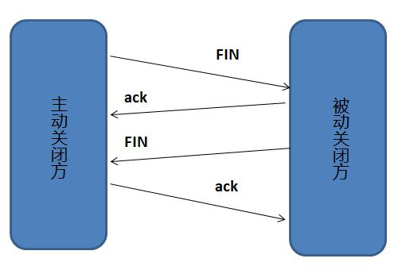

# 三次握手和四次挥手 

## TCP三次握手

1. 客户端-发送带有SYN标志的数据包，一次握手-服务端
2. 服务端-发送带有SYN/ACK标志的数据包，二次握手-客户端
3. 客户单-发送带有ACK标志的数据包，三次握手-服务端

### 为什么需要三次握手呢？
三次握手的目的是建立可靠的通信信道，至少需要三次握手才能让彼此都确定自己与对方的发送和接收是正常的。
第一次握手：客户端什么都不能确认，但是如果服务端接收到了SYN的数据包，也就能确认对方发送正常，自己接收正常；

第二次握手：如果客户端收到了服务端发回来的SYN/ACK数据包，可以确认自己的发送是正常的，自己的接收是正常的，服务端的发送，以及接收是正常的；（此时只剩服务端无法确认自己的发送和客户端的接收是否正常了，所以就有了第三次握手）；

第三次握手：客户端在第二次握手的时候，所有需要确认的，自己发送，自己接收，服务端发送与接收都已经确认了；如果服务器端收到了ACK标志的数据包，这样服务器端最后要确认的自己发送和客户端接收也都可以确认正常了；

此时双方的收发功能都可以确认正常了。

### 为什么要传回SYN
是为了告诉发送端，我接收到的SYN确实是你发过来的信号；

    SYN 是 TCP/IP 建立连接时使用的握手信号。在客户机和服务器之间建立正常的 TCP 网络连接时，客户机首先发出一个 SYN 消息，服务器使用 SYN-ACK 应答表示接收到了这个消息，最后客户机再以 ACK(Acknowledgement[汉译：确认字符 ,在数据通信传输中，接收站发给发送站的一种传输控制字符。它表示确认发来的数据已经接受无误。 ]）消息响应。这样在客户机和服务器之间才能建立起可靠的TCP连接，数据才可以在客户机和服务器之间传递。

### 传了SYN为什么还要再传ACK
双方通信无误必须是两者互相发送信息都无误，第一次发送了SYN，在第二次接收到返回的SYN，只能证明发送方到接收方之间的通道没有问题，但是接收方到发送方之间的通道还需要ACK信号来验证；

## 四次挥手

相比于TCP建立连接，断开一个TCP连接是需要四次挥手的；

1. 客户端-发送一个FIN，用来关闭客户端到服务器的数据传送
2. 服务器-收到一个FIN，它发回一个ACK，确认序号为收到序号+1，和SYN一样，一个FIN占用一个序号；
3. 服务器-关闭与客户端的连接，发送一个FIN给客户端；
4. 客户端-发挥ACK报文确认，并将确认序号设置为收到序号+1；

### 为什么要四次挥手

任何一方都可以在数据结束传送之后，发出连接释放的通知，也就是FIN，对方接受到之后，对方只是知道你不在发送数据了（但不代表我也没有数据发送了，这是只是相当于你告诉对方你没话说了，但是对方可能还有话要说），此时对方在你的FIN序号加一，形成ACK发送给你，这个时候你就可以进入半关闭状态了，（只需要等到对方数据也传输完全之后，发来结束信号就可以全部关闭了），至此两次挥手；
对方数据发送完之后，会给你发送一个FIN，这就是第三次挥手，告诉你我已经发送完数据；
此时你将接受到的FIN序号+1，返回给对方，对方确认后就完全关闭了TCP连接；

举个例子：
A 和 B 打电话，通话即将结束后，A 说“我没啥要说的了”，B回答“我知道了”，但是 B 可能还会有要说的话，A 不能要求 B 跟着自己的节奏结束通话，于是 B 可能又巴拉巴拉说了一通，最后 B 说“我说完了”，A 回答“知道了”，这样通话才算结束。

## TCP报文首部
主要有：
1. 源端口和目的端口：各2个字节，分别写入源端口和目的端口；
2. 序号，4个字节，TCP连接中传输的字节流中的每个字节都按顺序编号；如果一段报文的序号字段是301，报文中包括100字段，下一个报文字段应该是401开头的；
3. 确认号，4个字节，期望收到对方的下一个报文的第一个数据字节的序号，如果B接收了A的报文，报文序列字段是501，而数据长度是200字节，那么B就收到了A发送的700字节的数据了，这个时候B期望继续收到701的数据，然后就应该吧B发送给A的确认报文段的确认号置为1；
4. 确认ACK，仅当ACK=1时，确认号字段才有效，TCP规定，建立连接后所有报文传输都必须ACK=1；
5. 同步SYN，当连接建立时用来同步序号的，当SYN = 1，ACK = 0，表明连接请求报文，若同一连接则响应报文中应该SYN = 1,ACK = 1;
6. 终止FIN，用来释放连接，当FIN = 1表明此报文的发送方数据已经发送完毕，并且要求释放；

1. TCP服务器要首先打开传输控制块TCB，时刻准备接受客户的连接请求，进入所谓的LISTEN状态；
2. TCP客户端进程也是先创建传输控制块TCB，然后向服务器中发送请求，这时报文首部的SYN=1，同时选择一个初始序列号seq = x，此时TCP客户端进入SYN-SENT（同步已发送状态），TCP规定，SYN报文段（SYN=1的报文段）不能携带数据，但需要消耗掉一个序号。
3. TCP服务器收到请求报文后，如果同意连接，则发出确认报文。确认报文中应该 ACK=1，SYN=1，确认号是ack=x+1，同时也要为自己初始化一个序列号 seq=y，此时，TCP服务器进程进入了SYN-RCVD（同步收到）状态。这个报文也不能携带数据，但是同样要消耗一个序号。
4. CP客户进程收到确认后，还要向服务器给出确认。确认报文的ACK=1，ack=y+1，自己的序列号seq=x+1，此时，TCP连接建立，客户端进入ESTABLISHED（已建立连接）状态。TCP规定，ACK报文段可以携带数据，但是如果不携带数据则不消耗序号。
5. 当服务器收到客户端的确认后也进入ESTABLISHED状态，此后双方就可以开始通信了。

1. 客户端进程发出连接释放报文，并且停止发送数据。释放数据报文首部，FIN=1，其序列号为seq=u（等于前面已经传送过来的数据的最后一个字节的序号加1），此时，客户端进入FIN-WAIT-1（终止等待1）状态。 TCP规定，FIN报文段即使不携带数据，也要消耗一个序号。
2. 服务器收到连接释放报文，发出确认报文，ACK=1，ack=u+1，并且带上自己的序列号seq=v，此时，服务端就进入了CLOSE-WAIT（关闭等待）状态。TCP服务器通知高层的应用进程，客户端向服务器的方向就释放了，这时候处于半关闭状态，即客户端已经没有数据要发送了，但是服务器若发送数据，客户端依然要接受。这个状态还要持续一段时间，也就是整个CLOSE-WAIT状态持续的时间。
3. 客户端收到服务器的确认请求后，此时，客户端就进入FIN-WAIT-2（终止等待2）状态，等待服务器发送连接释放报文（在这之前还需要接受服务器发送的最后的数据）。
4. 服务器将最后的数据发送完毕后，就向客户端发送连接释放报文，FIN=1，ack=u+1，由于在半关闭状态，服务器很可能又发送了一些数据，假定此时的序列号为seq=w，此时，服务器就进入了LAST-ACK（最后确认）状态，等待客户端的确认。
5. 客户端收到服务器的连接释放报文后，必须发出确认，ACK=1，ack=w+1，而自己的序列号是seq=u+1，此时，客户端就进入了TIME-WAIT（时间等待）状态。**注意此时TCP连接还没有释放，必须经过2∗*∗MSL（最长报文段寿命）的时间后，当客户端撤销相应的TCB后，才进入CLOSED状态。**
6. 服务器只要收到了客户端发出的确认，立即进入CLOSED状态。同样，撤销TCB后，就结束了这次的TCP连接。可以看到，服务器结束TCP连接的时间要比客户端早一些。

**为什么客户端最后要等两个MSL**
MSL（Maximum Segment Lifetime），TCP允许不同的实现可以设置不同的MSL值。

第一，保证客户端发送的最后一个ACK报文能够到达服务器，因为这个ACK报文可能丢失，站在服务器的角度看来，我已经发送了FIN+ACK报文请求断开了，客户端还没有给我回应，应该是我发送的请求断开报文它没有收到，于是服务器又会重新发送一次，而客户端就能在这个2MSL时间段内收到这个重传的报文，接着给出回应报文，并且会重启2MSL计时器。

第二，防止类似与“三次握手”中提到了的“已经失效的连接请求报文段”出现在本连接中。客户端发送完最后一个确认报文后，在这个2MSL时间中，就可以使本连接持续的时间内所产生的所有报文段都从网络中消失。这样新的连接中不会出现旧连接的请求报文。