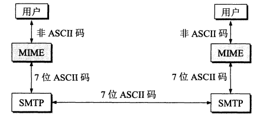

# 应用层

## 域名系统
DNS 是一个分布式数据库，提供了主机名和 IP 地址之间相互转换的服务。这里的分布式数据库是指，每个站点只保留它自己的那部分数据；

域名具有层次结构，从上到下依次是：根域名、顶级域名、二级域名；

DNS可以使用UDP和TCP进行传输，使用的端口都为53。大多数情况下DNS使用UDP进行传输，这就要求域名解析器和域名服务器逗比学自己处理超时和重传问题从而保证数据的可靠性。

TCP使用情况：
1. 响应数据超过512字节（UDP最大支持512字节的数据）；
2. 区域传送，主域名服务器向辅助域名服务器传送变化的那部分数据；

## 文件传送协议FTP
FTP使用TCP进行连接，他需要两个连接来传送一个文件；
1. 控制连接，服务器打开端口号21等待客户端的连接，客户端主动建立连接后，使用这个连接将客户端的命令传输给服务器，并传回服务器的应答；
2. 数据连接：用来传送一个文件数据；

根据数据连接是否是服务器端主动建立，FTP分为主动和被动两种模式：
1. 主动模式，服务器端发起连接，使用端口号是20，客户端端口号随机，但要大于1024；

2. 被动模式：客户端主动建立数据连接，其中客户端的端口号由客户端自己指定，服务器端端口号随机；

两者区别：主动连接要求客户端开放端口号给服务器，需要去配置客户端的防火墙。被动模式只需要服务器开放端口号即可，无需客户端配置防火墙。但是被动模式的服务器安全性减弱，因为开放了过多的端口号；

## 动态主机配置协议
DHCP提供了即插即用的连网方式，用户不在需要手动配置IP地址等信息；

DHCP配置的内容不仅仅是IP地址，还包括子网掩码，网关IP地址；

DHCP工作过程如下：
1. 客户端发送Discover报文，该报文的目的地址为255.255.255.255:67,源地址为0.0.0.0:68,被放入UDP中，该报文被广播到同一个子网的所有主机上。如果客户端和DHCP服务器不在同一个子网，就需要中级代理；
2. DHCP服务器收到Discover报文之后，发送Offer报文给客户端，该报文包含了客户端所需要的信息；因为客户端可能收到多个DHCP服务器提供的信息，因此客户端需要进行选择；
3. 如果客户端选择了某个DHCP服务器提供的信息，那么就发送Request报文给该DHCP服务器。
4. DHCP服务器发送Ack报文，表示客户端此时可以使用提供给他的信息；

## 远程登录协议
TELNET 用于登录到远程主机上，并且远程主机上的输出也会返回；
TELNET 可以适应许多计算机和操作系统的差异，例如不同操作系统换行符定义；

## 电子邮件协议
一个电子邮件系统由三部分组成：用户代理、服务器代理和邮件协议；

邮件协议包含发送协议和读取协议，发送协议常用SMTP，读取协议常用POP3和IMAP；

1. **SMTP**:
   SMTP只能发送ASCII码，而互联网邮件扩充MIME可以发送二进制文件。MIME并没有改动或者取代SMTP，而是增加邮件主体的结构，定义了非ASCII码的编码规则；

2. POP3
   POP3的特点是只要用户从服务器上读取了邮件，就把该邮件删除。但最新版本的POP3可以不删除邮件；

3. IMAP
   IMAP协议中客户端和服务器上的邮件保持同步，如果不手动删除邮件，那么服务器上的邮件不会被删除，IMAP这种做法可以让用户随时随地的去访问服务器上的邮件；

## 常用端口
|应用    | 应用层协议    | 端口号      | 传输层协议     |  备注          |
| ------ | ------ | ------ | ------ | ------ |
|域名解析 | DNS | 53 | UDP/TCP|长度超过512字节使用TCP|
|动态主机配置协议 | DHCP | 67/68 | UDP |  |
|简单网络管理协议 | SNMP | 161/162 | UDP |   |
|文件传输协议 | FTP | 20/21 | TCP | 控制连接21，数据连接20 |
|远程终端协议 | TELENT | 23 | TCP |    |
|超文本传送协议 | HTTP | 80 | TCP |    |
|简单邮件传送协议 | SMTP | 25 | TCP |     |
|邮件读取协议 | POP3 | 110 | TCP |     |
|网际报文存取协议 | IMAP | 143 | TCP |     |

## Web页面请求过程
### 1. DHCP配置信息
1. 假设主机最开始没有IP地址以及其他信息就需要先使用DHCP来获取；
2. 主机生成以DHCP请求报文，将这个报文装在一个目的端口67和源端口68的UDP报文段中。
3. 该报文段则被放入一个具有广播目的地之255.255.255.255和源地址0.0.0.0的IP数据报中；
4. 该数据报被放置在MAC帧中，该帧具有目的地址FF:FF:FF:FF:FF:FF,将广播到与交换机连接的所有设备中。
5. 连接在交换机上的DHCP服务器收到广播帧后，不断向上解析IP数据报，UDP报文段，DHCP请求报文，之后生成DHCP ACK报文，该报文包含：IP地址，DNS服务器的IP地址，默认网关路由器的IP地址和子网掩码。该报文被放入UDP报文段中，UDP报文段又被放入IP数据报中，最后放入MAC帧中；
6. 该帧的目的地址是请求主机的MAC地址，因为交换机有自学能力，之前的主机发送广播帧之后，就记录了MAC地址到其转发接口的交换表项，因此交换机就可以直接知道向那个接口发送该帧；
7. 主机收到该帧之后，不断分解得到DHCP报文，之后就配置他的IP地址，子网掩码和DNS服务器的IP地址，并在其IP转发表中安装默认网关。

### 2. ARP解析MAC地址
1. 主机通过浏览器生成以TCP套接字，套接字向HTTP服务器发送HTTP请求。为了生成该套接字，主机需要知道网站的域名对应的IP地址；
2. 主机生成以DNS查询报文，该报文具有53号端口，因为DNS服务器的端口号是53；
3. 该DNS查询报文被放入一个目的地址为DNS服务器IP地址的IP数据包中；
4. 该IP数据报被放入一个以太网帧中，该帧发送到网关路由器；
5. DHCP过程只知道网关路由器的IP地址，为了获取网关路由器的MAC地址，需要使用ARP协议；
6. 主机生成一个包含目的地址为网关路由器的ARP查询报文，将该ARP查询报文又放入一个具有广播目的地址FF:FF:FF:FF:FF:FF的以太网帧中，并向交换机发送该以太网帧，交换机将该帧转发给所有的连接设备，包括网关路由器。
7. 网关路由器接收到该帧后，不断向上分解得到ARP报文，发现其中的IP地址与其接口的IP地址匹配，因此就发送一个ARP回答报文，包含其MAC地址，发回给主机；

### DNS解析域名
1. 知道了网关路由器的MAC地址之后，就可以继续DNS的解析过程了。
2. 网关路由器接收到包含DNS查询报文的以太网帧后，抽取IP数据报，并根据转发表决定该IP数据报应该转发的路由器；
3. 因为路由器具有内部网关协议RIP，OSPF和外部网关协议BGP，这两种路由选择协议，因此路由表中已经配置了网关路由器到达DNS服务器的路由表项。
4. 到达DNS服务器之后，DNS服务器抽取DNS查询报文，并在DNS数据库中查找待解析的域名；
5. 找到DNS记录之后，发送DNS回答报文，将该回答报文放入UDP报文段中，然后放入IP数据报中，通过路由器反向转发回网关路由器，并经过以太网交换机到的主机；

### HTTP请求页面
1. 有了HTTP服务器的IP地址之后，主机就能生成TCP套接字，该套接字将用于向Web服务发送HTTP GET报文；
2. 在生成TCP套接字之前，必须先与HTTP服务器进行三次握手来建立连接。生成一个具有目的端口80的TCP SYN报文段，并向HTTP服务器发送该报文段；
3. HTTP服务器接收到该报文之后，生成TCP SYN ACK报文段，发回给主机。
4. 连接建立之后，浏览器生成HTTP GET报文，并交付给HTTP服务器。
5. HTTP服务器从TCP套接字读取HTTP GET报文，生成以HTTP响应报文，将Web页面内容放入报文主题内，发回给主机；
6. 浏览器收到HTTP响应报文之后，抽取Web页面内容，进行渲染，显示Web页面；
   

