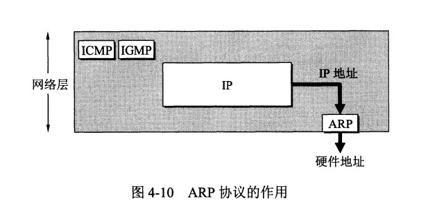

# 网络层
## 概述
网络层是整个互联网的核心，因此应当让网络层尽可能简单。网络层向上只提供简单灵活的，无连接的，尽最大努力交互的数据报服务。

使用IP协议，可以把异构的物理网络连接起来，使得在网络层看起来好像是一个统一的网络；

与IP协议配套的有三个协议：
地址解析协议ARP；
网际控制报文协议ICMP；
网际组管理协议IGMP；

## IP数据报格式

1. **版本**：4(IPv4)和6(IPv6)两个值；
2. **首部长度**：占4位，最大值15，值为1表示1个32位字的长度（4字节），固定部分长度为20字节，因此该值最小为5，如果可选字段的长度不是四字节的整数倍，尾部的填充部分来填充；
3. **区分服务**: 用来获得更好的服务，一般情况下不使用。
4. **生存时间**：TTL，他的存在时为了防止无法交付的数据报在互联网中不断兜圈子，以路由器跳数为单位，当TTL为0时，丢弃数据报；
5. **协议** ：指出携带的数据应该上交给哪个协议进行处理，例如 ICMP、TCP、UDP 等。
6. **首部检验和** ：因为数据报每经过一个路由器，都要重新计算检验和，因此检验和不包含数据部分可以减少计算的工作量。
7. **标识** : 在数据报长度过长从而发生分片的情况下，相同数据报的不同分片具有相同的标识符。
8. **片偏移** : 和标识符一起，用于发生分片的情况。片偏移的单位为 8 字节。

## IP地址编址方式
编址方式经历了三个阶段：
1. 分类
2. 子网划分
3. 无分类
### 1.分类
由两部分组成，网络号和主机号，其中不同分类具有不同的网络号长度，并且是固定的；
IP地址::={<网络号>，<主机号>}

1. A类IP地址 
一个A类IP地址由1字节的网络地址和3字节主机地址组成，网络地址的最高位必须是“0”， 地址范围从1.0.0.0 到126.0.0.0。可用的A类网络有126个，每个网络能容纳1亿多个主机。 

2. B类IP地址 
一个B类IP地址由2个字节的网络地址和2个字节的主机地址组成，网络地址的最高位必须是“10”，地址范围从128.0.0.0到191.255.255.255。可用的B类网络有16382个，每个网络能容纳6万多个主机。 

3. C类IP地址 
一个C类IP地址由3字节的网络地址和1字节的主机地址组成，网络地址的最高位必须是“110”。范围从192.0.0.0到223.255.255.255。C类网络可达209万余个，每个网络能容纳254个主机。 

在IP地址3种主要类型里，各保留了3个区域作为私有地址，其地址范围如下： 

A类地址：10.0.0.0～10.255.255.255 默认网络掩码：255.0.0.0

B类地址：172.16.0.0～172.31.255.255 默认网络掩码：255.255.0.0

C类地址：192.168.0.0～192.168.255.255 默认网络掩码：255.255.255.0

A类地址的第一组数字为1～126。注意，数字0和 127不作为A类地址，数字127保留给内部回送函数，而数字0则表示该地址是本地宿主机，不能传送。

B类地址的第一组数字为128～191。

C类地址的第一组数字为192～223。

### 2.子网划分
通过在主机号字段中拿一部分作为子网号，把两级 IP 地址划分为三级 IP 地址。

IP 地址 ::= {<网络号>, <子网号>, <主机号>}

要使用子网，必须配置子网掩码。一个 B 类地址的默认子网掩码为 255.255.0.0，如果 B 类地址的子网占两个比特，那么子网掩码为 11111111 11111111 11000000 00000000，也就是 255.255.192.0。

注意，外部网络看不到子网的存在。

### 3.五分类
无分类编址 CIDR 消除了传统 A 类、B 类和 C 类地址以及划分子网的概念，使用网络前缀和主机号来对 IP 地址进行编码，网络前缀的长度可以根据需要变化。
IP 地址 ::= {<网络前缀号>, <主机号>}
CIDR 的记法上采用在 IP 地址后面加上网络前缀长度的方法，例如 128.14.35.7/20 表示前 20 位为网络前缀。
CIDR 的地址掩码可以继续称为子网掩码，子网掩码首 1 长度为网络前缀的长度。

一个 CIDR 地址块中有很多地址，一个 CIDR 表示的网络就可以表示原来的很多个网络，并且在路由表中只需要一个路由就可以代替原来的多个路由，减少了路由表项的数量。把这种通过使用网络前缀来减少路由表项的方式称为路由聚合，也称为 构成超网 。

在路由表中的项目由“网络前缀”和“下一跳地址”组成，在查找时可能会得到不止一个匹配结果，应当采用最长前缀匹配来确定应该匹配哪一个。(最长的前缀表示最精确)

例1：192.168.23.35/21计算子网的网络ID、子网掩码、起止IP地址？
子网掩码：11111111 11111111 11111-000 00000000（子网掩码）=255.255.248.0（子网掩码的第二种表示方法。）
网络ID：192.168.16.0（192.168.00010111.0和子网掩码进行“与”运算。）
起始IP地址：192.168.16.1（192.168.16.0是本网端中的第一个IP，可是他已经表示网络ID了，所以，为了避免与该IP地址与网络ID混淆，所以，起始IP为192.168.16.1。）
结束IP地址：192.168.23.254（192.168.00010（网络位）-111.11111110（主机位）主机ID不能全为1，全为1表示本地广播。）

## 地址解析协议ARP
网络层实现主机之间的通信，而链路层实现具体每段链路之间的通信。因此在通信过程中，IP 数据报的源地址和目的地址始终不变，而 MAC 地址随着链路的改变而改变。

**ARP实现IP地址得到MAC地址**

每个主机都有一个 ARP 高速缓存，里面有本局域网上的各主机和路由器的 IP 地址到 MAC 地址的映射表。

过程：如果主机A知道主机B的IP地址，但是ARP高速缓存中没有该IP地址到MAC地址的映射，此时主机A通过广播的方式发送ARP请求分组，主机B收到该请求后会发送ARP响应分组给主机A，告知其MAC地址，随后主机A向其高速缓存中写入主机B的IP地址到MAC地址映射；

## 网际控制报文协议ICMP
ICMP为了更有效的转发IP数据报和提高交付成功的机会，它封装在IP数据报中，但是不属于高层协议；

ICMP 报文分为差错报告报文和询问报文。

1. **ping**
Ping 的原理是通过向目的主机发送 ICMP Echo 请求报文，目的主机收到之后会发送 Echo 回答报文。Ping 会根据时间和成功响应的次数估算出数据包往返时间以及丢包率。

2. **Traceroute**
Traceroute 是 ICMP 的另一个应用，用来跟踪一个分组从源点到终点的路径。

过程：
源主机向目的主机发送一连串的 IP 数据报。第一个数据报 P1 的生存时间 TTL 设置为 1，当 P1 到达路径上的第一个路由器 R1 时，R1 收下它并把 TTL 减 1，此时 TTL 等于 0，R1 就把 P1 丢弃，并向源主机发送一个 ICMP 时间超过差错报告报文；
源主机接着发送第二个数据报 P2，并把 TTL 设置为 2。P2 先到达 R1，R1 收下后把 TTL 减 1 再转发给 R2，R2 收下后也把 TTL 减 1，由于此时 TTL 等于 0，R2 就丢弃 P2，并向源主机发送一个 ICMP 时间超过差错报文。
不断执行这样的步骤，直到最后一个数据报刚刚到达目的主机，主机不转发数据报，也不把 TTL 值减 1。但是因为数据报封装的是无法交付的 UDP，因此目的主机要向源主机发送 ICMP 终点不可达差错报告报文。
之后源主机知道了到达目的主机所经过的路由器 IP 地址以及到达每个路由器的往返时间。

## 虚拟专用网VPN
由于IP地址的紧缺，一个机构能申请到的IP地址远远小于本机构所拥有的的主机数；且一个机构并不需要把所有的主机接入到外部的互联网中，机构内的计算机可以使用仅在本机构有效的 IP 地址（专用地址）

三个专用地址块：
10.0.0.0 ~ 10.255.255.255
172.16.0.0 ~ 172.31.255.255
192.168.0.0 ~ 192.168.255.255

VPN使用公网作为本机构各专用网之间的通信载体。专用指的是机构内的主机只与本机构内的其他主机通信；虚拟指的是好像是，实际上不是，他有经过公网的互联网；

上图中的过程，场所 A 和 B 的通信经过互联网，如果场所 A 的主机 X 要和另一个场所 B 的主机 Y 通信，IP 数据报的源地址是 10.1.0.1，目的地址是 10.2.0.3。数据报先发送到与互联网相连的路由器 R1，R1 对内部数据进行加密，然后重新加上数据报的首部，源地址是路由器 R1 的全球地址 125.1.2.3，目的地址是路由器 R2 的全球地址 194.4.5.6。路由器 R2 收到数据报后将数据部分进行解密，恢复原来的数据报，此时目的地址为 10.2.0.3，就交付给 Y。

## 网络地址转换NAT
专用网内部的主机使用本地IP地址又想和互联网上的主机通信时，可以使用NAT将本地IP转换为全球IP；

现在常用的 NAT 转换表把传输层的端口号也用上了，使得多个专用网内部的主机共用一个全球 IP 地址。使用端口号的 NAT 也叫做网络地址与端口转换 NAPT。

## 路由器的结构
路由器从功能上可以划分为：路由选择和分组转发；
分组转发结构由三部分组成：交换结构，一组输入端口和一组输出端口；

## 路由器分组转发流程
1. 从数据报的首部提取目的主机的IP地址D，得到目的网络地址N。
2. 若N就是与此路由器直接相连的某个网络地址，则直接交付；
3. 若路由表中有目的地址为D的特定主机路由，则把数据报传送给表中所指明的下一跳路由器；
4. 若路由表中有到大网络N的路由，则把数据报传送给路由表中所指明的下一跳路由器；
5. 若上述都找不到，且路由表中有一个默认路由，则把数据报传送给路由表中所指明的默认路由器，报告转发分组错误；

## 路由选择协议
路由选择协议都是自适应的，能随着网络通信量和拓扑结构的变化而自适应地进行调整。

互联网可以划分出许多较小的自治系统AS，一个AS可以使用一种和别的AS不同的路由选择协议；
自治系统内部的路由选择：RIP 和 OSPF
自治系统间的路由选择：BGP

### 内部网关协议RIP
RIP是一种基于距离向量的路由选择协议。距离指的是跳数，直接相连的路由器跳数为1。
RIP中跳数最多是15，超过15表示不可达。

RIP按固定的时间间隔仅和相邻路由器交换自己的路由表，经过若干次交换之后，所有的路由器最终会知道到本自治系统内任何一个网路的最短距离和下一跳路由地址；

距离向量算法：
1. 对地址为X的相邻路由器发来的RIP报文，先修改报文中的所有项目，把下一跳字段中的地址改为X，并把所有的距离字段加一；
2. 对修改后的 RIP 报文中的每一个项目，进行以下步骤：
    若原来的路由表中没有目的网络 N，则把该项目添加到路由表中；
    否则：若下一跳路由器地址是 X，则把收到的项目替换原来路由表中的项目；否则：若收到的项目中的距离 d 小于路由表中的距离，则进行更新（例如原始路由表项为 Net2, 5, P，新表项为 Net2, 4, X，则更新）；否则什么也不做。
若 3 分钟还没有收到相邻路由器的更新路由表，则把该相邻路由器标为不可达，即把距离置为 16。

### 内部网关协议OSPF
开放最短路径优先OSPF，是为了克服RIP的缺点而开发出来的；
OSPF具有以下特点：
1. 向本自治系统中所有的路由器发送信息，这种方式是洪泛法；
2. 发送的信息就是与相邻路由器的链路状态，链路状态包括与那些路由器相连以及链路的度量，度量用费用、距离、时延、带宽来表示；
3. 只有当链路状态发生变化时，路由器才会发送信息；

所有路由器都具有全网的拓扑结构图，并且是一致的。相比于 RIP，OSPF 的更新过程收敛的很快。

### 外部网关协议BGP
AS之间的路由选择比较困难，主要是因为：
1. 互联网规模很大；
2. 各个AS内部使用不同的路由选择协议，无法确定路径的度量；
3. AS之间的路由选择必须考虑有关的策略，比如某些AS不愿意让其他AS经过；
   
BGP 只能寻找一条比较好的路由，而不是最佳路由；

每个AS都必须配置BGP发言人，通过两个相邻的BGP发言人之间建立TCP连接来交换路由信息；

