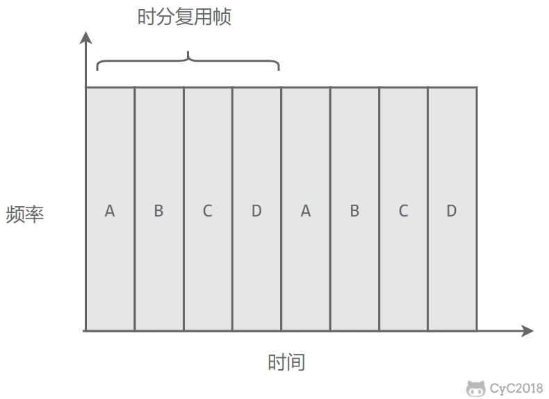

# 链路层

## 封装成帧
将网络层传下来的分组添加首部和尾部，用于标记帧的开始和结束；

## 透明传输
帧使用首部和尾部进行定界，如果帧的数据部分含有和首部尾部相同的内容，那么帧的开始和结束位置就会被错误的判定。需要在数据部分出现首部尾部相同的内容前面插入转义字符。如果数据部分出现转义字符，那么就在转义字符前面再加个转义字符。在接收端进行处理之后可以还原出原始数据。这个过程透明传输的内容是转义字符，用户察觉不到转义字符的存在。

## 差错检测
数据链路层广泛使用循环冗余校验CRC来检查比特差错；

## 信道分类
1. **广播信道**
   一对多通信，一个节点发送的数据能够被广播信道上所有的节点接收到。
   可能有冲突发生；
   主要有两种控制方法进行协调，一个是使用信道复用技术，一是使用 CSMA/CD 协议
2. **点对点信道**
   一对一通信，不冲突，PPP协议控制；

## 信道复用技术
1. **频分复用**
   
2. **时分复用**
   
两者会一直占用信道资源，计算机数据突发性质，如果一直占用，信道的利用率不搞；

3. **统计时分复用**
   是对时分复用的一种改进，不固定每个用户在时分复用帧中的位置，只要有数据就集中起来组成统计时分复用帧然后发送;
   

4. **波分复用**
   光的频分复用。由于光的频率很高，因此习惯上用波长而不是频率来表示所使用的光载波；
5. **码分复用**
   

## CSMA/CD协议
CAMA/CD表示载波监听多点接入/碰撞检测。
1. **多点接入**：说明是总线型网络，多个主机以多点的方式接入总线；
2. **载波监听**：每个主机都必须不停的监听信道，在发送前，如果监听到信道正在使用，就必须等待；
3. **碰撞检测**：在发送中，如果监听到信道已有其他主机正在发送数据，就表示发送了碰撞，虽然发送前都已经检测到信道空闲，但是由于电磁波的传播时延存在，还是有可能发生碰撞；
    记端到端的传播时延为 τ，最先发送的站点最多经过 2τ 就可以知道是否发生了碰撞，称 2τ 为 争用期 。只有经过争用期之后还没有检测到碰撞，才能肯定这次发送不会发生碰撞。
当发生碰撞，站点就要停止发送，等待一段时间再发送，时间是由截断二进制指数退避算法来确定的，从离散的整数集合{0，1，……，(2^k-1)}中随机取出一个数，记做r，然后取r倍的争用期作为重传等待时间；

## PPP协议
互联网用户通常需要连接到某个 ISP 之后才能接入到互联网，PPP 协议是用户计算机和 ISP 进行通信时所使用的数据链路层协议。

PPP帧格式：
F 字段为帧的定界符
A 和 C 字段暂时没有意义
FCS 字段是使用 CRC 的检验序列
信息部分的长度不超过 1500

## MAC地址
MAC 地址是链路层地址，长度为 6 字节（48 位），用于唯一标识网络适配器（网卡）
世界上每一个的网卡都有自己唯一的MAC地址；

## 局域网
局域网是一种典型的广播信道，主要特点是网络为一个单位所拥有，且地理范围和站点数目均有限。

主要有以太网、令牌环网、FDDI 和 ATM 等局域网技术，目前以太网占领着有线局域网市场。

## 以太网
以太网是一种星型拓扑局域网；

**集线器**是一种物理层设备， 作用于比特而不是帧，当一个比特到达接口时，集线器重新生成这个比特，并将其能量强度放大，从而扩大网络的传输距离，之后再将这个比特发送到其它所有接口。如果集线器同时收到两个不同接口的帧，那么就发生了碰撞。

## 交换机
交换机具有自学习能力，学习是交换表的内容，交换表存储的是MAC地址到接口的映射；
因此交换机是一种即插即用的设备，不用网管来手动配置交换表；

下图中，交换机有 4 个接口，主机 A 向主机 B 发送数据帧时，交换机把主机 A 到接口 1 的映射写入交换表中。为了发送数据帧到 B，**先查交换表**，此时没有主机 B 的表项，那么主机 A 就**发送广播帧**，主机 C 和主机 D 会丢弃该帧，**主机 B 回应该帧向主机 A**发送数据包时，交换机查找交换表得到主机 A 映射的接口为 1，就发送**数据帧**到接口 1，同时交换机**添加主机 B 到接口 2 的映射**；
(找不到的时候，就广播，然后让目的MAC来找交换机)

## 虚拟局域网VLAN
虚拟局域网，可以建立与物理位置无关的逻辑组，只有同一个虚拟局域网中的成员才会收到链路层广播信息；

例如下图中 (A1, A2, A3, A4) 属于一个虚拟局域网，A1 发送的广播会被 A2、A3、A4 收到，而其它站点收不到。

使用VLAN干线连接起来建立虚拟局域网，每台交换机上的一个特殊接口被设置为干线接口，以此互联VLAN交换机。IEEE定义一种扩展的以太网帧格式802.1Q，他在标准以太网帧上加了4字节首部VLAN标签，用于表示该帧属于哪一个虚拟局域网。

